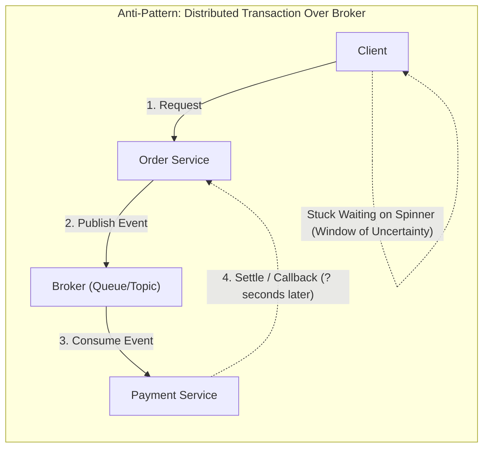
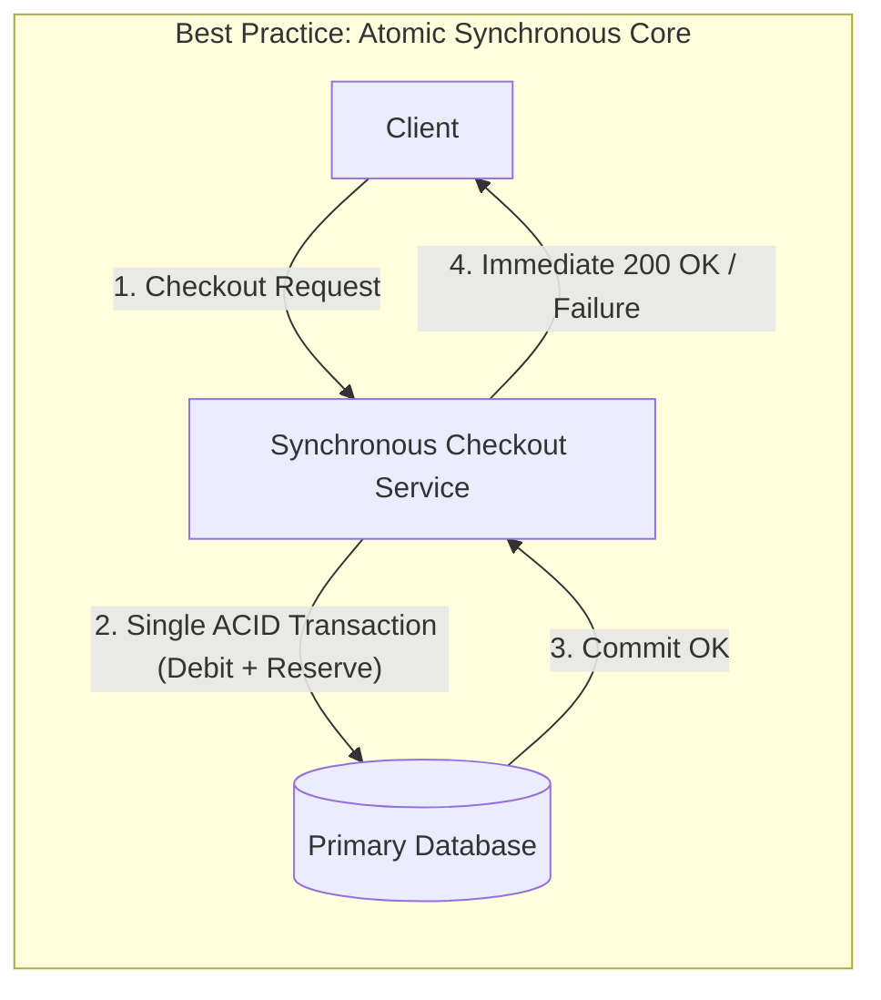
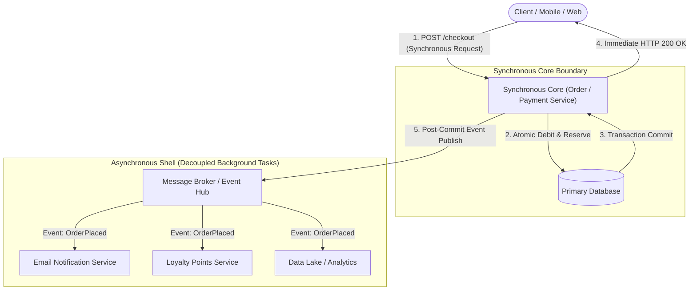

# When to Avoid Event-Driven Architecture — Key Takeaways

> **Parent**: [Messaging & Event Streaming](index.md)  
> **Source**: [When Should You Avoid Event-Driven Architecture Even If You Need to Scale?](../../articles/messaging/when-should-you-avoid-event-driven-architecture-even-if-you-need-to-scale.md)  
> **Taxonomy Reference**: §3.3 Event-Driven & Messaging  

## Contents

| ID | Problem | Key Concept |
|:---|:---|:---|
| [`broker-129`](#broker-129-strict-transactional-invariants-vs-distributed-window-of-uncertainty) | Atomic operations turned into distributed sagas with indeterminate waiting | Transactional invariant boundaries, atomic debit-and-reserve, window of uncertainty |
| [`broker-130`](#broker-130-latency-critical-synchronous-request-paths-vs-asynchronous-queueing-delays) | Sub-second client request paths degraded by broker delays | Latency budget incompatibility, queueing delay, consumer lag, retry inflation |
| [`broker-131`](#broker-131-operational-maturity-preconditions-for-event-driven-systems) | Adopting EDA without tracing, DLQ handling, or lag monitoring | Operational tax of event streaming, distributed tracing, DLQ runbooks, 2 AM triage |
| [`broker-132`](#broker-132-scaling-synchronous-request-paths-the-boring-way-before-eda) | Re-architecting to EDA instead of fixing standard sync bottlenecks | Boring scaling ladder: horizontal API scaling, read caching, read replicas, connection pooling |
| [`broker-133`](#broker-133-synchronous-core-with-asynchronous-shell-pattern) | Binary thinking (all-sync vs all-async) creating brittle or complex flows | Synchronous Core with Asynchronous Shell, transactional core + post-commit event dispatch |

---

## broker-129: Strict Transactional Invariants vs Distributed Window of Uncertainty

| | |
|:---|:---|
| **Problem** | Forcing an atomic transactional workflow (such as debiting a payment method and reserving limited inventory simultaneously) into an asynchronous event-driven model creates a distributed "window of uncertainty." During this window, state is undecided, forcing clients into indeterminate waiting states (e.g., UI spinners) and introducing complex partial failure recovery scenarios. |
| **Root cause** | Misapplying asynchronous eventual consistency to business domain invariants that require immediate, atomic consistency (both-or-neither) at the point of origin. |

**Strategy**: Keep strict transactional mutations within a single synchronous request boundary and database transaction (ACID boundary) using database constraints, row locks, or optimistic concurrency control. Avoid premature decomposition into async choreography or distributed sagas when immediate atomic settlement is an invariant business requirement.





**Tradeoff**: Constrains horizontal scaling of the write path to database transaction throughput limits, but guarantees immediate determinism and eliminates the cognitive and operational overhead of compensating transactions and distributed sagas.

> **Dictionary**: [Window of Uncertainty](../../reference-dictionary/cqrs-event-driven.md#window-of-uncertainty), [Eventual Consistency](../../reference-dictionary/cqrs-event-driven.md#eventual-consistency), [Idempotency](../../reference-dictionary/cqrs-event-driven.md#idempotency)  
> **Azure**: [Azure Cosmos DB Transactions](../../architecture-azure/data/databases/azure_cosmosdb/), [Azure SQL Database](../../architecture-azure/data/databases/azure_sql_database/)  
> **Related**: [`broker-121`](event-driven-architecture-questions-takeaways.md#broker-121-inapplicability-boundaries-of-event-driven-architecture), [`tx-01`](../concurrency-transactions/02-concurrency-transactions.md#tx-01-double-booking), [`tx-21`](../concurrency-transactions/29-tx-key-takeaways.md#tx-21-check-then-act-race-in-payment-retries)

---

## broker-130: Latency-Critical Synchronous Request Paths vs Asynchronous Queueing Delays

| | |
|:---|:---|
| **Problem** | Introducing a message broker into a synchronous request/response path where a human user or upstream client expects sub-second response times actively works against performance goals, adding queueing delay, consumer lag, broker serialization, and retry latency. |
| **Root cause** | Confusing decoupled infrastructure scalability with end-to-end request latency. Brokers optimize for decoupled throughput, not minimal round-trip latency. |

**Strategy**: Keep latency-critical request paths synchronous using low-overhead RPC (gRPC) or optimized HTTP/REST with keep-alive connections. Do not route requests through intermediate message queues unless the client can truly accept an asynchronous job acknowledgement (`202 Accepted`) and poll or subscribe via WebSockets/SSE.

**Tradeoff**: Synchronous paths couple client-server availability and require aggressive circuit breaking, timeouts, and load shedding, whereas asynchronous message buffers absorb surges at the cost of latency predictability.

> **Dictionary**: [Consumer Lag](../../reference-dictionary/messaging.md#consumer-lag), [API Idempotency](../../reference-dictionary/cqrs-event-driven.md#api-idempotency)  
> **Azure**: [Azure Application Gateway](../../architecture-azure/networking/application-gateway/), [Azure API Management](../../architecture-azure/integration/api-management/)  
> **Related**: [`cb-01`](../resilience/23-circuit-breaker-key-takeaways.md#cb-01), [`apipat-01`](../api-network/20-api-design-patterns-key-takeaways.md#apipat-01), [`perf-01`](../performance/29-microservices-runtime-performance.md#perf-01)

---

## broker-131: Operational Maturity Preconditions for Event-Driven Systems

| | |
|:---|:---|
| **Problem** | Adopting event-driven architecture prematurely without the necessary observability and operational tooling turns distributed systems into unmanageable production incidents: stuck consumer groups at 2 AM, invisible message drops, untriaged dead-letter queues, and untraceable multi-hop causal chains. |
| **Root cause** | Adopting event streaming as an architectural fashion while ignoring the steep operational tax: broker cluster administration, schema registry management, distributed tracing (W3C TraceContext/OpenTelemetry), consumer lag alerting, and dead-letter queue triage procedures. |

**Strategy**: Treat operational maturity as a hard prerequisite for EDA. Establish end-to-end distributed tracing across all service hops, automated consumer lag monitoring, DLQ alerting with playbooks, and schema evolution governance *before* migrating core production workloads to event brokers.

**Tradeoff**: Increases upfront engineering investment in platform engineering and SRE tooling before delivering business features, but prevents catastrophic operational blindness in production.

> **Dictionary**: [Dead Letter Queue (DLQ)](../../reference-dictionary/messaging.md#dead-letter-queue-dlq), [Consumer Lag](../../reference-dictionary/messaging.md#consumer-lag), [Schema Registry](../../reference-dictionary/messaging.md#schema-registry)  
> **Azure**: [Azure Monitor & Application Insights](../../architecture-azure/observability/application_insights/), [Azure Service Bus Dead-Lettering](../../architecture-azure/integration/service-bus/)  
> **Related**: [`broker-126`](event-driven-architecture-questions-takeaways.md#broker-126-distributed-production-flow-debugging-across-poly-service-eda), [`broker-128`](event-driven-architecture-questions-takeaways.md#broker-128-anti-degradation-governance-against-eda-distributed-monoliths), [`resilience-01`](../resilience/10-resilience-patterns.md#resilience-01)

---

## broker-132: Scaling Synchronous Request Paths "The Boring Way" Before EDA

| | |
|:---|:---|
| **Problem** | Engineering teams assume that because a synchronous system is hitting peak load limits, it must be rewritten into an event-driven architecture, when in fact the synchronous request path could scale orders of magnitude further using standard infrastructure practices. |
| **Root cause** | Reaching for architectural paradigm shifts (EDA) to solve standard resource saturation bottlenecks (CPU, connection pooling, database read contention). |

**Strategy**: Scale the synchronous architecture "the boring way" before altering the architectural paradigm:
1. **Horizontal scaling**: Add stateless application instances behind an L7 load balancer.
2. **Read caching**: Cache frequently accessed, read-mostly data (catalog, user profiles) in Redis with cache-aside and TTLs.
3. **Read replicas**: Offload analytics, reporting, and read-only queries from the primary transactional database onto asynchronous read replicas.
4. **Connection pooling**: Deploy external/in-process connection pooling (e.g., PgBouncer, HikariCP) to avoid opening/closing expensive TLS database connections per request.

**Tradeoff**: Keeps the mental model simple and preserves single-call-stack debugging, but eventually hits physical write concurrency ceilings on single primary databases if writes scale beyond single-instance limits.

> **Dictionary**: [Connection Pooling](../../reference-dictionary/databases.md#connection-pooling), [Read Replica](../../reference-dictionary/databases.md#read-replica), [Cache-Aside](../../reference-dictionary/caching.md#cache-aside)  
> **Azure**: [Azure Database for PostgreSQL Flexible Server with PgBouncer](../../architecture-azure/data/databases/azure_database_for_postgresql/), [Azure Cache for Redis](../../architecture-azure/data/databases/azure_cache_for_redis/)  
> **Related**: [`broker-66`](senior-engineers-kafka-tradeoffs.md#broker-66), [`broker-67`](senior-engineers-kafka-tradeoffs.md#broker-67), [`db-34`](../databases/34-db-key-takeaways.md#db-34), [`cache-01`](../caching/caching-architecture.md#cache-01)

---

## broker-133: Synchronous Core with Asynchronous Shell Pattern

| | |
|:---|:---|
| **Problem** | Treating architectural choices as binary ("all synchronous" vs "all event-driven"), resulting in either synchronous chains that become fragile and slow, or completely asynchronous architectures that make core transactional steps indeterminate and hard to reason about. |
| **Root cause** | False dichotomy between purely synchronous monoliths/microservices and purely event-driven choreographies. |

**Strategy**: Implement the **Synchronous Core with Asynchronous Shell** pattern:
- **Synchronous Core**: Keep critical transactional operations (e.g., payment debit, inventory reservation, auth verification) within the immediate synchronous request path, committing atomically to the primary database.
- **Asynchronous Shell**: Fire events off the back of the successful transaction commit (via Transactional Outbox or post-commit event dispatch) for all decoupled, non-blocking side effects (confirmation emails, loyalty point accruals, analytics ingestion, audit logging).



**Tradeoff**: Requires managing both communication paradigms (synchronous RPC + async messaging) within the same domain service, but provides the ideal balance: deterministic immediate client responses with scalable decoupled side effects.

> **Dictionary**: [Synchronous Core, Asynchronous Shell](../../reference-dictionary/cqrs-event-driven.md#synchronous-core-asynchronous-shell), [Outbox Pattern](../../reference-dictionary/cqrs-event-driven.md#outbox-pattern), [Post-Commit Dispatch](../../reference-dictionary/cqrs-event-driven.md#post-commit-dispatch)  
> **Azure**: [Azure Service Bus Topics/Subscriptions](../../architecture-azure/integration/service-bus/), [Azure Event Grid](../../architecture-azure/integration/event-grid/)  
> **Related**: [`broker-121`](event-driven-architecture-questions-takeaways.md#broker-121-inapplicability-boundaries-of-event-driven-architecture), [`broker-123`](event-driven-architecture-questions-takeaways.md#broker-123-transactional-outbox-capabilities-and-inherent-scope-boundaries), [`tx-07`](../concurrency-transactions/02-concurrency-transactions.md#tx-07-post-commit-confirmation-and-events)

---

```json
[
  {
    "id": "broker-129",
    "problem": "Strict Transactional Invariants vs Distributed Window of Uncertainty",
    "strategy": "Keep strict transactional mutations within a single synchronous request boundary and database transaction (ACID boundary) using transactional invariants, row locks, or optimistic concurrency control.",
    "tradeoff": "Constrains horizontal scaling of the write path to database transaction throughput limits, but guarantees immediate determinism and eliminates the cognitive and operational overhead of compensating transactions.",
    "links": {
      "dictionary": "../../reference-dictionary/cqrs-event-driven.md#window-of-uncertainty",
      "azure": "../../architecture-azure/data/databases/azure_cosmosdb/",
      "source": "../../articles/messaging/when-should-you-avoid-event-driven-architecture-even-if-you-need-to-scale.md"
    }
  },
  {
    "id": "broker-130",
    "problem": "Latency-Critical Synchronous Request Paths vs Asynchronous Queueing Delays",
    "strategy": "Keep latency-critical request paths synchronous using low-overhead RPC (gRPC) or optimized HTTP/REST with keep-alive connections; avoid routing sub-second user paths through intermediate message brokers.",
    "tradeoff": "Synchronous paths couple client-server availability and require aggressive circuit breaking, timeouts, and load shedding, whereas asynchronous message buffers absorb surges at the cost of latency predictability.",
    "links": {
      "dictionary": "../../reference-dictionary/messaging.md#consumer-lag",
      "azure": "../../architecture-azure/networking/application-gateway/",
      "source": "../../articles/messaging/when-should-you-avoid-event-driven-architecture-even-if-you-need-to-scale.md"
    }
  },
  {
    "id": "broker-131",
    "problem": "Operational Maturity Preconditions for Event-Driven Systems",
    "strategy": "Treat operational maturity as a hard prerequisite for EDA: establish distributed tracing, automated consumer lag monitoring, DLQ alerting with playbooks, and schema evolution governance before migrating production workloads to event brokers.",
    "tradeoff": "Increases upfront engineering investment in platform engineering and SRE tooling before delivering business features, but prevents catastrophic operational blindness in production.",
    "links": {
      "dictionary": "../../reference-dictionary/messaging.md#dead-letter-queue-dlq",
      "azure": "../../architecture-azure/observability/application_insights/",
      "source": "../../articles/messaging/when-should-you-avoid-event-driven-architecture-even-if-you-need-to-scale.md"
    }
  },
  {
    "id": "broker-132",
    "problem": "Scaling Synchronous Request Paths 'The Boring Way' Before EDA",
    "strategy": "Scale the synchronous architecture the boring way before altering the architectural paradigm: horizontal API scaling behind an L7 load balancer, read caching in Redis, read replicas for query offload, and database connection pooling.",
    "tradeoff": "Preserves single-call-stack simplicity and immediate debugging, but eventually hits physical write concurrency ceilings on single primary databases if writes scale beyond single-instance limits.",
    "links": {
      "dictionary": "../../reference-dictionary/databases.md#connection-pooling",
      "azure": "../../architecture-azure/data/databases/azure_database_for_postgresql/",
      "source": "../../articles/messaging/when-should-you-avoid-event-driven-architecture-even-if-you-need-to-scale.md"
    }
  },
  {
    "id": "broker-133",
    "problem": "Synchronous Core with Asynchronous Shell Pattern",
    "strategy": "Implement the Synchronous Core with Asynchronous Shell pattern: keep critical transactional operations in the synchronous request path committing atomically, while firing events off the back for non-blocking secondary side effects.",
    "tradeoff": "Requires managing both communication paradigms (synchronous RPC + async messaging) within the same domain service, but balances deterministic immediate client responses with scalable decoupled side effects.",
    "links": {
      "dictionary": "../../reference-dictionary/cqrs-event-driven.md#synchronous-core-asynchronous-shell",
      "azure": "../../architecture-azure/integration/service-bus/",
      "source": "../../articles/messaging/when-should-you-avoid-event-driven-architecture-even-if-you-need-to-scale.md"
    }
  }
]
```
