# 50 Senior & Staff-Level Scenarios on Scaling, Databases, Caching & Failure — Key Takeaways

> **Parent**: [System Design Interview Reference](index.md)  
> **Source**: [System Design Interview Questions: 50 Senior & Staff-Level Scenarios on Scaling, Databases, Caching & Failure](../../articles/system-design-interview/system-design-interview-questions-50-senior-staff-scenarios.md) — by Devrim Özçay (ProdRescue By Devrim)  
> **Taxonomy Reference**: §2.1 Application Architecture Patterns  
> **Also see**: [50 Shades of System Design Takeaways](../30-sdi-key-takeaways.md), [Interview Roadmap](interview-roadmap.md), [30 Real-World Scenarios](33-sdi-key-takeaways.md)

---

## Contents

| ID | Problem | Key Concept |
|:---|:---|:---|
| [`sdi-145`](#sdi-145-saturation-driven-scaling-vs-autoscaling-database-collapse) | Scaling stateless application instances from 20 to 200 causes downstream database connection pool exhaustion and collapse | Saturation-driven scaling over traffic-driven autoscaling; bounded concurrency and admission control |
| [`sdi-146`](#sdi-146-cache-outage-load-shift-and-stampede-prevention) | A sudden cache tier failure shifts 95% of reads directly onto the database, triggering immediate overload and stampedes | Controlled degradation, request coalescing, stale-while-revalidate, and jittered expiration |
| [`sdi-147`](#sdi-147-replication-lag-and-the-read-after-write-consistency-boundary) | Routing user reads to asynchronous read replicas causes immediate updates to disappear due to replication lag | Read-after-write consistency boundaries, session-pinned routing, and replication-position tokens |
| [`sdi-148`](#sdi-148-single-node-optimization-exhaustion-and-hot-shard-isolation) | Premature database sharding multiplies operational complexity, while uneven tenant traffic creates hot shards | Exhaust single-node headroom first; access-pattern-based shard keys, and dedicated large-tenant partitions |
| [`sdi-149`](#sdi-149-asynchronous-durability-boundaries-and-net-backlog-drain-rate) | Returning HTTP 202 hides incomplete work, and adding Kafka consumers fails when gross capacity is mistaken for net drain rate | Acceptance vs completion durability boundaries; Net Backlog Drain Rate formula ($R_{\text{consumer}} - R_{\text{producer}}$) |
| [`sdi-150`](#sdi-150-bounded-overload-protection-backpressure-load-shedding-and-rate-limiting) | Unbounded queues cause delayed death under sustained burst traffic, while naive rate limiters fail to prevent expensive query abuse | Priority load shedding, bounded queues, multi-dimensional rate limiting, and fail-open vs fail-closed policies |
| [`sdi-151`](#sdi-151-financial-idempotency-and-the-remote-timeout-three-state-ambiguity) | Remote timeouts leave operations in an indeterminate state, causing duplicate charges when clients blindly retry | The Three-State Ambiguity; atomic idempotency keys, and reconciliation lookups over blind retries |
| [`sdi-152`](#sdi-152-authoritative-database-concurrency-over-distributed-locks) | Distributed Redis locks for inventory introduce lease expiry, clock skew, and split-brain overselling risks | Database-native atomic conditional updates (`stock >= quantity`), reservation records, and explicit consistency boundaries |
| [`sdi-153`](#sdi-153-dual-write-prevention-and-transactional-outbox-delivery-realities) | Separate database updates and Kafka message publishes cause inconsistent distributed state on partial failures | Transactional Outbox pattern; at-least-once delivery semantics paired with idempotent consumer processing |
| [`sdi-154`](#sdi-154-asymmetric-fan-out-and-skewed-traffic-architectures) | Symmetrical architectures collapse when viral items or celebrity accounts concentrate massive disproportionate traffic | Edge caching for viral URLs; hybrid fan-out on read/write for celebrity accounts; partitioned notification tiers |
| [`sdi-155`](#sdi-155-multi-region-active-active-writes-and-physical-clock-limitations) | Active-active multi-region writes suffer conflicting updates during WAN partitions, while wall-clock timestamps suffer clock skew | Operation-specific consistency models; conflict-free replicated structures (CRDTs); logical ordering over wall clocks |
| [`sdi-156`](#sdi-156-cascading-failure-interruption-and-business-outcome-observability) | Retry storms amplify local component slowdowns into global outages while dashboards report misleading 100% 200 OK rates | Interlocking resilience levers (circuit breakers, timeouts, bulkheads); business-completion observability |

---

## sdi-145: Saturation-Driven Scaling vs Autoscaling Database Collapse

| | |
|:---|:---|
| **Problem** | An API experiences a sudden surge from 1,000 to 100,000 requests per second. The horizontal pod autoscaler (HPA) increases stateless API instances from 20 to 200. However, instead of absorbing the traffic, the entire system collapses because PostgreSQL connection pools are overwhelmed (20 instances × 20 connections = 400 connections surges to 200 instances × 20 = 4,000 connections), crushing the database with connection handshakes, context switching, and lock contention. |
| **Root cause** | Treating autoscaling as an isolated compute-tier property rather than a bounded distributed resource; scaling application concurrency without enforcing downstream capacity ceilings or connection pool multiplexing. |

**Strategy**: Transition from blind traffic-driven autoscaling to **saturation-driven scaling with admission control**:

1. **Constrained Resource Identification**: Before scaling compute, inspect which resource is approaching saturation: CPU, DB connections, DB IOPS, cache throughput, network bandwidth, or lock contention.
2. **Connection Sizing & Multiplexing**: Introduce an external database connection proxy (e.g., PgBouncer in transaction pooling mode, Azure Database for PostgreSQL Connection Pooler) between application instances and the database. Cap maximum active connections at the database's optimal thread ceiling (typically $2 \times \text{CPU cores} + \text{effective disk spindles}$).
3. **Admission Control & Autoscaling Ceilings**: Treat downstream capacity as a bounded invariant. Enforce hard limits on maximum replica scale-out and implement gateway/application-level **Admission Control** to reject excess requests with HTTP 429/503 before they open database transactions.

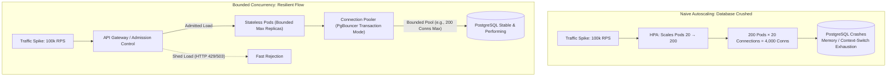

**Tradeoff**: Fast-rejecting excess requests prevents 100% total outage and preserves low latency for admitted traffic, but requires clients to handle rate-limiting signals and backoff gracefully.

> **Also see**: [PgBouncer Transaction Mode](33-sdi-key-takeaways.md#sdi-94-pgbouncer--transaction-mode-vs-session-mode), [Admission Control](../../reference-dictionary/resilience.md#admission-control)  
> **Dictionary**: [Connection Pooling](../../reference-dictionary/databases.md#connection-pooling), [Connection Storm](../../reference-dictionary/databases.md#connection-storm), [Load Shedding](../../reference-dictionary/resilience.md#load-shedding)  
> **Azure Services**: [Azure Database for PostgreSQL (Built-in PgBouncer)](../../architecture-azure/data/databases/postgresql/)  
> **Taxonomy Reference**: §2.1 Application Architecture Patterns

---

## sdi-146: Cache Outage Load Shift and Stampede Prevention

| | |
|:---|:---|
| **Problem** | A distributed cache (Redis) normally absorbs 95% of read traffic. When Redis crashes or network partitions for 5 minutes, 100% of read traffic immediately shifts to PostgreSQL. The 20x surge in database reads instantaneously saturates database IOPS, triggering query timeouts. Simultaneously, as popular keys expire or restart with cold caches, thousands of concurrent requests attempt to recompute the same keys simultaneously (cache stampede). |
| **Root cause** | Architectural reliance on a cache as a high-availability barrier without modeling the fallback failure path or implementing cold-cache concurrency guards. |

**Strategy**: Implement a defense-in-depth caching architecture combining **Request Coalescing**, **Stale-While-Revalidate**, and **Degradation Controls**:

1. **Request Coalescing (Singleflight)**: Ensure that for any given cache key miss, only exactly one request is dispatched to the backing database to query and populate the cache. All subsequent concurrent requests for the same key block and wait for that single in-flight query to return, sharing the result.
2. **Stale-While-Revalidate**: Configure caching tiers to serve stale local or distributed data during backing dependency revalidation, decoupling read latency from database fetch times.
3. **Probabilistic Early Recomputation (PER) / Jittered Expiration**: Apply random jitter ($\pm 15\%$) to TTLs so that keys do not expire simultaneously; use early recomputation before the hard TTL expires.
4. **Cache Outage Degradation Mode**: If Redis health checks fail, immediately flip the service into degraded mode: serve local in-memory stale cache, shed non-essential reads, and enable strict rate limiting on read-intensive database queries.

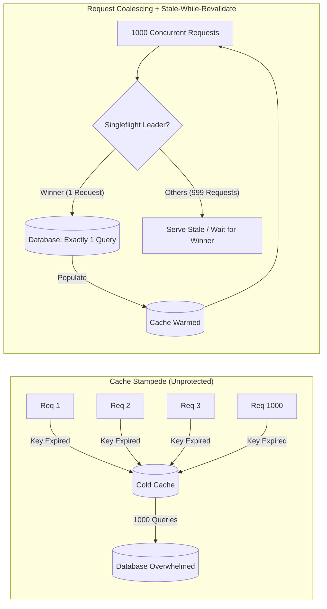

**Tradeoff**: Request coalescing introduces slight lock/synchronization overhead in application processes; stale-while-revalidate serves slightly out-of-date content to end users.

> **Also see**: [Cache Pre-Warming](33-sdi-key-takeaways.md#sdi-99-cache-pre-warming-for-stampede-prevention), [PER Algorithm](../../reference-dictionary/caching.md#per-algorithm)  
> **Dictionary**: [Cache Stampede](../../reference-dictionary/caching.md#cache-stampede), [Request Coalescing](../../reference-dictionary/caching.md#request-coalescing), [Stale-While-Revalidate](../../reference-dictionary/caching.md#stale-while-revalidate)  
> **Azure Services**: [Azure Cache for Redis (Clustering & Persistence)](../../architecture-azure/data/databases/redis/)  
> **Taxonomy Reference**: §2.1 Application Architecture Patterns

---

## sdi-147: Replication Lag and the Read-After-Write Consistency Boundary

| | |
|:---|:---|
| **Problem** | An application routes all writes to a primary database node and scales reads by distributing them across three read replicas. A user updates their profile or creates a post and is immediately redirected to the profile view, but the old data appears. The user assumes the update failed, clicks submit five times, and files a bug report. |
| **Root cause** | Asynchronous replication introduces measurable replication lag ($\Delta t \approx 50\text{ms} - 2\text{s}$). Reading immediately from a replica after writing to the primary violates **Read-After-Write Consistency** (also known as Read-Your-Writes consistency). |

**Strategy**: Enforce strict session consistency boundaries using **Write-Aware Read Routing**:

1. **Session-Level Pinning / Primary Lease**: When a user performs a write, set a short-lived cookie or session token (`just_wrote_timestamp = now()`). Direct all subsequent read requests from that specific user to the primary database for the duration of the typical replication lag window (e.g., 5 seconds).
2. **Replication Position Awareness (LSN / Causal Tokens)**: When a write commits on the primary, return the Log Sequence Number (LSN) or version token to the client. When the client sends the subsequent read, include the token; the router directs the query to a replica only if the replica has caught up past that LSN (`replica_lsn >= client_lsn`).
3. **Selective Replica Offloading**: Do not apply a blanket rule sending 100% of reads to replicas. Reserve read replicas for workloads that explicitly tolerate staleness (search, analytics, public feeds, recommendation engines).

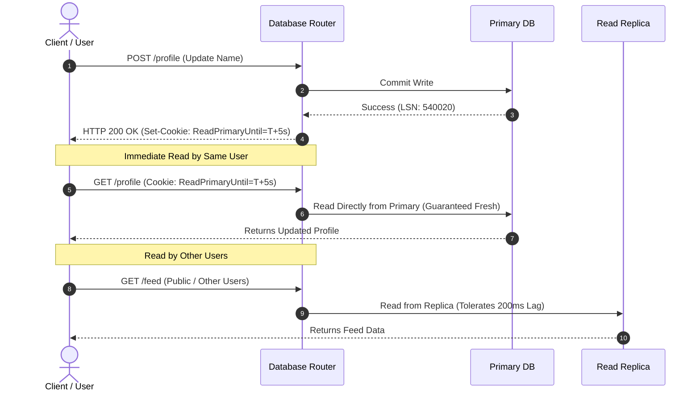

**Tradeoff**: Routing post-write reads to the primary increases primary connection and query load; tracking LSN tokens requires router logic or client-state cooperation.

> **Also see**: [Read-Your-Writes Consistency](33-sdi-key-takeaways.md#sdi-100-read-your-writes-consistency), [LSN & Replication Lag](../../reference-dictionary/databases.md#lsn)  
> **Dictionary**: [Read-After-Write Consistency](../../reference-dictionary/data-concurrency.md#read-after-write-consistency), [Replication Lag](../../reference-dictionary/data-architecture.md#replication-lag), [Session Affinity](../../reference-dictionary/caching.md#session-affinity)  
> **Azure Services**: [Azure Cosmos DB (Session Consistency Level)](../../architecture-azure/data/databases/cosmos-db/)  
> **Taxonomy Reference**: §2.1 Application Architecture Patterns

---

## sdi-148: Single-Node Optimization Exhaustion and Hot-Shard Isolation

| | |
|:---|:---|
| **Problem** | A monolithic database begins experiencing write latency. The team immediately decides to shard the database across 16 nodes. After months of re-architecting, migrations, broken foreign keys, and cross-shard query failures, they discover that 30% of all write traffic originates from a single enterprise customer. The shard hosting that customer remains completely saturated, while the other 15 shards sit idle. |
| **Root cause** | Premature sharding before exhausting single-node optimizations; choosing a shard key based purely on data volume rather than query frequency and tenant skew. |

**Strategy**: Exhaust vertical and schema optimizations first, then implement **Access-Pattern Sharding with Dedicated Large-Tenant Partitioning**:

1. **Exhaust Single-Node Headroom**: Before introducing distributed sharding, systematically eliminate:
   - Missing or redundant indexes (unnecessary indexes create write amplification on every insert/update).
   - Long-running transactions holding row/table locks.
   - Bloated payloads (move blobs to object storage).
   - Inefficient batch queries.
2. **Access-Pattern-Driven Shard Keys**: Choose a shard key that distributes traffic evenly across typical workloads and keeps co-accessed data within the same shard to eliminate cross-shard joins.
3. **Dedicated Capacity for Skewed Tenants (Outlier Isolation)**: For tenants generating disproportionate traffic (e.g., enterprise customer generating 30% of QPS), break them out into dedicated database instances or partitions with custom connection pools and quotas, insulating multi-tenant pools from starvation.
4. **Consistent Hashing with Virtual Nodes**: When partitioning across distributed nodes, use consistent hashing with virtual nodes to smooth out hash distribution and minimize rebalancing data movement when nodes are added or removed.

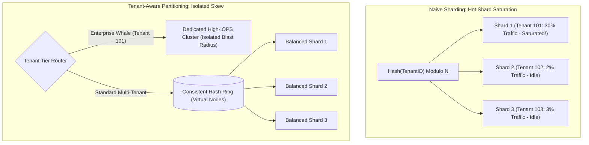

**Tradeoff**: Dedicated tenant clusters increase operational routing configuration and infrastructure management costs, but completely eliminate multi-tenant noisy-neighbor outages.

> **Also see**: [Directory-Based Sharding](33-sdi-key-takeaways.md#sdi-86-directory-based-sharding-by-access-pattern), [Write Sharding for Hot Partitions](33-sdi-key-takeaways.md#sdi-97-write-sharding-for-dynamodb-hot-partitions)  
> **Dictionary**: [Sharding](../../reference-dictionary/data-concurrency.md#sharding), [Consistent Hashing](../../reference-dictionary/networking.md#consistent-hashing), [Data Skew](../../reference-dictionary/data-architecture.md#data-skew)  
> **Azure Services**: [Azure Cosmos DB (Hierarchical Partition Keys)](../../architecture-azure/data/databases/cosmos-db/)  
> **Taxonomy Reference**: §2.1 Application Architecture Patterns

---

## sdi-149: Asynchronous Durability Boundaries and Net Backlog Drain Rate

| | |
|:---|:---|
| **Problem** | An API publishes events to Kafka and immediately returns `HTTP 202 Accepted`. Clients assume the transaction succeeded, but consumers lag severely, leaving jobs unfulfilled for hours. When operators discover 80 million messages of consumer lag, they observe consumers processing at 50,000 msg/sec and assume the backlog will clear in 26 minutes ($\frac{80\text{M}}{50\text{k}} = 1600\text{s}$). Hours later, the backlog has barely moved because producers continue pushing 40,000 msg/sec. |
| **Root cause** | Conflating HTTP acceptance with business completion; failing to understand that backlog drain rate is strictly determined by the **net surplus capacity** ($R_{\text{consumer}} - R_{\text{producer}}$), not gross consumer throughput. |

**Strategy**: Explicitly define asynchronous durability boundaries and calculate **Net Backlog Drain Time**:

1. **Acceptance vs. Completion Contracts**: Return `HTTP 202 Accepted` with a tracking identifier (`operation_id`) and status URL (`GET /operations/{id}`). Never promise completion at the ingestion boundary.
2. **Net Drain Rate Calculation**: Calculate recovery duration using the net surplus rate:
   $$T_{\text{recovery}} = \frac{\text{Accumulated Backlog}}{R_{\text{consumer}} - R_{\text{producer}}}$$
   With an 80M backlog, $R_{\text{consumer}} = 50,000\text{ msg/s}$, and $R_{\text{producer}} = 40,000\text{ msg/s}$:
   $$R_{\text{net}} = 50,000 - 40,000 = 10,000\text{ msg/s} \implies T_{\text{recovery}} = \frac{80,000,000}{10,000} = 8,000\text{ seconds } (\approx 2.22\text{ hours})$$
3. **Constrained-Resource Consumer Scaling**: Adding consumer pods only accelerates recovery if downstream dependencies (databases, external APIs) have unused capacity. If consumers are already database-bound, scaling consumer pods worsens lock contention and increases total recovery time.

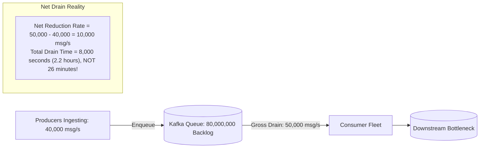

**Tradeoff**: Throttling producers or scaling consumers to widen the surplus rate drains backlogs faster, but risks pushing overload into downstream databases or violating producer SLAs.

> **Also see**: [Acknowledge Fast, Process Async](33-sdi-key-takeaways.md#sdi-92-acknowledge-fast-process-async-webhooks), [Delayed Job Scheduler Takeaways](delayed-job-scheduler-takeaways.md#sdi-115-database-index-strategy-for-time-queries)  
> **Dictionary**: [Backlog Recovery Time](../../reference-dictionary/messaging.md#backlog-recovery-time), [Backpressure](../../reference-dictionary/resilience.md#backpressure), [Consumer Group Lag](../../reference-dictionary/kafka.md#consumer-group-lag)  
> **Azure Services**: [Azure Event Hubs](../../architecture-azure/integration/event-hubs/), [Azure Service Bus (Dead-Lettering)](../../architecture-azure/integration/service-bus/)  
> **Taxonomy Reference**: §3.3 Event-Driven & Messaging

---

## sdi-150: Bounded Overload Protection: Backpressure, Load Shedding and Rate Limiting

| | |
|:---|:---|
| **Problem** | Under sudden viral traffic, a service allows queues and in-flight threads to grow without bound. Memory usage climbs until an Out-Of-Memory (OOM) crash kills the container. Upon restart, the container is immediately hit with the accumulated backlog and crashes again in a death spiral. Concurrently, a simple global rate limiter ("100 RPS per IP") fails to protect backend capacity because malicious or batch callers consume massive CPU with expensive queries disguised as low-QPS calls. |
| **Root cause** | Failing to bound queues; mistaking infinite buffering for resilience; using crude request-count rate limiting instead of multi-dimensional cost-aware limiting; lack of explicit fail-open/fail-closed policies. |

**Strategy**: Implement a multi-layered overload defense combining **Bounded Backpressure**, **Priority Load Shedding**, and **Cost-Unit Rate Limiting**:

1. **Bounded Queues Over Infinite Buffering**: Never allow queues, thread pools, or channel buffers to grow unbounded. When buffer limits are reached, immediately apply backpressure or shed load. Fast rejection via HTTP 429/503 preserves surviving capacity.
2. **Priority-Tiered Load Shedding**: Categorize traffic into priority classes:
   - Tier 1 (Critical): Payment checkout, active customer transactions.
   - Tier 2 (Standard): Search, browsing, catalog views.
   - Tier 3 (Sheddable): Recommendations, analytics tracking, marketing banners.
   Under saturation, shed Tier 3 entirely, degrade Tier 2, and protect Tier 1.
3. **Multi-Dimensional & Cost-Based Rate Limiting**: Rate limit by identity hierarchy (API Key, User ID, IP, Tenant) and charge per operation cost units (e.g., lightweight read = 1 unit, complex aggregation = 25 units).
4. **Explicit Fail-Open vs. Fail-Closed Decisions**: Configure the rate limiter's failure mode: fail-open for public content browsing; fail-closed for financial mutations and expensive generative AI operations.

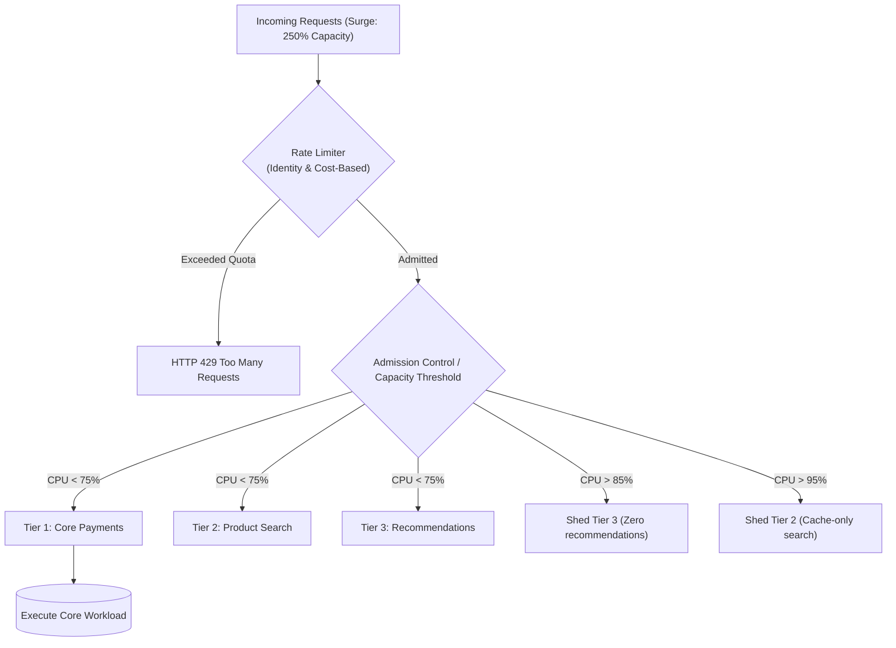

**Tradeoff**: Discarding low-priority traffic degrades user experience on auxiliary features, but prevents 100% total system outage and preserves transaction processing.

> **Also see**: [Token Bucket Over Fixed Window](33-sdi-key-takeaways.md#sdi-84-token-bucket-over-fixed-window), [Load Shed with Overflow Topic](33-sdi-key-takeaways.md#sdi-98-load-shed-with-overflow-topic-kafka-backpressure)  
> **Dictionary**: [Load Shedding](../../reference-dictionary/resilience.md#load-shedding), [Backpressure](../../reference-dictionary/resilience.md#backpressure), [Fail-Open vs Fail-Closed](../../reference-dictionary/resilience.md#fail-open-vs-fail-closed)  
> **Azure Services**: [Azure API Management (Rate Limiting & Quotas)](../../architecture-azure/integration/)  
> **Taxonomy Reference**: §2.1 Application Architecture Patterns

---

## sdi-151: Financial Idempotency and the Remote Timeout Three-State Ambiguity

| | |
|:---|:---|
| **Problem** | A payment service calls an external payment provider (e.g., Stripe, PayPal). The call times out after 10 seconds. The application catches the timeout, assumes the payment failed, and triggers an automatic retry. Ten minutes later, the customer discovers their credit card was charged twice for the same order. |
| **Root cause** | The **Three-State Ambiguity** of network communications: a timeout does not mean failure; it means the caller has entered an unknown state where the request may have succeeded, failed, or still be processing remotely. Blind retries without idempotency violate financial invariants. |

**Strategy**: Implement **Client Idempotency Keys** paired with **Atomic State Persistence** and **Reconciliation Protocols**:

1. **Unique Idempotency Key**: Require every mutating financial request to include a client-generated UUID idempotency key (`Idempotency-Key: pay_req_98a72b`).
2. **Atomic Ingestion State**: Persist the idempotency key in an authoritative database table with a unique constraint and state machine (`PENDING`, `SUCCEEDED`, `FAILED`). If a duplicate key arrives while the operation is `PENDING`, reject concurrent execution with HTTP 409 Conflict or return the existing in-flight promise.
3. **Reconciliation Over Blind Retry**: Upon receiving a network timeout from an external provider:
   - Do NOT immediately execute a new charge.
   - Poll the provider's query/status endpoint (`GET /v1/charges/{idempotency_key}`).
   - If the charge exists and succeeded, mark the local record as `SUCCEEDED`.
   - If the provider has no record, safely re-dispatch with the *same* idempotency key.
   - If the state remains ambiguous, schedule an out-of-band reconciliation worker.

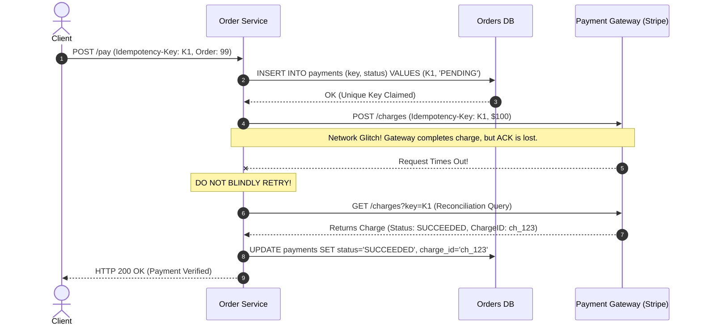

**Tradeoff**: Requires durable state tracking for all payment keys and extra network hops for status queries, but mathematically eliminates duplicate charges and financial discrepancies.

> **Also see**: [Idempotency Key for Payment Safety](33-sdi-key-takeaways.md#sdi-85-idempotency-key-for-payment-safety), [Saga Orchestration](33-sdi-key-takeaways.md#sdi-91-orchestration-saga-for-multi-service-transactions)  
> **Dictionary**: [Three-State Ambiguity](../../reference-dictionary/resilience.md#three-state-ambiguity), [Idempotency](../../reference-dictionary/cqrs-event-driven.md#idempotency), [Compensating Transaction](../../reference-dictionary/data-concurrency.md#compensating-transaction)  
> **Azure Services**: [Azure Functions (Durable Entities)](../../architecture-azure/compute/functions/)  
> **Taxonomy Reference**: §2.1 Application Architecture Patterns

---

## sdi-152: Authoritative Database Concurrency over Distributed Locks

| | |
|:---|:---|
| **Problem** | An e-commerce engineering team uses a Redis distributed lock (`SETNX` with a 5-second TTL) to guard inventory during flash sales. Under heavy load, an application thread acquiring the lock experiences a 6-second Garbage Collection (GC) pause. The Redis lock TTL expires and is acquired by a second worker. Both workers decrement inventory, causing the final stock unit to be sold twice (overselling). |
| **Root cause** | Distributed locks over asynchronous networks are vulnerable to lease expiration, clock skew, and process pauses; using non-authoritative cache locks to guard authoritative database state. |

**Strategy**: Rely on **Database-Native Atomic Conditional Updates** and **Reservation Rows**:

1. **Atomic Conditional SQL**: Enforce invariants directly inside the authoritative database engine using single atomic statements:
   ```sql
   UPDATE inventory 
   SET stock = stock - 1, version = version + 1
   WHERE product_id = 402 AND stock >= 1;
   ```
   If the update returns `rows_affected == 0`, inventory is exhausted. The database's write-ahead log (WAL) and row-level locks natively serialize concurrent attempts without relying on network leases.
2. **Explicit Reservation Rows**: For multi-item carts, insert reservation records with expiration timestamps (`EXPIRES_AT = NOW() + INTERVAL '10 minutes'`) inside a database transaction rather than holding distributed locks across multi-service calls.
3. **When Distributed Locks Are Actually Warranted**: Use distributed locks (with fencing tokens) only for coordinating non-authoritative leader election or scheduling deduplication, never as the sole barrier against data corruption.

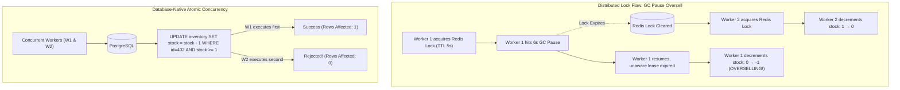

**Tradeoff**: Database row-level locks create serialization contention on extreme hot-spot items (e.g., concert tickets with 50,000 QPS on one SKU), requiring pre-allocation or queue buffering at extreme scale.

> **Also see**: [Fencing Token for Distributed Locks](33-sdi-key-takeaways.md#sdi-87-fencing-token-for-distributed-locks), [Optimistic Concurrency Control](../../reference-dictionary/data-concurrency.md#optimistic-locking)  
> **Dictionary**: [Overselling](../../reference-dictionary/data-concurrency.md#overselling), [Distributed Lock](../../reference-dictionary/data-concurrency.md#distributed-lock), [Atomic Conditional Update](../../reference-dictionary/data-concurrency.md#atomic-conditional-update)  
> **Azure Services**: [Azure SQL Database (Row-Level Locking & Snapshot Isolation)](../../architecture-azure/data/databases/)  
> **Taxonomy Reference**: §2.1 Application Architecture Patterns

---

## sdi-153: Dual-Write Prevention and Transactional Outbox Delivery Realities

| | |
|:---|:---|
| **Problem** | A microservice executes a local database transaction to update an order, then immediately makes a separate network call to publish an `OrderPlaced` event to Kafka. The database write commits, but the service crashes before the Kafka message is acknowledged. Downstream billing and shipping never learn about the order. Alternately, the Kafka message sends first, but the database write fails on constraint violation, causing downstream systems to charge a non-existent order. |
| **Root cause** | The **Dual-Write Problem**: two separate storage systems (database and message broker) cannot participate in an atomic commit without heavy two-phase commit (2PC) protocols that destroy performance and availability. |

**Strategy**: Implement the **Transactional Outbox Pattern** paired with **Idempotent Consumer Processing**:

1. **Transactional Outbox Table**: In the *same local database transaction* that updates business state, write an event record to an `outbox` table. Because both operations occur within the same ACID transaction, they either both commit or both roll back.
2. **Asynchronous Outbox Dispatch**: An asynchronous process (such as a Change Data Capture engine like Debezium or a polling relay worker) reads committed outbox entries, publishes them to Kafka, and marks them as published or deletes them.
3. **Embrace At-Least-Once Delivery**: The outbox publisher can crash *after* publishing to Kafka but *before* marking the outbox row. Therefore, duplicate messages will inevitably occur upon restart. Downstream consumers must implement idempotency (checking message IDs against processed sets) to guarantee exactly-once processing semantics.

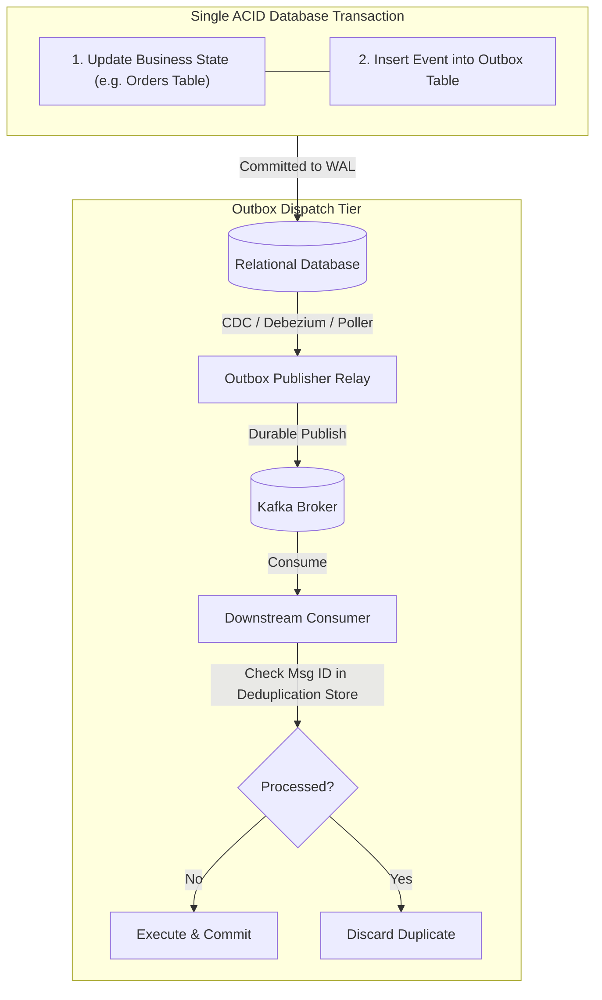

**Tradeoff**: Transactional outbox eliminates distributed state divergence, but adds polling/CDC relay infrastructure overhead and requires all downstream consumers to handle duplicate deliveries.

> **Also see**: [Outbox Cache Consistency](33-sdi-key-takeaways.md#sdi-104-outbox-cache-consistency), [Event-Driven vs Workflow-Driven Architecture](../messaging/event-driven-vs-workflow-driven-takeaways.md#broker-205-decoupling-vs-runtime-visibility-tradeoff)  
> **Dictionary**: [Dual-Write Problem](../../reference-dictionary/cqrs-event-driven.md#dual-write-problem), [Outbox Pattern](../../reference-dictionary/cqrs-event-driven.md#outbox-pattern), [Idempotent Consumer](../../reference-dictionary/kafka.md#idempotent-consumer)  
> **Azure Services**: [Azure Cosmos DB (Change Feed)](../../architecture-azure/data/databases/cosmos-db/)  
> **Taxonomy Reference**: §3.3 Event-Driven & Messaging

---

## sdi-154: Asymmetric Fan-Out and Skewed Traffic Architectures

| | |
|:---|:---|
| **Problem** | A social feed system uses a pure fan-out-on-write model: whenever a user posts, the system appends the post ID to every follower's timeline. When a celebrity user with 80 million followers posts, the system triggers 80 million database writes simultaneously, completely choking the background worker fleet and database. Similarly, in a URL shortener, a viral tweet points to a single short code, causing millions of RPS to slam the primary datastore for the same row. |
| **Root cause** | Designing symmetrical algorithms that assume uniform user distributions; ignoring power-law (Pareto) skew where 1% of entities generate 90% of traffic. |

**Strategy**: Design **Asymmetric, Skew-Aware Routing Architectures**:

1. **Hybrid Fan-Out for Feeds (Celebrity Problem)**:
   - **Standard Users (< 25,000 followers)**: Use fan-out-on-write. Write timelines to follower caches for $O(1)$ fast reads.
   - **Celebrity Accounts (> 25,000 followers)**: Do NOT fan out on write. When followers read their timelines, perform a hybrid fan-out-on-read merge: fetch the standard cached timeline and merge the celebrity's recent posts on the fly.
2. **Edge-Positioned Viral URL Caching**:
   - Cache popular redirect mappings at edge CDNs (Cloudflare, Azure Front Door) with short TTLs (e.g., 60 seconds).
   - Ensure viral redirect lookups never touch origin databases.
3. **Partitioned Notification Engines**:
   - For mass broadcast notifications (100 million users), decouple generation from dispatch.
   - Buffer notifications in delivery queues partitioned by downstream provider (APNs, FCM, SMS), with strict rate limiting and backpressure to avoid vendor rate-limit penalties.

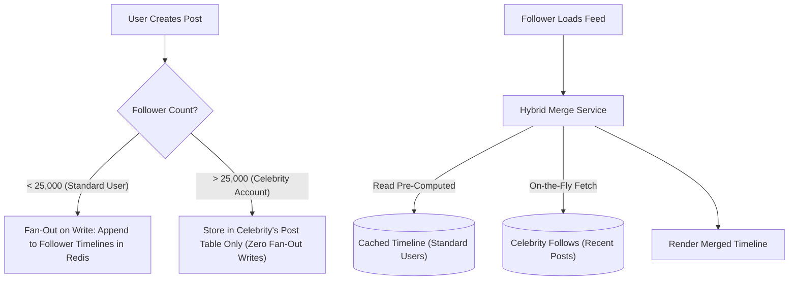

**Tradeoff**: Hybrid models introduce complexity in feed query routing and edge caching invalidation, but eliminate catastrophic write amplification and protect backing databases from viral traffic spikes.

> **Also see**: [Hybrid Fanout](33-sdi-key-takeaways.md#sdi-101-hybrid-fanout-timeline-generation), [Fan-out on Write vs. Fan-out on Read](29-sdi-key-takeaways.md#sdi-73-fan-out-on-write-vs-fan-out-on-read)  
> **Dictionary**: [Fanout on Write](../../reference-dictionary/messaging.md#fanout-on-write), [Fanout on Read](../../reference-dictionary/messaging.md#fanout-on-read), [Hybrid Fanout](../../reference-dictionary/messaging.md#hybrid-fanout)  
> **Azure Services**: [Azure Front Door (Global Edge Caching)](../../architecture-azure/networking/)  
> **Taxonomy Reference**: §2.1 Application Architecture Patterns

---

## sdi-155: Multi-Region Active-Active Writes and Physical Clock Limitations

| | |
|:---|:---|
| **Problem** | An enterprise deploys an active-active multi-region system across US-East and EU-West to lower latency. When an inter-region WAN cable is severed, both regions continue accepting writes to the same customer records. When connectivity restores, the system attempts to resolve conflicting writes using machine wall-clock timestamps (Last-Write-Wins). Due to 80ms of clock skew between server NTP daemons, newer user edits are silently overwritten by older updates. |
| **Root cause** | Violating the CAP theorem under network partitions; assuming physical wall-clock timestamps provide a reliable causal ordering across distributed nodes subject to clock drift. |

**Strategy**: Delineate **Business Invariant Boundaries** and use **Logical Versioning / Conflict-Free Replicated Data Types (CRDTs)**:

1. **Active-Active Applicability Boundary**: Active-active multi-region writes are only safe if the business domain can tolerate asynchronous convergence or partition divergence. Reading a product catalog can be active-active; deducting bank balances or booking seat inventory requires strict single-region primary ownership or global consensus.
2. **Logical Clocks Over Physical Clocks**: Never use wall-clock timestamps alone for distributed conflict resolution. Use Lamport Clocks, Vector Clocks, or version numbers to capture causal happens-before relationships.
3. **CRDTs & Application-Level Merging**: For collaborative state (e.g., shopping carts, document editing), use Conflict-Free Replicated Data Types (e.g., ORSet, PN-Counter) where state merges deterministically regardless of message arrival order.
4. **Partition Behavior by Operation**: Under split-brain network partitions, let independent read-only or regional operations continue (AP), while forcing strict global invariant mutations to pause or fail-closed (CP).

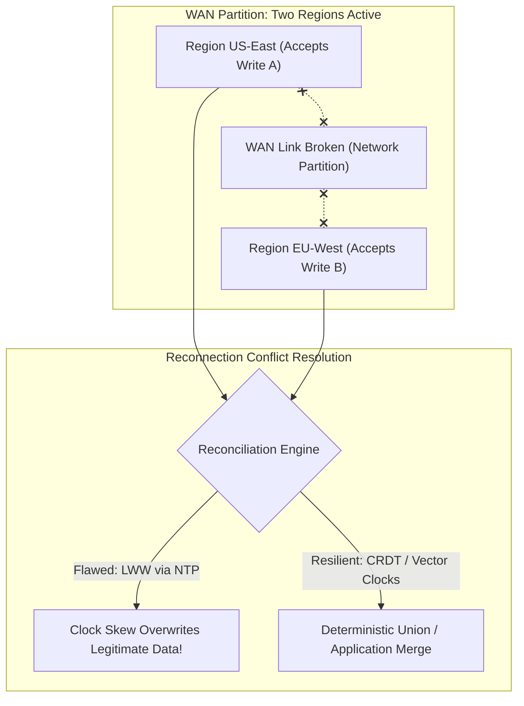

**Tradeoff**: Multi-region single-leader routing increases write latency for distant users, but guarantees zero conflicting state divergence and eliminates complex merge logic.

> **Also see**: [Consistency vs Availability Under Partition](../30-sdi-key-takeaways.md#sdi-137-consistency-vs-availability-under-partition), [Replication and Region Placement](../30-sdi-key-takeaways.md#sdi-138-replication-and-region-placement)  
> **Dictionary**: [Clock Skew](../../reference-dictionary/data-concurrency.md#clock-skew), [Vector Clocks](../../reference-dictionary/data-concurrency.md#vector-clocks), [CRDT](../../reference-dictionary/data-concurrency.md#crdt-conflict-free-replicated-data-type)  
> **Azure Services**: [Azure Cosmos DB (Multi-Region Write Replication & Conflict Resolution Policies)](../../architecture-azure/data/databases/cosmos-db/)  
> **Taxonomy Reference**: §2.1 Application Architecture Patterns

---

## sdi-156: Cascading Failure Interruption and Business-Outcome Observability

| | |
|:---|:---|
| **Problem** | A minor database query slows down due to an un-indexed lock contention. Microservices waiting for the query hold connection threads longer. As threads saturate, upstream services experience timeouts and trigger aggressive retries. The retry storm increases database query volume by 400%, completely crashing the database. Meanwhile, all monitoring dashboards display green status because the API Gateway returns HTTP 200 with fallback empty arrays, masking that zero orders are being placed. |
| **Root cause** | Unbounded retries and lack of circuit breakers turn localized latency spikes into global cascading collapses; monitoring infrastructure proxies (HTTP 200 rates) rather than business completion invariants. |

**Strategy**: Interlock **Resilience Levers** and deploy **Business-Outcome Observability**:

1. **Interrupting Cascading Failure Chains**:
   - **Timeout Hierarchy**: Upstream timeouts must strictly exceed downstream timeouts ($T_{\text{gateway}} > T_{\text{service}} > T_{\text{db}}$) with zero-tolerance deadlocks.
   - **Bounded Retries with Jittered Backoff**: Enforce retry budgets (e.g., maximum 10% retry traffic allowance) and exponential backoff with full jitter to avoid synchronized retry waves.
   - **Circuit Breakers & Bulkheads**: Trip open circuit breakers immediately when error rates or latency thresholds cross SLAs, isolating healthy components from degraded dependencies.
2. **Business-Outcome Observability**:
   - Look beyond technical "golden signals" (Latency, Traffic, Errors, Saturation).
   - Track core business metrics in real-time: `orders_completed_per_minute`, `payment_dollars_captured_per_second`, `notification_delivery_latency_p99`.
   - Alert whenever business throughput drops, even if HTTP error rates are zero.
3. **Staff-Level Trade-Off Reasoning**: Move beyond "drawing boxes." Senior and staff engineers evaluate organizational ownership boundaries, operational blast radiuses, infrastructure cost trajectories, and how systems degrade when core assumptions change.

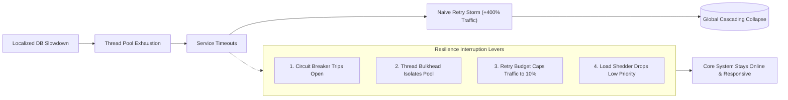

**Tradeoff**: Circuit breakers and fallbacks temporarily reject or degrade functionality, but prevent total platform blackout and allow automatic self-healing once root causes resolve.

> **Also see**: [Failure Handling & Timeout Hierarchy](interview-roadmap.md#sdi-13-failure-handling--timeout-hierarchy), [Observability Minimum](interview-roadmap.md#sdi-14-observability-minimum)  
> **Dictionary**: [Cascading Failure](../../reference-dictionary/resilience.md#cascading-failure), [Retry Storm](../../reference-dictionary/resilience.md#retry-storm), [Circuit Breaker](../../reference-dictionary/resilience.md#circuit-breaker)  
> **Azure Services**: [Azure Monitor (Application Insights & Metric Alerts)](../../architecture-azure/observability/)  
> **Taxonomy Reference**: §2.1 Application Architecture Patterns
