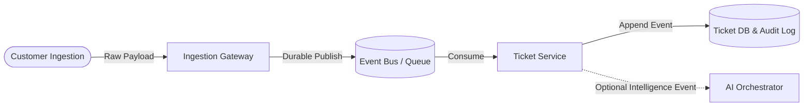
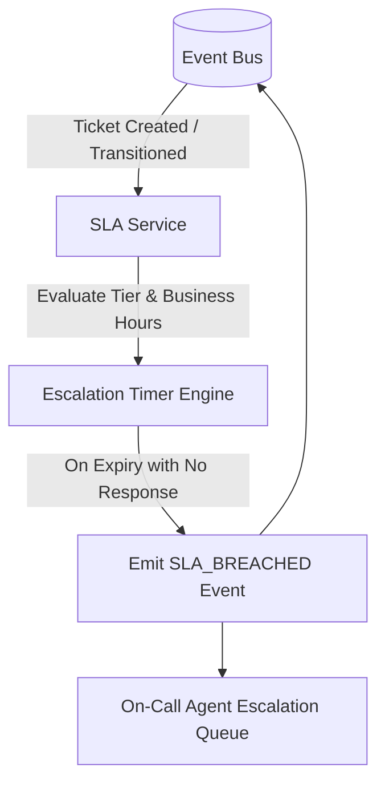
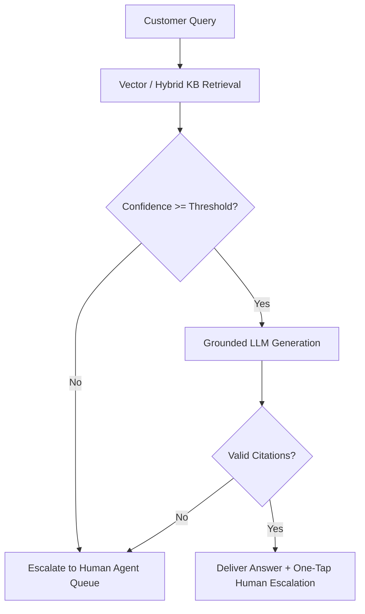
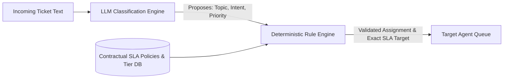
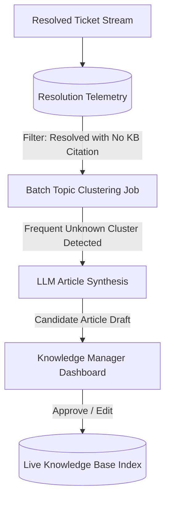
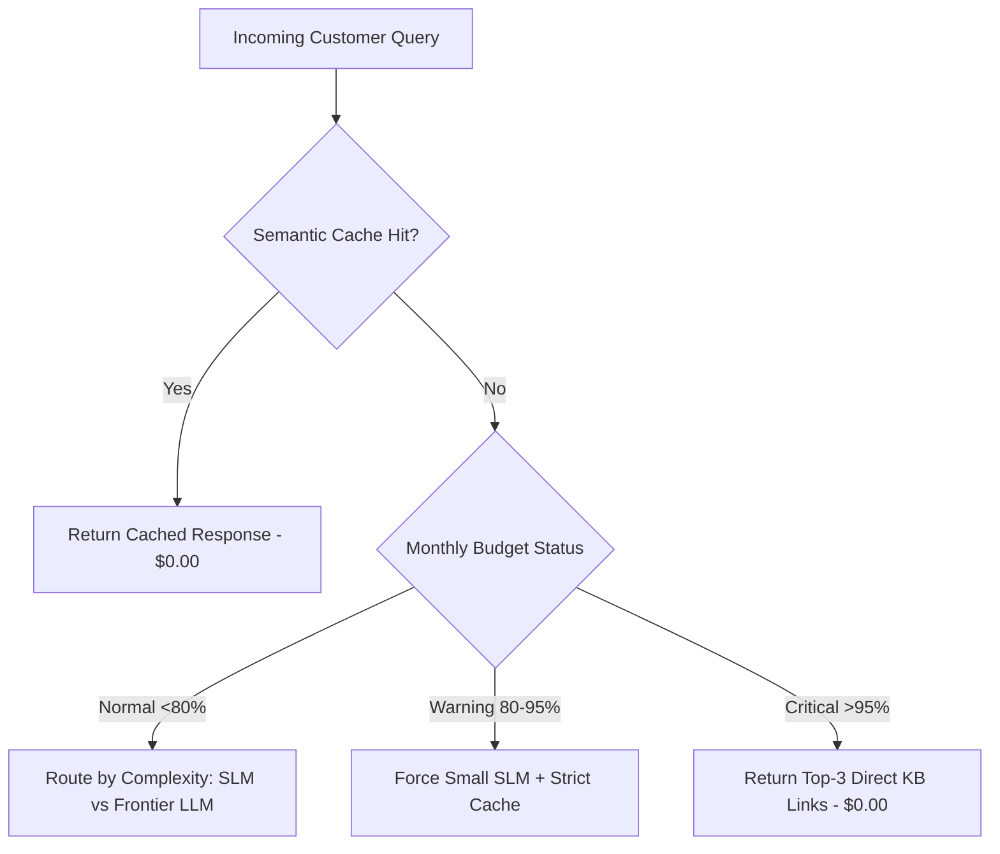

# Customer Support AI Platform — Key Takeaways

> **Parent**: [System Design Interview Reference](index.md)  
> **Source**: [Customer Support System Design Interview: Building an AI-Powered Support Platform (From MVP to GenAI)](../../articles/system-design-interview/customer-support-ai-platform-system-design-interview.md) — by Arvind Kumar (Aug 2026)  
> **Purpose**: Extract architectural tradeoffs and design principles for building reliable, compliant, and cost-controlled customer support platforms transitioning from durable MVPs to generative AI enhancements.

---

## Contents

| ID | Problem | Key Concept |
|:---|:---|:---|
| [`sdi-122`](#sdi-122-boring-reliability-first--decoupling-ingestion-and-ticketing-state-machine-from-ai) | AI chatbots placed in front of unproven ingestion lose critical incoming tickets | Durable-first ingestion queueing decoupled from an append-only state machine |
| [`sdi-123`](#sdi-123-pure-function-sla-observation-engine-over-mutating-ticket-state) | Embedding SLA calendar math into CRUD operations causes lock contention and errors | Pure-function SLA engine observing events and emitting breaches without mutating state |
| [`sdi-124`](#sdi-124-relational-postgres-state-machine--jsonb-over-pure-document-store) | Unstructured document stores struggle with transactional multi-attribute queries | Postgres ACID state machine with JSONB flexibility + Elasticsearch for text search |
| [`sdi-125`](#sdi-125-tdd-for-time-and-money-logic-to-prevent-llm-code-generation-drift) | AI coding assistants quietly introduce subtle bugs in business-hours and billing math | Human-authored TDD/BDD specs, 80%+ CI diff coverage, chaos tests, and p95 latency budgets |
| [`sdi-126`](#sdi-126-grounded-ai-resolver-with-non-negotiable-human-escalation-path) | Ungrounded chatbots hallucinate policies, trapping frustrated users in bot loops | Strict RAG citation grounding + confidence gating with single-tap human escalation |
| [`sdi-127`](#sdi-127-human-in-the-loop-agent-copilot-with-zero-auto-send) | Auto-sending LLM drafts risks brand damage and subtle contractual drift | Agent copilot grounding suggestions in KB and ticket context with mandatory human review |
| [`sdi-128`](#sdi-128-llm-proposal-vs-deterministic-rule-enforcement-for-ticket-triage) | Probabilistic LLMs misclassify high-severity tickets or miscalculate deadlines | LLM proposes category/priority; deterministic rule layer validates and enforces SLAs |
| [`sdi-129`](#sdi-129-kb-gap-detector--turning-operational-resolutions-into-kb-evolution) | Knowledge bases decay because agent solutions remain trapped in private tickets | Batch mining of agent-resolved tickets to detect missing topics and auto-draft articles |
| [`sdi-130`](#sdi-130-seven-day-reopen-gated-auto-resolution--grounding-rate-observability) | Naive bot deflection metrics mask repeat inquiries and customer frustration | 7-day reopen-gated auto-resolution, grounding rates, copilot acceptance, and distributed tracing |
| [`sdi-131`](#sdi-131-tiered-model-routing--token-spend-ceilings-with-graceful-degradation) | Uniform frontier LLM usage causes uncontrollable token costs and budget exhaustion | Semantic caching, complexity-based model routing, and link-only zero-token fallback |

---

## sdi-122: Boring Reliability First — Decoupling Ingestion and Ticketing State Machine from AI

| | |
|:---|:---|
| **Problem** | Teams often jump directly into deploying LLMs or conversational bots before building a durable ticketing backbone. When inference engines experience latency spikes or service outages, raw incoming customer inquiries (emails, chats, webhook payloads) are dropped, violating contractual service agreements. |
| **Root cause** | Conflating the foundational ingestion and storage substrate with generative intelligence layers; treating AI as the product rather than an interpretation capability over a resilient foundation. |

**Strategy**: Decouple ingestion from ticket processing and intelligence. Ingestion adapters (Email Ingestion, Chat Gateway, Web Form Receiver) immediately write raw payloads to a durable message broker (Kafka or Service Bus) and acknowledge receipt. A dedicated Ticket Service consumes these events asynchronously and executes an append-only finite state machine (`NEW` $\rightarrow$ `ASSIGNED` $\rightarrow$ `RESPONDED` $\rightarrow$ `RESOLVED` $\rightarrow$ `REOPENED`).



**Tradeoff**: Introduces asynchronous eventual consistency and slight end-to-end processing latency (milliseconds), but guarantees zero message loss during downstream component outages or traffic surges.

> **Also see**: [Durable Ingestion Patterns](../../architecture-general/03-integration-communication-architecture/), [At-Least-Once Delivery & Idempotent Consumer](delayed-job-scheduler-takeaways.md#sdi-118-the-exactly-once-fallacy-at-least-once--idempotent-handlers)  
> **Dictionary**: [Event-Driven Architecture](../../reference-dictionary/cqrs-event-driven.md#event-driven-architecture), [Message Broker](../../reference-dictionary/messaging.md#message-broker)  
> **Azure Services**: [Azure Service Bus](../../architecture-azure/integration/), [Azure Event Hubs](../../architecture-azure/integration/)  
> **Taxonomy Reference**: §3.3 Event-Driven & Messaging

---

## sdi-123: Pure-Function SLA Observation Engine over Mutating Ticket State

| | |
|:---|:---|
| **Problem** | Computing complex contractual SLA deadlines (business hours, timezone offsets, holiday calendars, plan tier thresholds) within mutable ticket CRUD transactions creates intense row lock contention, database deadlocks, and fragile audit trails. |
| **Root cause** | Tightly coupling contractual deadline computation and escalation logic with operational ticket state mutations. |

**Strategy**: Design the SLA Service as an isolated, pure function of state. The SLA engine subscribes to ticket lifecycle events emitted onto the event bus, deterministically computes deadlines based on customer tier and operational calendars, and schedules escalation timers. If a deadline expires without a `RESPONDED` event, the SLA Service emits an `SLA_BREACHED` event directly to notification queues. It never directly mutates the ticket record.



**Tradeoff**: Requires distributed event choreography and monitoring for event consumer lag to ensure SLA timers reflect real-time ticket activity.

> **Also see**: [Delayed Job Scheduler Takeaways](delayed-job-scheduler-takeaways.md)  
> **Dictionary**: [SLA (Service Level Agreement)](../../reference-dictionary/architecture-patterns.md), [Event-Driven Architecture](../../reference-dictionary/cqrs-event-driven.md#event-driven-architecture)  
> **Azure Services**: [Azure Functions](../../architecture-azure/compute/) (Event-Driven Triggers), [Azure Event Grid](../../architecture-azure/integration/)  
> **Taxonomy Reference**: §2.1 Application Architecture Patterns

---

## sdi-124: Relational Postgres State Machine + JSONB over Pure Document Store

| | |
|:---|:---|
| **Problem** | Choosing a pure NoSQL document store under the assumption that "tickets are just documents" creates massive architectural debt. Support platforms query tickets by composite attributes (status, priority, assigned queue, organization ID, SLA due date) and perform concurrent state transitions, which document stores execute inefficiently without multi-document ACID transactions. |
| **Root cause** | Confusing ticket *content* (unstructured text) with ticket *identity and lifecycle* (transactional finite state machine). |

**Strategy**: Use a relational database (PostgreSQL) as the authoritative state machine and ledger. Model core state machine properties (status, queue_id, priority, customer_id, sla_due_at) as strongly-typed indexed columns with ACID constraints. Use `JSONB` columns for dynamic channel-specific metadata and offload full-text search and embedding vector queries to Elasticsearch / Vector DBs.

```sql
CREATE TABLE tickets (
    ticket_id UUID PRIMARY KEY,
    customer_id UUID NOT NULL,
    status VARCHAR(32) NOT NULL, -- new, assigned, responded, resolved, reopened
    queue_id VARCHAR(64) NOT NULL,
    priority VARCHAR(16) NOT NULL, -- P1, P2, P3, P4
    sla_due_at TIMESTAMPTZ NOT NULL,
    channel VARCHAR(32) NOT NULL,
    metadata JSONB,
    created_at TIMESTAMPTZ NOT NULL DEFAULT NOW(),
    updated_at TIMESTAMPTZ NOT NULL DEFAULT NOW()
);

CREATE INDEX idx_tickets_queue_status_sla ON tickets (queue_id, status, sla_due_at);
```

**Tradeoff**: Schema migrations require disciplined DDL scripts; extreme horizontal scaling requires tenant-based sharding.

> **Also see**: [Database ID Strategy](../databases/database-id-strategy.md), [Partial Index on Working Set](delayed-job-scheduler-takeaways.md#sdi-115-partial-index-on-active-working-set)  
> **Dictionary**: [ACID Transactions](../../reference-dictionary/databases.md#acid-transactions), [B-Tree Index](../../reference-dictionary/databases.md#b-tree-index)  
> **Azure Services**: [Azure Database for PostgreSQL](../../architecture-azure/data/databases/), [Azure Cosmos DB for PostgreSQL](../../architecture-azure/data/databases/)  
> **Taxonomy Reference**: §4.1 Data Architecture & Storage

---

## sdi-125: TDD for Time-and-Money Logic to Prevent LLM Code-Generation Drift

| | |
|:---|:---|
| **Problem** | When development teams leverage AI coding assistants (Copilot, Claude), the assistants generate plausible-looking code that passes basic unit tests but quietly introduces subtle bugs in contractual time arithmetic (business hours across holidays, timezone boundaries, leap years) and billing logic. |
| **Root cause** | AI coding assistants exhibit high statistical confidence in temporal and financial algorithms while frequently mishandling non-trivial calendar boundary conditions. |

**Strategy**: Enforce strict engineering guardrails on code generation:
1. **Human-Authored TDD & BDD Specs**: Write unit tests and Gherkin feature files *before* generating implementation code. The test suite serves as the immutable specification.
2. **CI Coverage Floors**: Enforce an 80%+ branch coverage floor on new pull request diffs.
3. **Outage Load Testing**: Benchmark systems against sudden $3\times$ volume surges caused by production product outages.
4. **Chaos Testing**: Validate that killing the ingestion pipeline mid-burst queues messages rather than dropping them, and killing the KB search engine allows agents to still view raw tickets.

```gherkin
Feature: SLA escalation
  Scenario: Priority-1 ticket escalates when its deadline passes
    Given a ticket with priority "P1"
    And the business-hours SLA for P1 is 2 hours
    When 2 business hours pass without a response
    Then the ticket status becomes "overdue"
    And an escalation event is emitted to the on-call queue
```

**Tradeoff**: Requires upfront human test-authoring discipline before leveraging AI code synthesis.

> **Also see**: [Accountability & Review Gates in AI Engineering](../../reference-dictionary/ai-ml-llm.md#review-gate)  
> **Dictionary**: [Verification Loop (AI)](../../reference-dictionary/ai-ml-llm.md#verification-loop-ai), [Human Ownership](../../reference-dictionary/ai-ml-llm.md#human-ownership)  
> **Azure Services**: [Azure DevOps Pipelines](../../architecture-azure/devops/), [GitHub Actions](../../architecture-azure/devops/)  
> **Taxonomy Reference**: §8.1 DevOps & Delivery Lifecycle

---

## sdi-126: Grounded AI Resolver with Non-Negotiable Human Escalation Path

| | |
|:---|:---|
| **Problem** | Deploying autonomous customer-facing chatbots that generate ungrounded answers results in hallucinations, incorrect policy commitments, and customer alienation. Trapping users in circular bot interactions without a clear human exit destroys brand trust. |
| **Root cause** | Allowing open-domain LLM generation without strict retrieval verification and missing deterministic escalation circuit breakers. |

**Strategy**: Implement an AI Resolver driven by Retrieval-Augmented Generation (RAG) with mandatory safety guardrails:
1. **Strict Context Grounding**: The LLM is restricted to answering exclusively from retrieved and cited Knowledge Base (KB) documents.
2. **Confidence Threshold Gating**: If vector retrieval similarity or generation confidence falls below calibrated thresholds, the system skips generation entirely.
3. **One-Tap Human Escape**: Every AI-generated response includes visible article source citations and a persistent, one-click "Connect with an Agent" button that immediately routes the entire context to the human queue.



**Tradeoff**: Deflects fewer total tickets compared to aggressive ungrounded bots, but prevents catastrophic policy hallucinations and protects customer satisfaction.

> **Also see**: [RAG Architecture & Optimization](../../architecture-general/12-ai-applications/)  
> **Dictionary**: [Grounding](../../reference-dictionary/ai-ml-llm.md#grounding), [Grounding Rate](../../reference-dictionary/ai-ml-llm.md#grounding-rate), [Hallucination](../../reference-dictionary/ai-ml-llm.md#hallucination)  
> **Azure Services**: [Azure OpenAI Service](../../architecture-azure/), [Azure AI Search](../../architecture-azure/)  
> **Taxonomy Reference**: §12.1 AI Application Architecture

---

## sdi-127: Human-in-the-Loop Agent Copilot with Zero Auto-Send

| | |
|:---|:---|
| **Problem** | Attempting to fully automate complex support tier responses leads to inaccurate resolutions on nuanced tickets, while completely manual drafting causes severe agent fatigue and misses SLA response targets. |
| **Root cause** | Treating AI as an autonomous replacement for human agents rather than a productivity-enhancing copilot workbench. |

**Strategy**: Implement an Agent Copilot operating under a strict **Zero Auto-Send** policy. When an agent opens a ticket, the copilot asynchronously retrieves customer history, plan tier metadata, and relevant KB articles to generate a pre-drafted response. The draft is populated directly in the agent's editor for human review, adjustment, or discard.

```
+-----------------------------------------------------------------------+
| Ticket #8492 - Customer: Acme Corp (Enterprise Tier)                  |
| Subject: Webhook delivery failure on endpoint 504                     |
+-----------------------------------------------------------------------+
| [AI Copilot Draft - Grounded in KB #204 & Webhook Diagnostics]       |
| "Hello Sarah, we detected upstream timeouts on your endpoint.         |
|  Based on KB #204, here is how to configure exponential backoff..."   |
+-----------------------------------------------------------------------+
| [ Accept & Send ]    [ Edit Draft (Active) ]    [ Discard Suggestion ] |
+-----------------------------------------------------------------------+
```

**Tradeoff**: Maintains human labor overhead per ticket, but increases agent throughput by $2\times\text{--}3\times$ while ensuring 100% human accountability for outbound communication.

> **Also see**: [Maker-Checker Pattern](../../reference-dictionary/ai-ml-llm.md#maker-checker-pattern-ai)  
> **Dictionary**: [Copilot Acceptance Rate](../../reference-dictionary/ai-ml-llm.md#copilot-acceptance-rate), [Human Ownership](../../reference-dictionary/ai-ml-llm.md#human-ownership)  
> **Azure Services**: [Azure OpenAI Service](../../architecture-azure/), [Azure App Service](../../architecture-azure/compute/)  
> **Taxonomy Reference**: §12.1 AI Application Architecture

---

## sdi-128: LLM Proposal vs Deterministic Rule Enforcement for Ticket Triage

| | |
|:---|:---|
| **Problem** | Allowing an LLM to directly assign contractual ticket priority (e.g., P1 vs P3) and route tickets can result in misrouted critical incidents or SLA breaches due to prompt injection, semantic ambiguity, or model variance. |
| **Root cause** | Granting non-deterministic probabilistic models authoritative write control over contractual business workflows. |

**Strategy**: Enforce a strict architectural separation between **LLM Proposal** and **Deterministic Rule Enforcement**:
1. **Probabilistic Proposal**: The LLM extracts intent, topic classification, sentiment, and proposed priority from free-form text.
2. **Deterministic Enforcement**: A rule engine validates the proposal against tenant subscription tiers, contractual SLA policies, and current on-call schedules. If the LLM proposes P1 but the customer contract only supports P3, or if classification confidence is low, the rule engine deterministically overrides or routes the ticket to general triage.



**Tradeoff**: Requires maintaining both prompt engineering pipelines and a business rule engine, but ensures contractual SLA compliance cannot be compromised by model misinterpretation.

> **Also see**: [Action Surfaces & Guardrails](../../reference-dictionary/ai-ml-llm.md#action-surfaces)  
> **Dictionary**: [Guardrails (AI)](../../reference-dictionary/ai-ml-llm.md#guardrails-ai), [Review Gate](../../reference-dictionary/ai-ml-llm.md#review-gate)  
> **Azure Services**: [Azure Logic Apps](../../architecture-azure/integration/), [Azure Functions](../../architecture-azure/compute/)  
> **Taxonomy Reference**: §2.1 Application Architecture Patterns

---

## sdi-129: KB-Gap Detector — Turning Operational Resolutions into KB Evolution

| | |
|:---|:---|
| **Problem** | Enterprise knowledge bases quickly become obsolete and disconnected from customer reality. Support agents repeatedly answer emerging questions using unshared tribal knowledge, leaving documentation stale and auto-resolution rates stagnant. |
| **Root cause** | Absence of operational telemetry connecting ticket resolution methods back to knowledge base maintenance workflows. |

**Strategy**: Deploy an asynchronous batch **KB-Gap Detector**. The system logs telemetry for every resolved ticket: (a) resolved via existing KB article, (b) resolved via agent custom response (no article cited), or (c) unresolved / escalated. Periodic batch jobs cluster un-cited agent resolutions, identify high-volume missing topics, auto-draft candidate KB articles via LLM, and submit them to documentation managers for review and one-click publishing.



**Tradeoff**: Requires background clustering compute and human editorial review bandwidth, but transforms daily support operations into a self-improving documentation flywheel.

> **Also see**: [Knowledge Base Architecture](../../architecture-general/04-data-analytics-ai-architecture/)  
> **Dictionary**: [KB-Gap Detector](../../reference-dictionary/ai-ml-llm.md#kb-gap-detector), [RAG (Retrieval-Augmented Generation)](../../reference-dictionary/ai-ml-llm.md#rag)  
> **Azure Services**: [Azure AI Search](../../architecture-azure/), [Azure OpenAI Service](../../architecture-azure/)  
> **Taxonomy Reference**: §4.2 Data Engineering & AI Platforms

---

## sdi-130: Seven-Day Reopen-Gated Auto-Resolution & Grounding Rate Observability

| | |
|:---|:---|
| **Problem** | Engineering teams frequently optimize for naive metrics like "bot deflection rate" (tickets closed by the bot), which masks customer frustration, abandoned inquiries, and immediate ticket re-openings. |
| **Root cause** | Measuring immediate point-in-time bot status transitions rather than true end-to-end customer issue resolution over time. |

**Strategy**: Instrument honest, multi-dimensional GenAI observability:
1. **7-Day Reopen-Gated Auto-Resolution**: Count a ticket as successfully resolved only if no customer follow-up or reopen event occurs within 7 days.
2. **Grounding Rate**: Monitor the percentage of resolver answers citing verified retrieved articles vs fallback ungrounded responses.
3. **Copilot Acceptance Rate**: Track whether agent suggestions are accepted as-is, edited, or discarded.
4. **Distributed Tracing**: Trace every request across Orchestrator $\rightarrow$ Retrieval $\rightarrow$ LLM $\rightarrow$ Guardrails with OpenTelemetry, maintaining immutable audit logs for regulated tenants.

$$\text{Honest Auto-Resolution Rate} = \frac{\text{Bot-Closed Tickets with No Reopen in 7 Days}}{\text{Total Ingested Tickets}} \times 100\%$$

**Tradeoff**: True resolution metrics exhibit a 7-day reporting lag, requiring dual dashboards (real-time leading indicators vs lagged true resolution).

> **Also see**: [Observability & OpenTelemetry](../../architecture-general/07-reliability-performance-operations/)  
> **Dictionary**: [Reopen-Gated Auto-Resolution Rate](../../reference-dictionary/ai-ml-llm.md#reopen-gated-auto-resolution-rate), [Grounding Rate](../../reference-dictionary/ai-ml-llm.md#grounding-rate), [Agent Metrics](../../reference-dictionary/ai-ml-llm.md#agent-metrics)  
> **Azure Services**: [Azure Monitor](../../architecture-azure/observability/), [Application Insights](../../architecture-azure/observability/)  
> **Taxonomy Reference**: §7.1 Reliability, Resilience & Observability

---

## sdi-131: Tiered Model Routing & Token Spend Ceilings with Graceful Degradation

| | |
|:---|:---|
| **Problem** | Routing all user questions to top-tier frontier LLMs causes explosive token bills that scale linearly with ticket volume. Furthermore, hitting monthly budget limits abruptly crashes AI features if hard financial ceilings lack graceful fallbacks. |
| **Root cause** | Monolithic inference routing without query complexity classification, combined with binary (all-or-nothing) feature gating. |

**Strategy**: Implement complexity-tiered routing and graceful spend degradation:
1. **Semantic Caching & Tiered Routing**: Check semantic caches for identical resolved queries ($0 token cost); route standard FAQs to fast SLMs ($0.001); reserve frontier models for complex multi-issue reasoning.
2. **Unit Cost of Truth**: Track token cost *per resolved ticket* rather than aggregate spend.
3. **Graceful Spend Degradation**: When monthly token spend crosses $80\%$ of budget, restrict generation to high-tier plans. When spend crosses $95\%$, gracefully degrade the resolver to return top-3 direct KB links with zero LLM generation, ensuring the core platform remains fully available without budget overruns.



**Tradeoff**: Adds routing classification logic and requires designing client UX fallbacks for link-only responses during budget caps.

> **Also see**: [Cost Management & Optimization](../../architecture-azure/cost-management/)  
> **Dictionary**: [Model Routing by Complexity](../../reference-dictionary/ai-ml-llm.md#model-routing-by-complexity), [Graceful Spend Degradation (LLM)](../../reference-dictionary/ai-ml-llm.md#graceful-spend-degradation-llm), [Semantic Cache](../../reference-dictionary/caching.md#semantic-cache)  
> **Azure Services**: [Azure API Management](../../architecture-azure/networking/) (Token Throttling / Circuit Breaking), [Azure OpenAI Service](../../architecture-azure/)  
> **Taxonomy Reference**: §7.2 Cost Engineering & Resource Optimization
