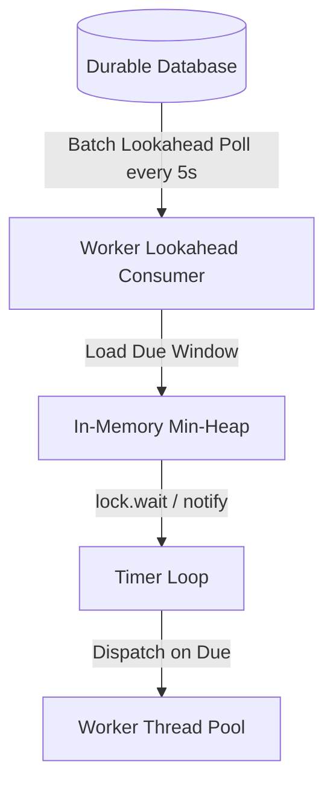

# Delayed Job Scheduler — Key Takeaways

> **Parent**: [System Design Interview Reference](index.md)  
> **Source**: [Amazon Interview Question: Design a Delayed Job Scheduler](../../articles/system-design-interview/amazon-interview-question-design-a-delayed-job-scheduler.md) — by Emily (Aug 2026)  
> **Purpose**: Extract reusable low-level and distributed architectural patterns for building durable, precise, and highly concurrent delayed job schedulers.

---

## Contents

| ID | Problem | Key Concept |
|:---|:---|:---|
| [`sdi-112`](#sdi-112-thread-per-job-fallacy--decoupled-in-memory-min-heap-loop) | Naive `Thread.sleep` exhausts memory and OS context switches | Single timer thread with Min-Heap (`PriorityQueue`) decoupled from execution worker pool |
| [`sdi-113`](#sdi-113-interruptible-waitdelay--notify-over-uninterruptible-sleep) | Arriving high-priority/sooner jobs blocked behind long sleeps | Use `lock.wait(delay)` interrupted by `lock.notify()` on head insertion |
| [`sdi-114`](#sdi-114-two-tier-hybrid-scheduling-db-lookahead--in-memory-precision) | Millisecond polling crushes DB; coarse polling introduces jitter | Two-tier lookahead: batch fetch 30s window from DB, micro-schedule in RAM |
| [`sdi-115`](#sdi-115-partial-index-on-active-working-set) | Millions of historical completed rows bloat indexes and slow writes | Filtered/partial index on `(run_at) WHERE state = 'PENDING'` |
| [`sdi-116`](#sdi-116-distributed-row-claiming-with-for-update-skip-locked) | Competing workers either duplicate work or serialize behind locks | `FOR UPDATE SKIP LOCKED` claims disjoint batches concurrently without Redis locks |
| [`sdi-117`](#sdi-117-lease-heartbeating-with-ownership-check-guard) | Stale worker renews lease after theft, causing concurrent execution | Atomic lease extension `WHERE job_id = :id AND lease_owner = :worker_id` |
| [`sdi-118`](#sdi-118-the-exactly-once-fallacy-at-least-once--idempotent-handlers) | Crash between execution and DB commit causes duplicate processing | Contract: at-least-once delivery + deduplication on stable `job_id` |
| [`sdi-119`](#sdi-119-time-bucketing--jitter-for-midnight-thundering-herd) | Round cron timestamps (00:00:00) cause massive point stampedes | Truncated time buckets (`bucket` column) + client-side schedule jitter |
| [`sdi-120`](#sdi-120-database-authoritative-clock-over-worker-clock-skew) | Distributed NTP drift causes premature or out-of-order execution | Evaluate time exclusively on DB server (`now()`) in query predicates |
| [`sdi-121`](#sdi-121-cooperative-in-flight-cancellation-via-checkpoint-flags) | Hard-killing distributed running jobs corrupts state | Optimistic state update for PENDING; cooperative flag polling for RUNNING |

---

## sdi-112: Thread-Per-Job Fallacy & Decoupled In-Memory Min-Heap Loop

| | |
|:---|:---|
| **Problem** | Spawning a thread per scheduled task (`new Thread(() -> { Thread.sleep(delay); run(); })`) exhausts memory at ~10,000 jobs (each thread costs ~1MB stack) and degrades system performance through excessive OS context switching. Furthermore, inline execution on the timing thread blocks all subsequent jobs if a single job is slow. |
| **Root cause** | Conflating task scheduling (timing) with task execution (work), while tying idle wait states to expensive kernel-managed OS threads. |

**Strategy**: Decouple timing from execution. Use a single dedicated timer loop that manages a Min-Heap (`PriorityQueue<Job>` ordered by `run_at`). The timer thread has exactly one responsibility: identifying when the head item is due and immediately dispatching it to an asynchronous worker thread pool (`ThreadPoolExecutor`). This matches the standard library pattern found in `ScheduledThreadPoolExecutor` and Java's `DelayQueue`.

**Tradeoff**: In-memory priority queues are volatile and process-bound. If the host process crashes or is redeployed, all scheduled jobs in RAM are lost unless backed by a durable persistence layer.

> **Also see**: [Two-Tier Hybrid Scheduling](#sdi-114), [Timer Thread Wait vs Sleep](#sdi-113)  
> **Dictionary**: [Delayed Job Scheduler](../../reference-dictionary/architecture-patterns.md#delayed-job-scheduler), [Thread Pool Sizing Formula](../../reference-dictionary/concurrency-runtimes.md#thread-pool-sizing-formula)  
> **Azure Services**: [Azure Container Apps](../../architecture-azure/compute/), [Azure Functions](../../architecture-azure/compute/) (Timer Trigger)  
> **Taxonomy Reference**: §2.1 Application Architecture Patterns

---

## sdi-113: Interruptible `wait(delay)` + `notify()` over Uninterruptible Sleep

| | |
|:---|:---|
| **Problem** | If a timer thread uses `Thread.sleep(delay)` based on the current queue head (e.g., waiting 1 hour for the next job), any newly submitted job scheduled to run in 5 seconds will be blocked and run 59 minutes and 55 seconds late. |
| **Root cause** | `Thread.sleep()` is uninterruptible by state mutations in the heap — it cannot dynamically adjust its sleep duration when a higher-priority, earlier job is inserted. |

**Strategy**: Guard the queue with an explicit monitor lock and use condition waiting (`lock.wait(delay)`). In the `schedule(job)` insertion method, inspect if the new job becomes the new head of the priority queue (`queue.peek() == job`). If it does, invoke `lock.notify()` to immediately wake the timer thread, recalculate the remaining delay, and reset the wait window.

```java
void schedule(Job job) {
    synchronized (lock) {
        queue.add(job);
        if (queue.peek() == job) {
            lock.notify(); // Wake timer immediately to recalculate delay
        }
    }
}
```

**Tradeoff**: Requires synchronized monitor access and careful handling of spurious wakeups inside a `while` loop condition check.

> **Also see**: [Decoupled In-Memory Min-Heap Loop](#sdi-112)  
> **Dictionary**: [Concurrency Models](../../reference-dictionary/concurrency-runtimes.md), [Lock Contention](../../reference-dictionary/data-concurrency.md#lock-contention)  
> **Azure Services**: [Azure App Service](../../architecture-azure/compute/)  
> **Taxonomy Reference**: §2.1 Application Architecture Patterns

---

## sdi-114: Two-Tier Hybrid Scheduling (DB Lookahead + In-Memory Precision)

| | |
|:---|:---|
| **Problem** | Polling a database every 50ms for millisecond scheduling accuracy overwhelms the database with high-frequency empty queries. Conversely, polling every 10 seconds introduces up to 10 seconds of execution jitter. |
| **Root cause** | High-frequency polling on disk/relational stores introduces unnecessary I/O contention, whereas coarse polling degrades scheduling precision. |

**Strategy**: Implement a two-tier hybrid architecture:
1. **Durable Layer (Database)**: Worker instances run a periodic lookahead query every few seconds (e.g., every 5s) to claim jobs due in the next lookahead window (e.g., next 30s).
2. **Precision Layer (In-Memory Heap)**: Claimed jobs are loaded into the local in-memory min-heap, where the local timer thread fires them with millisecond precision.

The database provides durability and crash recovery, while the in-memory heap provides sub-second dispatch accuracy.



**Tradeoff**: Requires careful lookahead buffer sizing. The poll interval must always be strictly shorter than the lookahead window to prevent scheduling gaps.

> **Also see**: [Distributed Row Claiming](#sdi-116), [Partial Index](#sdi-115)  
> **Dictionary**: [Delayed Job Scheduler](../../reference-dictionary/architecture-patterns.md#delayed-job-scheduler), [Task Claiming](../../reference-dictionary/data-concurrency.md#task-claiming)  
> **Azure Services**: [Azure SQL Database](../../architecture-azure/data/), [Azure Database for PostgreSQL](../../architecture-azure/data/)  
> **Taxonomy Reference**: §2.1 Application Architecture Patterns, §3.3 Event-Driven & Messaging

---

## sdi-115: Partial Index on Active Working Set

| | |
|:---|:---|
| **Problem** | In a high-volume scheduling table with tens of millions of rows, indexing `(run_at)` includes completed, cancelled, and failed rows. This wastes memory, degrades buffer pool hit rates, and slows down every write operation. |
| **Root cause** | Full B-tree indexes index every row in the table, even though 99% of queries only target active pending jobs due soon. |

**Strategy**: Create a partial (filtered) index restricted to the active state:
```sql
CREATE INDEX idx_jobs_due ON jobs (run_at)
WHERE state = 'PENDING';
```
This keeps the index compact and memory-resident, ensuring that lookahead range scans remain sub-millisecond even when the table contains hundreds of millions of historical rows.

**Tradeoff**: Queries filtering on other states (e.g., `state = 'FAILED'`) will not utilize this index and require separate indexes or administrative reporting replicas.

> **Also see**: [Two-Tier Hybrid Scheduling](#sdi-114), [Database Query Performance](../databases/query-performance.md)  
> **Dictionary**: [B-Tree](../../reference-dictionary/databases.md#b-tree), [Data Concurrency](../../reference-dictionary/data-concurrency.md)  
> **Azure Services**: [Azure Database for PostgreSQL](../../architecture-azure/data/), [Azure SQL Database](../../architecture-azure/data/)  
> **Taxonomy Reference**: §4.1 Data Architecture

---

## sdi-116: Distributed Row Claiming with `FOR UPDATE SKIP LOCKED`

| | |
|:---|:---|
| **Problem** | When multiple distributed worker instances poll the same pending jobs table, naive `SELECT` causes duplicate claims. Using plain `SELECT ... FOR UPDATE` causes workers to block and serialize behind each other, collapsing throughput. Using Redis distributed locks introduces a separate failure domain and fencing token complexity. |
| **Root cause** | Standard pessimistic locking waits for locked rows rather than bypassing them, turning concurrent workers into a sequential queue. |

**Strategy**: Use `SELECT ... FOR UPDATE SKIP LOCKED` in the batch claim transaction:
```sql
UPDATE jobs
   SET state            = 'CLAIMED',
       lease_owner      = :worker_id,
       lease_expires_at = now() + interval '60 seconds',
       attempt          = attempt + 1
 WHERE job_id IN (
     SELECT job_id
       FROM jobs
      WHERE state = 'PENDING'
        AND run_at <= now() + interval '30 seconds'
      ORDER BY run_at
      LIMIT 100
      FOR UPDATE SKIP LOCKED
 )
RETURNING *;
```
`SKIP LOCKED` instructs the database engine to lock matching unlocked rows and silently skip any rows currently locked by other concurrent transactions, granting each worker a disjoint batch of jobs with zero lock contention.

**Tradeoff**: Requires database engine support (PostgreSQL 9.5+, MySQL 8.0+, Oracle, SQL Server with `READPAST`). Requires index alignment so the subquery performs an indexed scan rather than a table scan.

> **Also see**: [Lease Heartbeating](#sdi-117), [Task Claiming §tx-42](../concurrency-transactions/thread-pool-sms-takeaways.md)  
> **Dictionary**: [FOR UPDATE SKIP LOCKED](../../reference-dictionary/data-concurrency.md#for-update-skip-locked), [Task Claiming](../../reference-dictionary/data-concurrency.md#task-claiming)  
> **Azure Services**: [Azure Database for PostgreSQL](../../architecture-azure/data/), [Azure SQL Database](../../architecture-azure/data/)  
> **Taxonomy Reference**: §2.1 Application Architecture Patterns, §7.1 Reliability & Resilience

---

## sdi-117: Lease Heartbeating with Ownership Check Guard

| | |
|:---|:---|
| **Problem** | If a job takes longer than its initial lease window, another worker will assume the original worker died, claim the job, and execute it concurrently. Conversely, if the original worker attempts to renew its lease without checking ownership, it can overwrite a newly claimed lease and cause dual-master execution. |
| **Root cause** | Unconditional lease renewal updates (`UPDATE jobs SET lease_expires_at = ... WHERE job_id = ...`) ignore whether ownership was already reassigned after a timeout. |

**Strategy**: Implement periodic heartbeat renewals that strictly check the worker's unique ID:
```sql
UPDATE jobs
   SET lease_expires_at = now() + interval '60 seconds'
 WHERE job_id = :job_id
   AND lease_owner = :worker_id;
```
If the query updates `0` rows, the worker knows its lease expired and was reassigned to another node. The worker must immediately abort execution (via cooperative cancellation) to prevent duplicate processing.

**Tradeoff**: Heartbeat threads introduce network and database overhead. If the database is under extreme load, heartbeat queries may time out, triggering false-positive aborts.

> **Also see**: [Cooperative Cancellation](#sdi-121), [At-Least-Once Execution](#sdi-118)  
> **Dictionary**: [Lease-Based Lock](../../reference-dictionary/data-concurrency.md#lease-based-lock), [Fencing Token](../../reference-dictionary/data-concurrency.md#fencing-token)  
> **Azure Services**: [Azure SQL Database](../../architecture-azure/data/), [Azure Database for PostgreSQL](../../architecture-azure/data/)  
> **Taxonomy Reference**: §7.1 Reliability & Resilience

---

## sdi-118: The Exactly-Once Fallacy (At-Least-Once + Idempotent Handlers)

| | |
|:---|:---|
| **Problem** | Promising "exactly-once execution" in a distributed scheduler is impossible without cross-system distributed transactions. If a worker completes execution and crashes before updating the database to `SUCCEEDED`, the lease expires and another worker re-executes the job. |
| **Root cause** | Distributed dual-write: the job side-effect (e.g., payment API, email dispatch) and the database state transition cannot be committed in a single atomic local transaction across separate distributed systems. |

**Strategy**: Design for **at-least-once execution paired with idempotent handlers**:
1. Assign a globally unique, immutable `job_id` or `idempotency_key` upon scheduling.
2. Downstream job execution handlers must verify and record the `job_id` in an atomic deduplication store / database table before applying side-effects.
3. Re-execution of an already-processed job becomes a safe no-op.

**Tradeoff**: Pushes idempotency requirements to downstream business handlers. Handlers that interact with non-idempotent third-party APIs must use two-phase token reservations or external reconciliation.

> **Also see**: [Idempotency Patterns §tx-11](../concurrency-transactions/transaction-patterns.md#tx-11-idempotent-payment-capture), [Idempotency Deduplication](../concurrency-transactions/idempotency-deduplication-distributed-systems-takeaways.md)  
> **Dictionary**: [Idempotency](../../reference-dictionary/resilience.md#idempotency), [Atomic Deduplication](../../reference-dictionary/messaging.md#atomic-deduplication)  
> **Azure Services**: [Azure Service Bus](../../architecture-azure/integration/service-bus/) (Duplicate Detection)  
> **Taxonomy Reference**: §3.3 Event-Driven & Messaging, §7.1 Reliability & Resilience

---

## sdi-119: Time Bucketing & Jitter for Midnight Thundering Herd

| | |
|:---|:---|
| **Problem** | Cron expressions and batch workflows cluster heavily on round timestamps (e.g., `00:00:00`). Millions of jobs become due at the exact same second, creating a massive database stampede and query timeout wave while the system sits idle at `00:00:30`. |
| **Root cause** | Synchronized scheduling boundaries without temporal distribution. |

**Strategy**: Apply two complementary techniques:
1. **Time Bucketing**: Add a `bucket` column derived from `date_trunc('minute', run_at)`. Workers partition lookaheads by bucket index, restricting index range scans to tiny localized segments and allowing completed buckets to be dropped efficiently.
2. **Schedule Jitter & Rate-Limited Dispatch**: Introduce random temporal jitter at schedule time for non-time-critical jobs (e.g., `run_at = timestamp + random(0, 60s)`). For strict timestamps, use a token bucket rate limiter on dispatch to flatten the spike into a manageable queue.

**Tradeoff**: Adding jitter alters exact execution time. Strict rate-limiting means non-critical jobs execute slightly past their target timestamp (acceptable latency vs. outage).

> **Also see**: [Rate Limiting Patterns](../api-network/api-design-patterns.md), [Redis Internals](../caching/redis-internals.md)  
> **Dictionary**: [Time Bucketing](../../reference-dictionary/architecture-patterns.md#time-bucketing), [Thundering Herd](../../reference-dictionary/resilience.md#thundering-herd)  
> **Azure Services**: [Azure Event Grid](../../architecture-azure/integration/event-grid/), [Azure API Management](../../architecture-azure/integration/)  
> **Taxonomy Reference**: §7.1 Reliability & Resilience

---

## sdi-120: Database-Authoritative Clock Evaluation over Worker Clock Skew

| | |
|:---|:---|
| **Problem** | Distributed worker nodes have drifting physical clocks. A worker whose clock runs 3 seconds fast will evaluate `run_at` against its local time and trigger jobs prematurely. |
| **Root cause** | Relying on unsynchronized client/worker system clocks in distributed time comparisons. |

**Strategy**: Make the database clock the single source of truth. Never pass client-computed timestamps into scheduling predicates. Always evaluate time server-side inside the SQL query using `now()` / `CURRENT_TIMESTAMP`:
```sql
WHERE state = 'PENDING' AND run_at <= now() + interval '30 seconds'
```
Worker nodes only coordinate via the database engine's synchronized clock, making application-tier clock drift completely irrelevant to scheduling correctness.

**Tradeoff**: Shifts timing responsibility to database server clock stability. Database nodes in multi-master or globally distributed setups (e.g., Spanner, CockroachDB) require TrueTime or hybrid logical clocks (HLC).

> **Also see**: [Distributed Row Claiming](#sdi-116), [Causal Consistency](../concurrency-transactions/causal-consistency.md)  
> **Dictionary**: [Lamport Clocks](../../reference-dictionary/data-concurrency.md#lamport-clocks), [Vector Clocks](../../reference-dictionary/data-concurrency.md#vector-clocks)  
> **Azure Services**: [Azure Database for PostgreSQL](../../architecture-azure/data/), [Azure SQL](../../architecture-azure/data/)  
> **Taxonomy Reference**: §4.1 Data Architecture, §7.1 Reliability & Resilience

---

## sdi-121: Cooperative In-Flight Cancellation via Checkpoint Flags

| | |
|:---|:---|
| **Problem** | Attempting to cancel a job that is already running by forcefully killing worker threads or processes corrupts memory, leaks database connections, and leaves external systems in inconsistent partial states. |
| **Root cause** | Distributed asynchronous jobs cannot be safely aborted externally once execution begins. |

**Strategy**: Implement a two-phase cancellation model:
1. **Unclaimed Jobs**: Execute atomic state cancellation: `UPDATE jobs SET state = 'CANCELLED' WHERE job_id = :id AND state = 'PENDING'`. If `1` row is affected, cancellation succeeds immediately.
2. **In-Flight Jobs**: If `0` rows are affected (job is already `CLAIMED` or `RUNNING`), set a `cancellation_requested = true` flag. Worker execution loops must check this token at defined checkpoints (e.g., between batch steps, before external API calls) and terminate cleanly.

**Tradeoff**: If a long-running job does not poll cancellation checkpoints (e.g., blocked inside a synchronous non-cancellable foreign library call), cancellation will be delayed until the call returns or times out.

> **Also see**: [Lease Heartbeating](#sdi-117), [At-Least-Once Execution](#sdi-118)  
> **Dictionary**: [Cooperative Cancellation](../../reference-dictionary/concurrency-runtimes.md#cooperative-cancellation), [CancellationToken](../../reference-dictionary/dotnet-multithreading.md#cancellationtoken)  
> **Azure Services**: [Azure Durable Functions](../../architecture-azure/compute/)  
> **Taxonomy Reference**: §2.1 Application Architecture Patterns, §7.1 Reliability & Resilience

---

## Cross-References

- **Related System Design Files**:
  - [System Design Interview Reference](index.md)
  - [Interview Deep Dive](interview-deep-dive.md)
  - [Concurrency & Transactions — Takeaways](../concurrency-transactions/concurrency-transactions.md)
  - [Idempotency & Deduplication in Distributed Systems](../concurrency-transactions/idempotency-deduplication-distributed-systems-takeaways.md)
  - [Thread Pool Sizing & Task Claiming](../concurrency-transactions/thread-pool-sms-takeaways.md)
  - [Message Brokers & Kafka](../messaging/kafka-consumer-mistakes.md)
- **Dictionary Terms**:
  - [Delayed Job Scheduler](../../reference-dictionary/architecture-patterns.md#delayed-job-scheduler)
  - [FOR UPDATE SKIP LOCKED](../../reference-dictionary/data-concurrency.md#for-update-skip-locked)
  - [Task Claiming](../../reference-dictionary/data-concurrency.md#task-claiming)
  - [Cooperative Cancellation](../../reference-dictionary/concurrency-runtimes.md#cooperative-cancellation)
  - [Time Bucketing](../../reference-dictionary/architecture-patterns.md#time-bucketing)
  - [Lease-Based Lock](../../reference-dictionary/data-concurrency.md#lease-based-lock)
  - [Idempotency](../../reference-dictionary/resilience.md#idempotency)
- **Azure Services**:
  - [Azure Database for PostgreSQL](../../architecture-azure/data/)
  - [Azure SQL Database](../../architecture-azure/data/)
  - [Azure Service Bus](../../architecture-azure/integration/service-bus/)
  - [Azure Functions](../../architecture-azure/compute/)
