# Scale From Zero To Millions Of Users

> **Source**: *System Design Interview – An Insider's Guide: Volume 1* by Alex Xu  
> **ByteByteGo Chapter**: 02  
> **Topic**: Foundational Scaling Principles, Horizontal vs. Vertical Scaling, Multi-Tier Decoupling, Database Replication & Sharding

---

## 1. Architectural Scaling Roadmap (From 1 to 10M+ Users)

Scaling a system is an iterative journey of eliminating single points of failure (SPOFs), removing bottlenecks, and decoupling tiers.

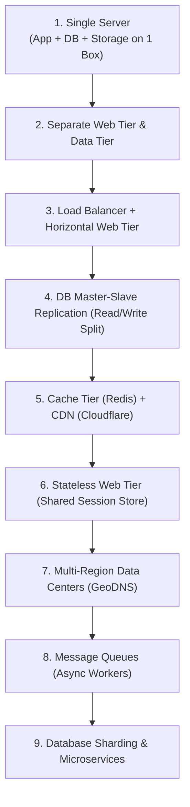

### Transaction Load Evolution

The architecture changes when the current tier can no longer absorb the next order of magnitude of active users or peak transaction load. The figures below are illustrative planning estimates for a read-heavy web application; actual capacity depends on request complexity, payload size, storage latency, and availability targets.

```mermaid
flowchart LR
    M1["Stage 1<br/>1 active user<br/>1 peak TPS<br/>Single server"] --> M2["Stage 2<br/>100 active users<br/>10 peak TPS<br/>Separate data tier"]
    M2 --> M3["Stage 3<br/>1,000 active users<br/>100 peak TPS<br/>Load-balanced web tier"]
    M3 --> M4["Stage 4<br/>10,000 active users<br/>1,000 peak TPS<br/>Read replicas"]
    M4 --> M5["Stage 5<br/>100,000 active users<br/>10,000 peak TPS<br/>Cache and CDN"]
    M5 --> M6["Stage 6<br/>500,000 active users<br/>25,000 peak TPS<br/>Stateless web tier"]
    M6 --> M7["Stage 7<br/>1 million active users<br/>50,000 peak TPS<br/>Multi-region routing"]
    M7 --> M8["Stage 8<br/>5 million active users<br/>250,000 peak TPS<br/>Queues and workers"]
    M8 --> M9["Stage 9<br/>10 million plus active users<br/>500,000 plus peak TPS<br/>Sharded data tier"]
```

| Stage | Illustrative active users | Illustrative peak TPS | Architecture response |
|:---|---:|---:|:---|
| 1 | 1 | 1 | Run application, database, and storage on one server. |
| 2 | 100 | 10 | Separate the web tier from the data tier. |
| 3 | 1,000 | 100 | Add a load balancer and multiple web servers. |
| 4 | 10,000 | 1,000 | Add read replicas and route reads separately from writes. |
| 5 | 100,000 | 10,000 | Cache hot data and serve static assets through a CDN. |
| 6 | 500,000 | 25,000 | Move sessions to shared storage and keep web nodes stateless. |
| 7 | 1 million | 50,000 | Route users to nearby regions and replicate data across regions. |
| 8 | 5 million | 250,000 | Move slow work to queues and independently scalable workers. |
| 9 | 10 million plus | 500,000 plus | Shard durable data and split high-volume business capabilities. |

> **Sizing note:** TPS means peak application transactions per second, not necessarily database writes. A single transaction may produce several cache reads, database queries, or asynchronous events.

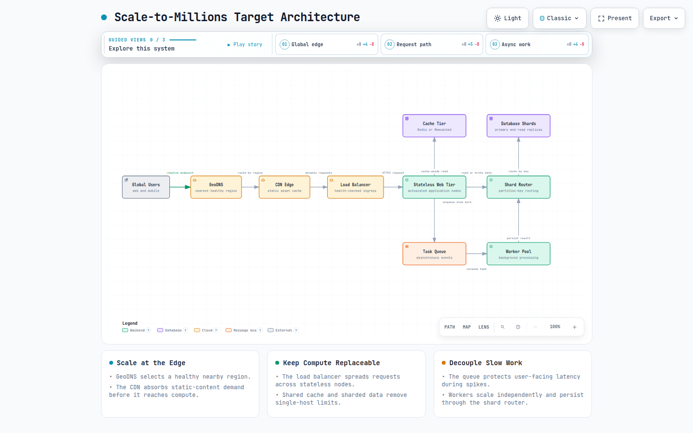

**Diagram description:** Global users are routed through GeoDNS and a CDN to a load-balanced stateless web tier. The application serves hot reads from cache, sends slow work through a queue to independently scalable workers, and routes durable data to partitioned database shards.

[Open the interactive scale-to-millions target architecture diagram](resources/scale-to-millions/scale-to-millions-architecture.html)

---

## 2. Step-by-Step Scaling Evolution

### Stage 1: Single Server Setup

In the beginning, all application services, databases, and static assets run on a single physical host or virtual machine.

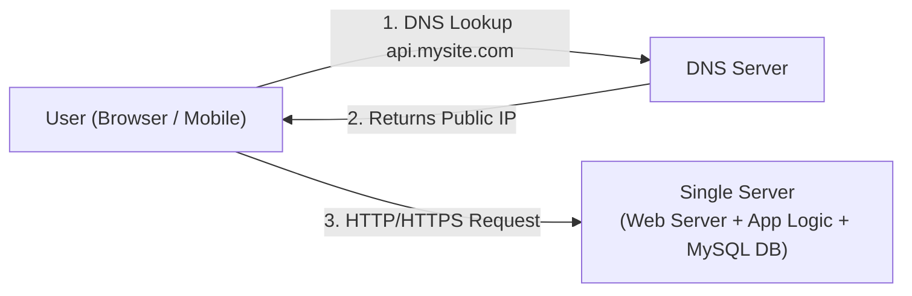

#### Request Flow
1. User resolves domain name (`api.mysite.com`) to an IP address via DNS.
2. The client establishes an HTTP/S connection to the single server IP.
3. The server processes business logic, queries its local database, and returns JSON or HTML.

---

### Stage 2: Separate Web Tier and Data Tier

As traffic grows, separating the stateless compute layer from the stateful storage layer allows independent horizontal and vertical scaling.

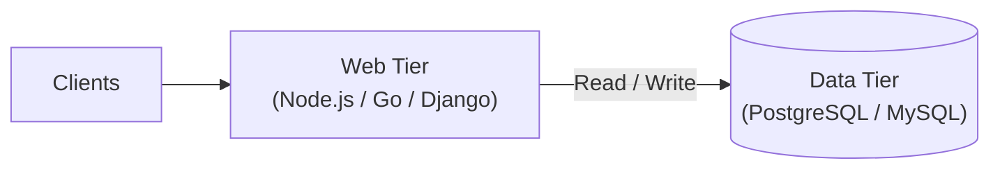

#### Relational (SQL) vs. Non-Relational (NoSQL) Selection Matrix

| Criterion | Relational Database (RDBMS) | Non-Relational Database (NoSQL) |
|:---|:---|:---|
| **Examples** | MySQL, PostgreSQL, Oracle | MongoDB, DynamoDB, Cassandra, Redis |
| **Data Schema** | Strict, structured tables with foreign keys | Dynamic schema (Key-Value, Document, Wide-Column, Graph) |
| **ACID & Joins** | Native ACID transactions and complex multi-table `JOIN`s | Eventual consistency; joins executed at the application layer |
| **Best Used When** | Structured transactional data (E-Commerce, Banking, Accounting) | Unstructured data, massive write volume, ultra-low latency, big data |

---

### Stage 3: Load Balancing & Horizontal Web Tier Scaling

Vertical scaling (adding CPU/RAM) has physical ceilings and creates a single point of failure. Horizontal scaling (adding commodity servers behind a Load Balancer) provides high availability.

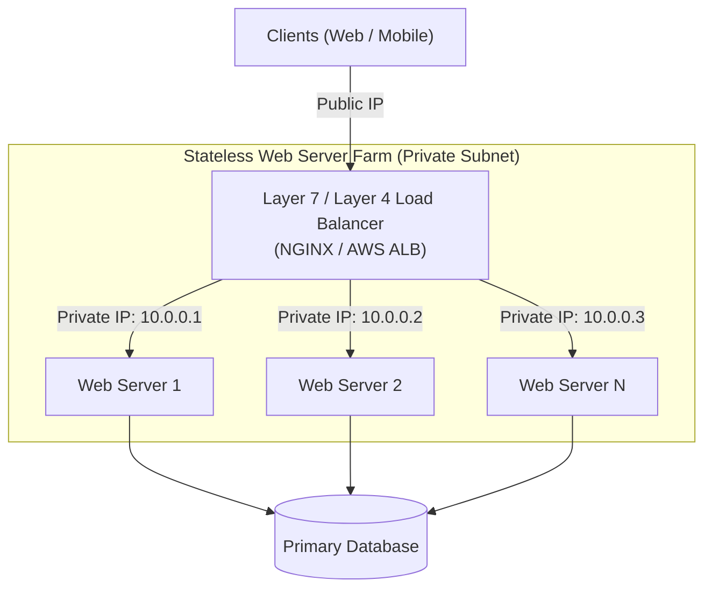

- **Health Checks**: The load balancer continuously monitors servers (`GET /healthz`) and removes unresponsive nodes instantly.
- **Security**: Web servers use private IPs and are unreachable directly from the public internet.

---

### Stage 4: Database Master-Slave Replication (Read/Write Separation)

Most web applications are read-heavy (e.g., $90\%$ reads, $10\%$ writes). Master-slave database replication scales read capacity and improves fault tolerance.

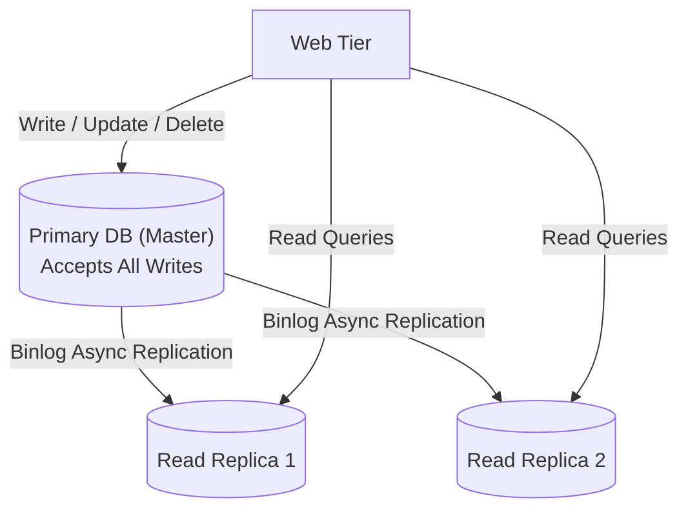

- **Failover**: If the Master crashes, a Read Replica is automatically promoted to Master (via orchestrators like Orchestrator / MHA).
- **Replication Lag**: Applications requiring immediate read-after-write consistency must direct critical reads to the Master directly.

---

### Stage 5: Caching Tier & Content Delivery Networks (CDN)

To prevent the database from becoming an I/O bottleneck, hot data is stored in memory (Redis/Memcached), and static media is cached at the edge (CDN).

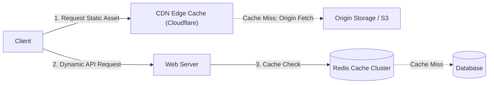

#### Cache Strategies & Considerations
1. **Cache-Aside Pattern**: Application checks cache $\rightarrow$ if miss, queries database $\rightarrow$ writes result back to cache.
2. **Eviction Policies**: LRU (Least Recently Used), LFU (Least Frequently Used), FIFO.
3. **Cache Invalidation & Expiration (TTL)**: Prevent stale data from lingering indefinitely.
4. **Stampede (Thundering Herd) Defense**: Use mutex locking or probabilistic early expiration.

---

### Stage 6: Stateless Web Tier (Shared Session Store)

To allow any web server to handle any incoming user request without session affinity (sticky sessions), session states are moved to a centralized distributed store.

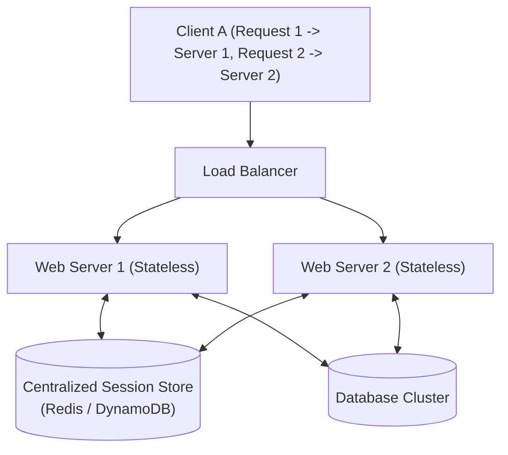

- **Autoscaling**: Stateless web servers can scale dynamically from 2 to 200 nodes during traffic spikes without dropping logged-in sessions.

---

### Stage 7: Multi-Region Data Centers (GeoDNS)

Deploying across multiple geographic regions reduces latency for global users and provides disaster recovery.

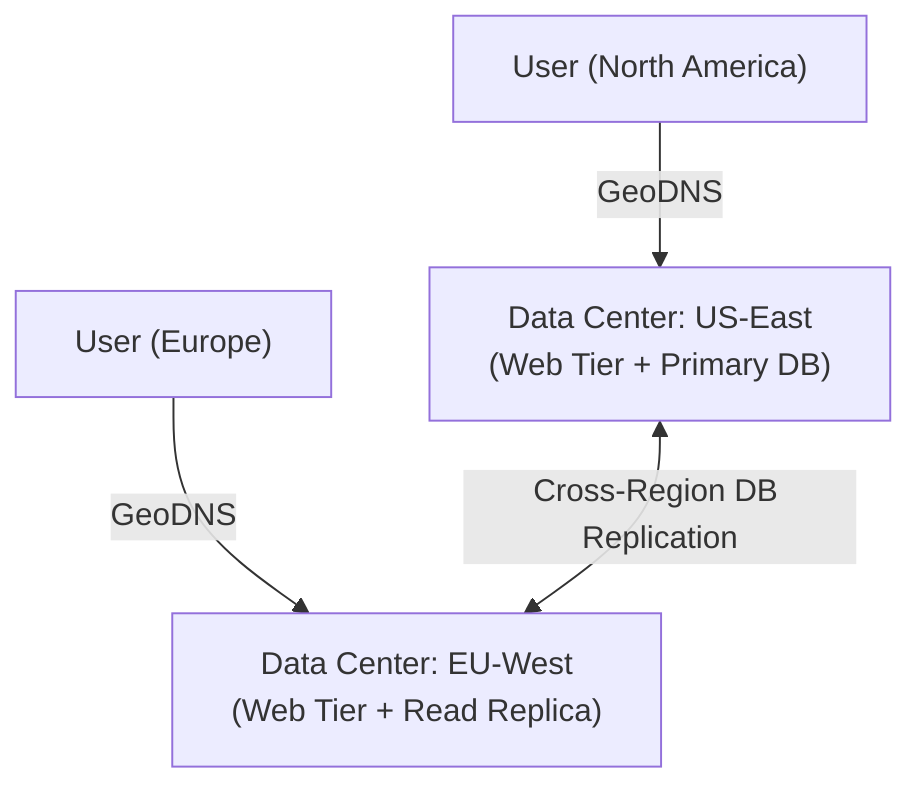

---

### Stage 8: Message Queues & Asynchronous Worker Pipelines

Decoupling long-running tasks (e.g., video processing, image resizing, email sending) from the web request/response cycle improves user responsiveness.

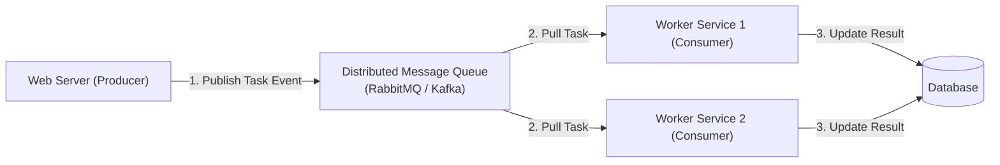

---

### Stage 9: Database Scaling (Horizontal Sharding)

When a single database server exhausts storage capacity ($> 10\text{ TB}$) or write IOPS, data is partitioned across multiple database shards.

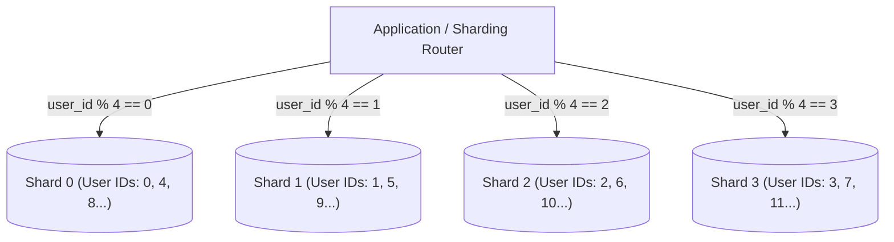

#### Sharding Challenges & Solutions
- **Resharding / Data Movement**: Solved via **Consistent Hashing**.
- **Celebrity / Hotspot Problem**: Append random salts to hot keys (e.g., `celebrity_id_01`).
- **Cross-Shard Joins**: Denormalize data schemas to allow single-shard query execution.

---

## 3. Comprehensive Target Architecture (Serving 10M+ Users)

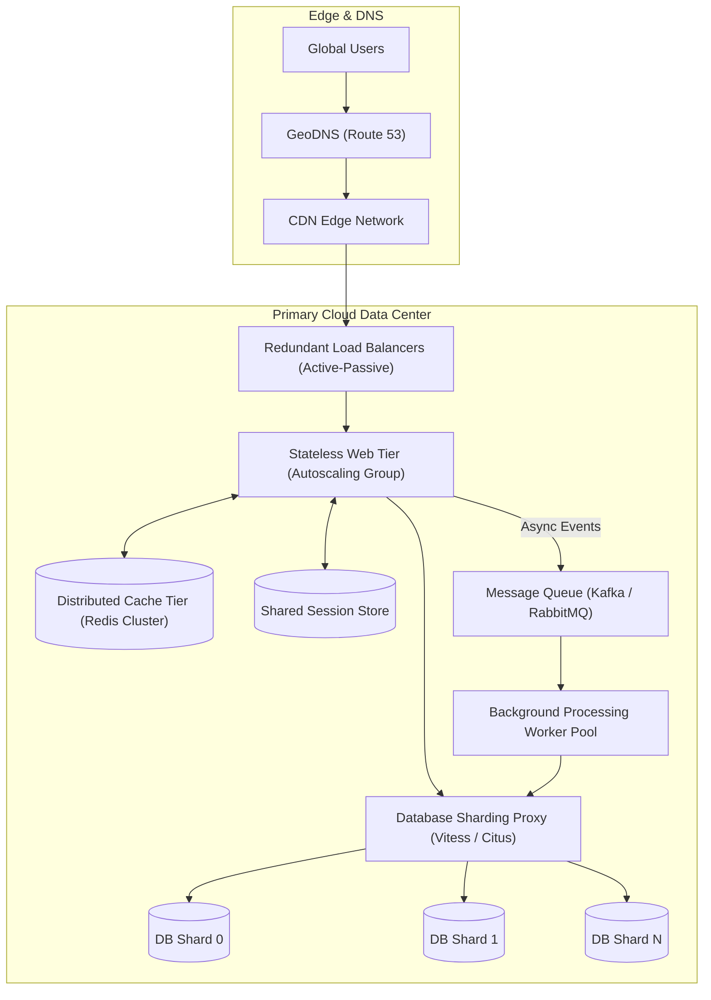

---

## 4. Architectural Summary Checklist

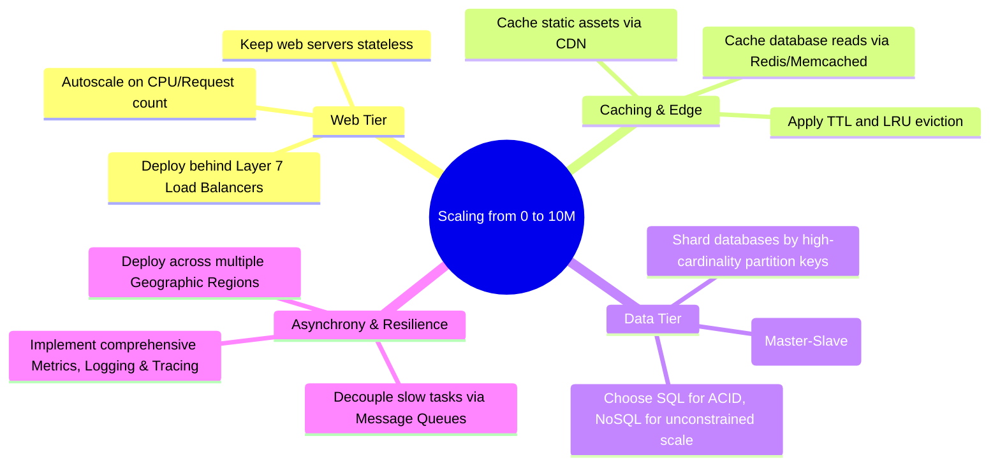

| Area | Core Technique | Scaling Benefit |
|:---|:---|:---|
| **Compute** | Stateless Web Tier + Load Balancer | Horizontal scaling without state loss; zero-downtime rolling deploys. |
| **Edge** | Content Delivery Network (CDN) | Sub-millisecond latency for static media; shields origin servers. |
| **Memory** | Redis / Memcached Cache-Aside | Eliminates $80\text{–}90\%$ of relational database read load. |
| **Data Reads** | Primary-Replica Replication | Scales read queries across multiple read replicas. |
| **Data Writes** | Horizontal Sharding | Scales write throughput and storage linearly across database instances. |
| **Decoupling** | Asynchronous Message Queues | Isolates background spikes and guarantees eventual consistency. |

---

## References

1. Hypertext Transfer Protocol: https://en.wikipedia.org/wiki/Hypertext_Transfer_Protocol
2. Scaling Memcache at Facebook: https://www.usenix.org/system/files/conference/nsdi13/nsdi13-nishtala.pdf
3. Sharding Pinterest: How we scaled our database to 100M users: https://medium.com/pinterest-engineering/sharding-pinterest-how-we-scaled-our-mysql-fleet-3f341e96ca6f
4. Vitess: Horizontal Scaling for MySQL: https://vitess.io/
