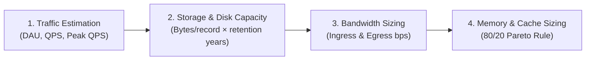
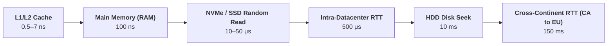
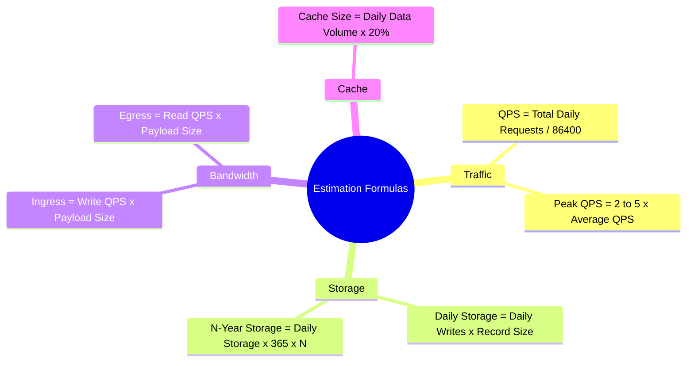

# Back-of-the-Envelope Estimation

> **Source**: *System Design Interview – An Insider's Guide: Volume 1* by Alex Xu  
> **ByteByteGo Chapter**: 03  
> **Topic**: Capacity Planning, Latency Hierarchy, Availability SLAs, System Dimensioning Frameworks

---

## 1. The Estimation Mental Model

Back-of-the-envelope calculations are rough, order-of-magnitude estimates used to evaluate whether a proposed system architecture is technically feasible within hardware, network, and financial constraints.

---

## 2. Fundamental Foundations

### 1. Powers of Two & Data Volume Units

| Power of 2 | Exact Value (Bytes) | Approximation | Binary Prefix | Standard Unit |
|:---|:---|:---|:---|:---|
| $2^{10}$ | $1{,}024$ | $1\text{ Thousand } (10^3)$ | $1\text{ KiB}$ | **$1\text{ KB}$ (Kilobyte)** |
| $2^{20}$ | $1{,}048{,}576$ | $1\text{ Million } (10^6)$ | $1\text{ MiB}$ | **$1\text{ MB}$ (Megabyte)** |
| $2^{30}$ | $1{,}073{,}741{,}824$ | $1\text{ Billion } (10^9)$ | $1\text{ GiB}$ | **$1\text{ GB}$ (Gigabyte)** |
| $2^{40}$ | $1{,}099{,}511{,}627{,}776$ | $1\text{ Trillion } (10^{12})$ | $1\text{ TiB}$ | **$1\text{ TB}$ (Terabyte)** |
| $2^{50}$ | $1{,}125{,}899{,}906{,}842{,}624$ | $1\text{ Quadrillion } (10^{15})$ | $1\text{ PiB}$ | **$1\text{ PB}$ (Petabyte)** |

> [!TIP]
> **Handy Interview Conversion**:
> - $1\text{ Million requests/day} \approx \mathbf{12\text{ QPS}}$ ($10^6 / 86{,}400 \approx 10^6 / 10^5 \times 1.15$).
> - $100\text{ Million requests/day} \approx \mathbf{1{,}200\text{ QPS}}$.
> - $1\text{ Billion requests/day} \approx \mathbf{12{,}000\text{ QPS}}$.

---

### 2. Latency Numbers Every Programmer Should Know

Understanding physical hardware and network latency boundaries prevents unfeasible designs (e.g., placing synchronous database queries on the critical path across datacenters).

| Operation | Latency (ns) | Human Time Analogy (Scaled $\times 10^9$) |
|:---|:---|:---|
| **L1 CPU Cache Reference** | $0.5\text{ ns}$ | $0.5\text{ seconds}$ (A heartbeat) |
| **Branch Mispredict** | $5\text{ ns}$ | $5\text{ seconds}$ |
| **L2 CPU Cache Reference** | $7\text{ ns}$ | $7\text{ seconds}$ |
| **Mutex Lock / Unlock** | $25\text{ ns}$ | $25\text{ seconds}$ |
| **Main Memory Reference (RAM)** | $100\text{ ns}$ | $100\text{ seconds}$ ($1.6\text{ minutes}$) |
| **Compress 1 KB with Snappy/ZSTD** | $2{,}000\text{ ns} = 2\ \mu\text{s}$ | $33\text{ minutes}$ |
| **Read 1 MB Sequentially from RAM** | $250{,}000\text{ ns} = 250\ \mu\text{s}$ | $2.9\text{ days}$ |
| **Round-Trip in Same Data Center** | $500{,}000\text{ ns} = 500\ \mu\text{s}$ | $5.8\text{ days}$ |
| **Read 1 MB Sequentially from NVMe SSD** | $1{,}000{,}000\text{ ns} = 1\text{ ms}$ | $11.6\text{ days}$ |
| **HDD Random Disk Seek** | $10{,}000{,}000\text{ ns} = 10\text{ ms}$ | $116\text{ days}$ ($3.8\text{ months}$) |
| **Read 1 MB Sequentially from HDD** | $20{,}000{,}000\text{ ns} = 20\text{ ms}$ | $7.7\text{ months}$ |
| **Cross-Atlantic WAN Round-Trip (CA $\rightarrow$ NL)** | $150{,}000{,}000\text{ ns} = 150\text{ ms}$ | **$4.8\text{ years}$** |

#### Core Engineering Lessons
1. **Memory is $100{,}000\times$ faster than spinning disk**: Avoid disk seeks at all costs.
2. **Sequential I/O dominates Random I/O**: Sequential disk reads approach RAM speeds.
3. **Compression saves bandwidth and network latency**: Always compress payloads over WAN.
4. **Cross-region round-trips are expensive**: Batch and cache data locally within regions.

---

### 3. High Availability SLAs (The "Nines")

Availability represents the uptime percentage of a service over a given period.

$$\text{Availability} = \frac{\text{Total Uptime}}{\text{Total Uptime} + \text{Downtime}} \times 100\%$$

| Availability SLA | Downtime per Day | Downtime per Month | Downtime per Year | Typical Cloud Service |
|:---|:---|:---|:---|:---|
| **$99\%$ (2 nines)** | $14.4\text{ minutes}$ | $7.31\text{ hours}$ | $3.65\text{ days}$ | Non-critical batch jobs |
| **$99.9\%$ (3 nines)** | $1.44\text{ minutes}$ | $43.8\text{ minutes}$ | $8.77\text{ hours}$ | Standard SaaS Web APIs |
| **$99.99\%$ (4 nines)** | **$8.64\text{ seconds}$** | **$4.38\text{ minutes}$** | **$52.6\text{ minutes}$** | Enterprise Cloud Databases |
| **$99.999\%$ (5 nines)** | **$864\text{ milliseconds}$** | **$26.3\text{ seconds}$** | **$5.26\text{ minutes}$** | Telco / Core Financial Systems |
| **$99.9999\%$ (6 nines)** | $86.4\text{ ms}$ | $2.63\text{ seconds}$ | $31.5\text{ seconds}$ | Aerospace & Nuclear Safety |

---

## 3. End-to-End Estimation Walkthrough (Twitter Example)

Let us estimate the capacity requirements for a Twitter-like social media platform.

### Step 1: Clarify Baseline Assumptions
- **Monthly Active Users (MAU)**: $300\text{ Million}$
- **Daily Active Users (DAU)**: $50\% \text{ of MAU} = 150\text{ Million}$
- **Daily Tweets posted**: $2\text{ tweets/user/day}$ on average
- **Media Content**: $10\% \text{ of tweets}$ contain a photo or video
- **Data Retention**: $5\text{ years}$

---

### Step 2: Traffic (QPS) Estimation

$$\text{Daily Tweet Posts} = 150\text{M DAU} \times 2 = 300{,}000{,}000\text{ tweets/day}$$

$$\text{Write QPS} = \frac{300{,}000{,}000\text{ tweets}}{86{,}400\text{ seconds}} \approx \mathbf{3{,}500\text{ QPS}}$$

$$\text{Peak Write QPS} = 2 \times \text{Write QPS} \approx \mathbf{7{,}000\text{ QPS}}$$

#### Read QPS (Assuming 1:100 Read-to-Write Ratio)
- Average user views $200\text{ tweets/day}$:

$$\text{Daily Read Requests} = 150\text{M} \times 200 = 30{,}000{,}000{,}000\text{ reads/day}$$

$$\text{Read QPS} = \frac{30\text{B}}{86{,}400\text{ sec}} \approx \mathbf{350{,}000\text{ QPS}}$$

---

### Step 3: Storage & Disk Capacity Estimation

#### 1. Text Tweet Metadata Sizing
- `tweet_id`: 64 bits ($8\text{ bytes}$)
- `user_id`: 64 bits ($8\text{ bytes}$)
- `text content`: 140 chars ($140\text{ bytes}$)
- `metadata (timestamp, flags)`: $30\text{ bytes}$
- **Total per Tweet**: $\approx 200\text{ bytes}$

$$\text{Daily Text Storage} = 300\text{M tweets/day} \times 200\text{ bytes} = 60\text{ GB/day}$$

#### 2. Media (Image/Video) Sizing
- $10\% \text{ of tweets contain media} \implies 30\text{M media tweets/day}$
- Average media size: $1\text{ MB}$

$$\text{Daily Media Storage} = 30\text{M} \times 1\text{ MB} = \mathbf{30\text{ TB/day}}$$

#### 3. 5-Year Total Storage Capacity

$$\text{5-Year Storage} = 30\text{ TB/day} \times 365\text{ days} \times 5\text{ years} \approx \mathbf{55\text{ PB}}$$

---

### Step 4: Cache Memory Sizing (Pareto 80/20 Rule)

According to the **80/20 Rule**, $20\%$ of tweets generate $80\%$ of total read traffic. Caching the top $20\%$ of daily read volume in Redis handles the majority of queries:

$$\text{Daily Read Volume} = 300\text{M tweets} \times 200\text{ bytes} = 60\text{ GB/day}$$

$$\text{RAM Cache Required} = 60\text{ GB} \times 20\% = \mathbf{12\text{ GB of RAM}}$$

---

## 4. Summary Calculation Cheat Sheet

| Dimension | Formula | Rule of Thumb |
|:---|:---|:---|
| **QPS** | $\text{Total Requests} / 86{,}400$ | Round $86{,}400 \approx 100{,}000$ for quick mental math. |
| **Peak QPS** | $\text{Average QPS} \times 2 \dots 5$ | Plan for diurnal day/night peaks. |
| **Storage** | $\text{Writes/day} \times \text{Size/record} \times 365 \times \text{Years}$ | Always add $2\times\text{–}3\times$ replication factor for durability. |
| **Bandwidth** | $\text{QPS} \times \text{Request Size (bytes)} \times 8\text{ bits}$ | Express in Gbps or MB/s. |
| **Cache (RAM)** | $\text{Daily Hot Data} \times 0.20$ | Size Redis cluster with $25\%$ memory buffer for overhead. |

---

## References

1. Latency Numbers Every Programmer Should Know by Colin Scott: https://colin-scott.github.io/personal_website/research/interactive_latency.html
2. Jeff Dean's Stanford Lecture on Building Large-Scale Distributed Systems: https://static.googleusercontent.com/media/research.google.com/en//people/jeff/stanford-295-talk.pdf
3. High Availability SLAs: https://en.wikipedia.org/wiki/High_availability