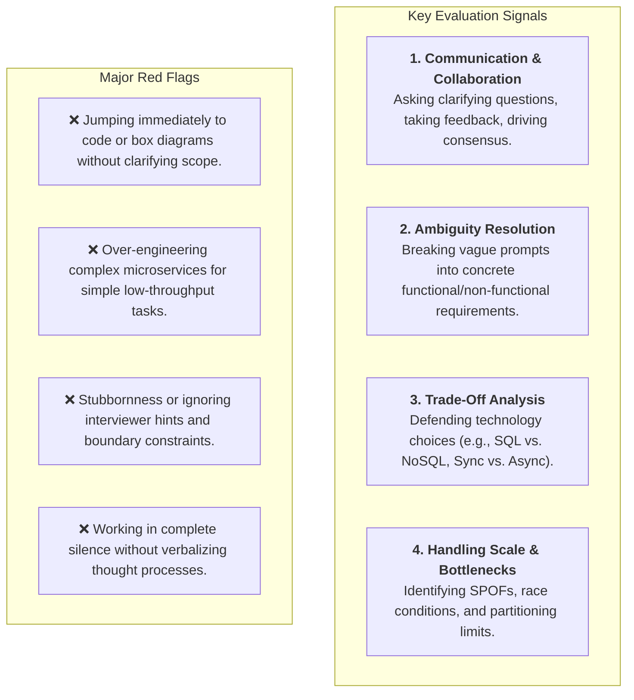
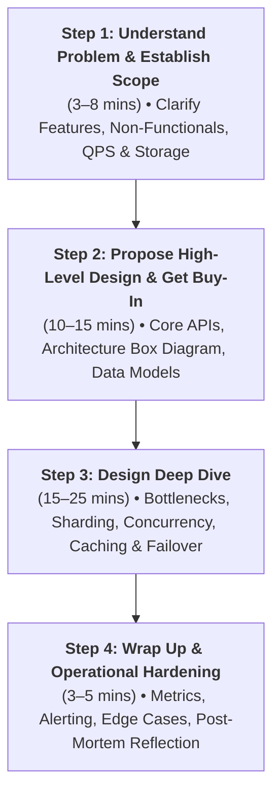
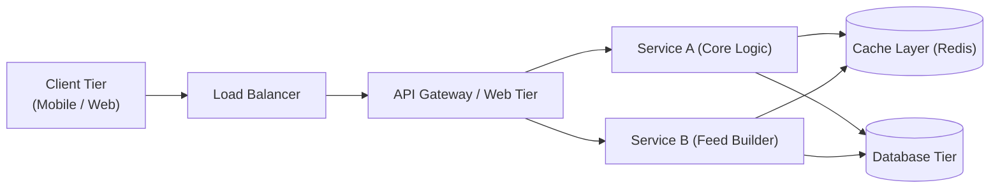
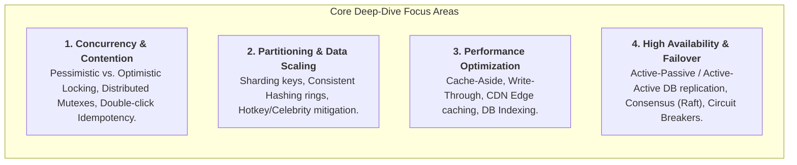
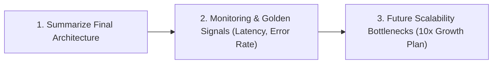

# A Framework For System Design Interviews

> **Source**: *System Design Interview – An Insider's Guide: Volume 1* by Alex Xu  
> **ByteByteGo Chapter**: 04  
> **Topic**: The 4-Step Problem-Solving Framework, Interview Time Allocation, Collaboration & Signal Gathering

---

## 1. The Interviewer's Mindset & Core Evaluation Signals

A system design interview is not a trivia contest or a test of design purity. It simulates a **collaborative design session between two senior engineers** tackling an ambiguous, open-ended problem.



---

## 2. The 4-Step System Design Framework



---

### Step 1: Understand the Problem & Establish Design Scope ($3\text{–}8\text{ mins}$)

> [!IMPORTANT]
> **Never start drawing boxes immediately.** Slow down, ask clarifying questions, and write down assumptions explicitly on the whiteboard.

#### Recommended Clarification Checklist
1. **Target Platforms**: Mobile only? Web only? Both?
2. **Core Feature Scope**: What are the top 2–3 must-have features vs. out-of-scope features?
3. **Scale & Traffic**: Daily Active Users (DAU), read-to-write ratio, peak QPS multipliers.
4. **Latency & SLA**: Strict real-time ($< 50\text{ ms}$) vs. eventual consistency batch processing?
5. **Data Longevity & Sizing**: How long is data retained ($1\text{ year vs. } 5\text{ years}$)?

```mermaid
sequenceDiagram
    autonumber
    actor Candidate
    actor Interviewer

    Candidate->>Interviewer: "Is this news feed sorted chronologically or via ML candidate ranking?"
    Interviewer-->>Candidate: "Reverse chronological order for simplicity."
    Candidate->>Interviewer: "What is the expected DAU and media content breakdown?"
    Interviewer-->>Candidate: "10M DAU; posts contain text and images (up to 5 MB)."
    Candidate->>Candidate: Calculates QPS (~120 write, ~1,200 read) and confirms scope.
```

---

### Step 2: Propose High-Level Design & Get Buy-In ($10\text{–}15\text{ mins}$)

Develop a clean end-to-end blueprint and validate it with the interviewer before diving into low-level mechanics.



#### Key Deliverables in Step 2
1. **API Contracts**: Define clean RESTful / gRPC request & response signatures for primary endpoints.
2. **Data Schemas**: Outline relational tables or NoSQL document models with partition keys.
3. **Component Flowchart**: Draw boxes connecting Clients, Load Balancers, Web Tier, Cache, and Data Tier.
4. **Validation Check**: Ask the interviewer: *"Does this high-level topology align with your expectations, or should we adjust any component before deep-diving?"*

---

### Step 3: Design Deep Dive ($15\text{–}25\text{ mins}$)

Work with the interviewer to prioritize and unpack the $1\text{–}2$ most critical bottlenecks in the architecture.



---

### Step 4: Wrap Up ($3\text{–}5\text{ mins}$)

Summarize the design, evaluate operational readiness, and critique potential failure modes.



#### Wrap-Up Checklist
- Revisit non-functional requirements: Did we meet the target QPS and latency budget?
- Discuss telemetry: Metrics (Prometheus), Distributed Tracing (Jaeger), Centralized Logs (ELK).
- Acknowledge trade-offs honestly: Where would the system buckle under $10\times$ load?

---

## 3. 45-Minute Interview Time Allocation

```mermaid
gantt
    title 45-Minute System Design Interview Timeline
    dateFormat mm
    axisFormat %M min

    section Step 1
    Scope & Clarification      :done, 00, 05m
    section Step 2
    High-Level Architecture    :active, 05, 15m
    section Step 3
    Deep Dive Bottlenecks      :20, 20m
    section Step 4
    Wrap-Up & Monitoring       :40, 05m
```



---

## 4. Dos and Don'ts Matrix

| Phase | DO (Best Practices) | DON'T (Common Pitfalls) |
|:---|:---|:---|
| **Step 1** | Ask clarifying questions; state assumptions out loud; establish scale numbers. | Jump into drawing architecture without clarifying requirements. |
| **Step 2** | Draw clean end-to-end box diagrams; get interviewer buy-in before proceeding. | Dive into minute details (e.g., database indexes) before agreeing on high-level design. |
| **Step 3** | Focus on performance bottlenecks, race conditions, and single points of failure. | Get bogged down in generic CRUD logic without addressing scale bottlenecks. |
| **Step 4** | Proactively discuss metrics, alerting, and failure recovery scenarios. | Claim the design is "flawless" or forget to summarize key components. |
| **General** | Treat the interviewer as a collaborative teammate; think out loud continuously. | Work in complete silence or stubbornly defend a flawed technical choice. |

---

## References

1. System Design Interview An Insider's Guide by Alex Xu: https://bytebytego.com
2. System Design Primer by Donne Martin: https://github.com/donnemartin/system-design-primer
3. Designing Data-Intensive Applications by Martin Kleppmann