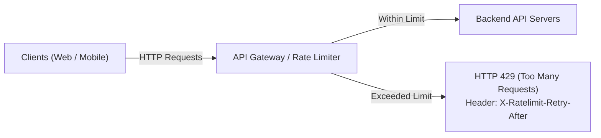
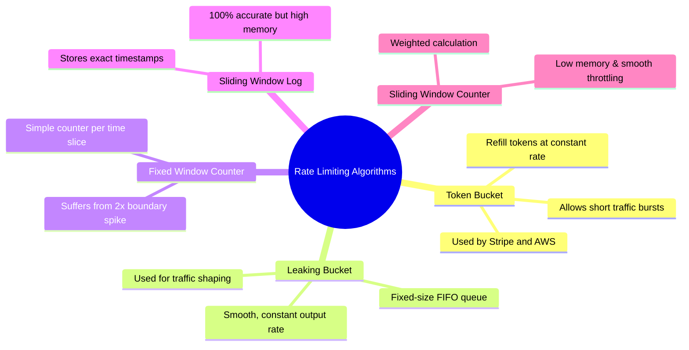
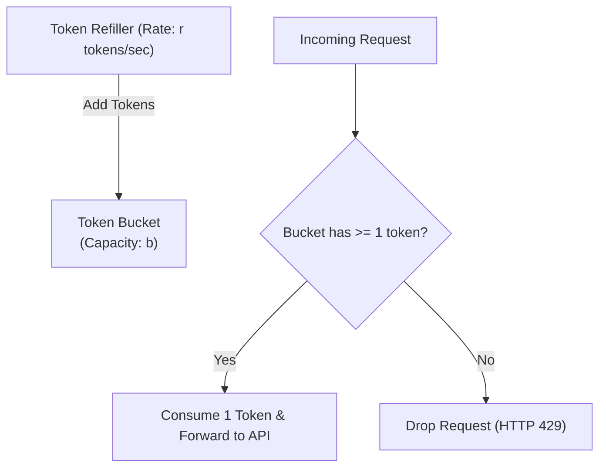
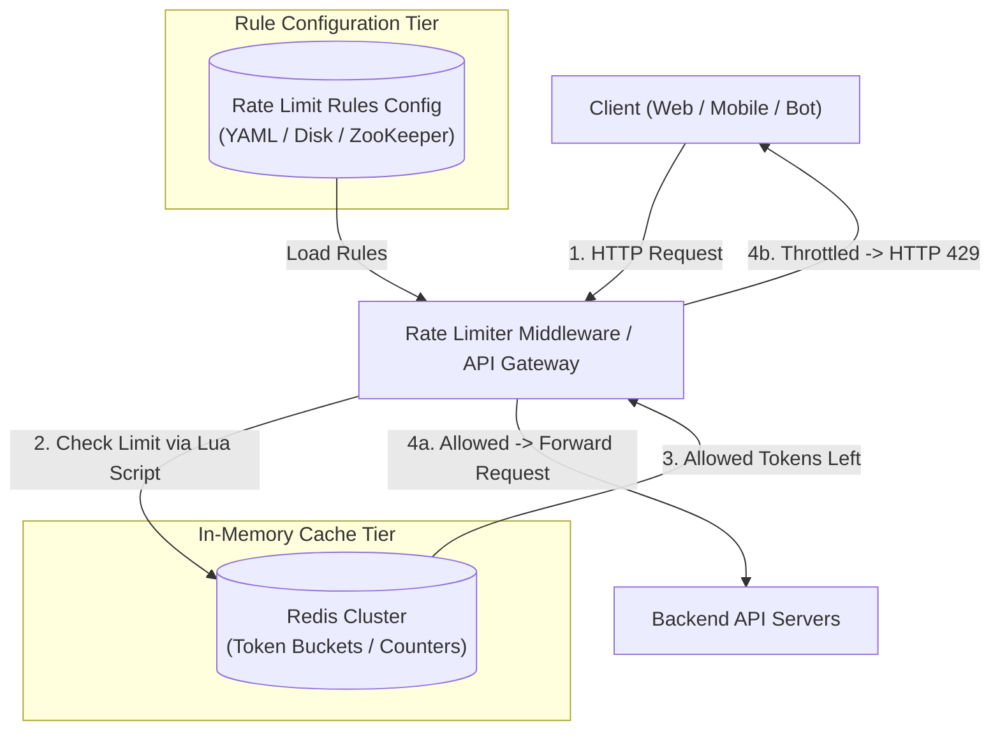
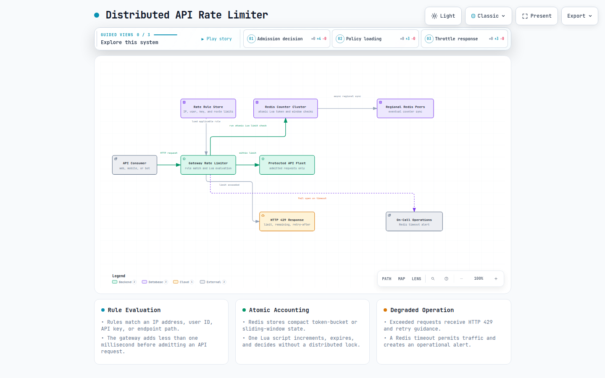
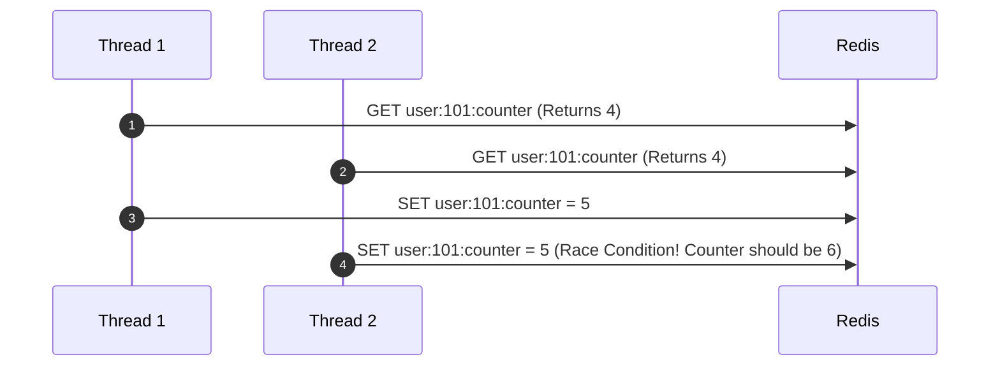
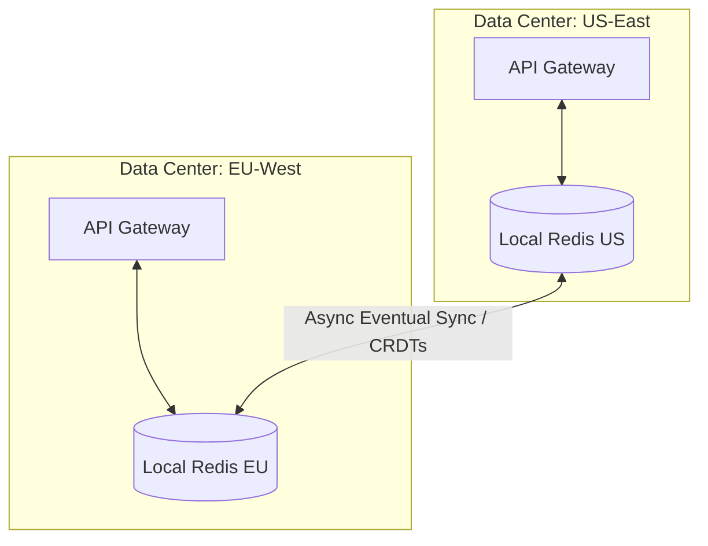

# Design A Rate Limiter

> **Source**: *System Design Interview – An Insider's Guide: Volume 1* by Alex Xu  
> **ByteByteGo Chapter**: 05  
> **Topic**: Traffic Throttling, Rate-Limiting Algorithms, Distributed Synchronization, Redis Lua Scripts, HTTP 429 Protocols

---

## 1. Understand the Problem and Establish Design Scope

An API rate limiter controls the rate of incoming client requests over a specified time window. If the request volume exceeds the configured threshold, excess calls are throttled (HTTP 429 Too Many Requests) to prevent Denial-of-Service (DoS) attacks, reduce 3rd-party API costs, and protect backend services from cascading overload.



---

### Interview Clarification & Scope

> **Candidate:** What type of rate limiter are we designing (Client-side vs. Server-side API Gateway)?  
> **Interviewer:** A **server-side API rate limiter** that acts as middleware / API gateway.
>
> **Candidate:** What dimensions determine the throttle rules?  
> **Interviewer:** Flexible rules supporting IP addresses, user IDs, API keys, and endpoint paths.
>
> **Candidate:** What is the throughput and scale requirement?  
> **Interviewer:** High throughput (hundreds of thousands of QPS) with **sub-millisecond latency overhead**.
>
> **Candidate:** How should distributed concurrency and race conditions be handled?  
> **Interviewer:** Must operate consistently in a distributed multi-server environment with high fault tolerance.

---

### Requirements Summary

#### Functional Requirements
1. **Accurate Throttling**: Block excess requests exceeding defined limits.
2. **HTTP 429 Feedback**: Return HTTP 429 status code with `X-Ratelimit-*` standard response headers.
3. **Configurable Rule Engine**: Support dynamic rate rules based on IP, user, and endpoint.

#### Non-Functional Requirements
- **Ultra-Low Latency**: Rate limiting checks must add $< 1\text{ ms}$ overhead to API calls.
- **Memory Efficiency**: Store minimal state per client/window.
- **Fault Tolerance**: If the rate limiter cache goes down, traffic should fail-open or degrade gracefully without taking down the main API.

---

## 2. The 5 Rate-Limiting Algorithms in Depth



---

### 1. Token Bucket Algorithm
- **Mechanism**: A bucket with capacity $b$ is refilled with tokens at a constant rate $r$ tokens/second. Each request consumes $1$ token. If tokens are available, the request passes; otherwise, it is dropped.
- **Pros**: Memory efficient ($O(1)$ state: `tokens_left`, `last_refill_timestamp`); accommodates bursty traffic.
- **Cons**: Tuning $b$ and $r$ can be challenging.



---

### 2. Leaking Bucket Algorithm
- **Mechanism**: Requests enter a fixed-size FIFO queue. A worker process pulls and handles requests at a **fixed constant rate**. If the queue is full, new requests overflow and drop.
- **Pros**: Smooths out traffic spikes; ideal for stable egress rate limiting.
- **Cons**: Bursts fill the queue quickly, causing recent requests to be delayed or dropped.

---

### 3. Fixed Window Counter Algorithm
- **Mechanism**: Divides timeline into fixed windows (e.g., $1\text{ minute}$). Each window maintains an integer counter.
- **The 2x Boundary Spike Problem**: If a user sends $100$ requests at $00:59$ and another $100$ requests at $01:01$, the system processes $200$ requests in a $2$-second window, violating the $100\text{ req/min}$ rate limit.

```
Window 1 [00:00 - 01:00]: 100 requests (at 00:59) ──┐ (200 requests within 2 seconds!)
Window 2 [01:00 - 02:00]: 100 requests (at 01:01) ──┘
```

---

### 4. Sliding Window Log Algorithm
- **Mechanism**: Stores the exact timestamp of every request in a Redis Sorted Set (`ZSET`). Drops timestamps older than $(\text{current\_time} - \text{window\_size})$, then counts elements in the set.
- **Pros**: $100\%$ precision with no boundary spikes.
- **Cons**: **High memory footprint** because every single request timestamp is stored.

---

### 5. Sliding Window Counter (Hybrid Approximation)
- **Mechanism**: Approximates the current count by weighting the previous window's requests based on overlap percentage:

$$\text{Requests in Window} = \text{Current Window Count} + \left( \text{Previous Window Count} \times (1 - \text{Overlap Fraction}) \right)$$

```
Previous Window [00:00 - 01:00]: 100 requests
Current Window  [01:00 - 02:00]: 30 requests
Current Time: 01:36 (36% into current window -> Overlap with previous = 64%)

Estimated Rolling Count = 30 + (100 * 0.64) = 94 requests
```

- **Pros**: Memory efficient ($O(1)$ integer storage per window); smooths out boundary spikes with $< 0.05\%$ error.

---

### Comprehensive Algorithm Trade-Off Matrix

| Algorithm | Memory Usage | Burst Handling | Precision | Recommended Use Cases |
|:---|:---|:---|:---|:---|
| **Token Bucket** | **$O(1)$ (Minimal)** | **Excellent (Burst-friendly)** | High | General API Gateway (Stripe, AWS) |
| **Leaking Bucket** | $O(\text{Queue Size})$ | Poor (Strict fixed output) | High | Traffic shaping, Payment webhooks |
| **Fixed Window** | **$O(1)$ (Minimal)** | Poor ($2\times$ boundary spike) | Low | Coarse-grained rate limits (Daily limits) |
| **Sliding Log** | $O(N)$ (High) | Good | **100% Absolute** | Low-volume, mission-critical security APIs |
| **Sliding Counter** | **$O(1)$ (Minimal)** | **Good (Smooth approximation)** | Very High ($>99.9\%$) | High-scale distributed API gateways |

---

## 3. High-Level Architecture & Request Flow



  

  **Diagram description:** The gateway loads a matching IP, user, API-key, or route rule and runs an atomic Lua limit check against Redis. Allowed requests reach the protected API fleet; exceeded requests receive HTTP 429 headers, while regional peers synchronize counters asynchronously and Redis timeouts fail open with an on-call alert.

  [Open the interactive rate-limiter architecture diagram](resources/rate-limiter/rate-limiter-architecture.html)

### Standard Rate Limiting HTTP Headers

| Header | Description | Example |
|:---|:---|:---|
| `X-Ratelimit-Limit` | Maximum allowed requests in the current window | `100` |
| `X-Ratelimit-Remaining` | Number of remaining requests allowed in window | `24` |
| `X-Ratelimit-Retry-After` | Number of seconds to wait before retrying | `36` |

---

## 4. Design Deep Dive

### 1. Concurrency & Race Conditions (Atomic Lua Scripts)

In high-concurrency environments, naive `GET` $\rightarrow$ `INCREMENT` operations in Redis cause race conditions:



#### Solution: Atomic Redis Lua Script
```lua
-- KEYS[1]: Rate limit key (e.g. "rate:usr_101")
-- ARGV[1]: Window size in seconds (e.g. 60)
-- ARGV[2]: Max requests allowed (e.g. 100)

local current = redis.call('INCR', KEYS[1])
if current == 1 then
    redis.call('EXPIRE', KEYS[1], ARGV[1])
end

if current > tonumber(ARGV[2]) then
    return 0 -- Throttled
else
    return 1 -- Allowed
end
```
> [!TIP]
> Redis executes Lua scripts **atomically in a single-threaded event loop**, completely eliminating race conditions without distributed locks.

---

### 2. Multi-Data Center Synchronization



- **Approach A (Centralized Global Redis)**: High latency for distant regions ($> 100\text{ ms}$). Not recommended.
- **Approach B (Consistent Hashing to Local Redis)**: Client IP is routed to a fixed data center via Anycast/GeoDNS. Local counters track usage with minimal cross-datacenter chatter.

---

### 3. Fail-Open vs. Fail-Closed Strategy
- If Redis is unavailable or times out ($> 5\text{ ms}$), the rate limiter **fails open** (allows traffic to pass through) while emitting an alert to on-call engineers. **Never let a rate limiter outage bring down the entire business platform**.

---

## 5. Wrap Up & Summary

### Architectural Summary Mindmap

```mermaid
mindmap
  root((Rate Limiter System))
    Algorithms
      Token Bucket: Burst-friendly, O(1) memory
      Sliding Window Counter: Smooth & accurate
    Implementation
      API Gateway Middleware
      Redis Lua Scripts for Atomic Checks
      X-Ratelimit Response Headers
    Fault Tolerance
      Fail-Open on Redis Timeout
      Local Caching for Hot IP Denylists
```

| Component | Design Decision | Rationale |
|:---|:---|:---|
| **Core Algorithm** | Token Bucket / Sliding Window Counter | Low memory footprint ($O(1)$), burst handling, sub-millisecond execution. |
| **Storage Engine** | In-Memory Redis Cluster | Low-latency in-memory lookup with TTL automatic expiration. |
| **Concurrency** | Redis Lua Scripts | Atomic check-and-decrement eliminates race conditions. |
| **Resilience** | Fail-Open with Circuit Breaker | Ensures rate limiter failure does not impact backend availability. |

---

## References

1. Stripe Rate Limiting Architecture: https://stripe.com/blog/rate-limiters
2. Cloudflare: How we built Rate Limiting: https://blog.cloudflare.com/counting-things-a-lot-of-different-things/
3. Redis Lua Scripting Documentation: https://redis.io/docs/interact/programmability/eval-intro/
