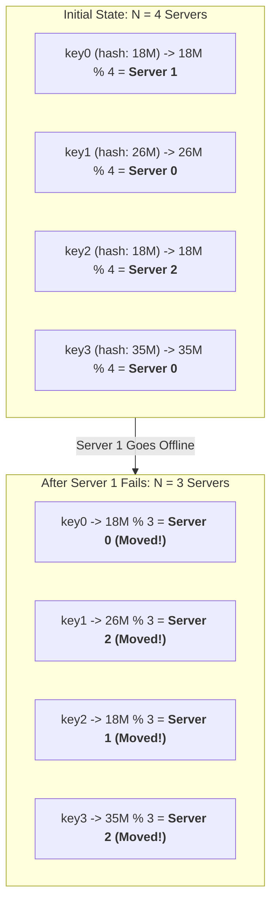
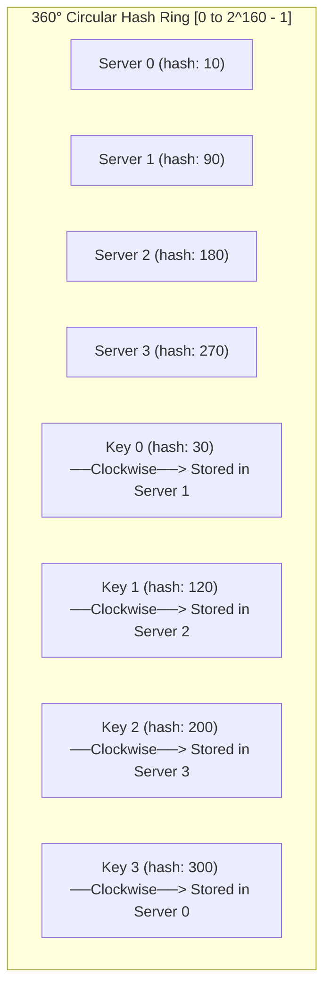
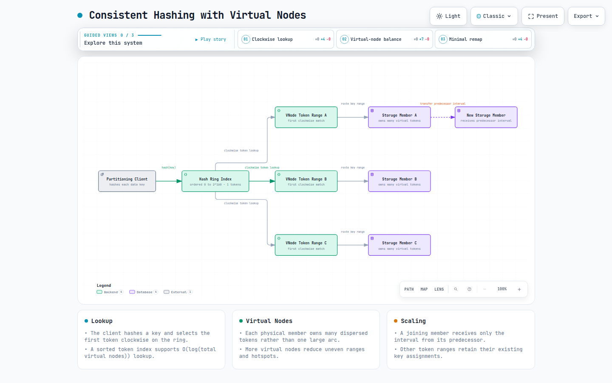
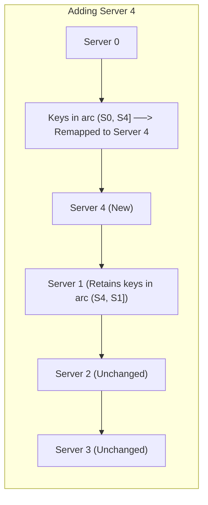
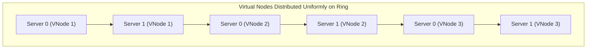
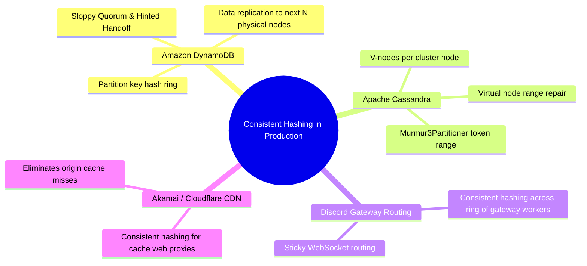

# Design Consistent Hashing

> **Source**: *System Design Interview – An Insider's Guide: Volume 1* by Alex Xu  
> **ByteByteGo Chapter**: 06  
> **Topic**: Distributed Data Partitioning, Hash Ring Topologies, Virtual Nodes (V-Nodes), Rebalancing Minimization

---

## 1. The Rehashing Problem (Why Modulo-N Fails)

In distributed caching and database systems, keys are partitioned across $N$ servers. The traditional approach uses the modulo hash function:

$$\text{serverIndex} = \text{hash}(\text{key}) \pmod N$$



> [!CAUTION]
> When $N$ changes (e.g., node addition or crash), **almost $100\%$ of keys are remapped to new servers**. In a caching tier, this causes a catastrophic **cache stampede** as millions of concurrent requests miss the cache and overwhelm origin databases simultaneously.

---

## 2. Consistent Hashing Mechanics

Consistent hashing maps both servers and data keys onto a **circular hash ring**, ensuring that adding or removing a node only requires remapping $k/N$ keys on average ($k = \text{total keys}, N = \text{total server slots}$).





**Diagram description:** A partitioning client hashes each key and looks up the first virtual-node token clockwise on the ordered ring, then routes to that token’s physical storage member. Multiple dispersed virtual nodes balance ownership; when a member joins, only its predecessor interval transfers.

[Open the interactive consistent-hashing architecture diagram](resources/consistent-hashing/consistent-hashing-architecture.html)

### Core Operations

#### 1. Server Lookup (Clockwise Traversal)
- To find where `keyX` is stored, calculate $\text{hash}(\text{keyX})$ and move **clockwise** along the ring until encountering the first server node.

#### 2. Adding a Server Node (Minimal Data Movement)
- When `Server 4` is inserted between `Server 0` and `Server 1`, **only the keys between `Server 0` and `Server 4` are moved** to `Server 4`. All other server partitions remain completely undisturbed.



#### 3. Removing a Server Node
- When `Server 1` is removed, only the keys previously stored on `Server 1` are remapped clockwise to `Server 2`. Zero unaffected keys move.

---

## 3. Two Inherent Flaws & The Virtual Nodes Solution

### The Two Problems with Basic Consistent Hashing
1. **Non-Uniform Partition Sizes**: Because hash functions place physical server nodes randomly on the ring, arc distances between servers vary wildly. One server might own $60\%$ of the ring while another owns $5\%$.
2. **Non-Uniform Key Distribution (Hotspots)**: A server with a large incoming arc receives disproportionately heavy traffic.

```mermaid
flowchart LR
    subgraph UnevenRing["Flaw: Highly Skewed Ring"]
        S0["Server 0"] ---|5% of Ring| S1["Server 1"]
        S1 ---|75% of Ring (Overloaded Hotspot!)| S2["Server 2"]
        S2 ---|20% of Ring| S0
    end
```

---

### The Solution: Virtual Nodes (V-Nodes)

Instead of placing 1 physical node on the ring, each physical server is assigned **$V$ virtual nodes** (e.g., $V = 100\text{–}200$ replicas) distributed evenly across the ring using multiple hash labels: `Server0_0`, `Server0_1`, `Server0_2` ... `Server0_V-1`.



#### Standard Deviation of Key Distribution vs. Number of Virtual Nodes

| Number of Virtual Nodes ($V$) | Standard Deviation ($\sigma$) of Load | Memory Overhead per Node |
|:---|:---|:---|
| **$V = 1$** (No V-Nodes) | $\approx \mathbf{100\%}$ (Extremely uneven) | Minimal ($O(1)$) |
| **$V = 50$** | $\approx \mathbf{15\%}$ | Low |
| **$V = 100$** | $\approx \mathbf{10\%}$ | Moderate |
| **$V = 200$** | $\approx \mathbf{5\%}$ (Highly balanced) | Well within modern RAM limits |

> [!TIP]
> Increasing $V$ to $100\text{–}200$ achieves near-perfect load balancing across physical hardware. In practice, $V$ can be tuned proportionally to a physical server's CPU/RAM capacity (heterogeneous cluster weighting).

---

## 4. Real-World Implementations



---

## 5. Architectural Summary

| Dimension | Modulo Hashing ($\text{key} \pmod N$) | Consistent Hashing with V-Nodes |
|:---|:---|:---|
| **Keys Remapped on Scaling** | $\approx 100\%$ (Catastrophic cache wipe) | Only $k/N$ keys on average ($\text{Minimal}$) |
| **Load Uniformity** | Poor when $N$ changes | Uniform ($<5\%$ variance with $200$ V-Nodes) |
| **Hotspot Defense** | Ineffective | Excellent (Heterogeneous server capacity weighting) |
| **Lookup Complexity** | $O(1)$ | $O(\log(\text{Total V-Nodes}))$ via Binary Search / Red-Black Tree |

---

## References

1. Consistent Hashing and Random Trees (Karger et al. MIT Paper): https://www.cs.princeton.edu/courses/archive/fall09/cos518/papers/karger.pdf
2. Dynamo: Amazon's Highly Available Key-value Store: https://www.allthingsdistributed.com/files/amazon-dynamo-sosp2007.pdf
3. Apache Cassandra Architecture (Virtual Nodes): https://cassandra.apache.org/doc/latest/cassandra/architecture/dynamo.html
