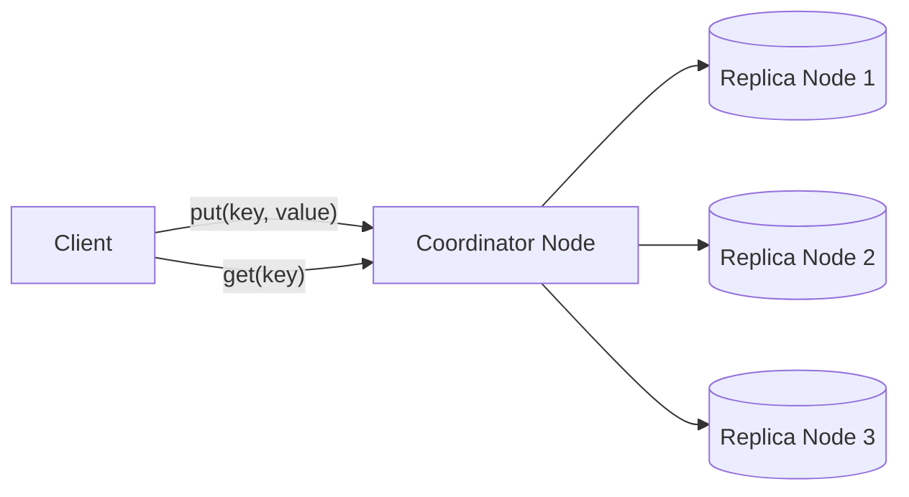
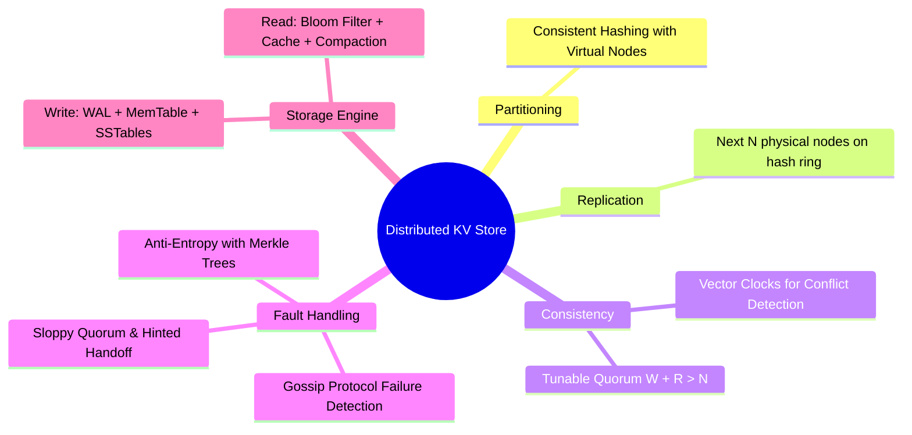
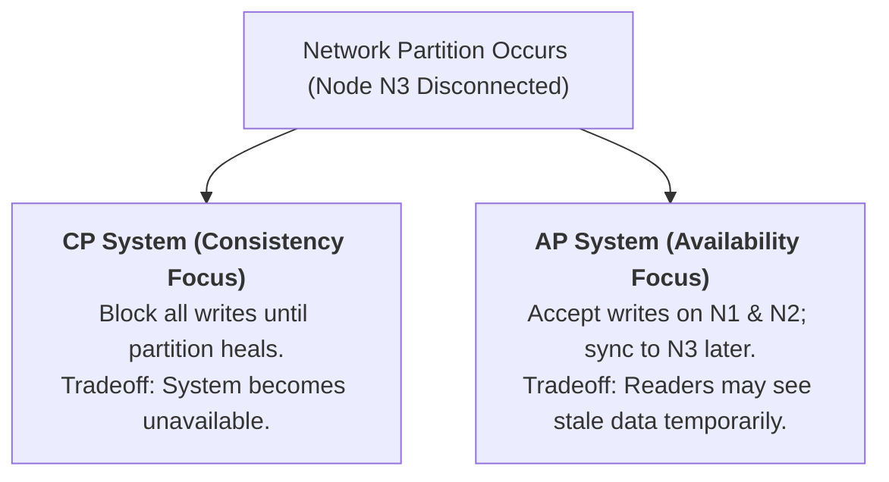
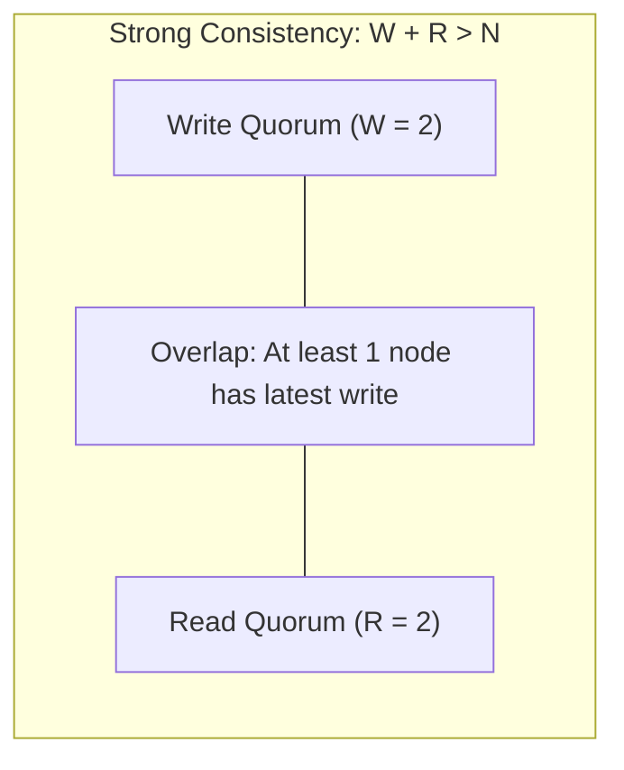
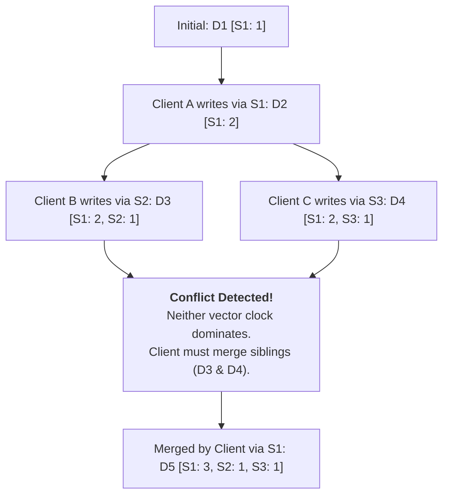
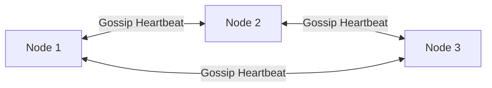
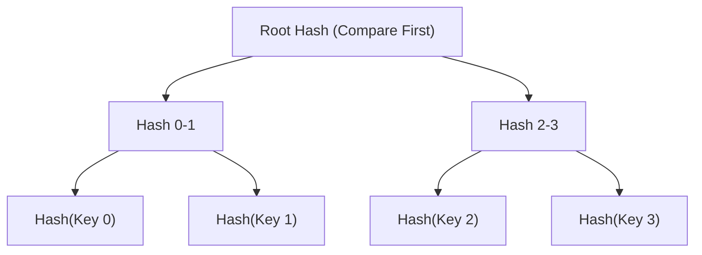
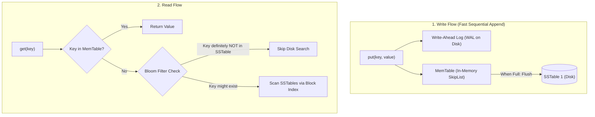

# Design A Key-Value Store

> **Source**: *System Design Interview – An Insider's Guide: Volume 1* by Alex Xu  
> **ByteByteGo Chapter**: 07  
> **Topic**: Distributed Hash Tables, CAP Theorem, Tunable Quorums ($N, W, R$), Vector Clocks, LSM-Tree Engine

---

## 1. Understand the Problem and Establish Design Scope

A distributed key-value store (e.g., Amazon DynamoDB, Apache Cassandra) partitions unstructured key-value records across a cluster of commodity servers to provide high availability, predictable low latency, and horizontal scalability.

---

### Interview Clarification & Scope

> **Candidate:** What is the average size of a key-value record?  
> **Interviewer:** Small pairs ($< 10\text{ KB}$ per record).
>
> **Candidate:** What are the primary consistency and availability requirements?  
> **Interviewer:** Highly available (**AP system**) with **tunable consistency** and low latency ($< 10\text{ ms}$).
>
> **Candidate:** Should the system handle petabytes of data with automatic rebalancing?  
> **Interviewer:** Yes, seamless node addition and removal without human intervention.

---

### Requirements Summary

#### Functional Requirements
1. `put(key, value)`: Store or update the value associated with a key.
2. `get(key)`: Retrieve the latest value associated with a key.

#### Non-Functional Requirements
- **High Scalability & Big Data**: Support petabytes of data across hundreds of storage nodes.
- **High Availability**: Provide fast read/write responses even during partial network partitions.
- **Tunable Consistency**: Support configurable Read ($R$) and Write ($W$) quorums.
- **Zero Single Point of Failure**: Fully decentralized, leaderless master-master topology.

---

## 2. Distributed Architecture Principles (The Dynamo Blueprint)

---

### 1. CAP Theorem & Trade-Offs

In distributed networks, network partitions ($P$) are inevitable. Therefore, a distributed system must choose between **Consistency ($CP$)** and **Availability ($AP$)**:

---

### 2. Tunable Quorum Consistency ($N, W, R$)

- $N$: Number of replicas (e.g., $N = 3$).
- $W$: Write quorum size (A write is acknowledged once $W$ replicas respond).
- $R$: Read quorum size (A read is acknowledged once $R$ replicas respond).

#### Quorum Configuration Profiles
- **$W + R > N$ (Strong Consistency)**: Guarantees that the read set and write set overlap on at least one replica holding the latest version (e.g., $N=3, W=2, R=2$).
- **$W = 1, R = N$ (Fast Write)**: Optimized for heavy ingestion pipelines.
- **$W = N, R = 1$ (Fast Read)**: Optimized for read-heavy systems where writes can be slow.
- **$W + R \le N$ (Eventual Consistency)**: Lowest latency, but readers may receive stale data.

---

### 3. Conflict Resolution with Vector Clocks

When concurrent writes occur on different partition replicas during a network split, **Vector Clocks** track causality. A vector clock is a list of `[Server, Version]` pairs:

$$VC = \{ (S_1, v_1), (S_2, v_2), \dots, (S_n, v_n) \}$$

---

## 3. Node Failure & Anti-Entropy Mechanisms

### 1. Gossip Protocol for Decentralized Failure Detection

There is no central coordinator. Nodes continuously exchange heartbeat state tables with random peers:

- Each node maintains a table: `[Node_ID, Heartbeat_Counter, Local_Timestamp]`.
- If a node's heartbeat counter does not increment for a threshold duration, it is marked as **Down**.

---

### 2. Temporary Failures: Sloppy Quorum & Hinted Handoff
- If primary node `Node A` is temporarily unreachable, healthy node `Node D` accepts the write on its behalf and stores a **Hinted Handoff** record.
- When `Node A` recovers, `Node D` pushes all accumulated writes back to `Node A`.

---

### 3. Permanent Failures: Anti-Entropy with Merkle Trees

To synchronize divergent data across nodes without scanning millions of keys over the network, **Merkle Trees (Cryptographic Hash Trees)** compare sub-ranges in $O(\log M)$ time:

- If `Root Hash` matches between two nodes, the datasets are identical.
- If root hashes differ, traverse child branches to isolate and transfer **only the exact mismatched keys**.

---

## 4. Single-Node Storage Engine (LSM-Tree)

- **Write-Ahead Log (WAL)**: Durability log on disk before acknowledging writes.
- **MemTable**: In-memory sorted buffer (SkipList or Red-Black Tree).
- **SSTable (Sorted String Table)**: Immutable on-disk sorted files with block indices.
- **Bloom Filters**: Fast probabilistic bit-arrays that prevent disk I/O for non-existent keys.
- **Compaction**: Background merge-sort process combining SSTables and purging deleted/overwritten tombstones.

---

## 5. Architectural Summary Table

| Distributed Challenge | Technical Solution | Real-World Benefit |
|:---|:---|:---|
| **Data Partitioning** | Consistent Hashing with Virtual Nodes | Seamless scaling with minimal key movement during rebalancing. |
| **High Durability** | Multi-DC Replication ($N$-Replicas) | Zero data loss during rack or datacenter outages. |
| **Tunable Consistency** | Quorum Reads & Writes ($W + R > N$) | Flexibly balance strong consistency vs. ultra-fast write performance. |
| **Concurrent Conflict** | Vector Clocks with Sibling Merging | Deterministic detection of parallel split-brain writes. |
| **Failure Detection** | Decentralized Gossip Protocol | Fully leaderless monitoring with no single point of failure. |
| **Temporary Outages** | Sloppy Quorum & Hinted Handoff | Uninterrupted write availability during transient node restarts. |
| **Range Synchronization** | Merkle Trees (Anti-Entropy) | Low-bandwidth background synchronization of divergent partitions. |
| **High-Throughput I/O** | LSM-Tree (WAL + MemTable + SSTable) | Converts random writes into ultra-fast sequential disk appends. |

---

## References

1. Dynamo: Amazon's Highly Available Key-value Store (SOSP '07): https://www.allthingsdistributed.com/files/amazon-dynamo-sosp2007.pdf
2. Apache Cassandra Architecture Overview: https://cassandra.apache.org/doc/latest/cassandra/architecture/
3. Bigtable: A Distributed Storage System for Structured Data: https://research.google/pubs/bigtable-a-distributed-storage-system-for-structured-data/
