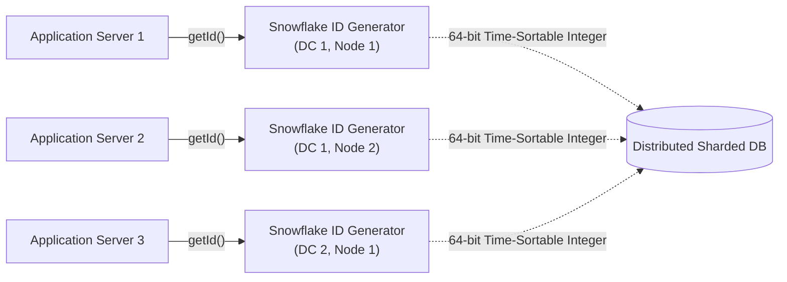
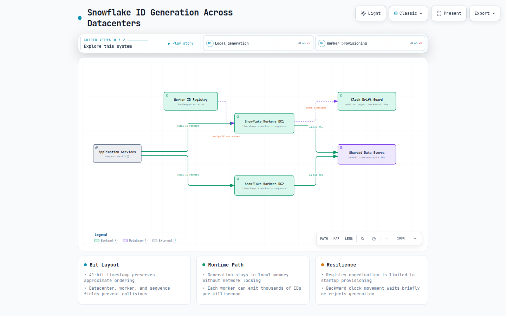
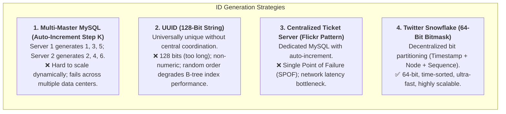
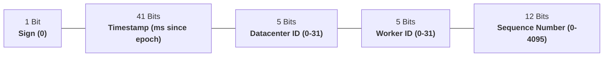
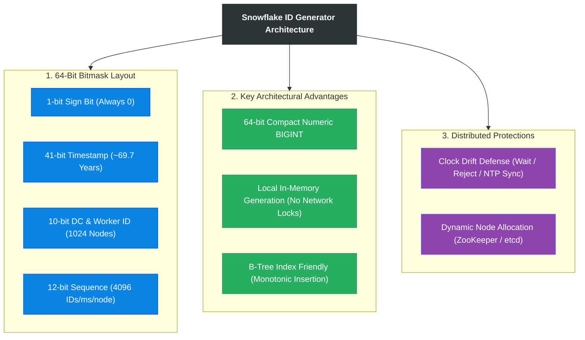

# Design A Unique ID Generator In Distributed Systems

> **Source**: *System Design Interview – An Insider's Guide: Volume 1* by Alex Xu  
> **ByteByteGo Chapter**: 08  
> **Topic**: Distributed ID Generation, Bit-Level Layouts, Twitter Snowflake, NTP Clock Drift Resilience

---

## 1. Understand the Problem and Establish Design Scope

In distributed architectures, relational database `AUTO_INCREMENT` primary keys become single points of failure and cannot scale horizontally across multi-master or sharded databases. We need a decentralized service capable of generating unique, globally sorted 64-bit numerical IDs at high velocity.



---

### Interview Clarification & Scope

> **Candidate:** What are the format and size constraints for the generated IDs?  
> **Interviewer:** Must be **64-bit numeric integers** that are roughly **time-sortable** (IDs created later are larger than IDs created earlier).
>
> **Candidate:** What is the throughput requirement?  
> **Interviewer:** Must generate over **$10{,}000\text{ IDs per second}$** with zero collisions.
>
> **Candidate:** Does the system span multiple data centers?  
> **Interviewer:** Yes, multi-datacenter deployment with zero central coordination.

---

### Requirements Summary

#### Functional Requirements
1. **Global Uniqueness**: No two generated IDs can ever be identical.
2. **64-Bit Numerical Values**: Fit directly into standard 64-bit integer types (`BIGINT` / `int64`).
3. **Time-Sortable ($k$-ordered)**: IDs roughly increment with time.

#### Non-Functional Requirements
- **High Throughput**: Capable of generating $> 10{,}000\text{ IDs/sec}$ per node.
- **High Availability & Low Latency**: Generation must be local and sub-microsecond without distributed network locking.



**Diagram:** Application services request IDs from independent workers in each datacenter. A registry provisions location fields at startup, while workers compose 64-bit IDs locally and guard against backward clock movement. [Open the interactive Snowflake ID architecture diagram](resources/unique-id-generator/unique-id-generator-architecture.html).

---

## 2. High-Level Alternatives Evaluation



### Strategy Comparison Matrix

| Approach | Bit Length | Sortable by Time | Scale & Coordination | SPOF Risk |
|:---|:---|:---|:---|:---|
| **Multi-Master MySQL** | 64 bits | No (across servers) | Poor when servers are added/removed | Low |
| **UUID (v4)** | 128 bits | No (Random) | **Excellent (Zero coordination)** | **None** |
| **Ticket Server (Flickr)** | 64 bits | Yes | Poor (Single central bottleneck) | **High (Single POF)** |
| **Twitter Snowflake** | **64 bits** | **Yes (Locally & Globally)** | **Excellent (Independent nodes)** | **None** |

---

## 3. Design Deep Dive: The Twitter Snowflake 64-Bit Layout

Instead of relying on central storage, Snowflake divides a 64-bit integer into distinct semantic bit fields:



### Bit Allocation Breakdown

| Bit Field | Width | Range / Capacity | Purpose / Rationale |
|:---|:---|:---|:---|
| **Sign Bit** | `1 bit` | Always `0` | Reserved to ensure the 64-bit integer remains positive in signed languages (Java/C#). |
| **Timestamp** | `41 bits` | $2^{41} - 1 \approx 2.199 \times 10^{12}\text{ ms} \approx \mathbf{69.7\text{ years}}$ | Milliseconds elapsed since a custom epoch (e.g., Nov 04, 2010). |
| **Datacenter ID** | `5 bits` | $2^5 = \mathbf{32\text{ Datacenters}}$ | Uniquely identifies the physical datacenter hosting the generator. |
| **Worker / Machine ID** | `5 bits` | $2^5 = \mathbf{32\text{ Worker Nodes / DC}}$ | Total of $32 \times 32 = \mathbf{1{,}024\text{ unique generator nodes}}$. |
| **Sequence Number** | `12 bits` | $2^{12} = \mathbf{4{,}096\text{ IDs / ms / node}}$ | Increments per ID within the same millisecond; resets to `0` each new millisecond. |

$$\text{Theoretical Peak Throughput} = 1{,}024\text{ nodes} \times 4{,}096\text{ IDs/ms} \times 1{,}000\text{ ms/s} \approx \mathbf{4.19\text{ Billion IDs/sec}}$$

---

### Snowflake ID Generation Algorithm (Java / Pseudocode)

```java
public class SnowflakeIdGenerator {
    private final long customEpoch = 1609459200000L; // 2021-01-01 00:00:00 UTC
    private final long datacenterIdBits = 5L;
    private final long workerIdBits = 5L;
    private final long sequenceBits = 12L;

    private final long maxWorkerId = -1L ^ (-1L << workerIdBits); // 31
    private final long maxSequence = -1L ^ (-1L << sequenceBits); // 4095

    private final long workerIdShift = sequenceBits; // 12
    private final long datacenterIdShift = sequenceBits + workerIdBits; // 17
    private final long timestampLeftShift = sequenceBits + workerIdBits + datacenterIdBits; // 22

    private long datacenterId;
    private long workerId;
    private long sequence = 0L;
    private long lastTimestamp = -1L;

    public synchronized long nextId() {
        long currentTimestamp = System.currentTimeMillis();

        // 1. Clock drift defense
        if (currentTimestamp < lastTimestamp) {
            throw new IllegalStateException("Clock moved backwards! Refusing to generate ID for " 
                + (lastTimestamp - currentTimestamp) + "ms");
        }

        // 2. Same millisecond: increment sequence
        if (currentTimestamp == lastTimestamp) {
            sequence = (sequence + 1) & maxSequence;
            if (sequence == 0) {
                // Sequence exhausted (4096 IDs in 1 ms): wait until next millisecond
                currentTimestamp = waitNextMillis(currentTimestamp);
            }
        } else {
            // New millisecond: reset sequence
            sequence = 0L;
        }

        lastTimestamp = currentTimestamp;

        // 3. Bitwise OR composition
        return ((currentTimestamp - customEpoch) << timestampLeftShift)
                | (datacenterId << datacenterIdShift)
                | (workerId << workerIdShift)
                | sequence;
    }

    private long waitNextMillis(long currentTimestamp) {
        while (currentTimestamp <= lastTimestamp) {
            currentTimestamp = System.currentTimeMillis();
        }
        return currentTimestamp;
    }
}
```

---

## 4. Key Distributed System Challenges

### 1. Clock Synchronization & Drift (NTP Anomaly)
- **Problem**: In distributed systems, Network Time Protocol (NTP) adjustments can cause system clocks to drift backwards by milliseconds, potentially generating duplicate timestamps.
- **Mitigation Strategies**:
  - **Wait / Sleep**: If clock skew is minor ($< 5\text{ ms}$), pause the generator thread until the real clock catches up to `lastTimestamp`.
  - **Refuse Requests**: If clock skew is substantial, reject ID generation requests and trigger high-priority alerts to on-call engineers.
  - **Hardware Clocks**: Use cloud instances equipped with atomic clocks (e.g., AWS Time Sync Service, Google TrueTime).

### 2. Worker ID Provisioning & Management
- Worker IDs ($0\text{–}31$) and Datacenter IDs ($0\text{–}31$) should be dynamically assigned on node startup via consensus registries like **Apache ZooKeeper** or **etcd** to avoid human misconfiguration.

---

## 5. Architectural Summary



| Dimension | Architectural Choice | Benefit |
|:---|:---|:---|
| **Structure** | 64-bit bitmask partitioning | Fits directly into database `BIGINT` indices without string serialization overhead. |
| **Performance** | Local in-memory bit-shifting | Sub-microsecond latency ($> 4\text{M IDs/sec}$ per node). |
| **Ordering** | 41-bit timestamp prefix | Monotonically increasing layout minimizes B-Tree index page splits. |
| **Fault Isolation** | Decentralized independent workers | Zero cross-server network dependencies during runtime. |

---

## References

1. Twitter Snowflake Announcement: https://blog.twitter.com/engineering/en_us/a/2010/announcing-snowflake
2. Network Time Protocol (NTP) Best Practices: https://en.wikipedia.org/wiki/Network_Time_Protocol
3. Sonyflake (Go Implementation of Snowflake): https://github.com/sony/sonyflake
