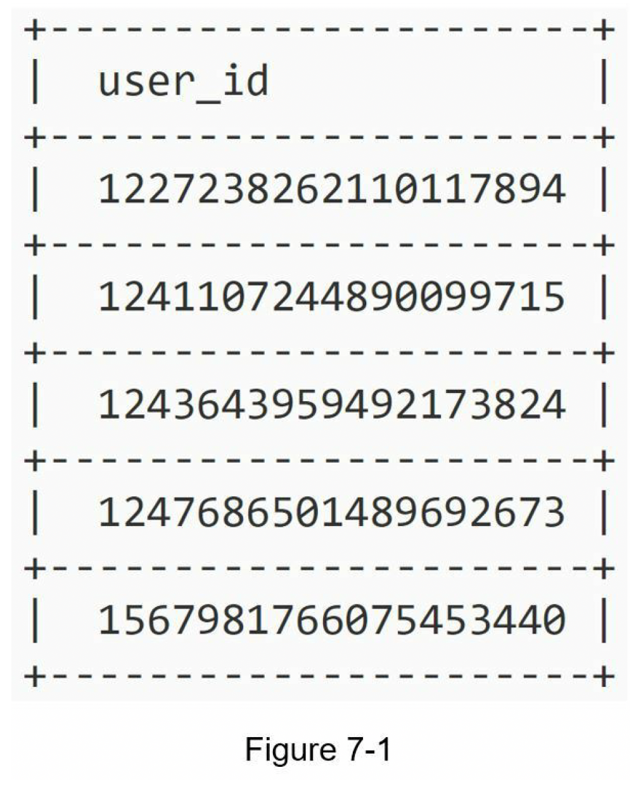
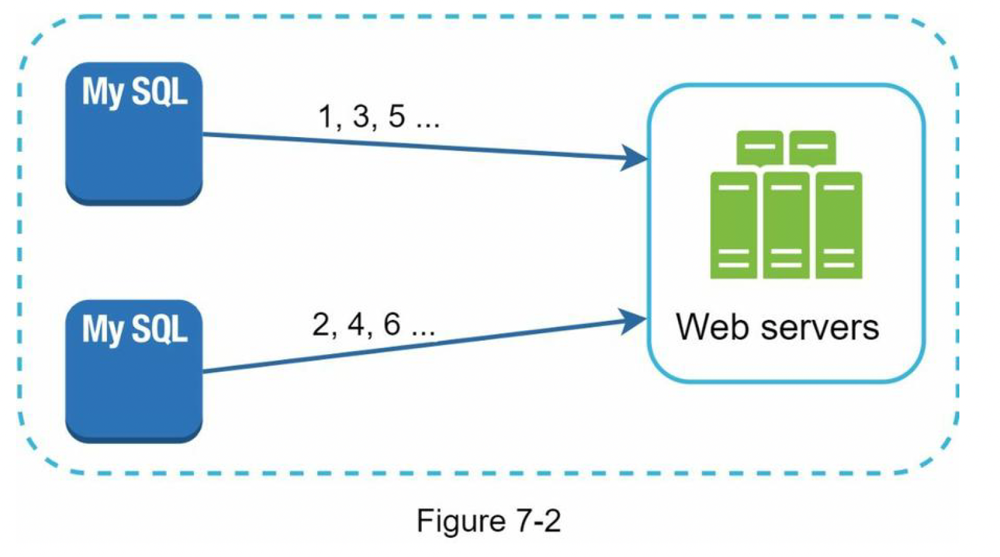
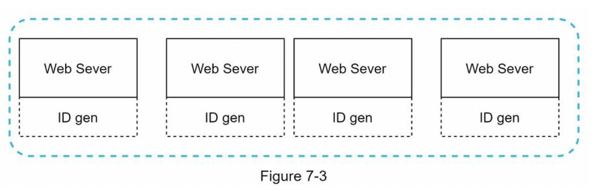
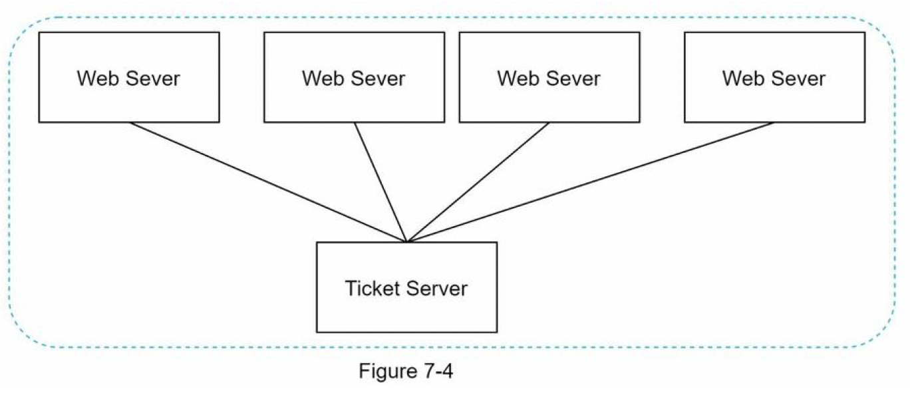
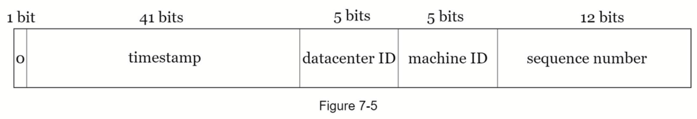
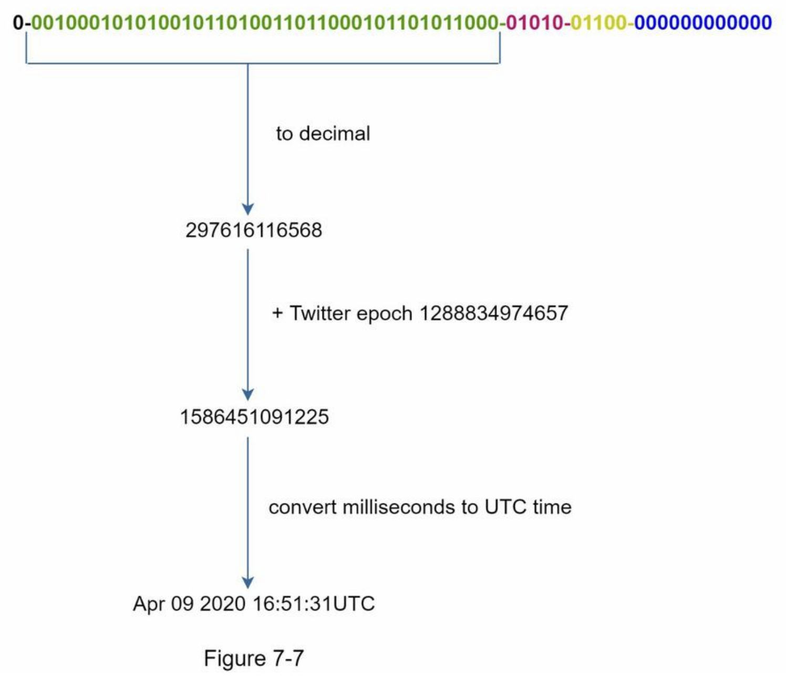

# Design A Unique ID Generator In Distributed Systems

> **Source**: System Design Interview – An Insider's Guide by Alex Xu & Sahn Lam (Study Notes)
> **ByteByteGo Chapter**: 08

[

**Toronto Study Group Notes**](/study-notes/)[Notes](/study-notes/notes/)

* [Table of Contents](/study-notes/notes/)
* [System Design Interview: An Insider’s Guide](/study-notes/notes/system-design-interview)

  + [Chapter 1: Scale From Zero to Millions of Users](/study-notes/notes/system-design-interview/ch1)
  + [Chapter 2: BACK-OF-THE-ENVELOPE ESTIMATION](/study-notes/notes/system-design-interview/ch2)
  + [Chapter 3: A FRAMEWORK FOR SYSTEM DESIGN INTERVIEWS](/study-notes/notes/system-design-interview/ch3)
  + [Chapter 4: Design a Rate Limiter](/study-notes/notes/system-design-interview/ch4)
  + [Chapter 5: Design Consistent Hashing](/study-notes/notes/system-design-interview/ch5)
  + [Chapter 6: Design a Key-Value Store](/study-notes/notes/system-design-interview/ch6)
  + [Chapter 7: Design a Unique ID Generator in Distributed Systems](/study-notes/notes/system-design-interview/ch7)
  + [Chapter 8: Design A URL Shortener](/study-notes/notes/system-design-interview/ch8)
  + [Chapter 9: Design a Web Crawler](/study-notes/notes/system-design-interview/ch9)
  + [Chapter 10: Design a Notification System](/study-notes/notes/system-design-interview/ch10)
  + [Chapter 11: Design a News Feed System](/study-notes/notes/system-design-interview/ch11)
  + [Chapter 12: Design a Chat System](/study-notes/notes/system-design-interview/ch12)
  + [Chapter 13: Designing a Search Autocomplete System](/study-notes/notes/system-design-interview/ch13)
  + [Chapter 14: Design YouTube](/study-notes/notes/system-design-interview/ch14)
  + [Chapter 15: DESIGN GOOGLE DRIVE](/study-notes/notes/system-design-interview/ch15)
* [Kubernetes - Up and Running](/study-notes/notes/kubernetes-up-and-running)

* [System Design Interview: An Insider’s Guide](/study-notes/notes/system-design-interview)
* Chapter 7: Design a Unique ID Generator in Distributed Systems

# Chapter 7: Design a Unique ID Generator in Distributed Systems

note

You are asked to design a unique ID generator in distributed systems.

## First thought[​](#first-thought "Direct link to First thought")

> Using a primary key with the `auto_increment` attribute in a traditional
> database

* Does not work in a distributed environment because
  1. a single database server is not large enough
  2. generating unique IDs across multiple databases with minimal delay is challenging
     

## Step 1 - Understand the problem and establish design scope[​](#step-1---understand-the-problem-and-establish-design-scope "Direct link to Step 1 - Understand the problem and establish design scope")

* **Clarification questions**
  + **Candidate**: What are the characteristics of unique IDs?
  + **Interviewer**: IDs must be unique and sortable.
  + **Candidate**: For each new record, does ID increment by 1?
  + **Interviewer**: The ID increments by time but not necessarily only increments by 1. IDs
    created in the evening are larger than those created in the morning on the same day.
  + **Candidate**: Do IDs only contain numerical values?
  + **Interviewer**: Yes, that is correct.
  + **Candidate**: What is the ID length requirement?
  + **Interviewer**: IDs should fit into 64-bit.
  + **Candidate**: What is the scale of the system?
  + **Interviewer**: The system should be able to generate 10,000 IDs per second.
* **the requirements are listed as follows**
  + IDs must be unique.
  + IDs are numerical values only.
  + IDs fit into 64-bit.
  + IDs are ordered by date.
  + Ability to generate over 10,000 unique IDs per second.

## Step 2 - Propose high-level design and get buy-in[​](#step-2---propose-high-level-design-and-get-buy-in "Direct link to Step 2 - Propose high-level design and get buy-in")

* **Multi-master replication**
  

  + uses the databases’ `auto_increment` feature
  + increasing the next ID by `1`, we increase it by `k`
  + where k is the number of database servers in use
  + ✅ Pros:
    - solves some scalability issues because IDs can scale with the number of database servers.
  + ❌ Cons:
    - Hard to scale with multiple data centers
    - IDs do not go up with time across multiple servers.
    - It does not scale well when a server is added or removed
* **UUID**

  + UUID is a `128-bit` number used to identify information in computer systems. e.g. `09c93e62-50b4-468d-bf8a-c07e1040bfb2`
    
  + ✅ Pros:
    - low probability of getting collusion
    - UUIDs can be
      generated independently without coordination between servers
    > after generating 1 billion UUIDs every second for approximately
    > 100 years would the probability of creating a single duplicate reach 50%”

    - The system is easy to scale
      * because each web server is responsible for generating IDs they consume.
      * ID generator can easily scale with web servers.
  + ❌ Cons:
    - IDs are 128 bits long, but our requirement is 64 bits.
    - IDs do not go up with time.
    - IDs could be non-numeric.
* **Ticket Server**

  + The idea is to use a centralized auto\_increment feature in a single database server
    
    - ✅ Pros:
      * Numeric IDs.
      * It is easy to implement, and it works for small to medium-scale applications.
    - ❌ Cons:
      * Single point of failure
      * To avoid a single point of failure → we can set up
        multiple ticket servers → will introduce new challenges such as data
        synchronization.
* **Twitter snowflake approach**

  + Twitter’s unique ID generation system called “snowflake” is inspiring and can satisfy our requirements.
  + Divide and conquer → Instead of generating an ID directly → we divide an ID into different sections
  + the layout of a `64-bit` ID
    
  + Sign bit: `1 bit`. It will always be `0`. This is reserved for future uses. It can potentially be used to distinguish between signed and unsigned numbers.
  + Timestamp: `41 bits`. Milliseconds since the epoch or custom epoch. We use Twitter snowflake default epoch `1288834974657`, equivalent to `Nov 04, 2010, 01:42:54 UTC`.
  + Datacenter ID: `5 bits`, which gives us `2 ^ 5 = 32` datacenters.
  + Machine ID: `5 bits`, which gives us `2 ^ 5 = 32` machines per datacenter.
  + Sequence number: `12 bits`. For every ID generated on that machine/process, the sequence number is incremented by `1`. The number is reset to `0` every millisecond.

## Step 3 - Design deep dive[​](#step-3---design-deep-dive "Direct link to Step 3 - Design deep dive")

* Fixed: Datacenter IDs and machine ID

  + Any changes in datacenter IDs and machine IDs require careful review
    since an accidental change in those values can lead to ID conflicts.
* **Timestamp**

  + `41 bits`
  + are sortable by time
  + binary representation is converted to UTC
    
  + The maximum timestamp that can be represented in `41 bits` is
    `2 ^ 41 - 1 = 2199023255551 milliseconds (ms)`, which gives us: `~ 69 years = 2199023255551 ms / 1000 seconds / 365 days / 24 hours/ 3600 seconds`
  + This means the ID generator will work for 69 years
  + and having a custom epoch time close to today’s date delays the overflow time
  + After 69 years, we will need a new epoch time or adopt other techniques
    to migrate IDs.
* **Sequence number**

  + `12 bits`
  + 2 ^ 12 = 4096 combinations.
  + This field is `0` unless more than one ID is generated in a millisecond on the same server

## Step 4 - Wrap up[​](#step-4---wrap-up "Direct link to Step 4 - Wrap up")

* **unique ID generator**
* multimaster replication
* UUID
* ticket server
* Twitter snowflake-like unique ID generator
* **a few additional talking points:**
  + **Clock synchronization**
  + we assume ID generation servers have the same clock
  + might not be true when a server is running on multiple cores and multi-machine scenarios
  + ✅ popular solution: Network Time Protocol
  + **Section length tuning**
    - e.g. fewer sequence numbers but more timestamp bits are effective for low concurrency and long-term applications
  + **High availability**
    - Since an ID generator is a mission-critical system, it must be highly
      available

[Previous

Chapter 6: Design a Key-Value Store](/study-notes/notes/system-design-interview/ch6)[Next

Chapter 8: Design A URL Shortener](/study-notes/notes/system-design-interview/ch8)

* [First thought](#first-thought)
* [Step 1 - Understand the problem and establish design scope](#step-1---understand-the-problem-and-establish-design-scope)
* [Step 2 - Propose high-level design and get buy-in](#step-2---propose-high-level-design-and-get-buy-in)
* [Step 3 - Design deep dive](#step-3---design-deep-dive)
* [Step 4 - Wrap up](#step-4---wrap-up)

