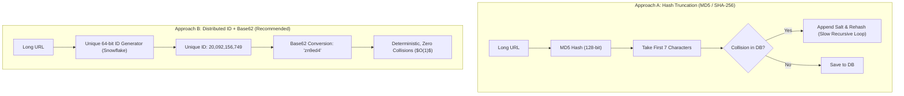
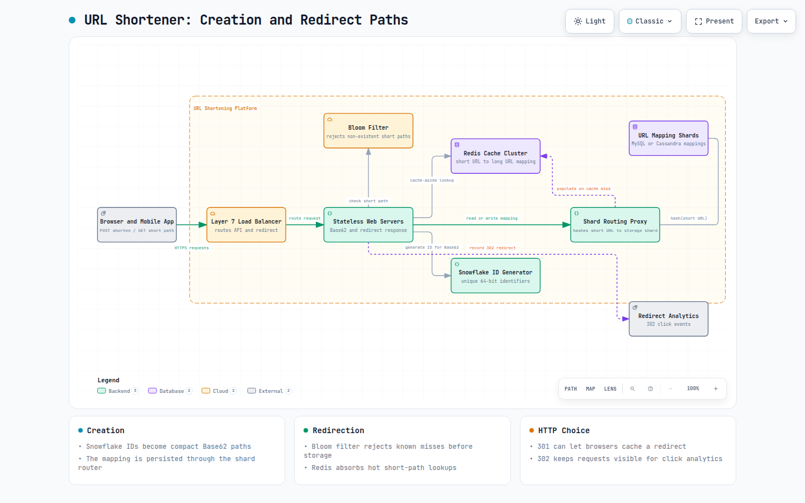
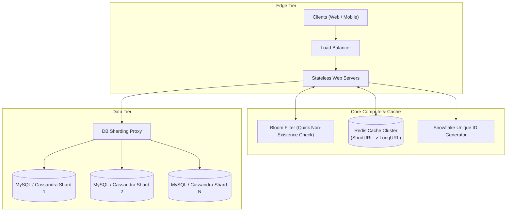
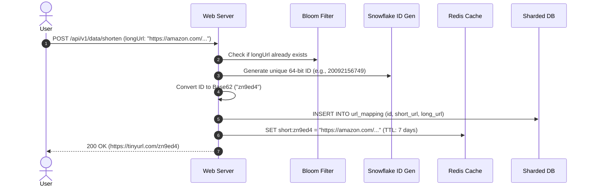
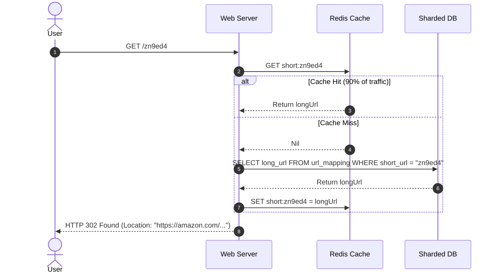
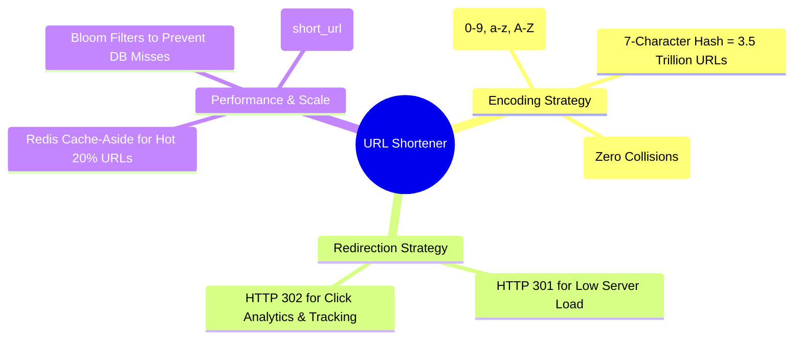

# Design A URL Shortener

> **Source**: *System Design Interview – An Insider's Guide: Volume 1* by Alex Xu  
> **ByteByteGo Chapter**: 09  
> **Topic**: URL Shortening, Base62 Encoding vs. Hash Collision Resolution, HTTP 301/302 Redirection, Distributed Caching

---

## 1. Understand the Problem and Establish Design Scope

A URL shortener (e.g., TinyURL, Bitly) creates an alias character string for long URLs, saving character space in SMS/social media feeds and providing click tracking.

```mermaid
flowchart LR
    subgraph ShortenFlow["1. URL Shortening"]
        CLIENT1["Client"] -->|POST /api/v1/data/shorten (longUrl)| GW["URL Shortener Service"]
        GW -->|Returns: https://tinyurl.com/y7keocwj| CLIENT1
    end

    subgraph RedirectFlow["2. URL Redirection"]
        CLIENT2["Client Browser"] -->|GET /y7keocwj| GW
        GW -->|HTTP 301/302 Location: https://amazon.com/...| CLIENT2
        CLIENT2 -->|Direct Fetch| ORIGIN["Target Web Server"]
    end
```

---

### Interview Clarification & Scope

> **Candidate:** What is the daily write traffic volume?  
> **Interviewer:** **100 million URLs generated per day**.
>
> **Candidate:** What is the read-to-write ratio?  
> **Interviewer:** **10:1** ($10\times$ more redirects than shorten requests).
>
> **Candidate:** What characters are allowed in the shortened URL?  
> **Interviewer:** Alphanumeric characters `[0-9, a-z, A-Z]` ($62\text{ distinct characters}$).
>
> **Candidate:** How long should shortened URLs be retained?  
> **Interviewer:** Retain records for **10 years**. URLs cannot be updated or deleted.

---

### Back-of-the-Envelope Estimation

| Metric / Dimension | Calculation | Estimated Value |
|:---|:---|:---|
| **Write QPS** | $\frac{100{,}000{,}000}{86{,}400\text{ sec}}$ | $\approx \mathbf{1{,}160\text{ Write QPS}}$ |
| **Peak Write QPS** | $2 \times \text{Write QPS}$ | $\approx \mathbf{2{,}320\text{ QPS}}$ |
| **Read QPS (10:1 Ratio)** | $1{,}160 \times 10$ | $\approx \mathbf{11{,}600\text{ Read QPS}}$ |
| **10-Year Total URL Count** | $100\text{M/day} \times 365 \times 10$ | $\approx \mathbf{365\text{ Billion records}}$ |
| **Average URL Length** | Text + Metadata | $\approx 100\text{ bytes/record}$ |
| **10-Year Storage Capacity** | $365\text{B} \times 100\text{ bytes}$ | $\approx \mathbf{36.5\text{ TB}}$ |
| **Memory Cache Size (20% Pareto)** | $100\text{M} \times 10 \times 100\text{B} \times 0.20$ | $\approx \mathbf{20\text{ GB RAM}}$ |

---

## 2. API Design & HTTP Redirection Semantics

### REST Endpoints
1. `POST /api/v1/data/shorten`
   - **Request**: `{ "longUrl": "https://www.example.com/very/long/path" }`
   - **Response**: `{ "shortUrl": "https://tinyurl.com/y7keocwj" }`
2. `GET /{shortUrl}`
   - **Response**: HTTP Redirection (`Location: https://www.example.com/very/long/path`)

---

### HTTP 301 vs. HTTP 302 Redirection

```mermaid
flowchart TD
    subgraph PermanentRedirect["HTTP 301 (Moved Permanently)"]
        C1["Client"] -->|1. First GET /y7k| S1["Shortener Service"]
        S1 -->>|2. 301 + Location| C1
        C1 -->|3. Browser Caches Mapping| C1
        C1 -->|4. Future Requests: Direct to Origin (Bypasses Shortener)| O1["Target Origin Server"]
    end

    subgraph TemporaryRedirect["HTTP 302 (Found / Temporary)"]
        C2["Client"] -->|1. GET /y7k| S2["Shortener Service"]
        S2 -->>|2. 302 + Location| C2
        C2 -->|3. Always hits Shortener first (Enables Analytics & Click Tracking)| S2
    end
```

| Redirect Code | Browser Caching | Server Load | Click Analytics Tracking |
|:---|:---|:---|:---|
| **HTTP 301 (Permanent)** | Cached in browser memory | **Lowest** (subsequent clicks bypass shortener) | Poor (only first click is tracked) |
| **HTTP 302 (Temporary)** | **Not cached** by browser | Higher | **Accurate (100% clicks recorded)** |

---

## 3. Short URL Encoding & Length Mathematics

We use Base62 characters: `0-9` (10), `a-z` (26), `A-Z` (26) $\implies \mathbf{62\text{ characters}}$.

To store $365\text{ Billion URLs}$, determine the minimum short URL length $n$:

$$62^n \ge 365\text{ Billion}$$

- For $n = 6$: $62^6 \approx 56.8\text{ Billion}$ (Insufficient).
- For $n = 7$: $62^7 \approx \mathbf{3.5\text{ Trillion}}$ ($\approx 10\times$ our 10-year requirement).

$$\mathbf{\text{Short URL Path Length} = 7\text{ characters (e.g., https://tinyurl.com/aBc123D)}}$$

---

### Hashing + Collision vs. Distributed ID + Base62



#### Base62 Conversion Algorithm
Convert integer ID $20092156749$ to Base62 string by repeatedly dividing by $62$:
$$20092156749 \pmod{62} \dots \implies \text{"zn9ed4"}$$

---

## 4. High-Level Architecture & End-to-End Data Flows



**Diagram:** Shorten and redirect requests share stateless web servers, while Bloom filters and Redis protect sharded URL mappings; 302 redirects can emit analytics events without blocking the response. [Open the interactive URL-shortener architecture diagram](resources/url-shortener/url-shortener-architecture.html).



---

### End-to-End Sequence Flows

#### 1. URL Shortening Flow (Write Path)


#### 2. URL Redirection Flow (Read Path)


---

## 5. Wrap Up & Summary

### Architectural Summary Mindmap



| Subsystem | Architectural Decision | Core Rationale |
|:---|:---|:---|
| **ID Generation** | Distributed Snowflake + Base62 | Eliminates MD5 hash collision loops; guarantees $O(1)$ unique short URL creation. |
| **Caching** | Redis Cache-Aside | Absorbs $>90\%$ of read QPS ($11{,}600\text{ QPS}$), providing sub-5ms redirection. |
| **Existence Check** | Bloom Filter | Prevents expensive disk database lookups for non-existent short URLs. |
| **Data Partitioning** | Sharding by `hash(short_url)` | Distributes $36.5\text{ TB}$ storage and write load evenly across DB shards. |

---

## References

1. Base62 Encoding: https://en.wikipedia.org/wiki/Base62
2. Bloom Filters: A Probabilistic Data Structure: https://en.wikipedia.org/wiki/Bloom_filter
3. High Scalability: How TinyURL and Bitly scale: http://highscalability.com/blog/2014/7/21/bitly-architecture.html
