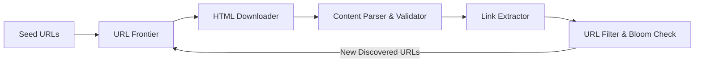
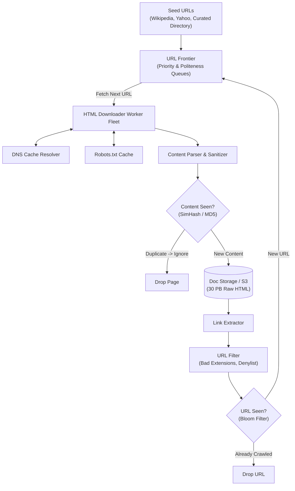
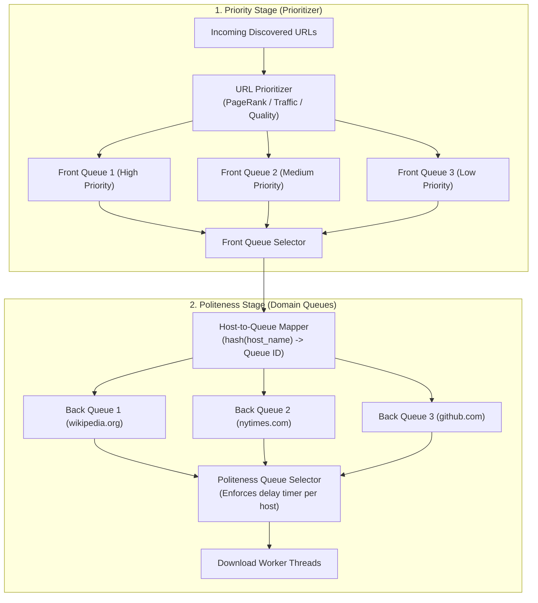
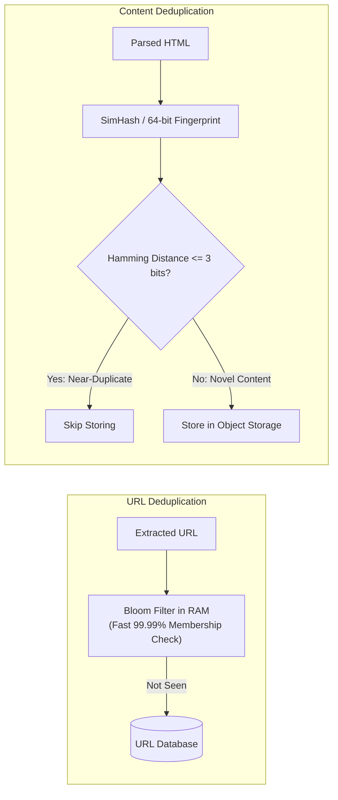
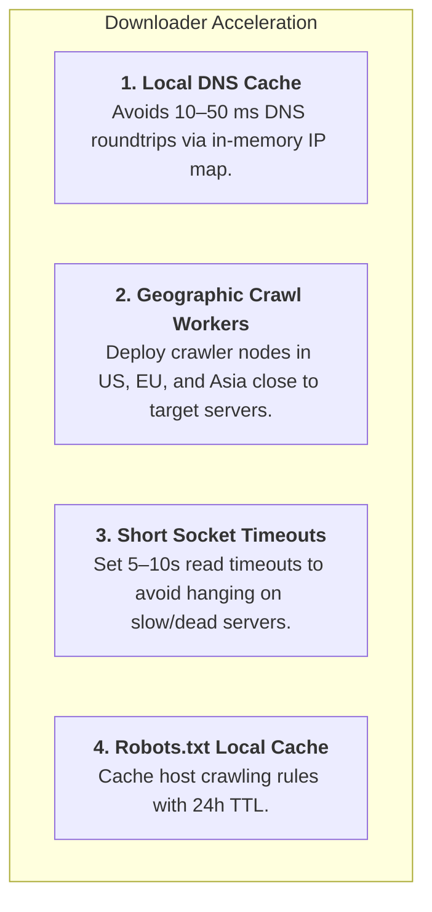
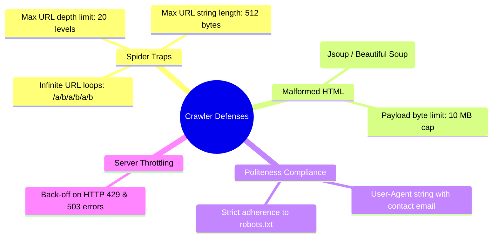

# Design A Web Crawler

> **Source**: *System Design Interview – An Insider's Guide: Volume 1* by Alex Xu  
> **ByteByteGo Chapter**: 10  
> **Topic**: Distributed Web Crawling, URL Frontier Architecture, Politeness & Priority Scheduling, Spider Trap Defenses

---

## 1. Understand the Problem and Establish Design Scope

A web crawler (spider/robot) systematically discovers, fetches, and parses billions of web pages across the public internet for search engine indexing, archival, and data mining.

---

### Interview Clarification & Scope

> **Candidate:** What is the primary purpose of this web crawler?  
> **Interviewer:** **Search engine indexing**.
>
> **Candidate:** What is the target crawling volume?  
> **Interviewer:** **1 billion web pages per month**.
>
> **Candidate:** What content types are crawled and stored?  
> **Interviewer:** **HTML pages only** (images and media files are excluded). Store crawled pages for **5 years**.
>
> **Candidate:** How should duplicate content and polite server access be handled?  
> **Interviewer:** Must detect and ignore duplicate pages (near-duplicate hashing) and adhere strictly to `robots.txt` and domain rate limits (**Politeness**).

---

### Back-of-the-Envelope Estimation

| Metric / Dimension | Calculation | Estimated Value |
|:---|:---|:---|
| **Monthly Crawled Pages** | Given | $1{,}000{,}000{,}000\text{ pages/month}$ |
| **Average Crawl QPS** | $\frac{10^9}{30\text{ days} \times 86{,}400\text{ sec}}$ | $\approx \mathbf{400\text{ pages/sec}}$ |
| **Peak Crawl QPS** | $2 \times \text{Average QPS}$ | $\approx \mathbf{800\text{ pages/sec}}$ |
| **Average HTML Page Size** | Text + markup | $\approx 500\text{ KB/page}$ |
| **Monthly Storage** | $1\text{B pages} \times 500\text{ KB}$ | $\approx \mathbf{500\text{ TB/month}}$ |
| **5-Year Storage Capacity** | $500\text{ TB/month} \times 60\text{ months}$ | $\approx \mathbf{30\text{ PB}}$ |

---

## 2. High-Level Architecture & Crawling Pipeline

---

## 3. Design Deep Dive

### 1. The URL Frontier (Mercator Crawling Model)

A robust crawler must balance two competing constraints:
1. **Politeness**: Never bombard a single web host with concurrent requests (prevents accidental DoS).
2. **Priority / Freshness**: Prioritize high-quality domains (PageRank) and frequently updated news portals.

#### Politeness Selector Logic
- Each back queue corresponds to a single web host/domain.
- A worker thread processes a queue, downloads a page, and enforces a mandatory delay (e.g., $500\text{ ms}$) before fetching the next URL from the same host queue.

---

### 2. Duplicate Detection: URLs vs. Content

- **Bloom Filter for URLs**: Eliminates disk lookups for billions of visited URLs with minimal RAM.
- **SimHash for Content**: Detects near-identical web pages (e.g., pages with only changing timestamp footers or ads) by measuring Hamming distance between 64-bit feature vectors.

---

### 3. HTML Downloader Optimizations

---

### 4. Spider Traps & Edge Case Defense

---

## 4. Architectural Summary

| Subsystem | Core Technical Choice | Scaling Benefit |
|:---|:---|:---|
| **URL Frontier** | 2-Stage Front/Back Queues (Mercator) | Decouples PageRank priority scheduling from domain politeness rate-limiting. |
| **URL Deduplication** | Distributed Bloom Filter Cluster | Memory-efficient visited URL filtering across billions of URLs. |
| **Content Deduplication**| SimHash Fingerprinting | Filters out near-duplicate pages without byte-by-byte comparisons. |
| **DNS Resolution** | In-Memory Asynchronous DNS Cache | Eliminates repetitive DNS latency on the critical download path. |
| **Storage Architecture** | S3 / Distributed Object Store | Highly cost-effective $30\text{ PB}$ durable archival storage. |

---

## References

1. Mercator: A Scalable, Extensible Web Crawler (Heydon & Najork): https://www.researchgate.net/publication/220875323_Mercator_A_scalable_extensible_web_crawler
2. SimHash: Detecting Near-Duplicates for Web Crawling (Manku et al. Google): https://dl.acm.org/doi/10.1145/1242572.1242592
3. The Robots Exclusion Protocol: https://www.robotstxt.org/
