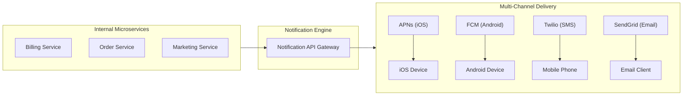
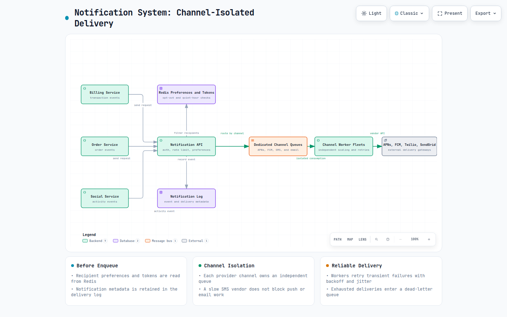
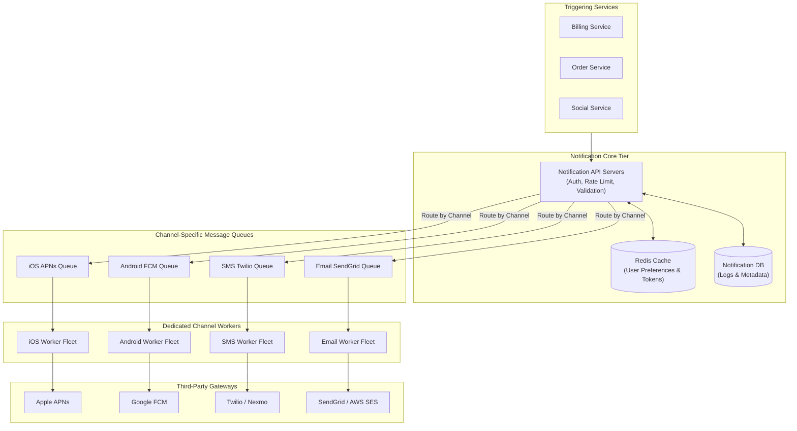
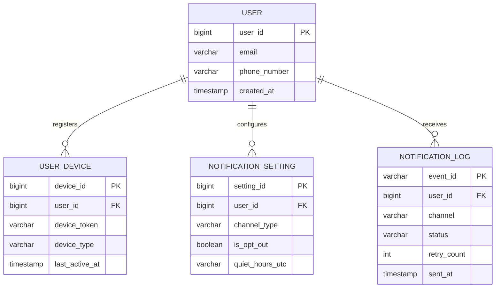
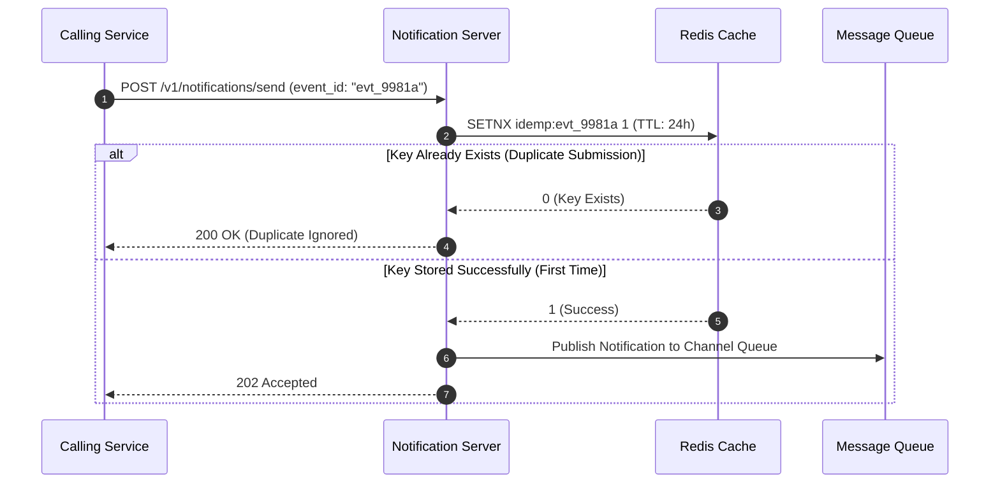
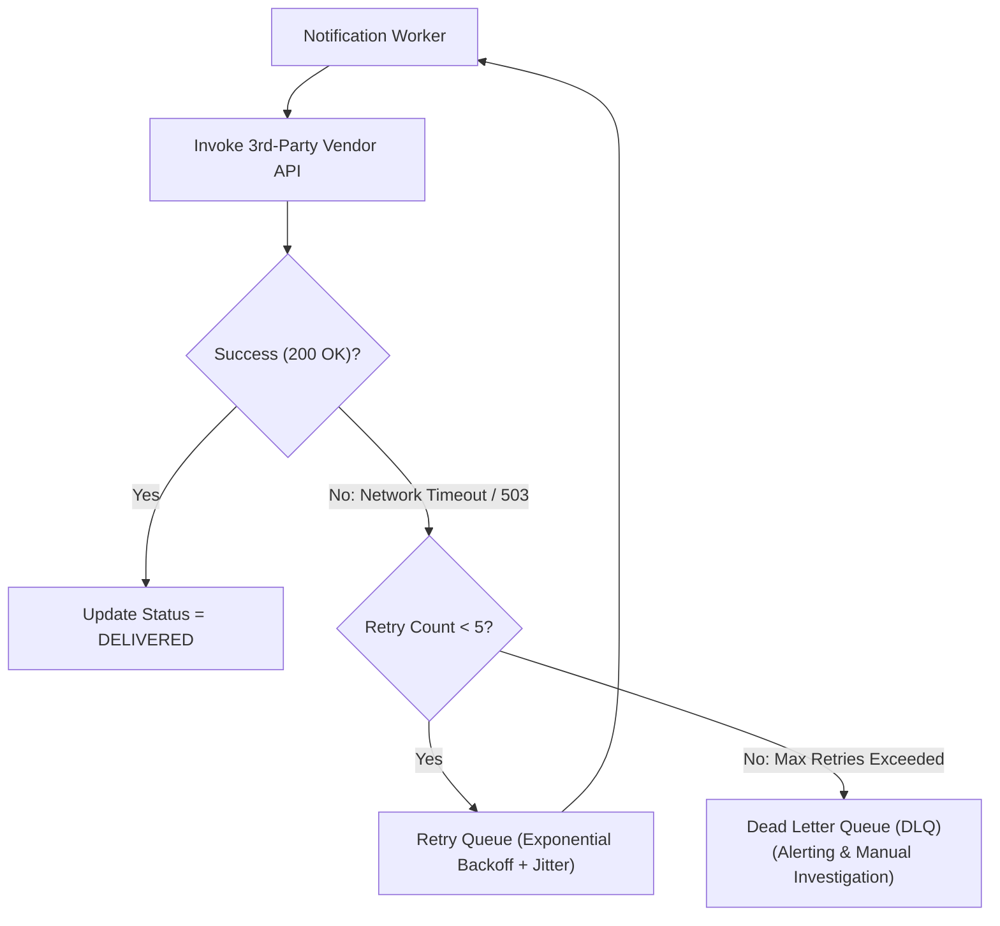
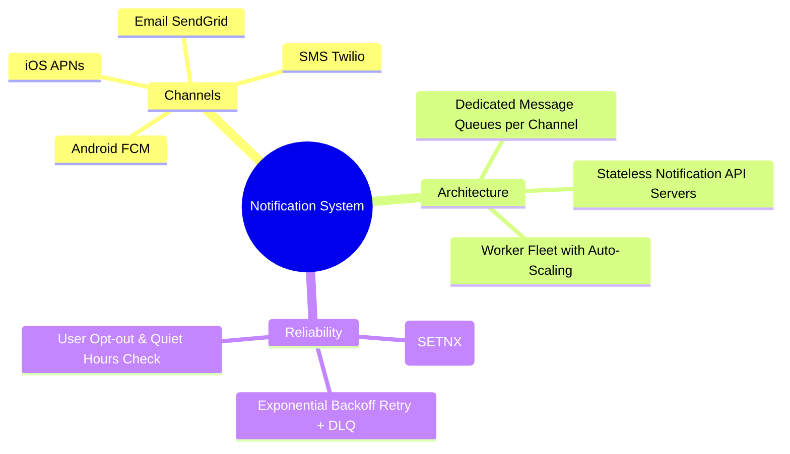

# Design A Notification System

> **Source**: *System Design Interview – An Insider's Guide: Volume 1* by Alex Xu  
> **ByteByteGo Chapter**: 11  
> **Topic**: Multi-Channel Delivery (APNs, FCM, Twilio, SendGrid), Dedicated Message Queues, Deduplication, Notification Templates

---

## 1. Understand the Problem and Establish Design Scope

A modern notification system delivers soft real-time transactional alerts, marketing promotions, and user updates across mobile push, SMS, and email.



---

### Interview Clarification & Scope

> **Candidate:** What communication channels must be supported?  
> **Interviewer:** **iOS Push (APNs)**, **Android Push (FCM)**, **SMS (Twilio/Nexmo)**, and **Email (SendGrid/Mailchimp)**.
>
> **Candidate:** What is the daily notification volume?  
> **Interviewer:** 
> - **10 Million Mobile Push Notifications**
> - **1 Million SMS Messages**
> - **5 Million Emails**
>
> **Candidate:** Can users configure opt-out preferences and quiet hours?  
> **Interviewer:** Yes, users can opt-out of specific notification categories and configure quiet hours.
>
> **Candidate:** How should transient third-party vendor downtime be handled?  
> **Interviewer:** Must guarantee at-least-once delivery with automated exponential retries without blocking other channels.

---

## 2. High-Level Architecture & Multi-Queue Isolation

To prevent an outage or rate-limiting in one external vendor (e.g., Twilio) from blocking critical push notifications, **each delivery channel is decoupled with an independent message queue**.



**Diagram:** Triggering services pass validated notifications through preference checks and durable logging before channel-isolated queues fan out to independently retrying workers. [Open the interactive notification architecture diagram](resources/notification-system/notification-system-architecture.html).



---

## 3. Data Model & Device Token Gathering



---

## 4. Design Deep Dive

### 1. Notification Templates & Parameter Injection

Hardcoding notification strings in backend microservices leads to maintenance nightmares. A centralized template engine injects dynamic parameters into localized, version-controlled templates:

```json
{
  "template_id": "tpl_order_shipped_v2",
  "locale": "en-US",
  "title": "Your Order #{order_id} Has Shipped!",
  "body": "Hi {customer_name}, your package is on the way via {carrier} (Tracking: {tracking_num}).",
  "action_url": "https://mysite.com/track/{tracking_num}"
}
```

---

### 2. Deduplication & Idempotency Check

Network retries can cause duplicate notification submissions. The API gateway validates a unique `event_id` against Redis before queueing:



---

### 3. Reliability: Exponential Backoff & Dead Letter Queues (DLQ)



#### Backoff Formula
$$\text{Delay} = \min\left(300\text{s}, 2^{\text{retry\_count}} \times 1\text{s}\right) \pm \text{Random Jitter}$$

---

### 4. User Notification Fatigue & Rate Limiting
- To avoid annoying users with excessive notifications, enforce a client-level rate limiter (e.g., maximum $5\text{ marketing push notifications per user per hour}$).
- **Quiet Hours Filter**: Check user's local timezone setting before sending non-urgent marketing alerts.

---

## 5. Architectural Summary

### Architectural Summary Mindmap



| Component | Design Choice | System Benefit |
|:---|:---|:---|
| **Queue Topology** | Separate Message Queues per channel | Fault isolation: third-party SMS outage never blocks push notifications. |
| **Deduplication** | Distributed Redis `SETNX` with TTL | Eliminates double-sending notifications to end-user devices. |
| **Worker Scaling** | Horizontally scalable independent worker pools | Scale compute resources independently based on channel queue depth. |
| **Compliance** | Pre-send opt-out preference filtering | Respects user communication preferences and regulatory unsubscribe laws (CAN-SPAM / GDPR). |

---

## References

1. Apple Push Notification service (APNs): https://developer.apple.com/documentation/usernotifications
2. Firebase Cloud Messaging (FCM): https://firebase.google.com/docs/cloud-messaging
3. Twilio Programmable SMS API: https://www.twilio.com/docs/sms
4. SendGrid Email API Best Practices: https://sendgrid.com/docs/
