# Design A Notification System

> **Source**: System Design Interview – An Insider's Guide by Alex Xu & Sahn Lam
> **ByteByteGo Chapter**: 11

A notification system has already become a very popular feature for many applications in recent years. A notification alerts a user with important information like breaking news, product updates, events, offerings, etc. It has become an indispensable part of our daily life. In this chapter, you are asked to design a notification system. A notification is more than just mobile push notification. Three types of notification formats are: mobile push notification, SMS message, and Email. Figure 1 shows an example of each of these notifications. Push SMS Email notification Figure 1 illustrates the three main types of notifications supported by the system: Push notification, SMS, and Email. It shows example visuals for each: 1. Push notification: A mobile phone screen displaying a short message alert.

2. SMS: A phone's messaging app showing a text message.

3. Email: A laptop screen displaying an email client with a new message. These represent the primary channels through which the notification system can reach users with important information.

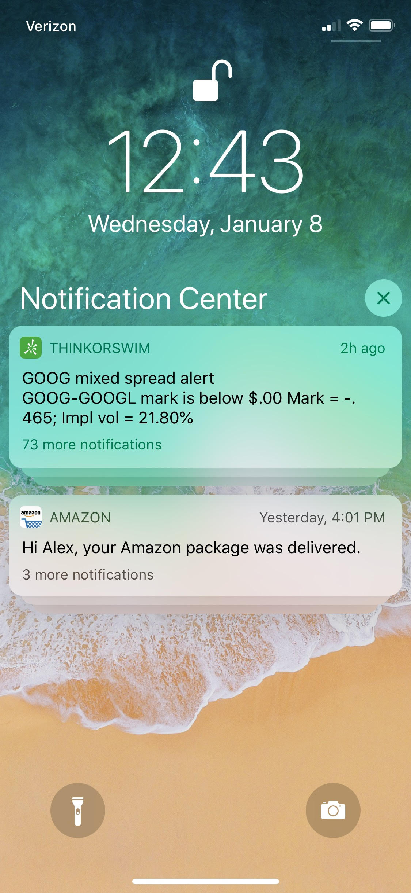


## Step 1 - Understand the problem and establish design scope

Building a scalable system that sends out millions of notifications a day is not an easy task. It requires a deep understanding of the notification ecosystem. The interview question is purposely designed to be open-ended and ambiguous, and it is your responsibility to ask questions to clarify the requirements.

> **Candidate:** What types of notifications does the system support?

> **Interviewer:** Push notification, SMS message, and email.

> **Candidate:** Is it a real-time system?

> **Interviewer:** Let us say it is a soft real-time system. We want a user to receive notifications as soon as possible. However, if the system is under a high workload, a slight delay is acceptable.

> **Candidate:** What are the supported devices?

> **Interviewer:** iOS devices, android devices, and laptop/desktop.


> **Candidate:** What triggers notifications?

> **Interviewer:** Notifications can be triggered by client applications. They can also be scheduled on the server-side.

> **Candidate:** Will users be able to opt-out?

> **Interviewer:** Yes, users who choose to opt-out will no longer receive notifications.

> **Candidate:** How many notifications are sent out each day?

> **Interviewer:** 10 million mobile push notifications, 1 million SMS messages, and 5 million emails.


## Step 2 - Propose high-level design and get buy-in

This section shows the high-level design that supports various notification types: iOS push notification, Android push notification, SMS message, and Email. It is structured as follows: Different types of notifications Contact info gathering flow Notification sending/receiving flow Different types of notifications We start by looking at how each notification type works at a high level. iOS push notification Figure 2 outlines the iOS push notification process: 1. The process begins with a Provider, which is the server-side component that initiates the notification.

2. The Provider sends a notification request to Apple Push Notification Service (APNS), a remote service managed by Apple.

3. APNS then forwards the notification to the target iOS Device.

4. The iOS Device receives and displays the push notification to the user. The diagram also shows that the Provider supplies two key pieces of information: Device token: A unique identifier for the target device. Payload: A JSON dictionary containing the notification content and metadata. We primary need three components to send an iOS push notification: Provider. A provider builds and sends notification requests to Apple Push Notification Service (APNS). To construct a push notification, the provider provides the following data: Device token: This is a unique identifier used for sending push notifications.

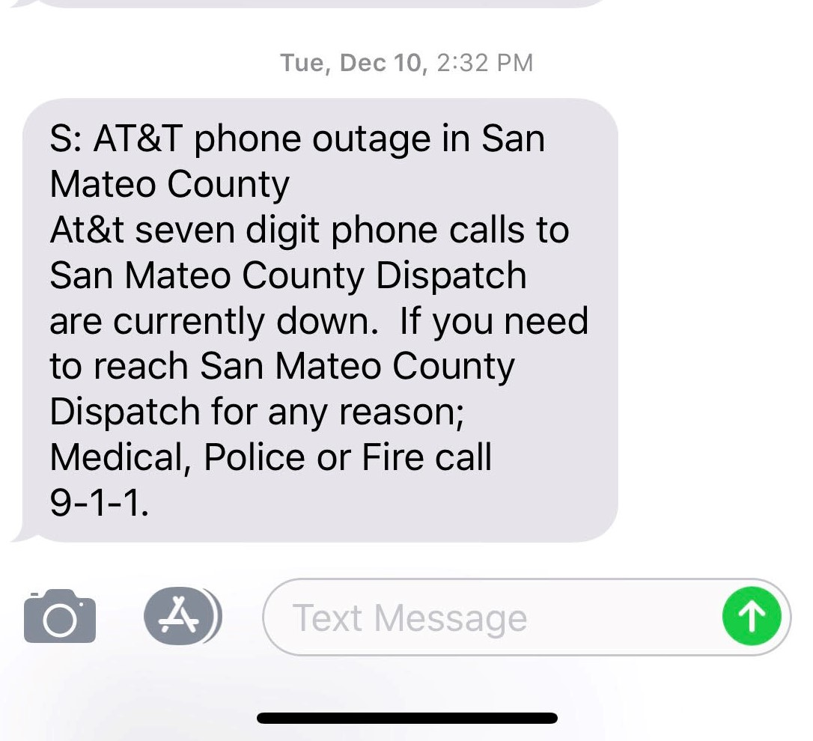


Payload: This is a JSON dictionary that contains a notification’s payload. Here is an example: 
```json
{ "aps":{ "alert":{ "title":"Game Request", "body":"Bob wants to play chess", "action-loc-key":"PLAY" }, "badge":5 } }
```
 APNS: This is a remote service provided by Apple to propagate push notifications to iOS devices. iOS Device: It is the end client, which receives push notifications. Android push notification Android adopts a similar notification flow. Instead of using APNs, Firebase Cloud Messaging (FCM) is commonly used to send push notifications to android devices. Figure 3 depicts the Android push notification flow: 1. Similar to the iOS process, it starts with a Provider (server-side component).

2. Instead of APNS, the Provider sends the notification request to Firebase Cloud Messaging (FCM), a service provided by Google.

3. FCM then forwards the notification to the target Android Device.

4. The Android Device receives and displays the push notification. This process mirrors the iOS flow but uses Google's FCM instead of Apple's APNS.

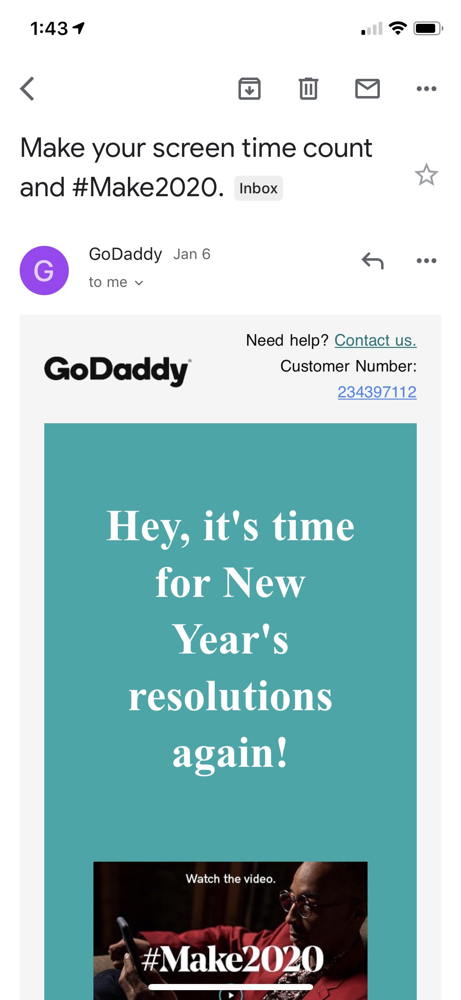


### SMS message

For SMS messages, third party SMS services like Twilio [1], Nexmo [2], and many others are commonly used. Most of them are commercial services. Figure 4 illustrates the SMS message sending process: 1. It begins with our Notification System, representing the core of our design.

2. The Notification System connects to a Third-party SMS Service, such as Twilio or Nexmo.

3. The Third-party SMS Service then sends the SMS message to the user's Phone.

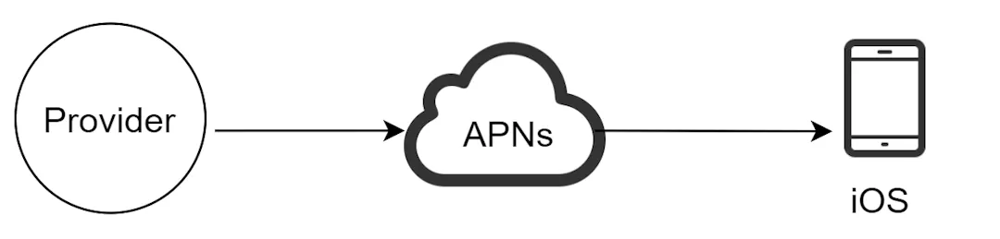


This approach leverages established SMS providers rather than managing the complex infrastructure required for direct SMS sending.


### Email

Although companies can set up their own email servers, many of them opt for commercial email services. Sendgrid [3] and Mailchimp [4] are among the most popular email services, which offer a better delivery rate and data analytics. Figure 5 shows the email notification process: 1. Starting with our Notification System, which generates the email content.

2. The system connects to a Third-party Email Service like Sendgrid or Mailchimp.

3. The Email Service then delivers the email to the recipient's Email Client. Using third-party email services often provides better delivery rates and analytics compared to self- hosted email servers. Figure 6 shows the design after including all the third-party services.

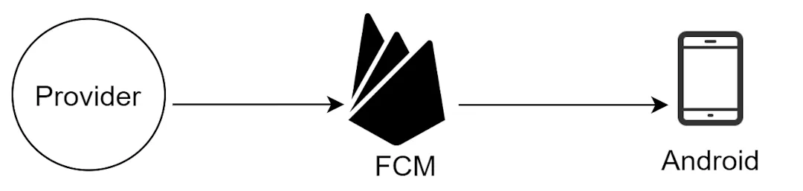


Figure 6 presents a comprehensive view of the notification system, incorporating all previously discussed notification types: 1. The central Notification System connects to various third-party services: APNS for iOS push notifications FCM for Android push notifications SMS Service for text messages Email Service for emails 2. Each service then delivers the notification to the appropriate device or client: iOS Device Android Device

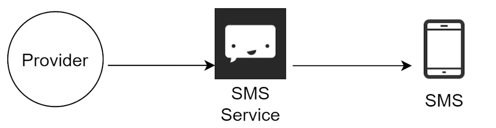


Phone (for SMS) Email Client This unified view shows how a single notification system can manage multiple notification channels efficiently. Contact info gathering flow To send notifications, we need to gather mobile device tokens, phone numbers, or email addresses. As shown in Figure 7, when a user installs our app or signs up for the first time, API servers collect user contact info and store it in the database. Figure 7 illustrates the contact information gathering flow: 1. A User installs the app or signs up for the service.

2. The User's device sends contact information to the API Servers.

3. The API Servers store this information in the Database. This process ensures the notification system has the necessary contact details to reach users through various channels. Figure 8 shows simplified database tables to store contact info. Email addresses and phone numbers are stored in the user table, whereas device tokens are stored in the device table. A user can have multiple devices, indicating that a push notification can be sent to all the user devices. Figure 8 shows a simplified database schema for storing user contact information: 1. User Table: user_id (primary key) email phone 2. Device Table: device_id (primary key) user_id (foreign key referencing User table) device_token device_type

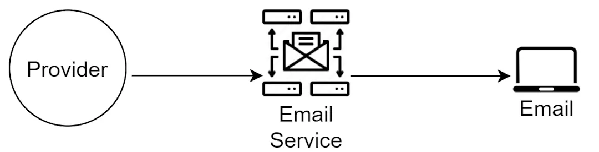


This structure allows for multiple devices per user, enabling notifications to be sent to all of a user's devices. Notification sending/receiving flow We will first present the initial design; then, propose some optimizations. High-level design Figure 9 shows the design, and each system component is explained below. Figure 9 This diagram presents the initial high-level design of the notification sending/receiving flow: 1. Services 1 to N initiate notification requests.

2. These requests go to the Notification System, which processes them and prepares payloads.

3. The Notification System then sends these payloads to the appropriate Third-party Services (APNS, FCM, SMS, Email).

4. Finally, the notifications are delivered to the end-user devices (iOS, Android, SMS, Email). This design, while functional, has limitations in scalability and reliability that are addressed in subsequent iterations. Service 1 to N: A service can be a micro-service, a cron job, or a distributed system that triggers notification sending events. For example, a billing service sends emails to remind customers of their due payment or a shopping website tells customers that their packages will be delivered tomorrow via SMS messages. Notification system: The notification system is the centerpiece of sending/receiving notifications. Starting with something simple, only one notification server is used. It provides APIs for services 1 to N, and builds notification payloads for third party services. Third-party services: Third party services are responsible for delivering notifications to users. While integrating with third-party services, we need to pay extra attention to extensibility. Good extensibility means a flexible system that can easily plugging or unplugging of a third-party service. Another important consideration is that a third-party service might be unavailable in new markets or

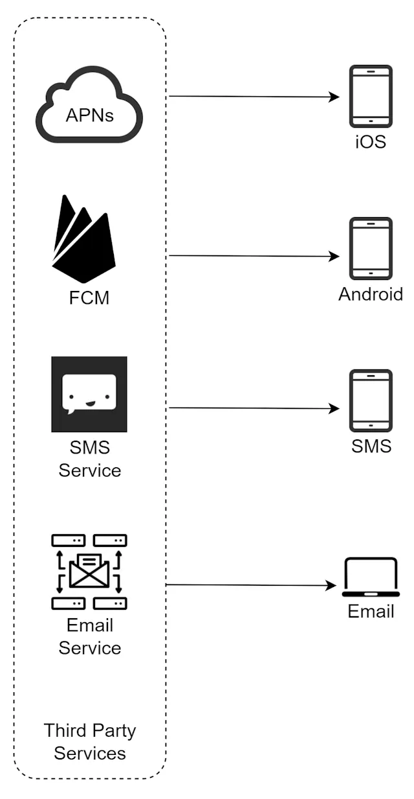


in the future. For instance, FCM is unavailable in China. Thus, alternative third-party services such as Jpush, PushY, etc are used there. iOS, Android, SMS, Email: Users receive notifications on their devices. Three problems are identified in this design: Single point of failure (SPOF): A single notification server means SPOF. Hard to scale: The notification system handles everything related to push notifications in one server. It is challenging to scale databases, caches, and different notification processing components independently. Performance bottleneck: Processing and sending notifications can be resource intensive. For example, constructing HTML pages and waiting for responses from third party services could take time. Handling everything in one system can result in the system overload, especially during peak hours. High-level design (improved) After enumerating challenges in the initial design, we improve the design as listed below: Move the database and cache out of the notification server. Add more notification servers and set up automatic horizontal scaling. Introduce message queues to decouple the system components. Figure 10 shows the improved high-level design. Figure 10 shows an improved high-level design of the notification system: 1. Services 1 to N initiate notification requests to Notification Servers.

2. Notification Servers interact with a Cache and DB for user and device information.

3. Notification data is then placed into specific Message Queues for each notification type.

4. Workers pull from these queues and send notifications to Third-party Services.

5. Third-party Services deliver notifications to end-user devices.

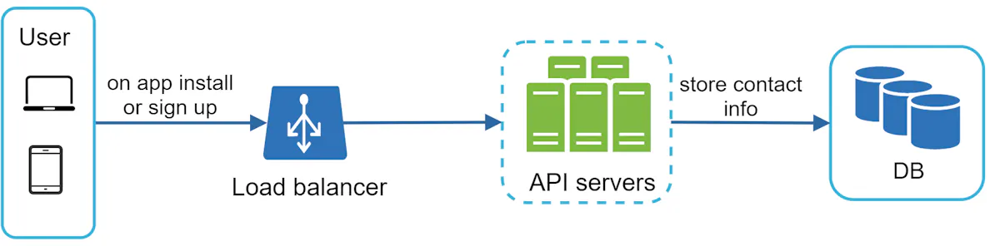


This design improves scalability and reliability by decoupling components and introducing message queues as buffers. The best way to go through the above diagram is from left to right: Service 1 to N: They represent different services that send notifications via APIs provided by notification servers. Notification servers: They provide the following functionalities: Provide APIs for services to send notifications. Those APIs are only accessible internally or by verified clients to prevent spams. Carry out basic validations to verify emails, phone numbers, etc. Query the database or cache to fetch data needed to render a notification. Put notification data to message queues for parallel processing. Here is an example of the API to send an email: POST  https://api.example.com/v/sms/send Request body { "to":[ { "user_id":123456 } ], "from":{ "email":"from_address@example.com" }, "subject":"Hello World!", "content":[ { "type":"text/plain", "value":"Hello, World!" } ] } Cache: User info, device info, notification templates are cached. DB: It stores data about user, notification, settings, etc. Message queues: They remove dependencies between components. Message queues serve as buffers when high volumes of notifications are to be sent out. Each notification type is assigned with a distinct message queue so an outage in one third-party service will not affect other notification types. Workers: Workers are a list of servers that pull notification events from message queues and send them to the corresponding third-party services. Third-party services: Already explained in the initial design.


iOS, Android, SMS, Email: Already explained in the initial design. Next, let us examine how every component works together to send a notification: 1. A service calls APIs provided by notification servers to send notifications.

2. Notification servers fetch metadata such as user info, device token, and notification setting from the cache or database.

3. A notification event is sent to the corresponding queue for processing. For instance, an iOS push notification event is sent to the iOS PN queue.

4. Workers pull notification events from message queues.

5. Workers send notifications to third party services.

6. Third-party services send notifications to user devices.


## Step 3 - Design deep dive

In the high-level design, we discussed different types of notifications, contact info gathering flow, and notification sending/receiving flow. We will explore the following in deep dive: Reliability. Additional component and considerations: notification template, notification settings, rate limiting, retry mechanism, security in push notifications, monitor queued notifications and event tracking. Updated design. Reliability We must answer a few important reliability questions when designing a notification system in distributed environments. How to prevent data loss? One of the most important requirements in a notification system is that it cannot lose data. Notifications can usually be delayed or re-ordered, but never lost. To satisfy this requirement, the notification system persists notification data in a database and implements a retry mechanism. The notification log database is included for data persistence, as shown in Figure 11. APNs iOS PN Workers Notification log Figure 11 focuses on ensuring reliability in iOS push notification delivery:

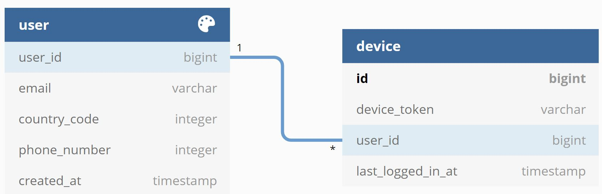


1. The iOS PN (Push Notification) queue feeds into iOS PN Workers.

2. Workers process notifications and send them to APNS.

3. A Notification Log database is introduced to persist notification data. This setup prevents data loss by logging notifications and allows for retry mechanisms in case of delivery failures. Will recipients receive a notification exactly once? The short answer is no. Although notification is delivered exactly once most of the time, the distributed nature could result in duplicate notifications. To reduce the duplication occurrence, we introduce a dedupe mechanism and handle each failure case carefully. Here is a simple dedupe logic: When a notification event first arrives, we check if it is seen before by checking the event ID. If it is seen before, it is discarded. Otherwise, we will send out the notification. For interested readers to explore why we cannot have exactly once delivery, refer to the reference material [5]. Additional components and considerations We have discussed how to collect user contact info, send, and receive a notification. A notification system is a lot more than that. Here we discuss additional components including template reusing, notification settings, event tracking, system monitoring, rate limiting, etc. Notification template A large notification system sends out millions of notifications per day, and many of these notifications follow a similar format. Notification templates are introduced to avoid building every notification from scratch. A notification template is a preformatted notification to create your unique notification by customizing parameters, styling, tracking links, etc. Here is an example template of push notifications. BODY: You dreamed of it. We dared it. [ITEM NAME] is back — only until [DATE]. CTA: Order Now. Or, Save My [ITEM NAME] The benefits of using notification templates include maintaining a consistent format, reducing the margin error, and saving time. Notification setting Users generally receive way too many notifications daily and they can easily feel overwhelmed. Thus, many websites and apps give users fine-grained control over notification settings. This information is stored in the notification setting table, with the following fields: user_id bigInt channel varchar # push notification, email or SMS opt_in boolean # opt-in to receive notification


Before any notification is sent to a user, we first check if a user is opted-in to receive this type of notification. Rate limiting To avoid overwhelming users with too many notifications, we can limit the number of notifications a user can receive. This is important because receivers could turn off notifications completely if we send too often. Retry mechanism When a third-party service fails to send a notification, the notification will be added to the message queue for retrying. If the problem persists, an alert will be sent out to developers. Security in push notifications For iOS or Android apps, appKey and appSecret are used to secure push notification APIs [6]. Only authenticated or verified clients are allowed to send push notifications using our APIs. Interested users should refer to the reference material [6]. Monitor queued notifications A key metric to monitor is the total number of queued notifications. If the number is large, the notification events are not processed fast enough by workers. To avoid delay in the notification delivery, more workers are needed. Figure 12 (credit to [7]) shows an example of queued messages to be processed. Figure 12 graph showing the number of queued messages over time: The x-axis represents time. The y-axis shows the number of queued messages. The graph line fluctuates, indicating varying load on the system. This visualization helps monitor system performance and identify periods when more workers might be needed to process notifications efficiently. Events tracking

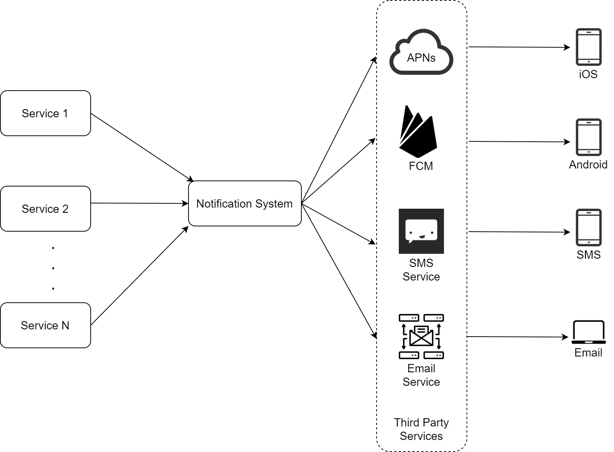


Notification metrics, such as open rate, click rate, and engagement are important in understanding customer behaviors. Analytics service implements events tracking. Integration between the notification system and the analytics service is usually required. Figure 13 shows an example of events that might be tracked for analytics purposes. click start pending sent deliver unsubscribe error Figure 13 illustrates the lifecycle of a notification event for tracking purposes: 1. The process starts with a 'pending' state.

2. It then moves to 'start' when processing begins.

3. 'Sent' indicates the notification has been dispatched.

4. 'Deliver' shows successful delivery to the user's device.

5. 'Click' represents user interaction with the notification.

6. 'Unsubscribe' is a possible user action.

7. 'Error' state captures any failures in the process. Tracking these events allows for analytics on notification effectiveness and system performance. Updated design Putting everything together, Figure 14 shows the updated notification system design. Figure 14 presents the updated, comprehensive design of the notification system: 1. Multiple Services initiate notification requests.

2. These go through Authentication and Rate Limiting at the Notification Servers.

3. Servers interact with Databases and Caches for user and notification data.

4. Notification events are placed in Message Queues.

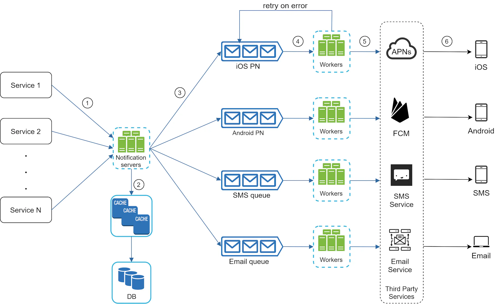


5. Workers process these queues and send to Third-party Services.

6. A Retry Mechanism handles failed notifications.

7. Notifications are delivered to user devices.

8. The system includes Monitoring and Tracking components.

9. Notification Templates are used for consistent formatting. This design addresses scalability, reliability, security, and analytics needs of a robust notification system. In this design, many new components are added in comparison with the previous design. The notification servers are equipped with two more critical features: authentication and rate- limiting. We also add a retry mechanism to handle notification failures. If the system fails to send notifications, they are put back in the messaging queue and the workers will retry for a predefined number of times. Furthermore, notification templates provide a consistent and efficient notification creation process. Finally, monitoring and tracking systems are added for system health checks and future improvements.


## Step 4 - Wrap up

Notifications are indispensable because they keep us posted with important information. It could be a push notification about your favorite movie on Netflix, an email about discounts on new products, or a message about your online shopping payment confirmation. In this chapter, we described the design of a scalable notification system that supports multiple notification formats: push notification, SMS message, and email. We adopted message queues to decouple system components. Besides the high-level design, we dug deep into more components and optimizations. Reliability: We proposed a robust retry mechanism to minimize the failure rate. Security: AppKey/appSecret pair is used to ensure only verified clients can send notifications. Tracking and monitoring: These are implemented in any stage of a notification flow to capture important stats. Respect user settings: Users may opt-out of receiving notifications. Our system checks user settings first before sending notifications. Rate limiting: Users will appreciate a frequency capping on the number of notifications they receive. Congratulations on getting this far! Now give yourself a pat on the back. Good job! Reference materials


[1] Twilio SMS: SMS API | Twilio [2] Nexmo SMS: Business Phone, VoIP, Communication APIs, Contact Center | Vonage [3] Sendgrid: https://sendgrid.com/ [4] Mailchimp: https://mailchimp.com/ [5] You Cannot Have Exactly-Once Delivery: You Cannot Have Exactly-Once Delivery – Brave New Geek [6] Security in Push Notifications: IBM Push Notifiication Securit [7] Key metrics for RabbitMQ monitoring: www.datadoghq.com/blog/rabbitmq-monitoring


## Additional Figures


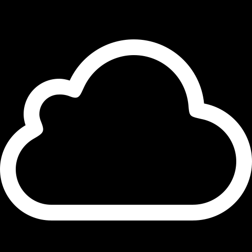

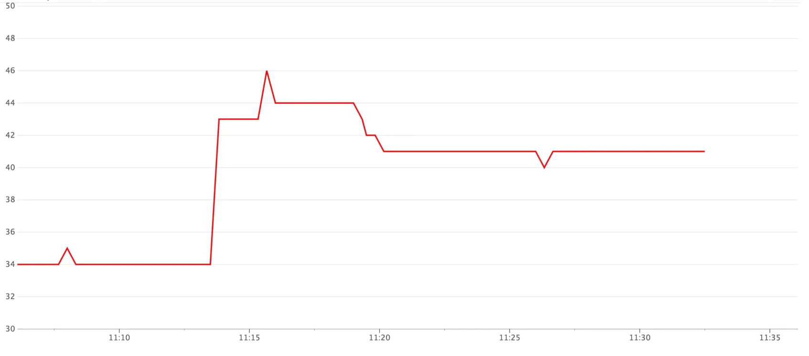

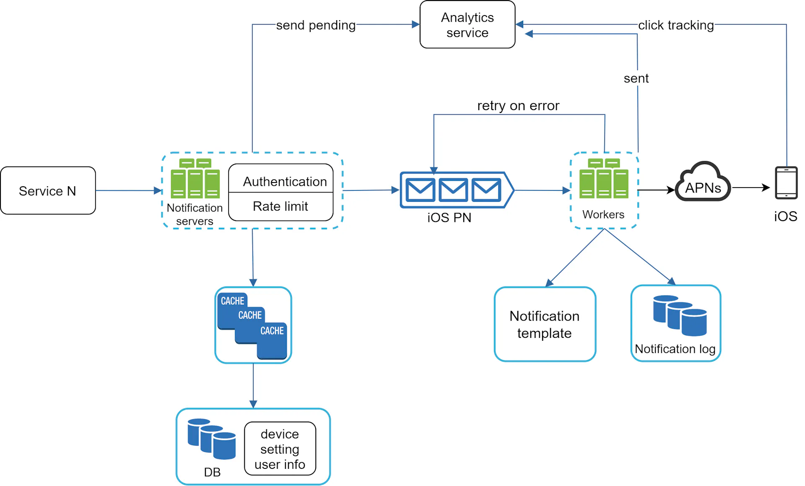
