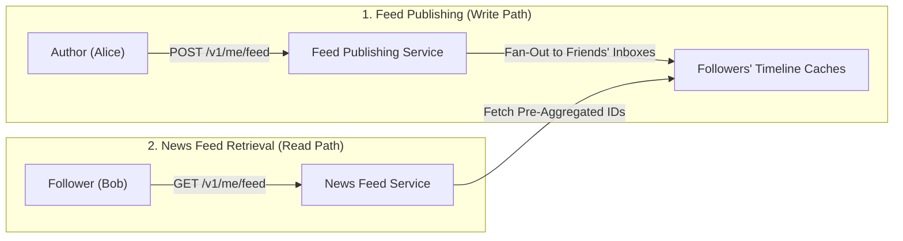
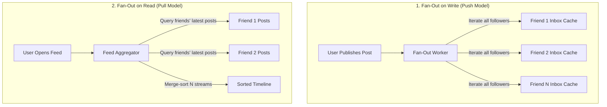
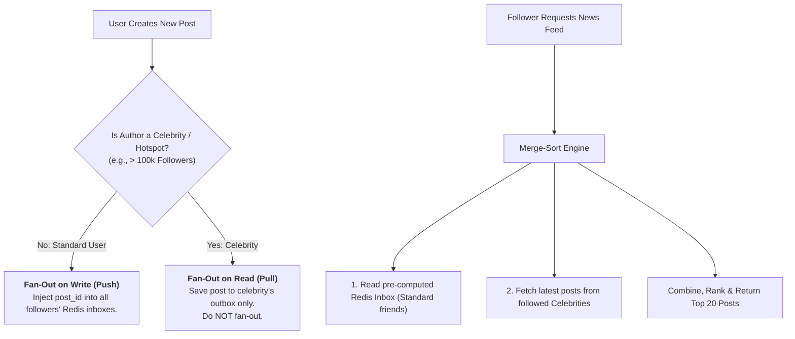
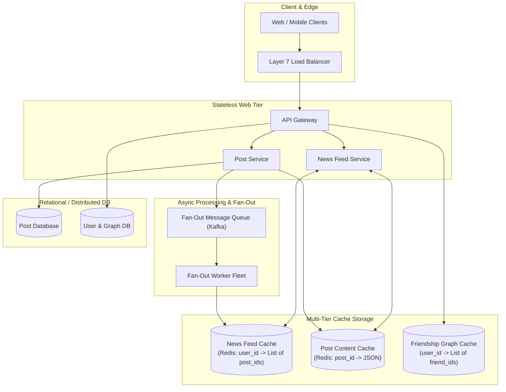
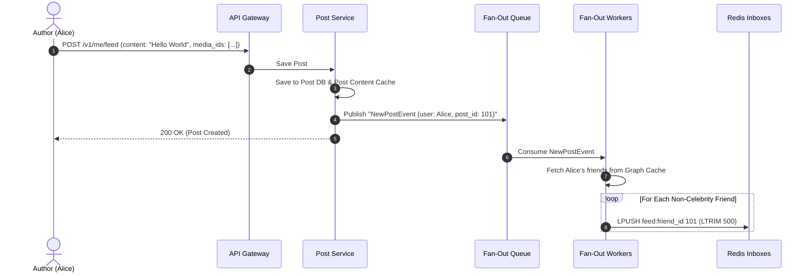
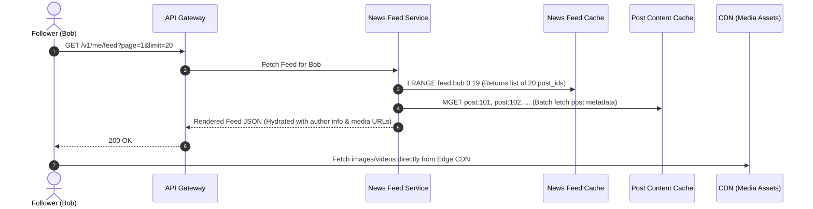
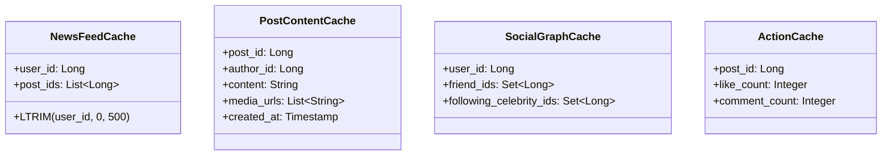
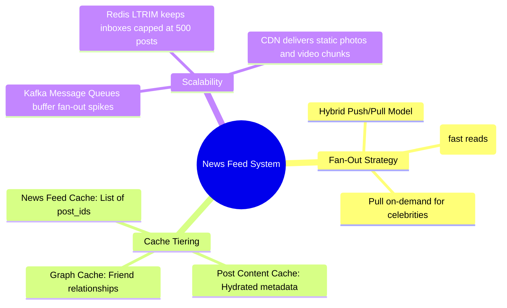

# Design A News Feed System

> **Source**: *System Design Interview – An Insider's Guide: Volume 1* by Alex Xu  
> **ByteByteGo Chapter**: 12  
> **Topic**: Social News Feeds, Fan-Out on Write (Push) vs. Fan-Out on Read (Pull), Multi-Tier Timeline Caching

---

## 1. Understand the Problem and Establish Design Scope

A news feed system aggregates status updates, photos, videos, and activities from friends and followed entities into an interactive, constantly updating timeline (e.g., Facebook News Feed, Twitter Home Timeline, Instagram Feed).

---

### Interview Clarification & Scope

> **Candidate:** What are the primary features supported?  
> **Interviewer:** Users can **publish posts** (text and media) and **view a scrolling news feed** of their friends' posts in reverse chronological order.
>
> **Candidate:** What is the platform scale?  
> **Interviewer:** **10 Million Daily Active Users (DAU)**. An average user has $500$ friends, but celebrity users can have millions of followers.
>
> **Candidate:** What are the latency requirements?  
> **Interviewer:** Loading the news feed should be fast ($< 200\text{ ms}$).

---

### Requirements Summary

#### Functional Requirements
1. **Feed Publishing**: A user creates a post containing text, images, or videos.
2. **News Feed Retrieval**: A user fetches their personal feed populated by friends' recent posts.
3. **Sorting**: Strict reverse chronological ordering by post creation timestamp.

#### Non-Functional Requirements
- **Low Read Latency**: Feed rendering must complete in $< 200\text{ ms}$.
- **High Availability**: Temporary background worker delays must not disrupt feed reading.
- **Celebrity / Hotspot Defense**: System must handle users with millions of followers without cascading memory exhaustion.

---

## 2. Core Fan-Out Models Comparison

The core architectural decision in feed design is **how and when posts are distributed to followers' timeline inboxes**.

### Trade-Off Comparison Matrix

| Dimension | Fan-Out on Write (Push) | Fan-Out on Read (Pull) | Hybrid Architecture (Recommended) |
|:---|:---|:---|:---|
| **Write Latency** | Slow (High write amplification for large follower counts) | **Instant ($O(1)$ database insert)** | Fast for 99.9% of users |
| **Read Latency** | **Ultra-Fast ($O(1)$ read from Redis list)** | Slow ($O(N)$ multi-table fetch & sort) | **Ultra-Fast ($< 50\text{ ms}$)** |
| **Celebrity Problem** | **Catastrophic** (1 tweet by a celebrity triggers 50M cache writes) | None | **Celebrity posts merged dynamically on read** |
| **Inactive Users** | Wastes memory pushing posts to dormant users | **Zero wasted compute** | Inactive user inboxes evicted via TTL |

---

### The Hybrid Fan-Out Strategy

---

## 3. High-Level Architecture & End-to-End Flows

---

### End-to-End Sequence Flows

#### 1. Feed Publishing Flow

#### 2. News Feed Retrieval Flow

---

## 4. Multi-Tier Cache Architecture

To serve millions of requests with sub-50ms latency, data is partitioned into **specialized cache layers**:

- **News Feed Cache**: Stores only lightweight arrays of `post_id`s (e.g., max 500 post IDs per user $\approx 4\text{ KB}$ per active user).
- **Post Content Cache**: Stores the actual text and media URLs, avoiding redundant storage in every friend's feed list.
- **Social Graph Cache**: Maintains friend relationships for fast follower list retrieval during fan-out.

---

## 5. Architectural Summary

| Subsystem | Architectural Decision | Core Rationale |
|:---|:---|:---|
| **Fan-Out Model** | Hybrid Push-Pull Model | Eliminates write amplification for celebrities while maintaining instant $O(1)$ feed reads for standard users. |
| **Feed Storage** | Redis `ZSET` / `LIST` (ID-only) | Drastically minimizes RAM usage by storing only 64-bit `post_id` pointers in user timelines. |
| **Decoupling** | Asynchronous Kafka Queue | Shields the API write path from slow fan-out operations to thousands of followers. |
| **Media Delivery** | Edge CDN (Cloudflare / CloudFront) | Prevents heavy video/photo downloads from hitting application web servers. |

---

## References

1. Serving Facebook Multifeed: Efficiency and Performance Gains: https://engineering.fb.com/
2. Scaling Twitter: Timelines at Scale: https://blog.twitter.com/engineering/en_us/topics/infrastructure/2013/timelines-at-scale
3. Redis Data Structures as a News Feed: https://redis.io/solutions/use-cases/
