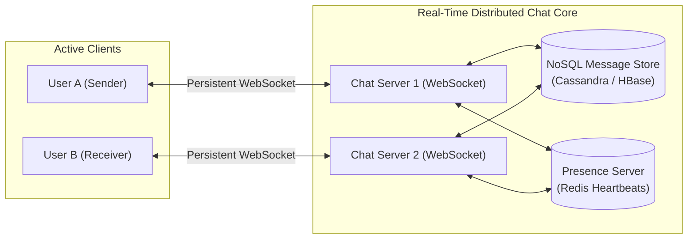
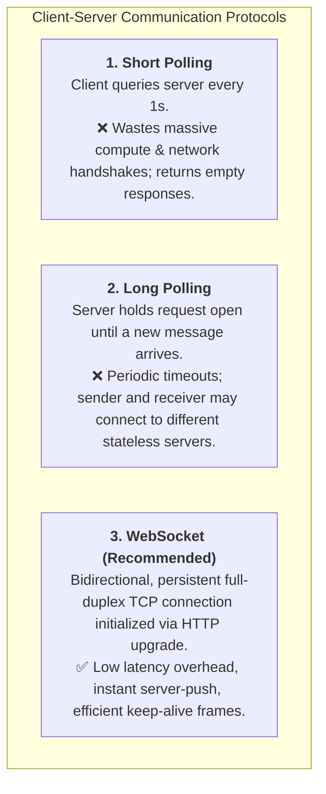
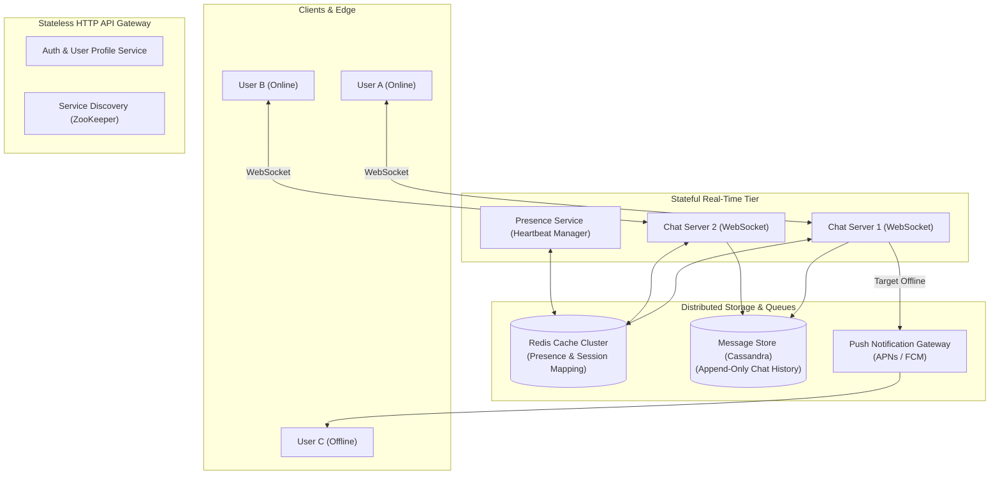
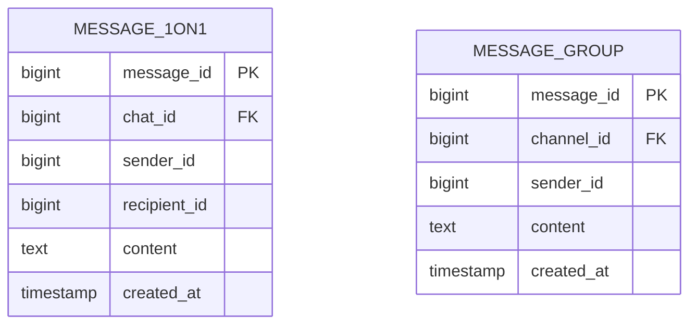
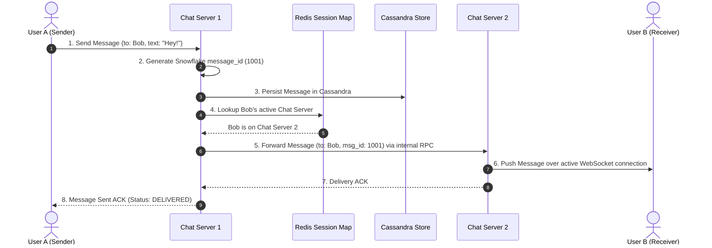
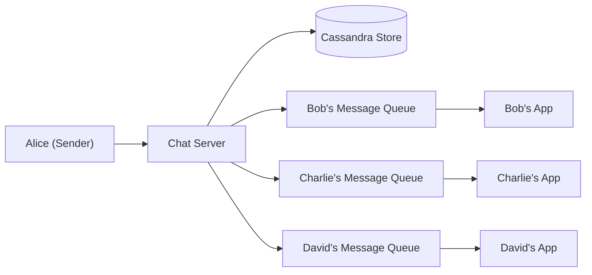
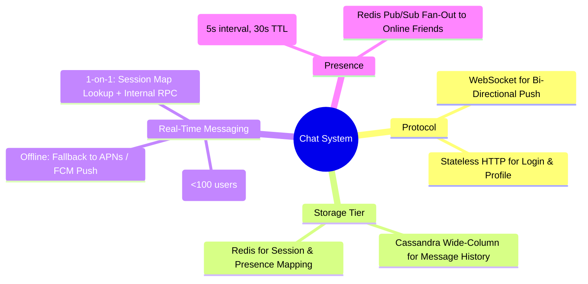

# Design A Chat System

> **Source**: *System Design Interview – An Insider's Guide: Volume 1* by Alex Xu  
> **ByteByteGo Chapter**: 13  
> **Topic**: Real-Time Communication, WebSockets vs. Long-Polling, Presence Service, Multi-Device Synchronization, Message Ordering

---

## 1. Understand the Problem and Establish Design Scope

A modern chat application enables instantaneous text exchange across 1-on-1 conversations and small group chats, maintaining online presence and delivering push alerts when users are offline.



---

### Interview Clarification & Scope

> **Candidate:** What types of chat should the system support?  
> **Interviewer:** Both **1-on-1 private chat** and **group chat (maximum 100 members)**.
>
> **Candidate:** What is the daily scale?  
> **Interviewer:** **50 Million Daily Active Users (DAU)**.
>
> **Candidate:** What are the key features?  
> **Interviewer:** Real-time text messaging, online/offline presence status, multi-device synchronization, and push notifications for offline users. Media attachments are out of scope.
>
> **Candidate:** What are the message retention and latency SLAs?  
> **Interviewer:** Store chat history permanently; message delivery latency must be **$< 100\text{ ms}$**.

---

## 2. Communication Protocols: Polling vs. WebSocket



---

## 3. High-Level Architecture

The system decouples into **stateless services** (HTTP REST for auth, profile, discovery) and **stateful services** (persistent WebSocket chat servers and presence servers).


**Diagram:** Redis maps recipients to active WebSocket servers, while Cassandra provides durable message history and the push gateway handles offline recipients. [Open the interactive chat architecture diagram](resources/13-chat-system/chat-system-architecture.html).



---

## 4. Data Models & Storage Architecture

### Why Key-Value / Wide-Column NoSQL (Cassandra)?
1. **Chat Read-to-Write Ratio**: High write volume ($1:1$ or $1:2$ read/write).
2. **Access Patterns**: Users fetch recent messages sequentially ($O(1)$ range scans on partition key `chat_id` sorted by `message_id`).
3. **Horizontal Scaling**: Scales linearly across petabytes of historical chat logs.



> [!NOTE]
> `message_id` is a 64-bit Snowflake integer that is **monotonically increasing per chat session**, guaranteeing strict chronological message ordering across devices.

---

## 5. Design Deep Dive

### 1. 1-on-1 Message Delivery Flow



---

### 2. Small Group Chat Delivery (Max 100 Members)

For small groups ($\le 100\text{ members}$), a **Message Sync Queue per Member** model provides low latency:



- Each user has a message inbox queue. When Alice sends a message to the group, the chat server copies the message into Bob, Charlie, and David's inboxes.
- For WeChat and WhatsApp, this model is fast and eliminates complex group locking.

---

### 3. Online Presence & Heartbeat Engine

```mermaid
flowchart TD
    CLIENT["Client Device"] -->|1. Heartbeat Ping every 5s| PRESENCE_SVC["Presence Service"]
    PRESENCE_SVC -->|2. SET user:101:online = 1 (TTL: 30s)| REDIS[("Redis Presence Store")]
    
    CLIENT -.->|Network Drops / No Ping for 30s| EXPIRE["Redis Key Expires"]
    EXPIRE --> PUBLISH["Publish User 101 OFFLINE Event via Redis Pub/Sub"]
    PUBLISH --> FRIENDS["Notify Connected Friends"]
```

- **Heartbeat Mechanism**: Client sends a heartbeat ping to the presence server every $5\text{ seconds}$.
- **Status Expiration**: If no heartbeat is received within $30\text{ seconds}$, the presence status automatically transitions to **Offline**.

---

## 6. Wrap Up & Summary

### Architectural Summary Mindmap



| Component | Design Choice | Core Rationale |
|:---|:---|:---|
| **Protocol** | WebSockets | Full-duplex persistent connection minimizes TCP handshake latency. |
| **Message Store** | Apache Cassandra | High-velocity append-only writes with sequential chronological reads. |
| **Session Routing** | Redis Global Session Map | Instantly maps `user_id -> chat_server_ip` for cross-node message forwarding. |
| **Presence** | Heartbeat Lease with 30s TTL | Prevents false offline flaps caused by brief mobile network disconnections. |

---

## References

1. Erlang at Facebook (Chat System Architecture): https://www.infoq.com/presentations/erlang-facebook/
2. Discord: How Discord Scaled to 5,000,000 Concurrent Users: https://discord.com/blog/how-discord-scaled-elixir-to-5-000-000-concurrent-users
3. Apache Cassandra for Messaging Workloads: https://cassandra.apache.org/
