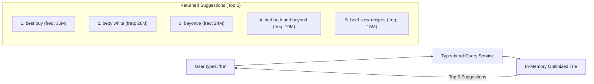
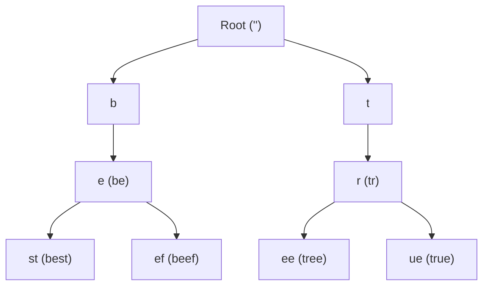
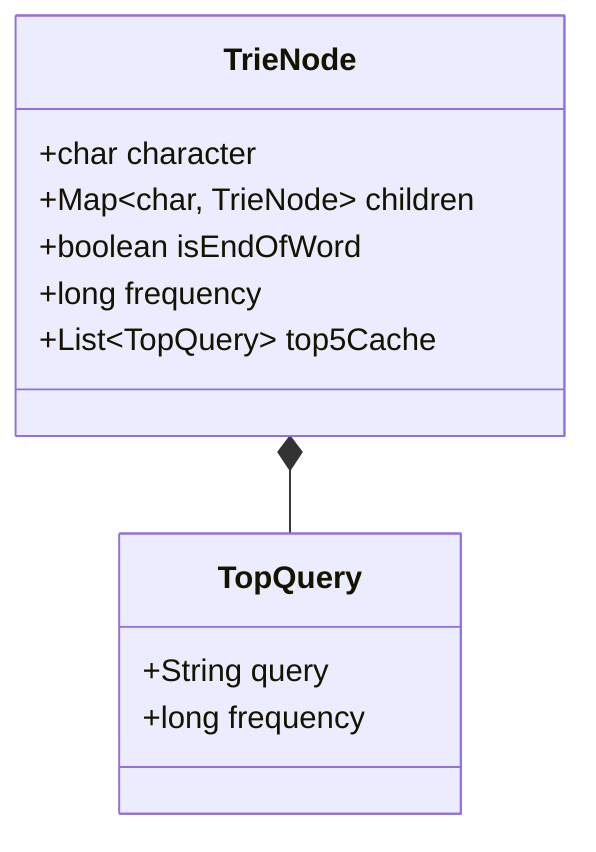
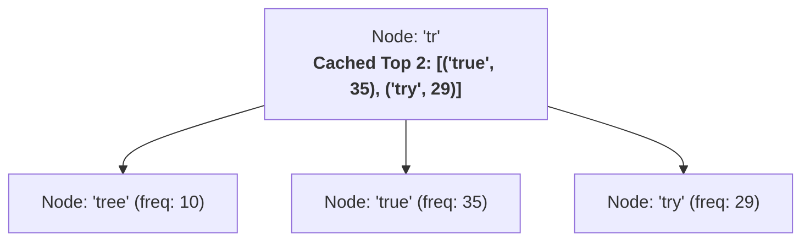
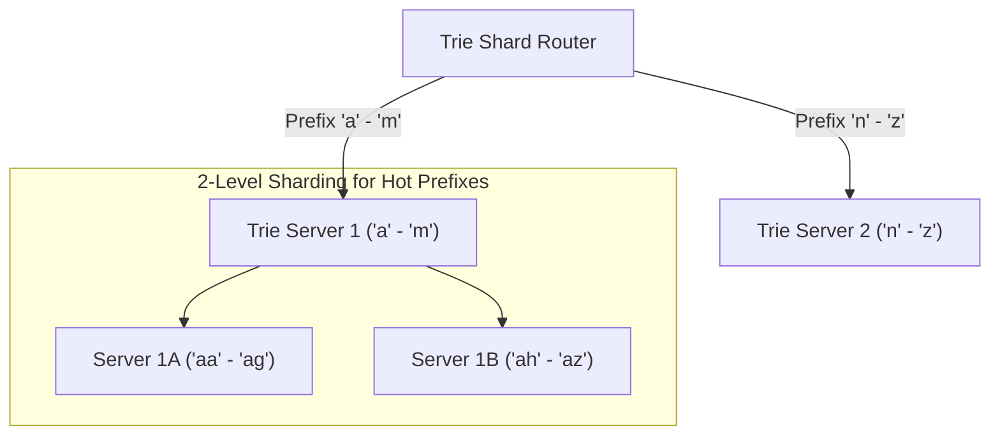

# Design A Search Autocomplete System

> **Source**: *System Design Interview – An Insider's Guide: Volume 1* by Alex Xu  
> **ByteByteGo Chapter**: 14  
> **Topic**: Typeahead Search, Prefix Tree (Trie) Optimizations, Node-Level Top-K Caching, Offline MapReduce Pipelines

---

## 1. Understand the Problem and Establish Design Scope

A search autocomplete (typeahead) system suggests the top $K$ most relevant and popular completed queries in real time as the user types each character into a search box.



---

### Interview Clarification & Scope

> **Candidate:** Does the prefix matching apply to anywhere in the query or only the beginning?  
> **Interviewer:** Only matching at the **beginning of the query string**.
>
> **Candidate:** How many autocomplete suggestions should be returned?  
> **Interviewer:** Top **$5$ suggestions**, ranked by historical search frequency/popularity.
>
> **Candidate:** What is the daily scale and latency SLA?  
> **Interviewer:** **10 Million Daily Active Users (DAU)**. Autocomplete results must appear in **$< 100\text{ ms}$**.
>
> **Candidate:** Can we assume queries are normalized to English lowercase letters?  
> **Interviewer:** Yes, lowercase alphabetic characters `[a-z]` for simplicity.

---

### Back-of-the-Envelope Estimation

- **Daily Active Users (DAU)**: $10\text{ Million}$
- **Queries per User per Day**: $10\text{ searches}$
- **Keystrokes per Query**: On average, a user sends an autocomplete request per keystroke ($\approx 20\text{ requests per full query}$).

$$\text{Total Daily Autocomplete Requests} = 10\text{M users} \times 10\text{ queries} \times 20\text{ keystrokes} = \mathbf{2{,}000{,}000{,}000\text{ requests/day}}$$

$$\text{Average Query QPS} = \frac{2\times 10^9}{86{,}400\text{ sec}} \approx \mathbf{24{,}000\text{ QPS}}$$

$$\text{Peak Query QPS} = 2 \times \text{Average QPS} \approx \mathbf{48{,}000\text{ QPS}}$$

---

## 2. Core Data Structure: Optimized Prefix Tree (Trie)

A **Trie (Prefix Tree)** organizes string characters hierarchically where each node represents a character, and paths from the root form words.



---

### 1. Unoptimized vs. Optimized Trie Lookup

#### Naive Trie Traversal ($O(p + c + c \log c)$)
1. Find prefix node of length $p \implies O(p)$.
2. Traverse entire child subtree with $c$ nodes $\implies O(c)$.
3. Sort all child queries to extract top $K \implies O(c \log c)$.
- **Problem**: When a prefix has millions of children (e.g., prefix `"a"`), traversing and sorting the subtree in real time violates the $100\text{ ms}$ latency budget.

---

#### Optimization 1: Max Prefix Length Constraint ($p \le 50$)
- Real-world users rarely type more than $50$ characters. Limiting prefix search depth caps the initial search at $O(1)$.

#### Optimization 2: Pre-Computed Top-$K$ Caching at Every Node ($O(1)$)
- Store a pre-sorted list of the **Top 5 search queries directly inside each Trie node**.





$$\mathbf{\text{Optimized Retrieval Complexity}} = O(\text{prefix length}) + O(1\text{ Cache Read}) \approx \mathbf{O(1)\text{ Instant Time!}}$$

---

## 3. High-Level Architecture & Two Core Pipelines

The system separates into a **Real-Time Query Service** and an **Offline Data Gathering & Trie Aggregation Pipeline**:

```mermaid
flowchart TD
    subgraph QueryPath["1. Real-Time Query Path (< 10 ms)"]
        CLIENT["Client Browser / Mobile"] -->|1. GET /v1/search/suggest?q=be| LB["Load Balancer"]
        LB --> GW["Typeahead API Servers"]
        GW <--> CACHE[("Distributed Trie Cache<br/>(Redis / In-Memory Shards)")]
    end

    subgraph DataPipeline["2. Offline Aggregation & Ingestion Pipeline"]
        LOGS["Search Query Log Stream (Kafka)"] --> AGG["Log Aggregator (Flink / Spark)"]
        AGG --> DB_FREQ[("Weekly Query Frequency DB<br/>(Cassandra / ClickHouse)")]
        DB_FREQ --> MAPREDUCE["MapReduce / Spark Trie Builder"]
        MAPREDUCE --> SNAPSHOT[("Trie Snapshots (S3 / HDFS)")]
        SNAPSHOT -->|Periodic Reload (Weekly)| CACHE
    end
```

---

## 4. Design Deep Dive

### 1. Scaling the Trie (Horizontal Sharding)

When the entire global search vocabulary cannot fit on a single server, the Trie is sharded across multiple machines:



- **Consistent Hashing**: Route queries by `hash(prefix)` to ensure balanced distribution across Trie cache servers.

---

### 2. Fast Client-Side Optimizations

1. **AJAX Debouncing**: Delay sending search API calls until the user stops typing for $50\text{–}100\text{ ms}$ (eliminates up to $70\%$ of intermediate network requests).
2. **Browser Cache (`Cache-Control`)**: Cache autocomplete responses in the browser for $1\text{ hour}$ (e.g., subsequent typing of `"goog"` instantly resolves locally).

---

## 5. Architectural Summary

```mermaid
mindmap
  root((Search Autocomplete))
    Data Structure
      Trie with max depth = 50
      Pre-computed Top-5 queries cached per node
      O(1) instant lookup time
    Architecture
      Stateless Query API + In-Memory Trie Cache
      Offline Batch Ingestion (Kafka + Spark)
      Consistent Hashing Shard Router
    Client Optimization
      Client-side Debouncing (100ms)
      Browser HTTP Caching
```

| Subsystem | Architectural Decision | Core Benefit |
|:---|:---|:---|
| **Data Structure** | Trie with Node-Level Top 5 Cache | Reduces suggestion retrieval from $O(c \log c)$ to instant $O(1)$. |
| **Data Ingestion** | Offline Weekly MapReduce Aggregation | Isolates analytical log processing from real-time search queries. |
| **Scalability** | Sharded In-Memory Trie Cluster | Distributes memory footprint and query load linearly across servers. |
| **Client Efficiency**| Client-Side Debouncing | Prevents millions of redundant intermediate keystroke requests from hitting backend servers. |

---

## References

1. Trie Prefix Tree Data Structure: https://en.wikipedia.org/wiki/Trie
2. Google Search Autocomplete Architecture: https://blog.google/products/search/how-google-autocomplete-works-search/
3. Building a Real-Time Autocomplete System: https://medium.com/@prefixyteam/how-we-built-prefixy-a-scalable-prefix-search-service-for-autocomplete-d34e62a03cf6
