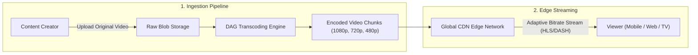
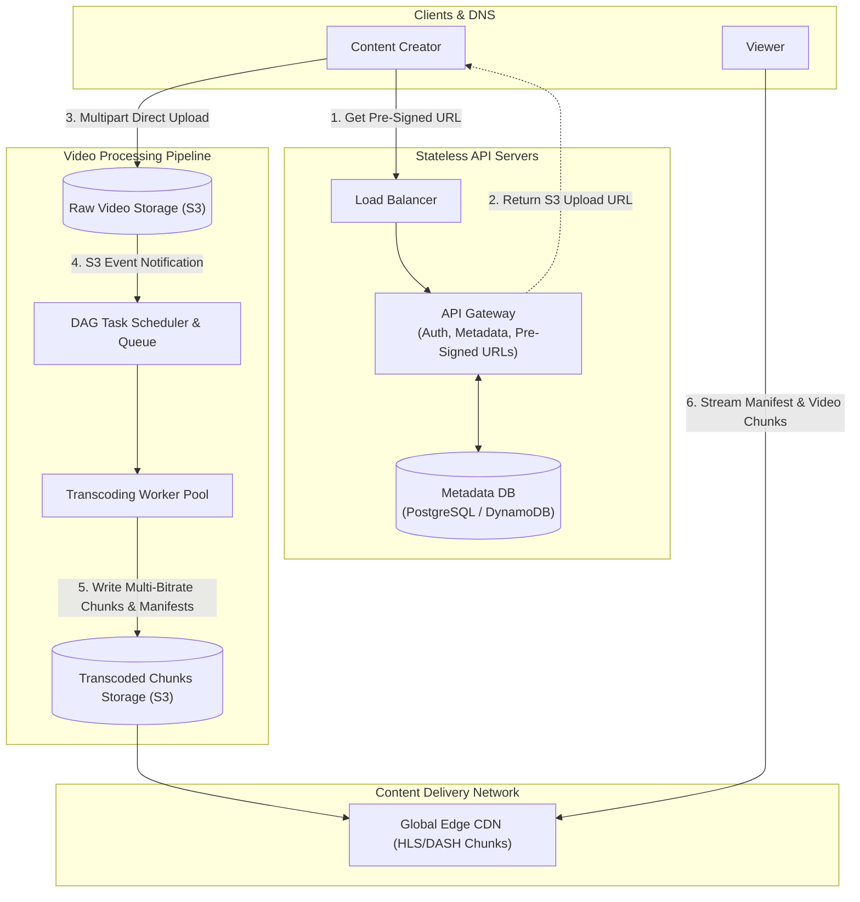
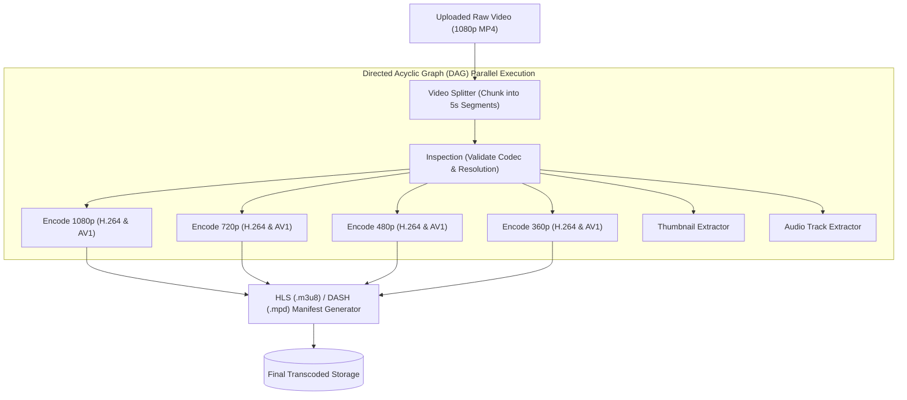
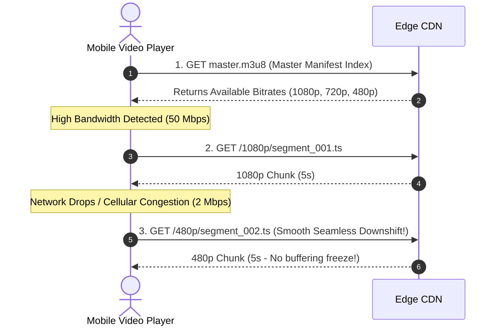
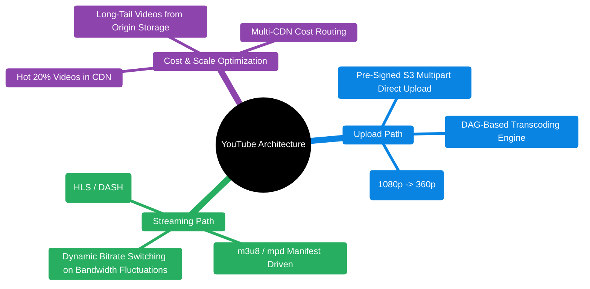

# Design YouTube

> **Source**: *System Design Interview – An Insider's Guide: Volume 1* by Alex Xu  
> **ByteByteGo Chapter**: 15  
> **Topic**: Video Ingestion & Transcoding Pipelines, Adaptive Bitrate Streaming (HLS/DASH), CDN Bandwidth Cost Optimization, DAG Schedulers

---

## 1. Understand the Problem and Establish Design Scope

A video streaming platform enables content creators to upload high-definition videos and allows global viewers to stream content adaptively across diverse network conditions and device resolutions.

---

### Interview Clarification & Scope

> **Candidate:** What are the primary features to support?  
> **Interviewer:** **Video uploading** and **smooth video streaming** across multiple resolutions. Comments and likes are out of scope.
>
> **Candidate:** What client platforms must be supported?  
> **Interviewer:** Web browsers, mobile apps (iOS/Android), and Smart TVs.
>
> **Candidate:** What is the daily scale and video size limit?  
> **Interviewer:** **5 Million Daily Active Users (DAU)**; maximum video file size is **1 GB** (average $300\text{ MB}$).
>
> **Candidate:** Can we leverage cloud infrastructure?  
> **Interviewer:** Yes, leverage cloud object storage (S3) and global CDNs (CloudFront/Akamai).

---

### Back-of-the-Envelope Estimation

| Metric / Dimension | Calculation | Estimated Value |
|:---|:---|:---|
| **Daily Active Users (DAU)** | Given | $5{,}000{,}000\text{ DAU}$ |
| **Daily Video Uploads (10% DAU)** | $5\text{M} \times 10\%$ | $500{,}000\text{ videos uploaded/day}$ |
| **Daily Storage Requirement** | $500\text{K} \times 300\text{ MB}$ | $\mathbf{150\text{ TB/day}}$ |
| **5-Year Raw Storage Capacity** | $150\text{ TB} \times 365 \times 5$ | $\approx \mathbf{273\text{ PB}}$ |
| **Daily Video Views (5 views/user)** | $5\text{M} \times 5$ | $25{,}000{,}000\text{ video views/day}$ |
| **Daily CDN Outflow Bandwidth** | $25\text{M views} \times 300\text{ MB} \times 8\text{ bits} / 86{,}400$ | $\approx \mathbf{694\text{ Gbps Egress}}$ |

---

## 2. High-Level Architecture & End-to-End Pipelines

---

## 3. Video Transcoding Pipeline (DAG Architecture)

Raw video formats (e.g., $1\text{ GB}$ ProRes/AVI) cannot be streamed directly to mobile devices. Videos must be encoded into multiple resolutions and modern codecs (H.264, VP9, AV1) split into **$2\text{–}10\text{ second chunks}$** for **Adaptive Bitrate Streaming (HLS/DASH)**.

---

## 4. Adaptive Bitrate Streaming Protocols

Modern streaming relies on **Adaptive Bitrate (ABR)**: the client's video player continuously measures network bandwidth and dynamically switches video quality chunk-by-chunk.

### Protocol Comparison

| Protocol | Developer / Standard | Transport | Video Container | Supported Devices |
|:---|:---|:---|:---|:---|
| **Apple HLS** | Apple | HTTP/S | MPEG-2 TS / fMP4 | iOS, macOS, Safari, Android, Smart TVs |
| **MPEG-DASH** | ISO / MPEG Standard | HTTP/S | ISO Base Media (fMP4) | Android, Chrome, Smart TVs, Xbox |
| **Microsoft Smooth Streaming**| Microsoft | HTTP/S | MP4 Fragmented | Windows, Silverlight, Xbox |

---

## 5. Design Deep Dive: Performance & Cost Optimizations

### 1. Direct Client-to-S3 Upload with Pre-Signed URLs
- **Problem**: Uploading $1\text{ GB}$ videos through application API servers saturates backend network interfaces and ties up server worker threads.
- **Solution**: The client requests a **Pre-Signed S3 Upload URL** from the API server, then streams video chunks directly to S3 via HTTP `PUT` multipart upload.

---

### 2. CDN Bandwidth Cost Optimization (The 80/20 Long-Tail Rule)
- **Problem**: Streaming $694\text{ Gbps}$ directly through public CDN egress costs millions of dollars per month.
- **Cost-Reduction Tactics**:
  1. **Hot vs. Cold Caching**: Cache only the top $20\%$ of popular videos in high-cost CDN edges; serve the remaining $80\%$ long-tail videos directly from optimized low-cost origin video storage.
  2. **Multi-CDN Routing**: Dynamically route video traffic to the most cost-effective CDN provider based on real-time pricing and ISP peering agreements.
  3. **P2P Streaming Assistance**: For live streams with millions of concurrent viewers, leverage WebRTC peer-to-peer chunk sharing among nearby devices.

---

## 6. Architectural Summary

| Subsystem | Architectural Decision | Core Rationale |
|:---|:---|:---|
| **Upload Flow** | Pre-Signed S3 Direct Upload | Eliminates intermediate API server bottlenecks and handles parallel multipart uploads. |
| **Transcoding** | DAG Distributed Scheduler | Enables independent, fault-tolerant parallel processing of video resolutions and audio tracks. |
| **Streaming Protocol** | Apple HLS / MPEG-DASH | Enables smooth, buffer-free playback that adapts dynamically to client network bandwidth. |
| **Edge Delivery** | Multi-CDN Edge Tiering | Minimizes latency globally while slashing egress bandwidth costs. |

---

## References

1. Apple HTTP Live Streaming (HLS) Specification: https://developer.apple.com/streaming/
2. Netflix: High Quality Video Encoding at Scale: https://netflixtechblog.com/high-quality-video-encoding-at-scale-d159f3136ced
3. Building a Video Transcoding Pipeline with AWS Step Functions and S3: https://aws.amazon.com/solutions/implementations/video-on-demand-on-aws/