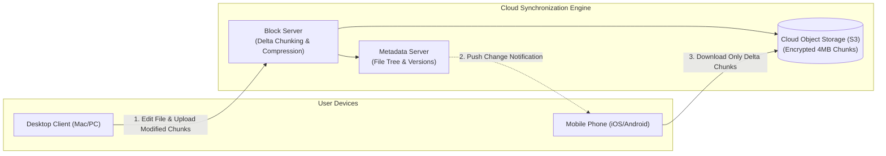
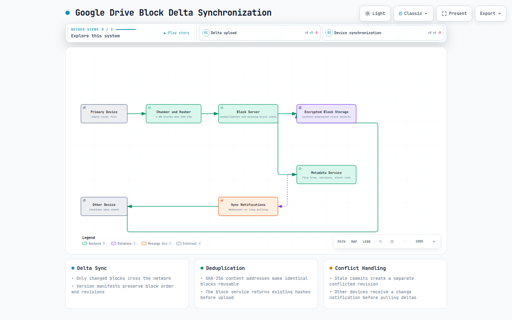
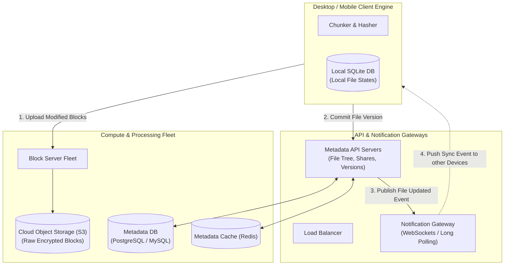
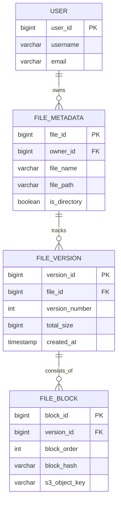
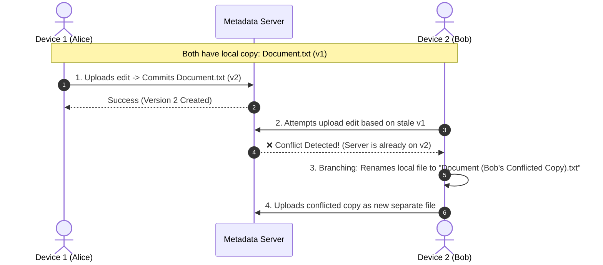
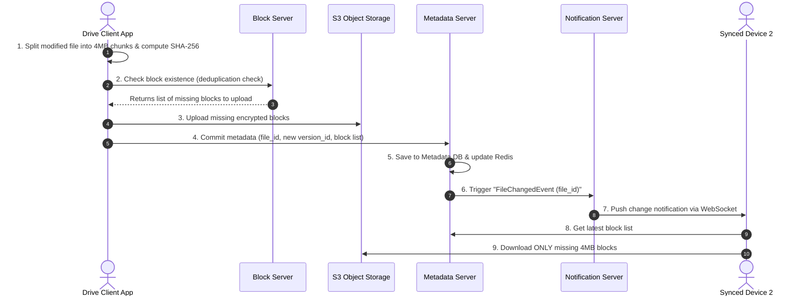
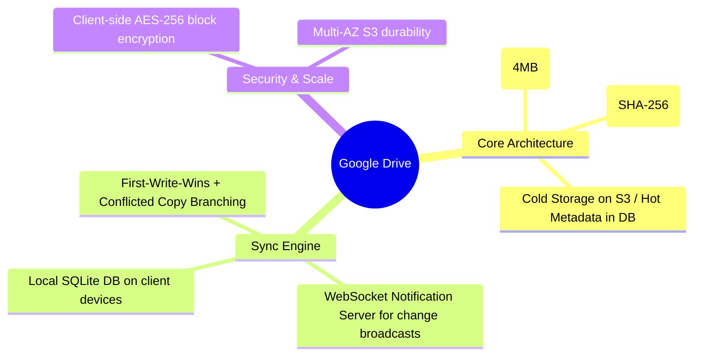

# Design Google Drive

> **Source**: *System Design Interview – An Insider's Guide: Volume 1* by Alex Xu  
> **ByteByteGo Chapter**: 16  
> **Topic**: Cloud Storage, Block-Level Delta Synchronization, Content-Addressable Deduplication, File Revision Trees

---

## 1. Understand the Problem and Establish Design Scope

Google Drive and Dropbox allow users to store files securely in the cloud, synchronize modifications across multiple devices (desktop, mobile, web), track version history, and collaborate via shared folders.





[Open the interactive Archify diagram](resources/google-drive/google-drive-delta-sync.html)

---

### Interview Clarification & Scope

> **Candidate:** What are the primary user features?  
> **Interviewer:** **File upload/download**, **cross-device synchronization**, **revision history**, and **change notifications**. Real-time collaborative doc editing (like Google Docs) is out of scope.
>
> **Candidate:** What is the scale and file size limit?  
> **Interviewer:** **10 Million Daily Active Users (DAU)**. Files up to **10 GB** are supported.
>
> **Candidate:** What are the security and bandwidth requirements?  
> **Interviewer:** Files must be encrypted at rest and in transit. Minimize bandwidth consumption using **delta sync and data compression**.

---

### Back-of-the-Envelope Estimation

| Metric / Dimension | Calculation | Estimated Value |
|:---|:---|:---|
| **Registered Users / DAU** | $50\text{M registered} / 10\text{M active}$ | $10{,}000{,}000\text{ DAU}$ |
| **Free Storage Allocation** | $50\text{M users} \times 10\text{ GB free}$ | $\mathbf{500\text{ PB total allocated}}$ |
| **Daily File Uploads** | $10\text{M users} \times 2\text{ uploads/day}$ | $20{,}000{,}000\text{ uploads/day}$ |
| **Average Upload QPS** | $\frac{20{,}000{,}000}{86{,}400\text{ sec}}$ | $\approx \mathbf{240\text{ QPS}}$ |
| **Peak Upload QPS** | $2 \times \text{Average QPS}$ | $\approx \mathbf{480\text{ QPS}}$ |

---

## 2. Core Storage Architecture: Block-Level Delta Synchronization

Uploading entire $10\text{ GB}$ files upon minor text edits wastes massive client bandwidth and saturates network pipes. The system uses **Block-Level Chunking & Delta Sync**:

```mermaid
flowchart TD
    FILE["Original File: Document.pdf (12 MB)"] --> CHUNK["Chunker (Split into 4 MB Blocks)"]
    
    subgraph Blocks["4 MB Content-Addressable Blocks"]
        B1["Block 1 (Hash: 0x8a3f...)"]
        B2["Block 2 (Hash: 0x9b1c...)"]
        B3["Block 3 (Hash: 0x4f2a...)"]
    end
    
    CHUNK --> B1 & B2 & B3

    subgraph EditScenario["User Modifies Only Page 2"]
        EDIT_FILE["Modified File: Document.pdf"] --> EDIT_CHUNK["Re-Chunk"]
        EDIT_CHUNK --> EB1["Block 1 (Hash: 0x8a3f -> Unchanged)"]
        EDIT_CHUNK --> EB2["Block 2 (Hash: 0x7c8e -> <b>MODIFIED!</b>)"]
        EDIT_CHUNK --> EB3["Block 3 (Hash: 0x4f2a -> Unchanged)"]
    end

    EB2 -->|Upload ONLY Modified Block 2 (4 MB)| S3[("Object Storage")]
```

### Key Technical Optimizations
1. **Delta Sync**: Only modified blocks are uploaded and synced across devices, reducing network transfer by $>90\%$.
2. **Deduplication**: Chunks are content-addressed by SHA-256 hash. If another user uploaded the same block, storage is de-duplicated instantly.
3. **Compression & Encryption**: Blocks are compressed using GZIP/Snappy and encrypted with AES-256 before leaving the client.

---

## 3. High-Level Architecture



---

## 4. Metadata Schema & Conflict Resolution

### Relational Storage Schema (MySQL / Spanner)



---

### Conflict Resolution Strategy (First-Write-Wins + Branching)

When two devices edit the same file offline and sync simultaneously:



---

## 5. End-to-End File Upload Sequence Flow



---

## 6. Architectural Summary



| Component | Design Decision | System Benefit |
|:---|:---|:---|
| **Chunking** | 4 MB Fixed Block Chunks | Optimizes network throughput, delta retransmissions, and compression efficiency. |
| **Deduplication** | Content-Addressable SHA-256 Hashing | Eliminates redundant storage of identical files across users. |
| **Synchronization**| WebSocket Notification Engine | Instantly notifies other logged-in devices to pull delta blocks. |
| **Conflict Strategy**| First-Write-Wins with Branching | Prevents silent data overwrites by automatically generating conflicted file copies. |

---

## References

1. How We Scaled Dropbox: https://dropbox.tech/infrastructure/how-we-scaled-dropbox
2. Content-Addressable Storage (CAS): https://en.wikipedia.org/wiki/Content-addressable_storage
3. Rsync Algorithm for Remote Delta Synchronization: https://rsync.samba.org/tech_report/
