# Design Google Drive

> **Source**: System Design Interview – An Insider's Guide by Alex Xu & Sahn Lam (Study Notes)
> **ByteByteGo Chapter**: 16


[

**Toronto Study Group Notes**](/study-notes/)[Notes](/study-notes/notes/)

* [Table of Contents](/study-notes/notes/)
* [System Design Interview: An Insider’s Guide](/study-notes/notes/system-design-interview)

  + [Chapter 1: Scale From Zero to Millions of Users](/study-notes/notes/system-design-interview/ch1)
  + [Chapter 2: BACK-OF-THE-ENVELOPE ESTIMATION](/study-notes/notes/system-design-interview/ch2)
  + [Chapter 3: A FRAMEWORK FOR SYSTEM DESIGN INTERVIEWS](/study-notes/notes/system-design-interview/ch3)
  + [Chapter 4: Design a Rate Limiter](/study-notes/notes/system-design-interview/ch4)
  + [Chapter 5: Design Consistent Hashing](/study-notes/notes/system-design-interview/ch5)
  + [Chapter 6: Design a Key-Value Store](/study-notes/notes/system-design-interview/ch6)
  + [Chapter 7: Design a Unique ID Generator in Distributed Systems](/study-notes/notes/system-design-interview/ch7)
  + [Chapter 8: Design A URL Shortener](/study-notes/notes/system-design-interview/ch8)
  + [Chapter 9: Design a Web Crawler](/study-notes/notes/system-design-interview/ch9)
  + [Chapter 10: Design a Notification System](/study-notes/notes/system-design-interview/ch10)
  + [Chapter 11: Design a News Feed System](/study-notes/notes/system-design-interview/ch11)
  + [Chapter 12: Design a Chat System](/study-notes/notes/system-design-interview/ch12)
  + [Chapter 13: Designing a Search Autocomplete System](/study-notes/notes/system-design-interview/ch13)
  + [Chapter 14: Design YouTube](/study-notes/notes/system-design-interview/ch14)
  + [Chapter 15: DESIGN GOOGLE DRIVE](/study-notes/notes/system-design-interview/ch15)
* [Kubernetes - Up and Running](/study-notes/notes/kubernetes-up-and-running)

* [System Design Interview: An Insider’s Guide](/study-notes/notes/system-design-interview)
* Chapter 15: DESIGN GOOGLE DRIVE


# Chapter 15: DESIGN GOOGLE DRIVE

## Understand Google Drive[​](#understand-google-drive "Direct link to Understand Google Drive")

* Google Drive is a file storage and synchronization service that helps you store documents, photos, videos, and other files in the cloud.
  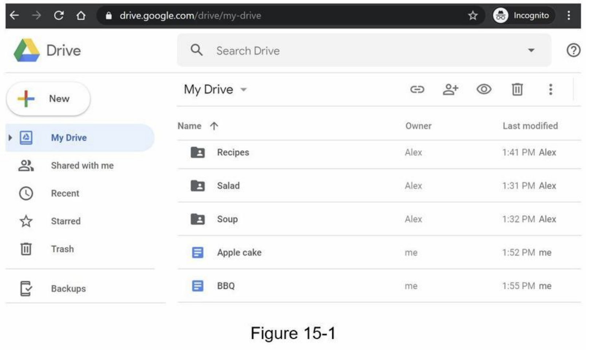
  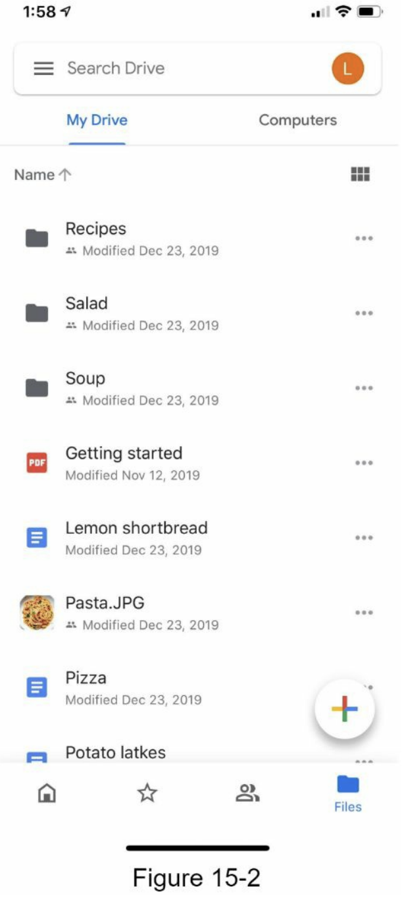

## Step 1 - Understand the problem and establish design scope[​](#step-1---understand-the-problem-and-establish-design-scope "Direct link to Step 1 - Understand the problem and establish design scope")

* requirements
  + features: Upload and download files, file sync, and notifications
  + mobile and web app
  + supported file formats: any file type
  + files are encrypted
  + size limit: `10 GB` or smaller
  + 10M DAU (Daily Active Users)
* Focused features:
  + Add files -> drag and drop
  + Download files
  + Sync files across multiple devices
  + See file revisions
  + Share files
  + Send a notification(edited, deleted, or shared)
* Not included
  + Google doc editing and collaboration

## Back of the envelope estimation[​](#back-of-the-envelope-estimation "Direct link to Back of the envelope estimation")

* assume -> `50` million signed up users and `10` million DA
* Users get `10` GB free space
* Assume users upload `2` files per day. The average file size is `500 KB`
* `1:1` read to write ratio
* Total space allocated: `50 million * 10 GB = 500 Petabyte`
* QPS (Queries Per Second) for upload API: `10 million * 2 uploads / 24 hours / 3600 seconds = ~ 240`
* Peak QPS = QPS \* 2 = `480`

## Step 2 - Propose high-level design and get buy-in[​](#step-2---propose-high-level-design-and-get-buy-in "Direct link to Step 2 - Propose high-level design and get buy-in")

* a single server -> scale it up to support millions of users
* a single server setup
  + web server (Apache web server) -> upload and download files
  + A database (MySql database) -> metadata (user data, login info, files info)
  + A storage system to store files -> 1TB
    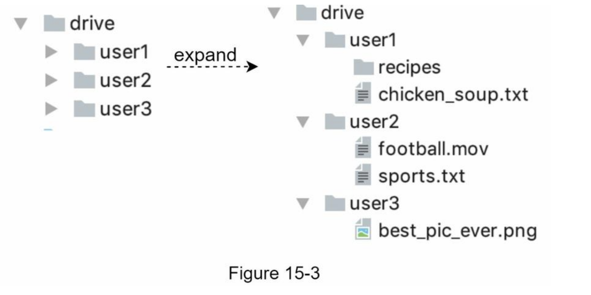

## APIs[​](#apis "Direct link to APIs")

* 3 APis: upload a file, download a file, and get
  file revisions
* user authentication and use HTTPS
* **1. Upload a file to Google Drive**
  + Two types of uploads are supported:
    - Simple upload -> file size is small
    - Resumable upload -> file size is large and there is high chance of network interruption
  + example: `https://api.example.com/files/upload?uploadType=resumable`
  + params:
    - uploadType=resumable
    - data: Local file to be uploaded
  + 3 steps of resumable uploading
    - Send the initial request to retrieve the resumable URL.
    - Upload the data and monitor upload state.
    - If upload is disturbed, resume the upload.
* **2. Download a file from Google Drive**
  + example: `https://api.example.com/files/download`
  + params:
    - path: download file path.
    - example:

      ```
      ```
      {
        "path": "/recipes/soup/best_soup.txt"
      }
      ```
      ```
* **3. Get file revisions**
  + example:  `https://api.example.com/files/list_revisions`
  + params:
    - path: The path to the file you want to get the revision history.
    - limit: The maximum number of revisions to return.
    - example:

      ```
      ```
      {
        "path": "/recipes/soup/best_soup.txt",
        "limit": 20
      }
      ```
      ```

## Move away from single server[​](#move-away-from-single-server "Direct link to Move away from single server")

* Not enough space
  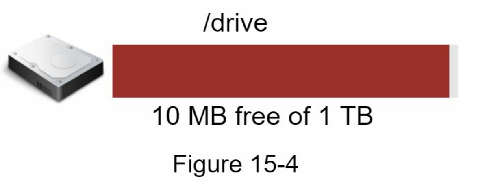
* sharding based on user\_id -> potential data losses in case of storage server outage
  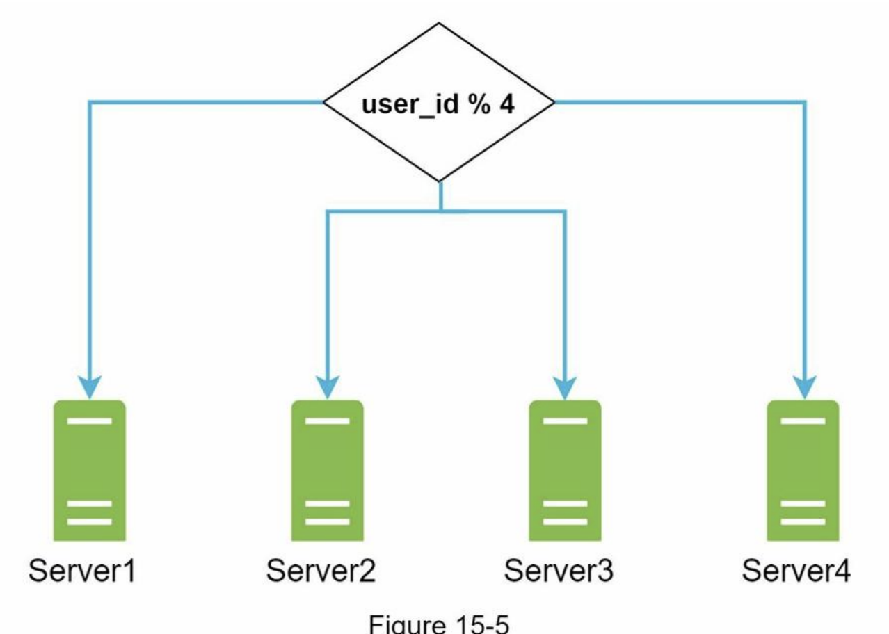
* Amazon S3 supports same-region and cross-region replication
  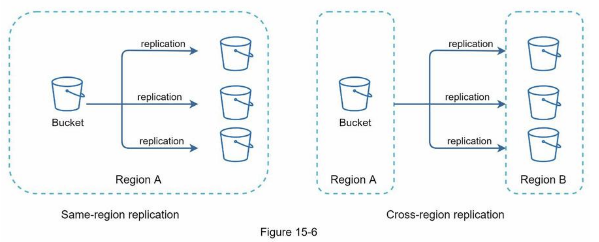
* decoupled web servers, metadata database, and file storage from a single server
  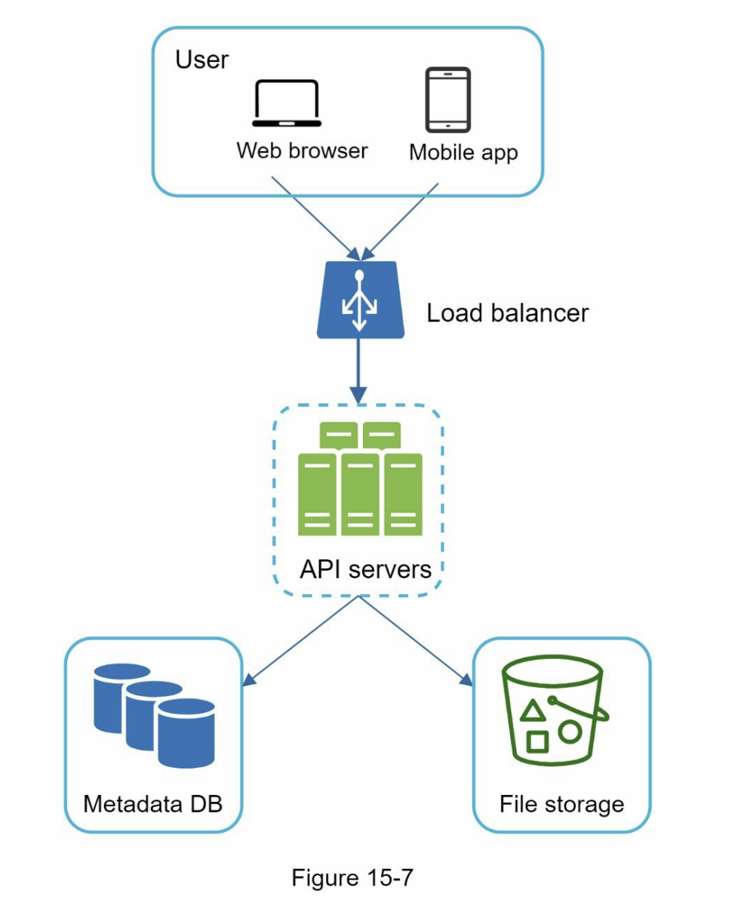

## Sync conflicts[​](#sync-conflicts "Direct link to Sync conflicts")

* **our strategy: the first version that gets processed wins, and the version that gets processed later receives a conflict**
  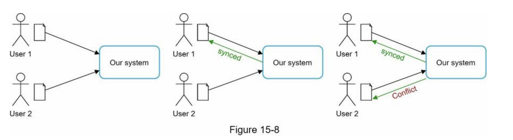
* User 2 has the option to merge both files or override one version with the other.
  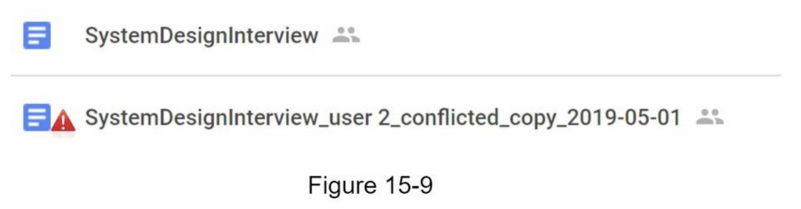

## High-level design[​](#high-level-design "Direct link to High-level design")

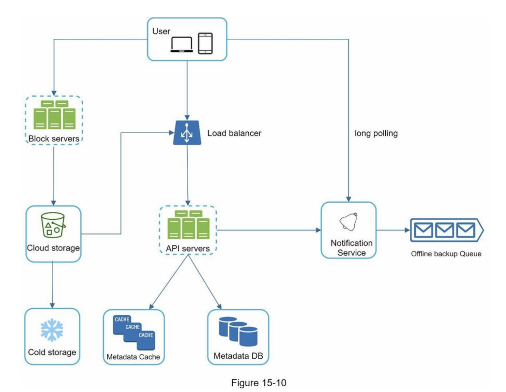

* **Block servers**
  + upload blocks to cloud storage
  + block-level storage
  + A file can be split into several blocks -> each with a unique hash value -> stored in our metadata database
  + independent object -> stored in S3
  + reconstruct a file -> are joined in a particular order
  + the block size (e.g. Dropbox): maximal size of a block to `4MB`
* **Cloud storage**
  + A file is split into smaller blocks and stored in cloud storage.
* **Cold storage**
  + storing inactive data (files are not accessed for a long time)
* **Load balancer**
  + evenly distributes requests
* **API servers**
  + other than the uploading flow
  + user authentication, managing user profile, updating file metadata, etc.
* **Metadata database**
  + metadata of users, files, blocks, versions, etc
* **Metadata cache**
  + Some of the metadata are cached for fast retrieval.
* **Notification service**
  + publisher/subscriber system
  + notifies relevant clients when a file is added/edited/removed elsewhere so they can pull the latest changes
* **Offline backup queue**
  + a client is offline -> the offline backup queue stores the info -> changes will be synced when the client is online

## Step 3 - Design deep dive[​](#step-3---design-deep-dive "Direct link to Step 3 - Design deep dive")

* **Block servers**
  + large files -> minimize the amount of network traffic being transmitted
    - **Delta sync**. When a file is modified, only modified blocks are synced instead of the whole file using a sync algorithm
    - **Compression** -> using compression algorithms depending on file types
      * e.g. gzip and bzip2 are used to compress text files
  + block server
    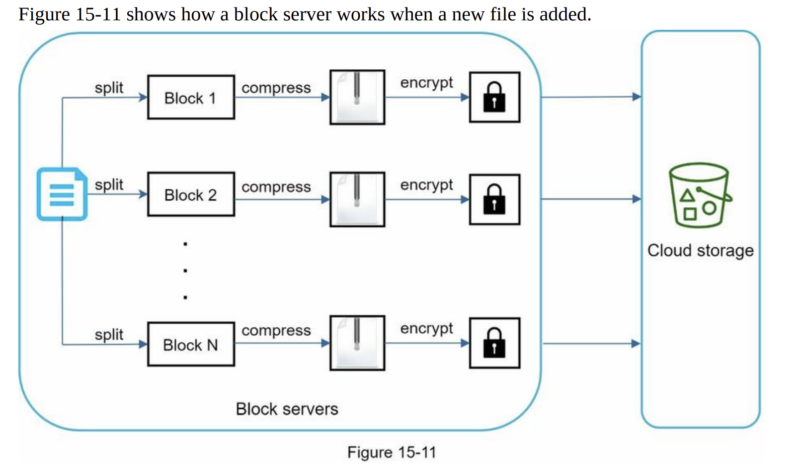
  + Instead of uploading the whole file to the storage system, only modified blocks are transferred -> save network traffic by providing delta sync and compression
    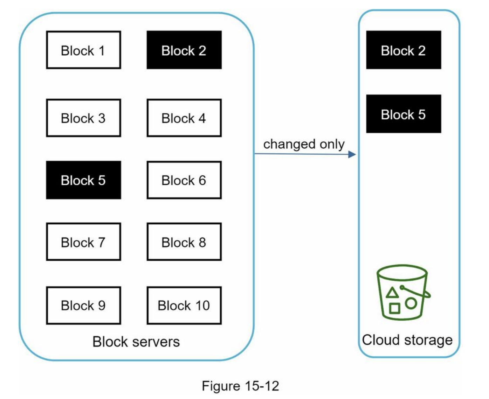
* **High consistency requirement**
  + Memory caches adopt an eventual consistency model by default -> different replicas might have different data.
  + To achieve strong consistency, ensure:
    - Data in cache replicas and the master is consistent
    - Invalidate caches on database write to ensure cache and database hold the same value.
  + a relational database -> strong consistency -> because ACID (Atomicity, Consistency, Isolation, Durability) => we choose it in our design
  + NoSQL databases -> not support ACID -> must be programmatically incorporated in synchronization logic
* **Metadata database**
  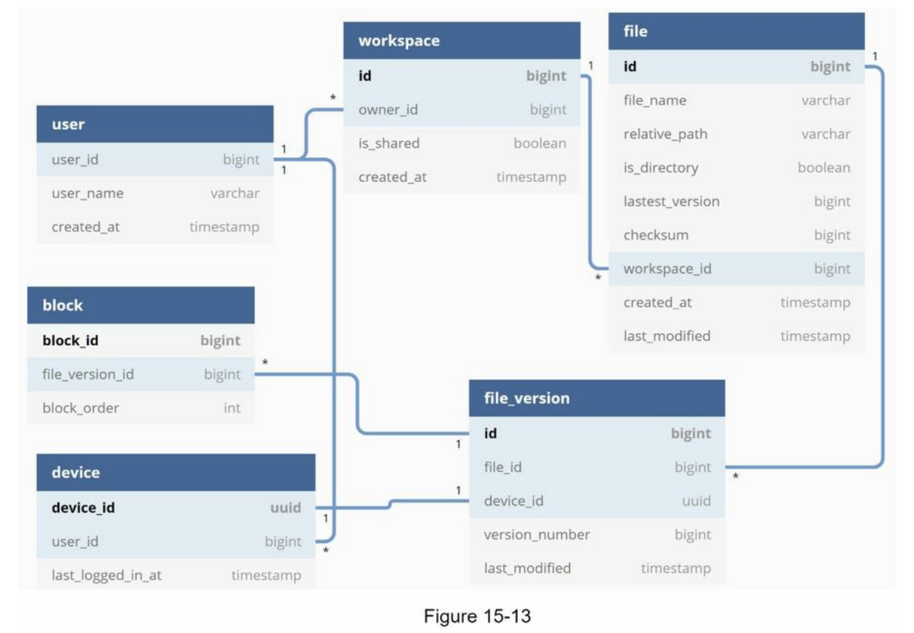
* **Upload flow**
  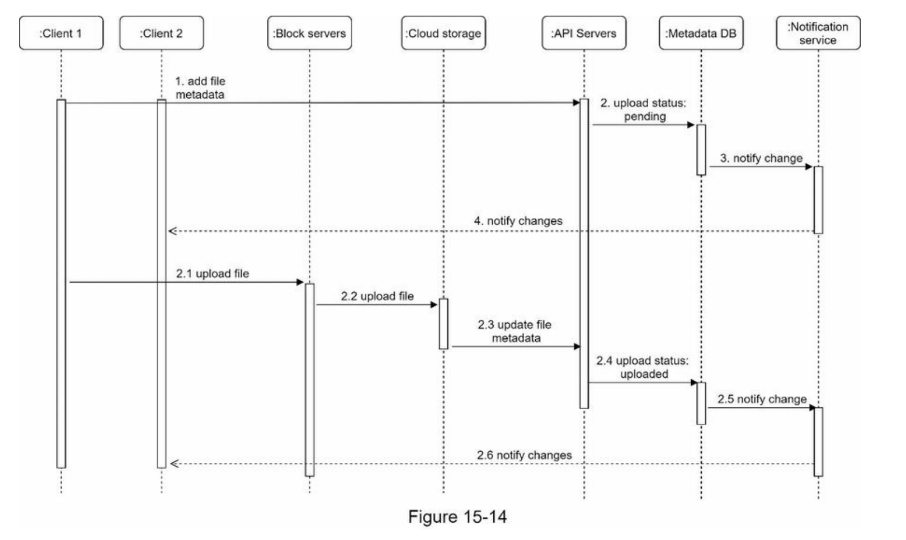
* **Download flow**
  + Download flow is triggered when a file is added or edited elsewhere.
    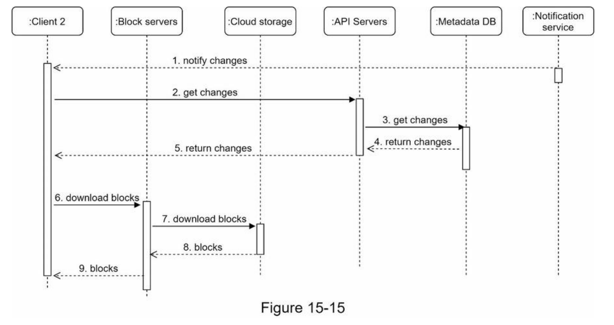
* **Notification service**
  + notification service allows data to be transferred to clients as events happen.
    - **Long polling**. Dropbox uses long polling
    - **WebSocket** -> a persistent connection between the client and the server -> bi-directional
  + we opt for long polling for the following two reasons:
    - Communication for notification service is not bi-directional
    - WebSocket is suited for real-time bi-directional communication such as a chat app
  + **long polling**
    - each client establishes a long poll connection to the notification service
    - If changes to a file are detected -> he client will close the long poll connection
    - a client must connect to the metadata server to download the latest changes
    - a response is received or connection timeout is reached -> a new request to keep the connection open
* **Save storage space**
  + De-duplicate data blocks
    - Eliminating redundant blocks at the account level
    - Two blocks are identical if they have the same hash value
  + Adopt an intelligent data backup strategy
    - Set a limit: a limit for the number of versions to store
    - Keep valuable versions only:
      * limit the number of saved versions
      * give more weight to recent versions
      * Moving infrequently used data to cold storage -> Amazon S3 glacier -> cheaper
* **Failure Handling**
  + Load balancer failure
    - If a load balancer fails, the secondary would become active and pick up the traffic
    - monitor each other using a heartbeat
    - if it has not sent a heartbeat for some time -> failed
  + Block server failure
    - If a block server fails, other servers pick up unfinished or pending jobs
  + Cloud storage failure
    - S3 buckets are replicated multiple times in different regions
    - not available in one region -> can be fetched from different regions
  + API server failure
    - a stateless service
    - if fails -> the traffic is redirected to other API servers by a load balancer
  + Metadata cache failure
    - are replicated multiple times
    - if fails -> access other nodes to fetch data
    - bring up a new cache server to replace the failed one
  + Metadata DB failure
    - Master down
      * promote one of the slaves to act as a new master and bring up a new slave node
    - Slave down
      * use another slave for read operations
      * bring another database server to replace the failed one
  + Notification service failure
    - Even though one server can keep many open connections, it cannot reconnect all the lost connections at once.
    - Reconnecting with all the lost clients is a relatively slow process
  + Offline backup queue failure
    - Queues are replicated multiple times.
    - If one queue fails, consumers of the queue may need to re-subscribe to the backup queue.

## Wrap up[​](#wrap-up "Direct link to Wrap up")

* In our design, a file is
  transferred to block servers first, and then to the cloud storage
  + drawbacks
    - the same chunking, compression, and encryption logic must be implemented on different platforms (iOS, Android, Web)-> It is error-prone and requires a lot of engineering effort
    - as a client can easily be hacked or manipulated, implementing encrypting logic on the client side is not ideal
* presence service (online/offline)
  + by moving presence service out of notification servers -> online/offline functionality can easily be integrated by other services


[Previous

Chapter 14: Design YouTube](/study-notes/notes/system-design-interview/ch14)[Next

Kubernetes - Up and Running](/study-notes/notes/kubernetes-up-and-running)

* [Understand Google Drive](#understand-google-drive)
* [Step 1 - Understand the problem and establish design scope](#step-1---understand-the-problem-and-establish-design-scope)
* [Back of the envelope estimation](#back-of-the-envelope-estimation)
* [Step 2 - Propose high-level design and get buy-in](#step-2---propose-high-level-design-and-get-buy-in)
* [APIs](#apis)
* [Move away from single server](#move-away-from-single-server)
* [Sync conflicts](#sync-conflicts)
* [High-level design](#high-level-design)
* [Step 3 - Design deep dive](#step-3---design-deep-dive)
* [Wrap up](#wrap-up)

