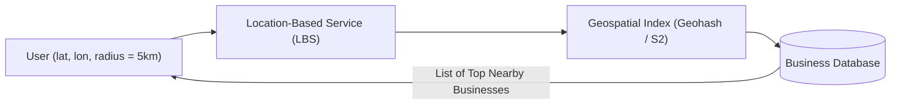
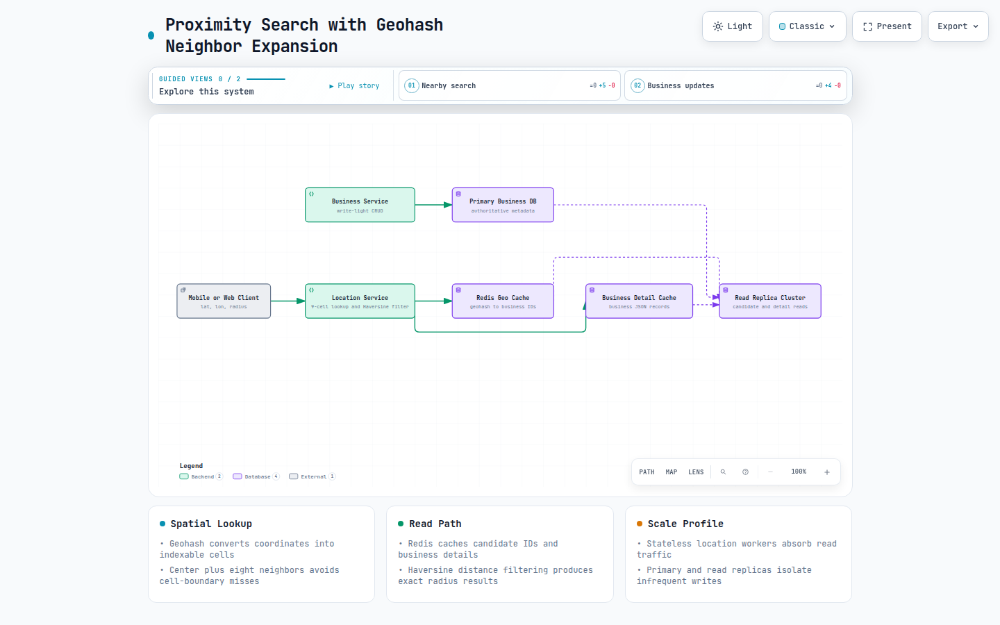
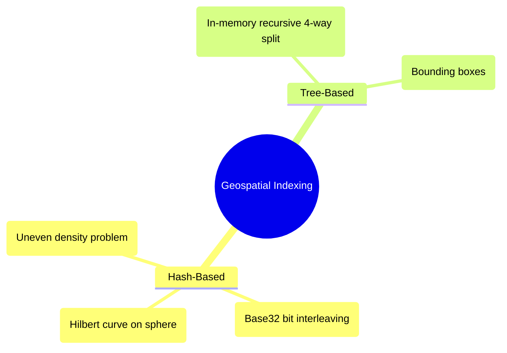
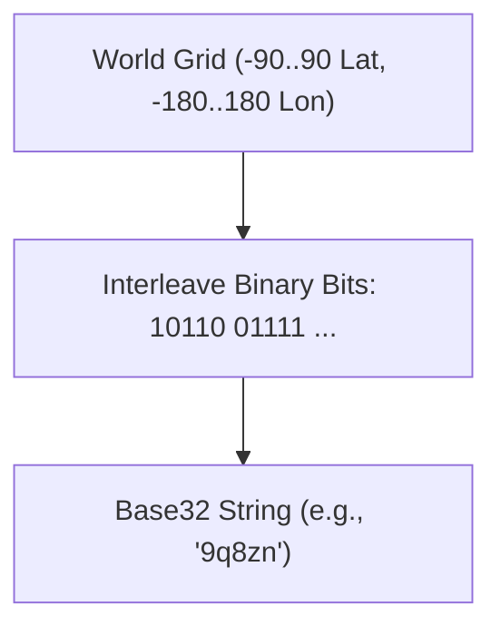
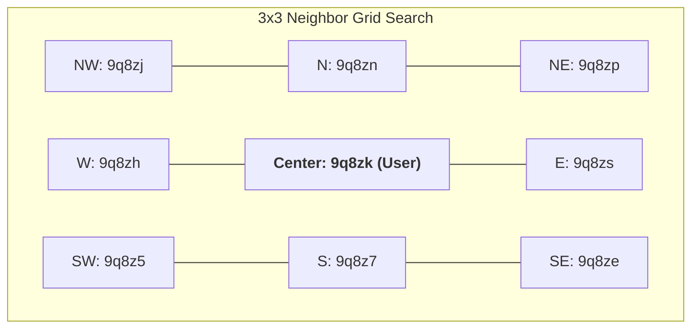
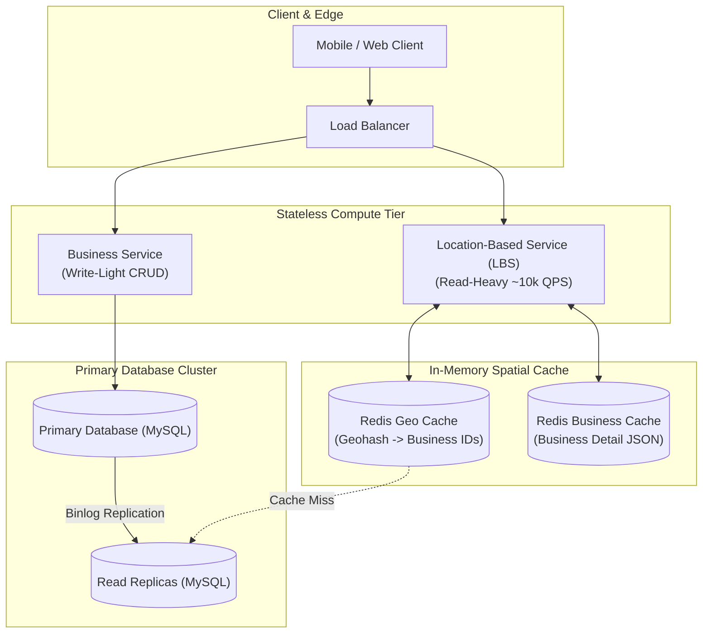
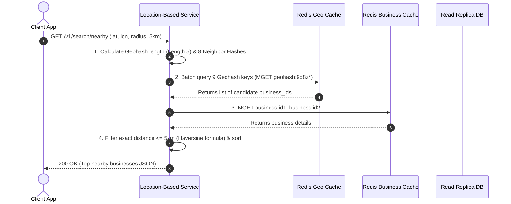

# Proximity Service

> **Source**: *System Design Interview – An Insider's Guide: Volume 2* by Alex Xu & Sahn Lam  
> **ByteByteGo Chapter**: 17  
> **Topic**: Geospatial Indexing, Geohash vs. Quadtree vs. Google S2, 8-Neighbor Cell Boundary Resolution, High-Throughput LBS

---

## 1. Understand the Problem and Establish Design Scope

A proximity service (e.g., Yelp, Google Places, TripAdvisor) enables users to discover nearby points of interest (restaurants, hotels, shops) within a configurable geographic radius (e.g., $0.5\text{ km}$ to $20\text{ km}$).





[Open the interactive Archify diagram](resources/proximity-service/proximity-geohash-search.html)

---

### Interview Clarification & Scope

> **Candidate:** What is the maximum search radius supported?  
> **Interviewer:** Configurable radii: $0.5\text{ km}$, $1\text{ km}$, $2\text{ km}$, $5\text{ km}$, and up to **$20\text{ km}$**.
>
> **Candidate:** How frequently are business records created or updated?  
> **Interviewer:** Infrequently ($99\%$ reads, $1\%$ writes). Updates can be reflected on the next day.
>
> **Candidate:** What is the scale of the system?  
> **Interviewer:** **100 Million Daily Active Users (DAU)** and **200 Million registered businesses**.
>
> **Candidate:** What are the latency requirements?  
> **Interviewer:** Nearby search queries must return results within **$< 100\text{ ms}$**.

---

### Back-of-the-Envelope Estimation

| Metric / Dimension | Calculation | Estimated Value |
|:---|:---|:---|
| **Daily Active Users (DAU)** | Given | $100{,}000{,}000\text{ DAU}$ |
| **Daily Search Queries** | $100\text{M users} \times 5\text{ searches/day}$ | $500{,}000{,}000\text{ queries/day}$ |
| **Search Query QPS** | $\frac{500{,}000{,}000}{86{,}400\text{ sec}} \approx \frac{5 \times 10^8}{10^5}$ | $\approx \mathbf{5{,}000\text{ QPS}}$ |
| **Peak Query QPS** | $2 \times \text{Average QPS}$ | $\approx \mathbf{10{,}000\text{ QPS}}$ |
| **Total Registered Businesses** | Given | $200{,}000{,}000\text{ records}$ |
| **Business Record Size** | $200\text{ bytes} \times 200\text{M}$ | $\approx \mathbf{40\text{ GB (Fits easily in RAM!)}}$ |

---

## 2. Geospatial Indexing Algorithms in Depth

Traditional relational 2D queries (`WHERE lat BETWEEN ... AND lon BETWEEN ...`) require full table scans and expensive 2D coordinate intersections. We must map 2D coordinates into a 1D indexable spatial structure.



---

### 1. Geohash (Base32 String Hierarchy)

Geohash recursively divides the Earth into a grid of alternating latitude and longitude binary subdivisions, encoding the interleaved bits into a **Base32 string**:



#### Geohash Length vs. Cell Dimensions

| Geohash Length | Cell Width $\times$ Height | Typical Application |
|:---|:---|:---|
| **4** | $\approx 39.1\text{ km} \times 19.5\text{ km}$ | State / County level |
| **5** | $\approx 4.89\text{ km} \times 4.89\text{ km}$ | City level search ($5\text{ km}$ radius) |
| **6** | $\approx 1.22\text{ km} \times 0.61\text{ km}$ | Neighborhood search ($1\text{ km}$ radius) |
| **7** | $\approx 153\text{ m} \times 153\text{ m}$ | Street / Building level |

---

### 2. The Geohash Boundary Problem (8-Neighbor Solution)

A user standing near the edge of a Geohash cell might be closer to a restaurant in an adjacent cell than one in their own cell.



> [!IMPORTANT]
> **Boundary Solution**: The Location-Based Service always queries the user's current Geohash cell **plus all 8 adjacent neighbor cells** ($\text{Center} + 8\text{ Neighbors} = 9\text{ cells total}$).

---

### 3. Quadtree vs. Google S2 vs. Geohash Matrix

| Dimension | Geohash | Quadtree | Google S2 Geometry |
|:---|:---|:---|:---|
| **Structure** | 1D Base32 String (DB-indexable) | In-memory 4-way Tree | 64-bit Hilbert Curve Cells |
| **Storage Engine** | Redis / PostgreSQL B-Tree | In-Memory Application RAM | In-Memory / Distributed DB |
| **Boundary Resolution** | Query 8 Neighbor cells | Traverse parent/sibling nodes | Built-in S2 `CapCoverer` |
| **Dynamic Density** | Fixed rectangular grid | Dynamic node splitting | Multi-level Hilbert cells |
| **Industry Adoption** | Redis GEO, MongoDB | Yelp, Elasticsearch | Google Maps, Uber, Foursquare |

---

## 3. High-Level Architecture



---

## 4. Data Models & API Design

### REST API
`GET /v1/search/nearby?latitude=37.7749&longitude=-122.4194&radius=5000`

### Database Schema
```sql
CREATE TABLE business (
    business_id   BIGINT PRIMARY KEY,
    name          VARCHAR(255) NOT NULL,
    address       VARCHAR(255),
    latitude      DECIMAL(9, 6) NOT NULL,
    longitude     DECIMAL(9, 6) NOT NULL,
    created_at    TIMESTAMP DEFAULT CURRENT_TIMESTAMP
);

CREATE TABLE business_geohash (
    geohash       VARCHAR(8) NOT NULL,
    business_id   BIGINT NOT NULL,
    PRIMARY KEY (geohash, business_id),
    INDEX idx_geohash (geohash)
);
```

---

## 5. End-to-End Nearby Search Sequence Flow



---

## 6. Architectural Summary

```mermaid
mindmap
  root((Proximity Service))
    Spatial Indexing
      Geohash: Base32 Bit Interleaving
      Length 5 (5km) & Length 6 (1km)
      8-Neighbor Boundary Resolution
    Architecture
      Stateless LBS Service
      Redis In-Memory Geospatial Cache
      MySQL Primary-Replica Read Scaling
    Optimizations
      Haversine Exact Distance Filter
      Separate Business Detail Cache
```

| Component | Design Choice | System Benefit |
|:---|:---|:---|
| **Geospatial Index** | Geohash with 8-Neighbor Expansion | Transforms 2D geographic searches into fast 1D B-Tree range queries and Redis key lookups. |
| **Cache Tier** | Redis Cluster (`Geohash -> [business_id]`) | Delivers sub-10ms query responses for $10{,}000\text{ peak QPS}$. |
| **Distance Math** | 2-Stage Filter (Geohash Box + Haversine Radius) | Fast grid candidate selection followed by precise spherical distance filtering. |
| **Database Scalability**| Read Replicas + Stateless LBS | Separates heavy read traffic from low-frequency business metadata edits. |

---

## References

1. Geohash Algorithm Overview: https://en.wikipedia.org/wiki/Geohash
2. Google S2 Geometry Library: https://s2geometry.io/
3. Redis Geospatial Commands: https://redis.io/commands/geo-add/
