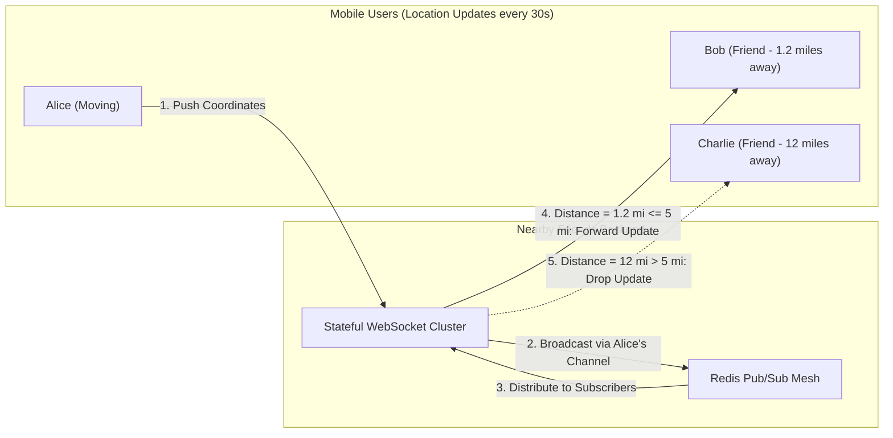
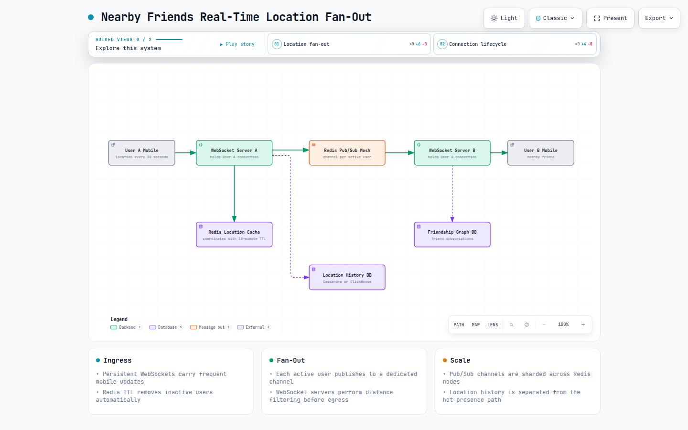
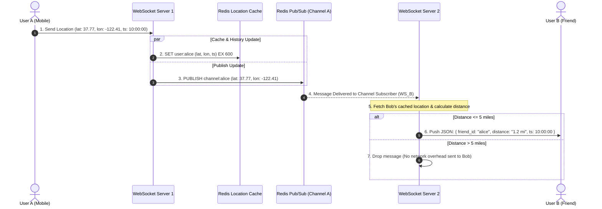
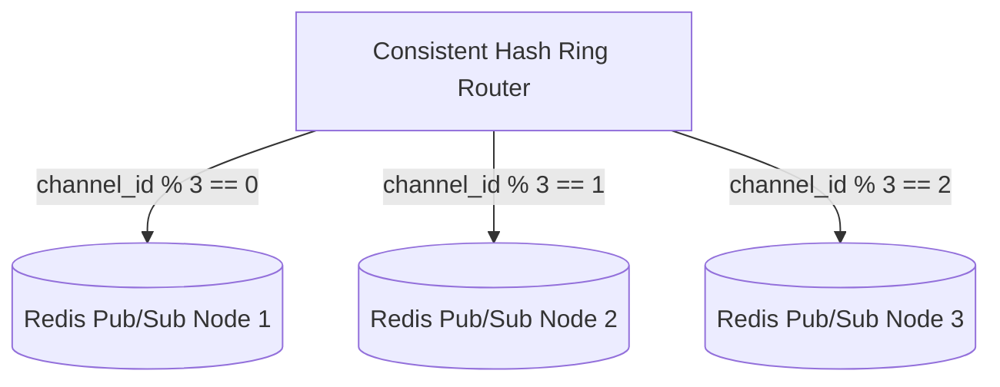
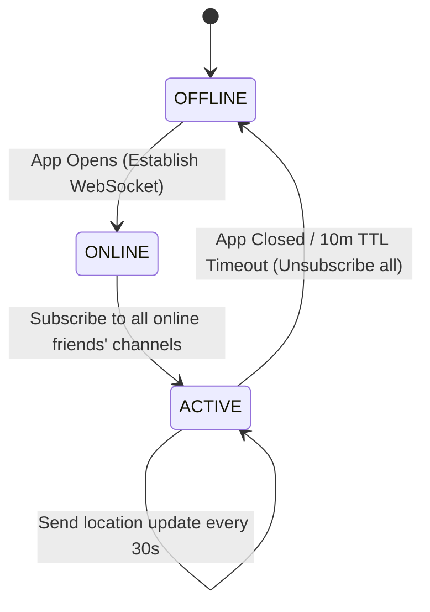
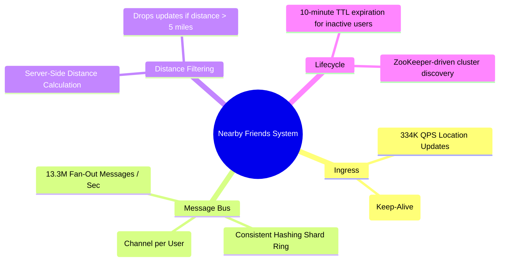

# Nearby Friends

> **Source**: *System Design Interview – An Insider's Guide: Volume 2* by Alex Xu & Sahn Lam  
> **ByteByteGo Chapter**: 18  
> **Topic**: Real-Time Dynamic Location Fan-Out, WebSockets, Channel-per-User Redis Pub/Sub, Spatial Distance Calculation

---

## 1. Understand the Problem and Establish Design Scope

Unlike static business proximity searches (Chapter 17), **Nearby Friends** tracks highly dynamic moving users, continuously computing proximity ($< 5\text{ miles}$) between mutual friends and fanning out real-time location updates.





[Open the interactive Archify diagram](resources/nearby-friends/nearby-friends-websocket-fanout.html)

---

### Interview Clarification & Scope

> **Candidate:** What is considered "nearby"?  
> **Interviewer:** Within a **$5\text{ mile (8 km)}$ radius** (straight-line Euclidean/Haversine distance).
>
> **Candidate:** How frequently do mobile clients report locations?  
> **Interviewer:** Every **$30\text{ seconds}$** while the app is active. Inactive users ($> 10\text{ minutes}$) disappear from friend lists.
>
> **Candidate:** What is the daily scale and concurrency?  
> **Interviewer:** **100 Million DAU**, with **10 Million concurrent active users**. An average user has $400$ friends ($10\%$ online concurrently).

---

### Back-of-the-Envelope Estimation

| Metric / Dimension | Calculation | Estimated Value |
|:---|:---|:---|
| **Concurrent Active Users** | $100\text{M DAU} \times 10\%$ | $10{,}000{,}000\text{ concurrent users}$ |
| **Location Update Interval** | Given | $30\text{ seconds}$ |
| **Location Ingress QPS** | $\frac{10{,}000{,}000}{30\text{ sec}}$ | $\approx \mathbf{334{,}000\text{ Update QPS}}$ |
| **Average Online Friends** | $400\text{ friends} \times 10\%\text{ online}$ | $40\text{ online friends/user}$ |
| **Egress Fan-Out Throughput** | $334{,}000\text{ QPS} \times 40\text{ online friends}$ | $\approx \mathbf{13{,}360{,}000\text{ updates/sec}}$ |

> [!IMPORTANT]
> The primary engineering bottleneck is handling **13.3+ Million fan-out messages per second** across persistent WebSocket connections with minimal CPU and memory overhead.

---

## 2. High-Level Architecture: Channel-per-User Pub/Sub

```mermaid
flowchart TD
    subgraph IngressTier["Mobile Clients & Edge"]
        USER_A["User A (Mobile)"]
        USER_B["User B (Friend)"]
        LB["Layer 4 / Layer 7 Load Balancer"]
    end

    subgraph StatefulTier["WebSocket Cluster"]
        WS1["WebSocket Server 1<br/>(Holds User A Connection)"]
        WS2["WebSocket Server 2<br/>(Holds User B Connection)"]
    end

    subgraph PubSubMesh["Distributed Message Bus (Redis Pub/Sub)"]
        CH_A["Channel: user_A_updates"]
        CH_B["Channel: user_B_updates"]
    end

    subgraph StorageTier["Cache & Database Fleet"]
        LOC_CACHE[("Redis Location Cache<br/>(user_id -> lat, lon, TTL=10m)")]
        LOC_HIST[("Location History DB<br/>(Cassandra / ClickHouse)")]
        USER_DB[("User & Friendship Graph DB")]
    end

    USER_A <-->|Persistent WebSocket| WS1
    USER_B <-->|Persistent WebSocket| WS2
    
    WS1 -->|1. Write Coordinates & Reset TTL| LOC_CACHE
    WS1 -->|2. Append Log| LOC_HIST
    WS1 -->|3. Publish (lat, lon)| CH_A
    
    CH_A -->|4. Fan-Out to Subscribers| WS2
    WS2 -->|5. Compute Distance <= 5mi -> Push| USER_B
```

---

## 3. End-to-End Location Fan-Out Flow



---

## 4. Design Deep Dive: Scaling the Pub/Sub Cluster

### 1. Redis Pub/Sub Sizing & Sharding

To support $10\text{ Million}$ active channels ($1\text{ channel per active user}$):
- Memory per channel subscriber entry: $\approx 20\text{ bytes} \times 40\text{ subscribers} \approx 800\text{ bytes/channel}$.
- Total Channel Memory: $10\text{M channels} \times 800\text{ bytes} \approx \mathbf{8\text{ GB of RAM}}$ (Easily fits across a small Redis cluster).



- **ZooKeeper Service Discovery**: WebSocket servers maintain a dynamic hash ring of Redis Pub/Sub nodes, automatically subscribing to the appropriate shard for each friend channel.

---

### 2. Client Lifecycle (Login, Movement, Logout)



1. **Client Initialization**:
   - Client opens WebSocket.
   - Server loads friends list from User DB $\rightarrow$ Queries Redis Location Cache to find active friends $\rightarrow$ Subscribes to their Redis channels $\rightarrow$ Returns initial nearby friends list.
2. **Client Teardown**:
   - Connection closes $\rightarrow$ Server unsubscribes from all friend channels $\rightarrow$ Key expires in Redis cache after $10\text{ minutes}$.

---

## 5. Architectural Summary



| Component | Technical Decision | Core Rationale |
|:---|:---|:---|
| **Protocol** | WebSockets | Low-overhead bidirectional communication over cellular networks. |
| **Message Bus** | Channel-per-User Redis Pub/Sub | Lightweight in-memory routing scaling to millions of dynamic channels. |
| **Location Cache** | Redis with 10-minute TTL | Automatic eviction of inactive friends without periodic background cleanup jobs. |
| **Egress Filtering** | Server-Side Distance Drop | Filters out $90\%$ of non-nearby friend updates before sending data over mobile networks. |

---

## References

1. Redis Pub/Sub Documentation: https://redis.io/topics/pubsub
2. Apache ZooKeeper for Cluster Coordination: https://zookeeper.apache.org/
3. Haversine Formula for Great-Circle Distance: https://en.wikipedia.org/wiki/Haversine_formula
