# Google Maps

> **Source**: System Design Interview – An Insider's Guide: Volume 2 by Alex Xu & Sahn Lam  
> **ByteByteGo Chapter**: 19

---

## Step 1 - Understand the Problem and Establish Design Scope

The interaction between the interviewer and the candidate could look like this:

> **Candidate:** How many daily active users are we expecting?  
> **Interviewer:** 1 billion DAU.
>
> **Candidate:** Which features should we focus on? Direction, navigation, and estimated time of arrival (ETA)?  
> **Interviewer:** Let’s focus on location update, navigation, ETA, and map rendering.
>
> **Candidate:** How large is the road data? Can we assume we have access to it?  
> **Interviewer:** Great questions. Yes, let’s assume we obtained the road data from different sources. It is terabytes (TBs) of raw data.
>
> **Candidate:** Should our system take traffic conditions into consideration?  
> **Interviewer:** Yes, traffic conditions are very important for accurate time estimation.
>
> **Candidate:** How about different travel modes such as driving, walking, bus, etc?  
> **Interviewer:** We should be able to support different travel modes.
>
> **Candidate:** Should it support multi-stop directions?  
> **Interviewer:** It is good to allow a user to define multiple stops, but let’s not focus on it.
>
> **Candidate:** How about business places and photos? How many photos are we expecting? How about the estimated number of businesses we should design for?  
> **Interviewer:** I am happy you asked and considered these. We do not need to design those. In the rest of the chapter, we focus on three key features: user location update, navigation service (including ETA), and map rendering. The main devices that we need to support are mobile phones.

### Core Features

1. **User location update**
2. **Navigation service, including ETA service**
3. **Map rendering**

### Non-Functional Requirements and Constraints

- **Accuracy:** Users should not be given the wrong directions.
- **Smooth navigation:** On the client-side, users should experience very smooth map rendering and transitions.
- **Data and battery usage:** The client should use as little data and energy as possible. This is very important for mobile devices.
- **Availability and scalability:** High availability and horizontal scalability to serve 1 billion DAU globally.

---

### Map 101

Before jumping into the design, we will briefly introduce some basic concepts and terminologies that are helpful in designing Google Maps.

#### Positioning System

The world is a sphere that rotates on its axis. At the very top, there is the North Pole, and at the very bottom is the South Pole.

*Figure 1 Latitude and Longitude (source: [3])*

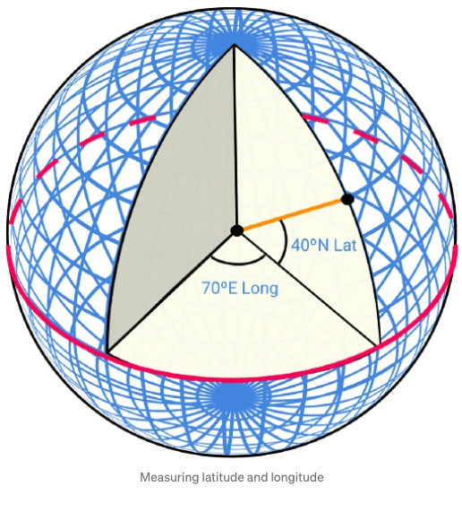

- **Lat (Latitude):** denotes how far north or south we are.
- **Long (Longitude):** denotes how far east or west we are.

#### Going from 3D to 2D

The process of translating points from a 3D globe to a 2D plane is called **Map Projection**. There are different ways to do map projection, and each comes with its own strengths and limitations. Almost all of them distort the actual geometry.

*Figure 2 Map projections (source: Wikipedia [4] [5] [6] [7])*

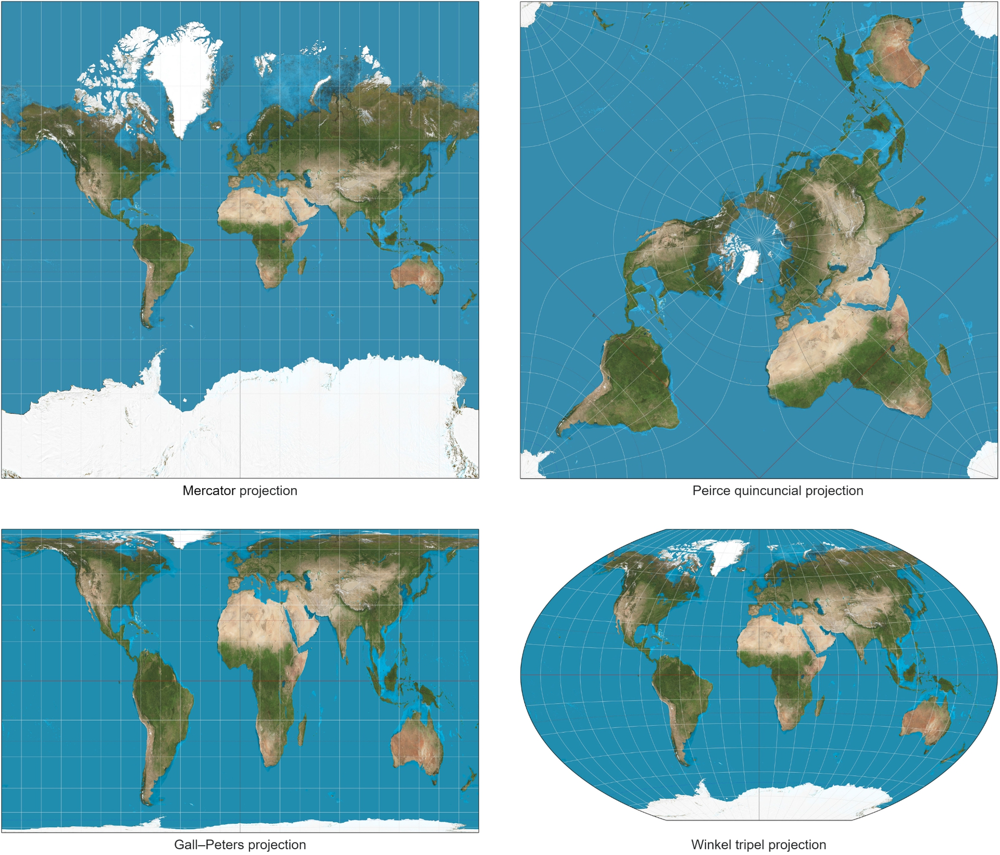

Google Maps selected a modified version of the Mercator projection called **Web Mercator**. For more details on positioning systems and projections, please refer to [3].

#### Geocoding

Geocoding is the process of converting addresses to geographic coordinates. For instance, *"1600 Amphitheatre Parkway, Mountain View, CA"* is geocoded to a latitude/longitude pair of `(latitude 37.423021, longitude -122.083739)`.

In the other direction, the conversion from the latitude/longitude pair to the actual human-readable address is called **reverse geocoding**.

One way to geocode is interpolation [8]. This method leverages data from different sources such as geographic information systems (GIS) where the street network is mapped to the geographic coordinate space.

#### Geohashing

Geohashing is an encoding system that encodes a geographic area into a short string of letters and digits. At its core, it depicts the earth as a flattened surface and recursively divides the grids into sub-grids, which can be square or rectangular. We represent each grid with a string of numbers between `0` to `3` that are created recursively.

Let’s assume the initial flattened surface is of size 20,000 km x 10,000 km. After the first division, we would have 4 grids of size 10,000 km x 5,000 km. We represent them as `00`, `01`, `10`, and `11` as shown in Figure 3.

We further divide each grid into 4 grids and use the same naming strategy. Each sub-grid is now of size 5,000 km x 2,500 km. We recursively divide the grids until each grid reaches a certain size threshold.

*Figure 3 Geohashing*

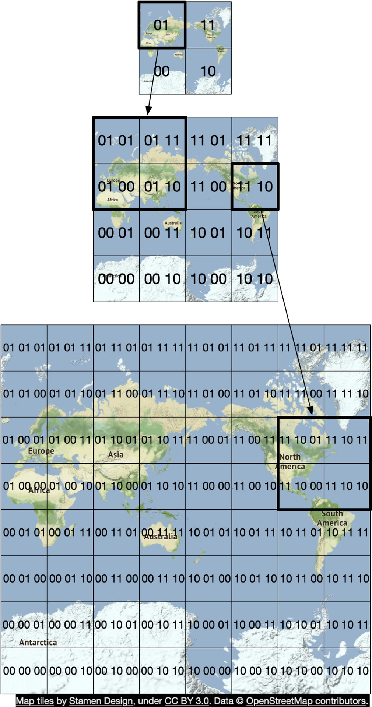

Geohashing has many uses. In our design, we use geohashing for map tiling. For more details on geohashing and its benefits, please refer to [9].

#### Map Rendering

Instead of rendering the entire map as one large custom image, the world is broken up into smaller tiles.

The client only downloads the relevant tiles for the area the user is in and stitches them together like a mosaic for display. There are distinct sets of tiles at different zoom levels. The client chooses the set of tiles appropriate for the zoom level of the map viewport on the client.

This provides the right level of map details without consuming excess bandwidth. When zoomed all the way out to show the entire world, the client downloads one tile at the lowest zoom level, which represents the entire world with a single 256x256 pixel image.

#### Road Data Processing for Navigation Algorithms

Most routing algorithms are variations of Dijkstra’s or A* pathfinding algorithms. All these algorithms operate on a graph data structure, where intersections are nodes and roads are edges of the graph.

*Figure 4 Graph*

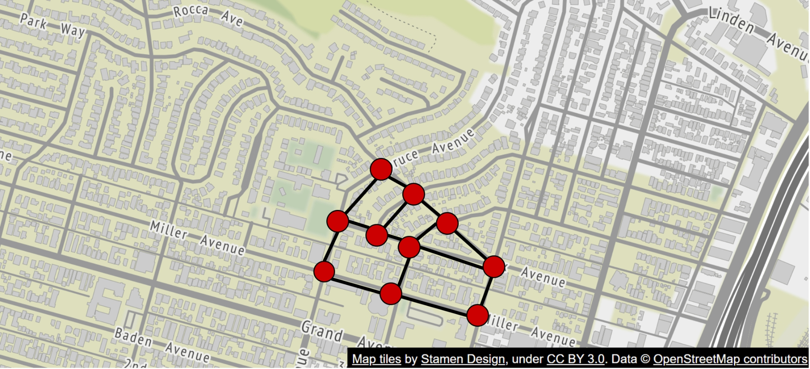

The pathfinding performance for most of these algorithms is extremely sensitive to the size of the graph. Representing the entire world of road networks as a single graph would consume too much memory and cannot run efficiently.

By employing a subdivision technique similar to geohashing, we divide the world into small grids called **routing tiles**. For each grid, we convert the roads within the grid into a small graph data structure consisting of nodes (intersections) and edges (roads). Each routing tile holds references to all other tiles it connects to.

*Figure 5 Routing tiles*

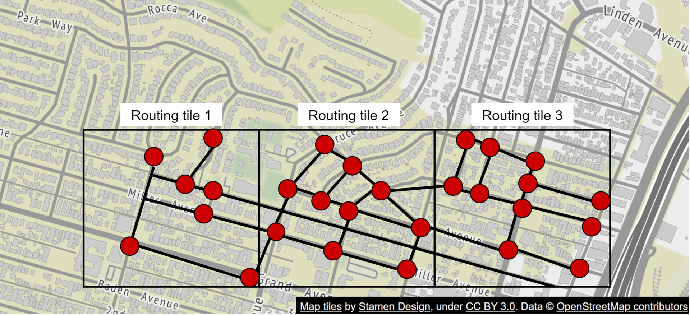

> **Reminder:** Routing tiles are similar to map tiles in that both are grids covering geographical areas. However, map tiles are PNG images, while routing tiles are binary files of road data for navigation algorithms.

#### Hierarchical Routing Tiles

Efficient navigation routing also requires having road data at the right level of detail:
- **High detail (local roads):** small routing tiles covering local streets.
- **Medium detail (arterial roads):** bigger routing tiles connecting districts.
- **Low detail (highways):** large tiles connecting cities and states.

*Figure 6 Routing tiles of varying sizes*

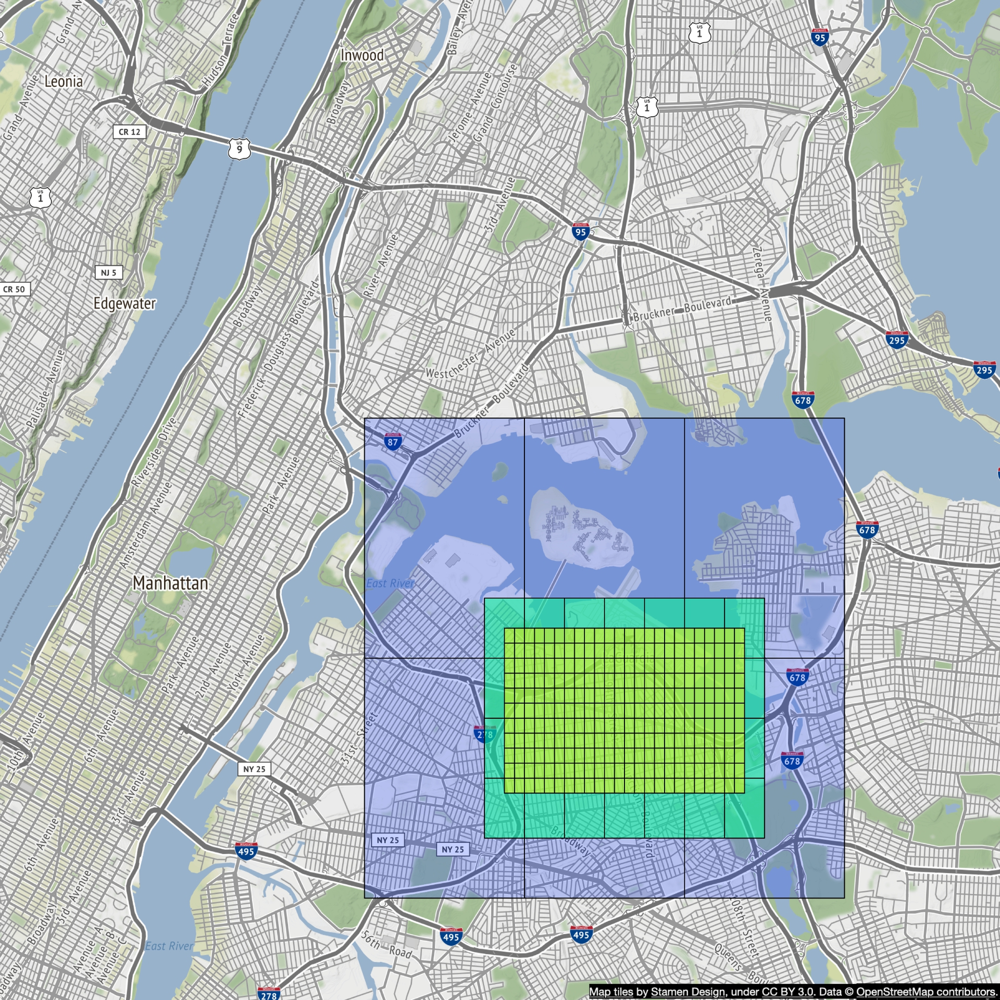

---

## Back-of-the-envelope estimation

### Storage Demand

We need to store three types of data:
1. **Map of the world:** precomputed map tiles at various zoom levels.
2. **Metadata:** negligible compared to tiles.
3. **Road info:** raw data transformed into binary routing tiles.

#### Map of the World Storage

At zoom level 21, there are about 4.4 trillion tiles (Table 1). Assuming each tile is a 256 x 256 pixel compressed PNG image (~100 KB), the entire set at zoom level 21 would require:

$$\text{Storage at level 21} = 4.4 \text{ trillion} \times 100\text{ KB} = 440\text{ PB}$$

| Zoom Level | Number of Tiles |
|:---|:---|
| 0 | 1 |
| 1 | 4 |
| 2 | 16 |
| 3 | 64 |
| 4 | 256 |
| 5 | 1,024 |
| 6 | 4,096 |
| 7 | 16,384 |
| 8 | 65,536 |
| 9 | 262,144 |
| 10 | 1,048,576 |
| 11 | 4,194,304 |
| 12 | 16,777,216 |
| 13 | 67,108,864 |
| 14 | 268,435,456 |
| 15 | 1,073,741,824 |
| 16 | 4,294,967,296 |
| 17 | 17,179,869,184 |
| 18 | 68,719,476,736 |
| 19 | 274,877,906,944 |
| 20 | 1,099,511,627,776 |
| 21 | 4,398,046,511,104 |

*Table 1 Zoom levels*

About 90% of the world’s surface consists of uninhabited areas (oceans, deserts, mountains), which compress heavily. Reducing the storage estimate by 80–90% brings the level 21 requirement to approximately **50 PB**.

Summing across all zoom levels (each level is 1/4 the tile count of the next higher level):

$$\text{Total Storage} = 50 + \frac{50}{4} + \frac{50}{16} + \frac{50}{64} + \dots \approx 67\text{ PB} \approx 100\text{ PB (conservative total)}$$

### Server Throughput

- **Navigation Requests:**
  - 1 billion DAU, each averaging 5 navigation sessions per week totaling 35 minutes per week = 5 billion minutes per day.
  - Average Navigation QPS:
    $$\text{Average QPS} = \frac{1\text{ billion} \times 5}{7 \times 86,400} \approx 7,200\text{ QPS}$$
  - Peak Navigation QPS (5x): $7,200 \times 5 = 36,000\text{ QPS}$.

- **Location Update Requests:**
  - If sent every second: 3 million QPS.
  - By batching updates on the client every 15 seconds:
    $$\text{Average Location QPS} = \frac{3,000,000}{15} = 200,000\text{ QPS}$$
  - Peak Location QPS (5x): $200,000 \times 5 = 1,000,000\text{ QPS}$.

---

## Step 2 - Propose High-Level Design and Get Buy-In

*Figure 7 High-level design*

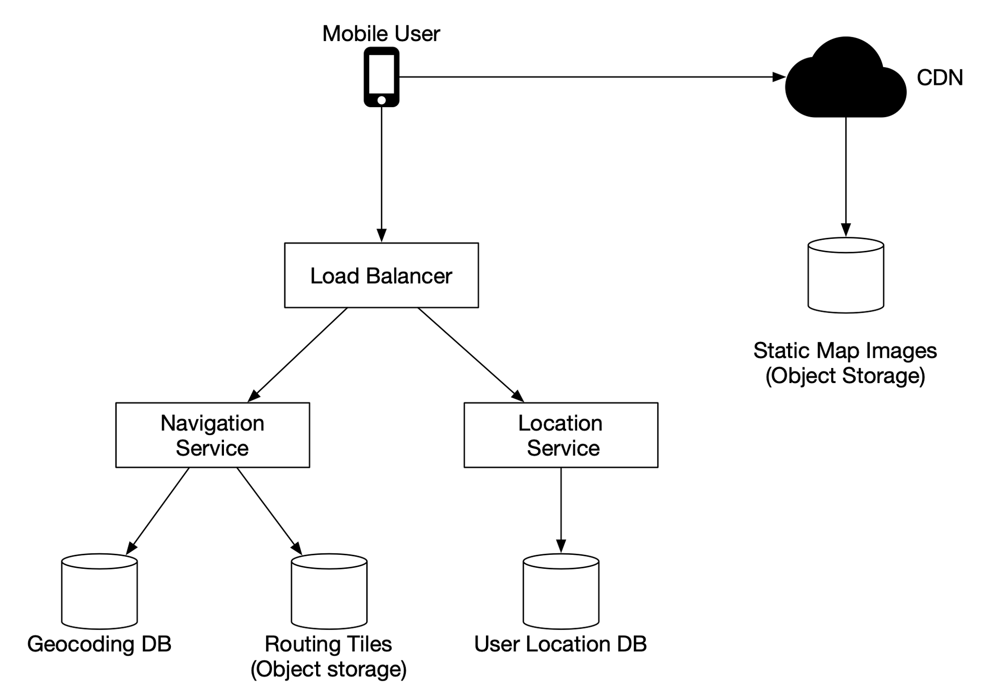

The high-level design supports three main features:
1. **Location service**
2. **Navigation service**
3. **Map rendering**

### 1. Location Service

The location service records user location updates.

*Figure 8 Location service*

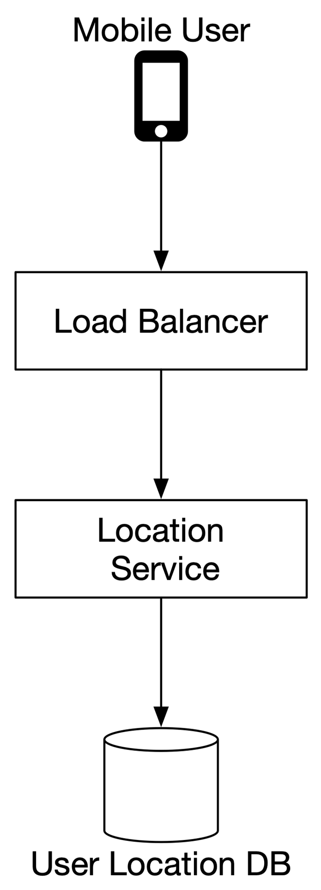

Clients buffer location updates and send them in batches every 15 seconds.

*Figure 9 Batch requests*

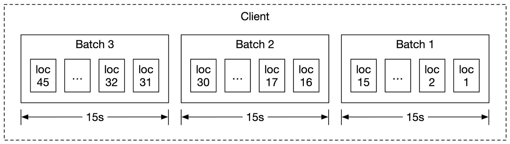

- **Database:** Cassandra (optimized for high write volumes and horizontal scale).
- **Messaging:** Kafka stream processing for downstream services (traffic analysis, ETA models).
- **Communication Protocol:** HTTP with keep-alive (`POST /v1/locations`).

```http
POST /v1/locations
Content-Type: application/json

{
  "locs": [
    {"lat": 37.423021, "lng": -122.083739, "timestamp": 1635740977},
    {"lat": 37.423150, "lng": -122.083850, "timestamp": 1635740992}
  ]
}
```

### 2. Navigation Service

The navigation service finds a fast route from point A to point B.

- **API:** `GET /v1/nav?origin=1355+market+street,SF&destination=Disneyland`

Example navigation response:

```json
{
  "distance": { "text": "0.2 mi", "value": 259 },
  "duration": { "text": "1 min", "value": 83 },
  "end_location": { "lat": 37.4038943, "lng": -121.9410454 },
  "html_instructions": "Head <b>northeast</b> on <b>Brandon St</b> toward <b>Lumin Way</b><div style=\"font-size:0.9em\">Restricted usage road</div>",
  "polyline": { "points": "_fhcFjbhgVuAwDsCal" },
  "start_location": { "lat": 37.4027165, "lng": -121.9435809 },
  "geocoded_waypoints": [
    {
      "geocoder_status": "OK",
      "partial_match": true,
      "place_id": "ChIJwZNMti1fawwRO2aVVVX2yKg",
      "types": ["locality", "political"]
    },
    {
      "geocoder_status": "OK",
      "partial_match": true,
      "place_id": "ChIJ3aPgQGtXawwRLYeiBMUi7bM",
      "types": ["locality", "political"]
    }
  ],
  "travel_mode": "DRIVING"
}
```

### 3. Map Rendering

- **Option 1 (Dynamic Generation):** Server builds map tiles on the fly. Disadvantages: immense computational overhead and loss of caching benefits.
- **Option 2 (Static Pre-generated Tiles via CDN):** Pre-generate static tiles indexed by geohash and serve them via a global CDN.

*Figure 10 CDN*

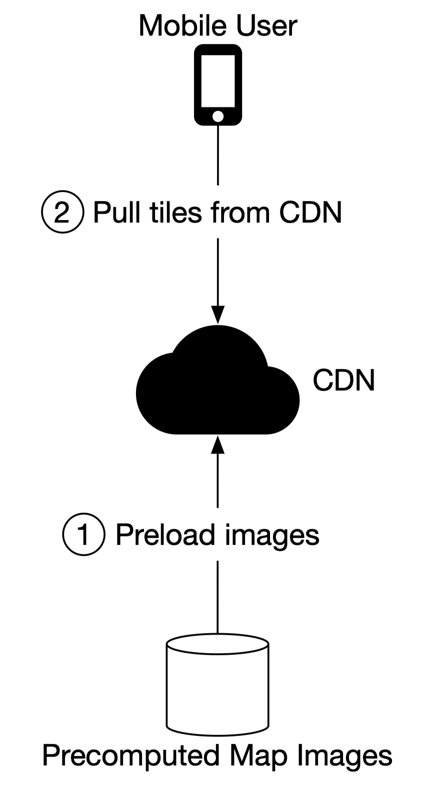

Serving tiles from Points of Presence (POPs) dramatically lowers latency.

*Figure 11 Without CDN vs with CDN*

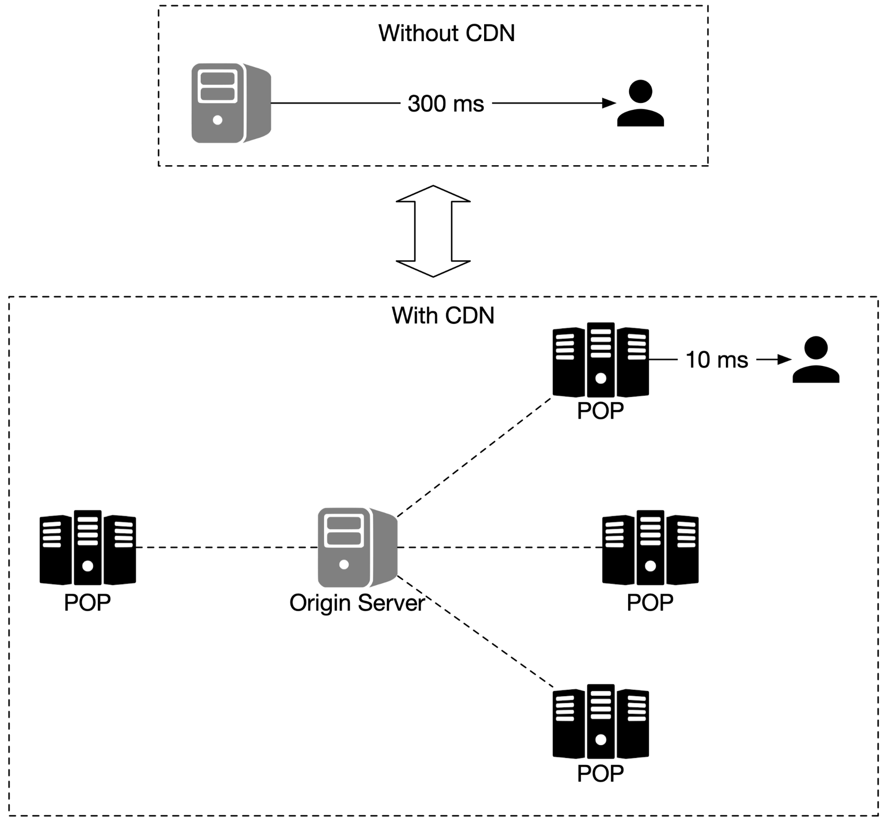

#### Client Data Usage and CDN Traffic

| Metric | Value |
|:---|:---|
| User speed | 30 km/h |
| Image tile size | 256x256 px (~100 KB) covering 200m x 200m |
| Data per $1\text{ km} \times 1\text{ km}$ area | 25 images $\times$ 100 KB = 2.5 MB |
| Data per user per hour | $30 \times 2.5\text{ MB} = 75\text{ MB/hour}$ (1.25 MB/min) |

*Table 2 Data usage*

| Metric | Value |
|:---|:---|
| Daily navigation volume | 5 billion minutes/day |
| Daily map data transfer | $5\text{ billion} \times 1.25\text{ MB} = 6.25\text{ billion MB/day}$ |
| Global map data rate | 62,500 MB/sec |
| Per POP load (200 POPs) | ~312.5 MB/sec |

*Table 3 Traffic through CDN*

#### Map Tile Routing / Service Architecture

Instead of hardcoding the lat/long-to-tile calculation exclusively in client apps, a Map Tile Service can act as an intermediary to provide operational flexibility.

*Figure 12 Map rendering*

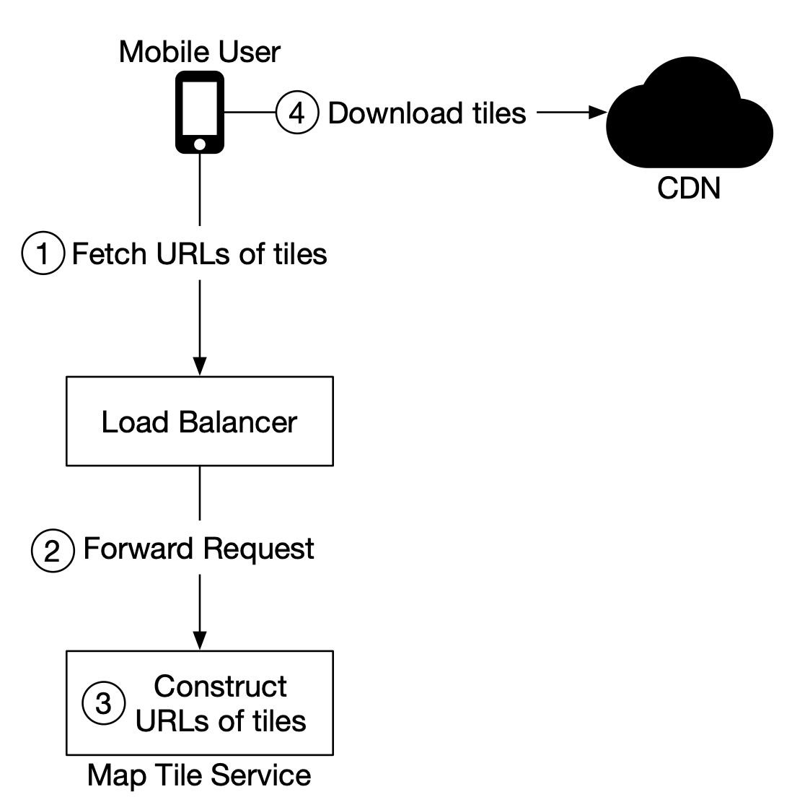

1. A mobile user calls the Map Tile Service with current location and zoom level.
2. The Load Balancer forwards the request.
3. The Map Tile Service calculates and returns 9 tile URLs (the target tile and its 8 neighbors).
4. The client downloads the images directly from the CDN.

---

## Step 3 - Design Deep Dive

### Data Model

We deal with four types of data:
1. **Routing tiles:** Graph nodes/edges serialized into binary files, stored in Amazon S3, and keyed by geohash.
2. **User location data:** High-volume writes stored in Cassandra and streamed via Kafka.
3. **Geocoding database:** Fast key-value store (e.g., Redis) mapping place names to lat/long coordinates.
4. **Precomputed map tiles:** Static PNG images stored in S3 and cached on CDN edges.

*Figure 13 Precomputed tiles*

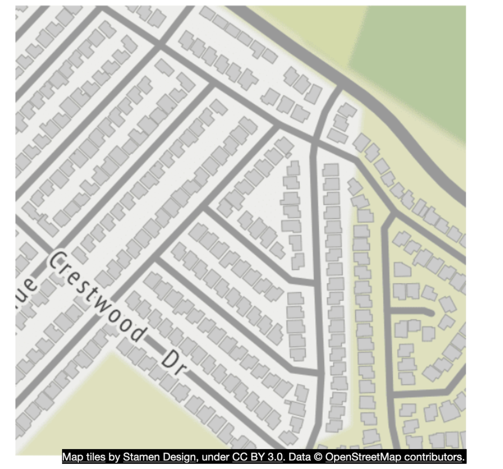

---

### Location Service Deep Dive

*Figure 14 User location database*

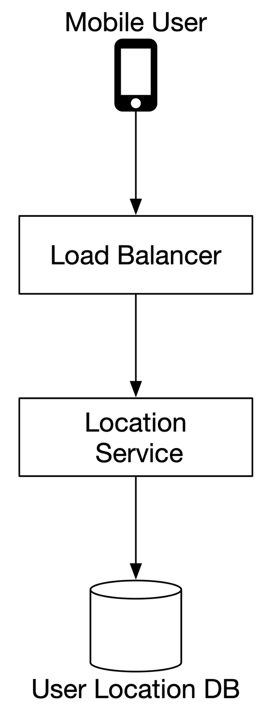

With 1 million updates per second, Cassandra is chosen for its high write throughput, horizontal scalability, and availability focus (AP in the CAP theorem).

- **Partition Key:** `user_id` (enables fast lookups of a user's location history).
- **Clustering Key:** `timestamp` (keeps historical points sorted).

| user_id (Partition Key) | timestamp (Clustering Key) | lat | long | user_mode | navigation_mode |
|:---|:---|:---|:---|:---|:---|
| 51 | 132053000 | 21.9 | 89.8 | active | driving |

*Table 5 Location data*

#### Kafka Stream Consumers

*Figure 15 Location data is used by other services*

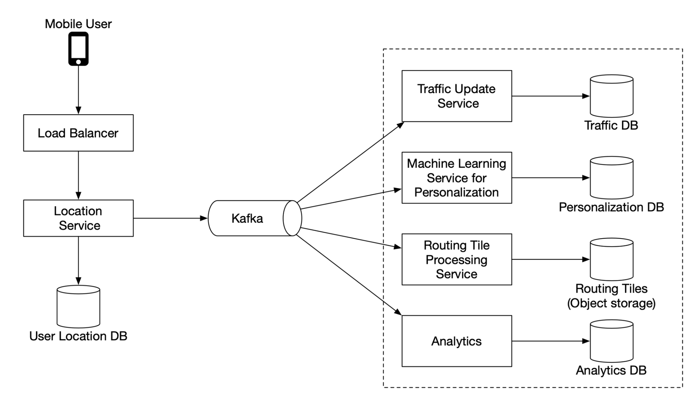

1. **Traffic Update Service:** Extracts live speed and congestion, writing to the Live Traffic DB.
2. **Routing Tile Processing Service:** Detects new roads and road closures, periodically rebuilding routing tiles in S3.
3. **Machine Learning / Personalization Services:** User behavior and personalization analysis.

---

### Map Rendering Optimization

*Figure 16 Zoom levels*

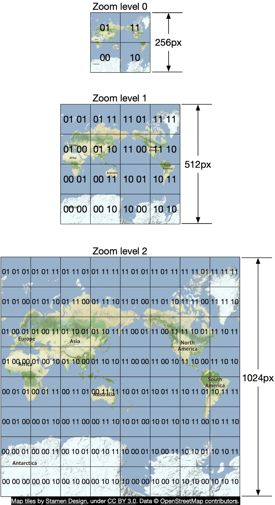

#### Vector Tiles with WebGL

Instead of sending rasterized PNGs over the network, modern systems send vector data (paths and polygons) rendered client-side using WebGL:
- **Bandwidth Savings:** Vector data compresses significantly better than raster images.
- **Smooth Zooming:** Continuous scaling without pixelation or stretching artifacts.

---

### Navigation Service Deep Dive

*Figure 17 Navigation service*

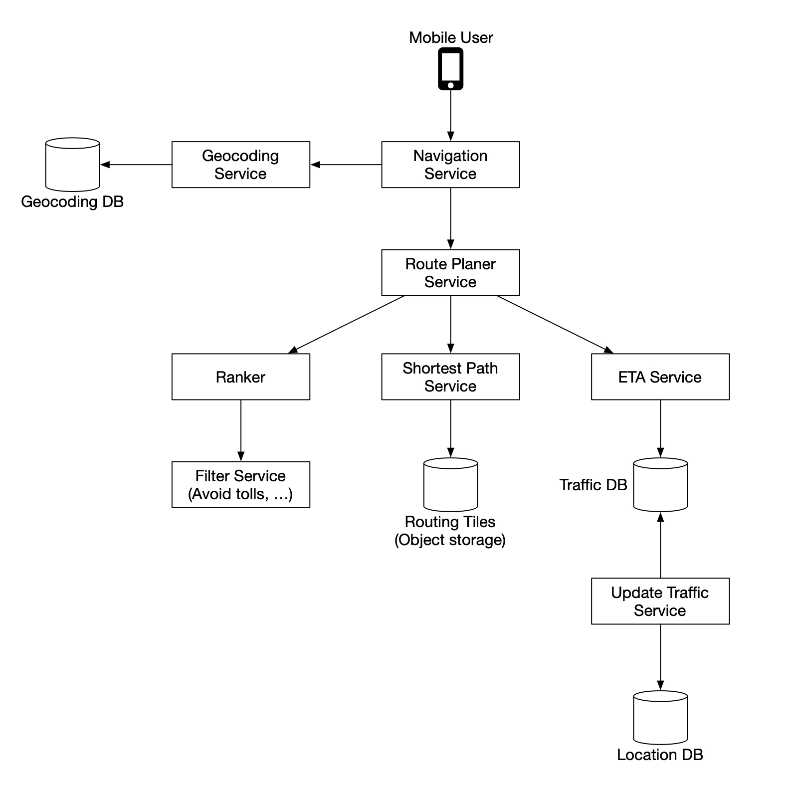

#### Geocoding Service

Resolves textual addresses to geographic coordinates.

```http
GET https://maps.googleapis.com/maps/api/geocode/json?address=1600+Amphitheatre+Parkway,+Mountain+View,+CA
```

```json
{
  "results": [
    {
      "formatted_address": "1600 Amphitheatre Parkway, Mountain View, CA 94043, USA",
      "geometry": {
        "location": { "lat": 37.4224764, "lng": -122.0842499 },
        "location_type": "ROOFTOP",
        "viewport": {
          "northeast": { "lat": 37.423825, "lng": -122.082901 },
          "southwest": { "lat": 37.421127, "lng": -122.085599 }
        }
      },
      "place_id": "ChIJ2eUgeAK6j4ARbn5u_wAGqWA",
      "plus_code": {
        "compound_code": "CWC8+W5 Mountain View, California, United States",
        "global_code": "849VCWC8+W5"
      },
      "types": ["street_address"]
    }
  ],
  "status": "OK"
}
```

#### Shortest-Path Service

Runs a modified A* pathfinding algorithm over hierarchical routing tiles loaded from S3/local cache.

*Figure 18 Graph traversal*

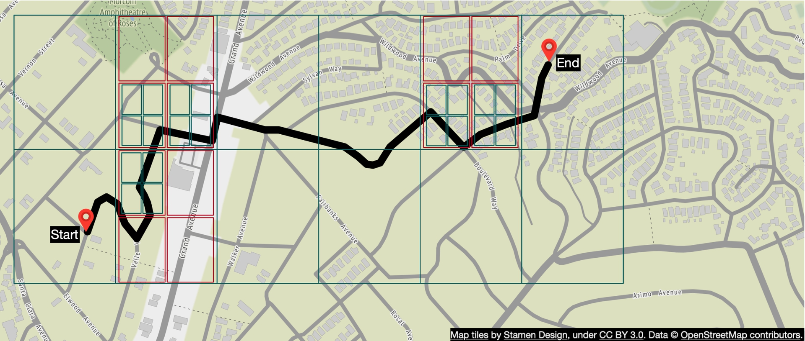

1. Origin and destination lat/lng are converted to geohashes.
2. The search begins at the origin tile and hydrates neighboring tiles.
3. Transitions from local road tiles to higher-level highway tiles allow rapid cross-country routing.

#### ETA and Ranker Services

- **ETA Service:** Machine learning / Graph Neural Networks (GNNs) predict ETAs using historical patterns and live traffic.
- **Ranker Service:** Applies user preferences (e.g., avoid tolls, avoid highways) and ranks candidates from fastest to slowest.

---

### Adaptive ETA and Rerouting

To handle unexpected traffic incidents during active navigation:

#### Naive Approach

Store the sequence of routing tiles traversed by each user ($u_1 \to s_1, s_2, \dots, s_k$). If tile $s_2$ has an incident, scanning all rows takes $O(n \times m)$ time.

*Figure 19 Navigation route*

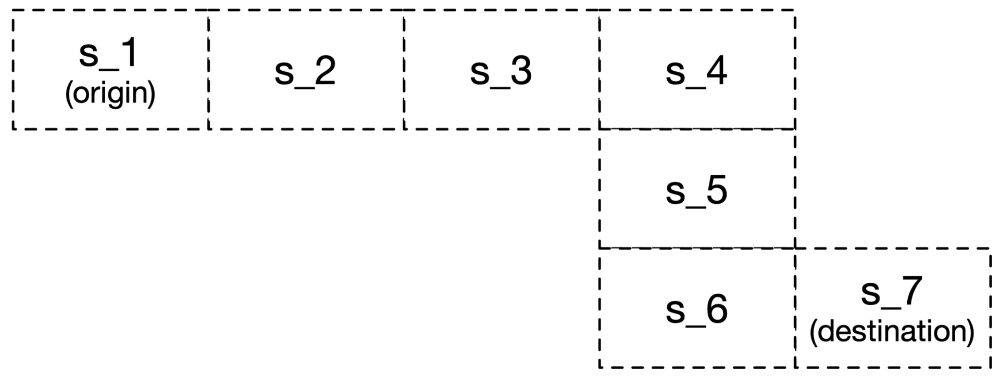

#### Hierarchical Bounding Tile Approach

Track the enclosing parent and grandparent routing tiles (`super(s_1)`, `super(super(s_1))`).

*Figure 20 Build routing tiles*

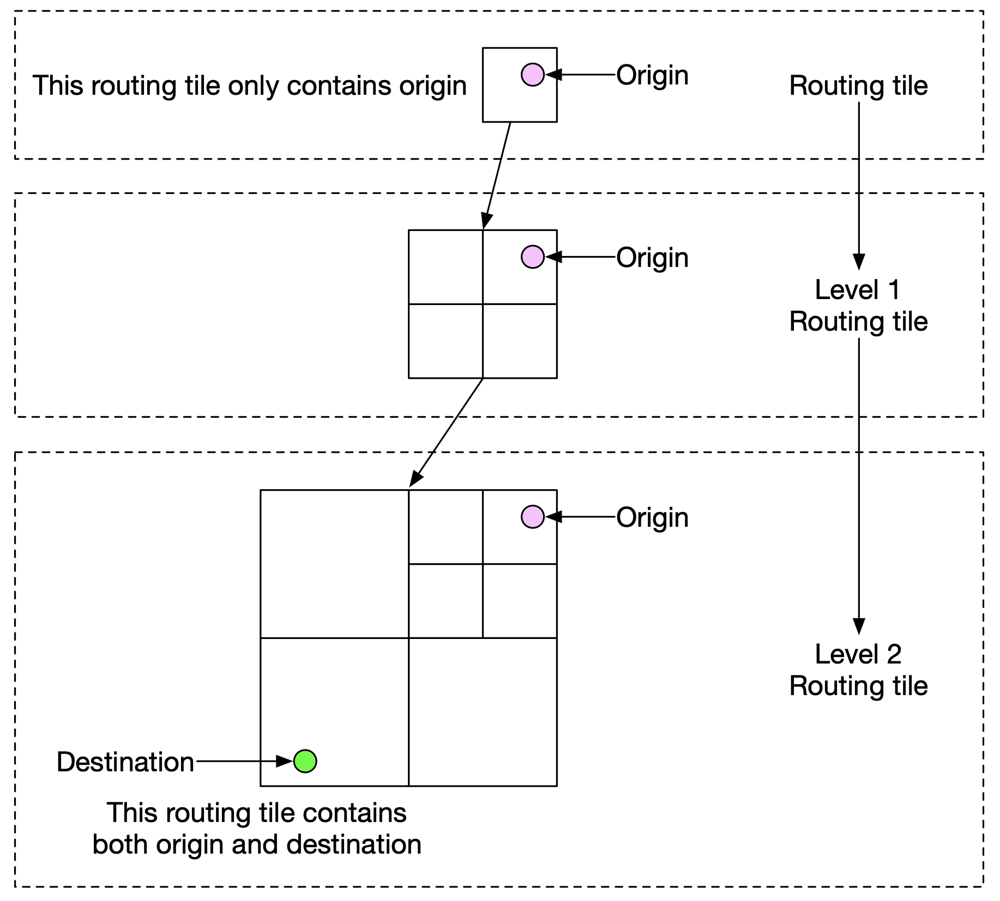

A traffic incident in tile $s$ can quickly be checked against the highest-level tile for fast filtering.

#### Push Delivery Protocol

- **WebSocket:** Chosen over SSE and mobile push notifications for bi-directional communication, low latency, and lightweight server overhead.

---

### Final Architecture

*Figure 21 Final design*

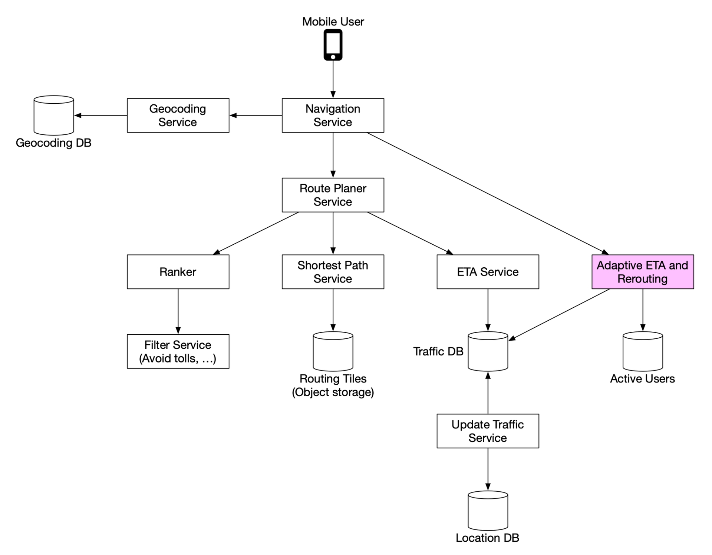

---

## Step 4 - Wrap Up

In this chapter, we designed a scalable Google Maps service supporting:
- **Location Updates:** Client batching + Cassandra + Kafka.
- **Map Rendering:** Precomputed tiles / Vector tiles via CDN.
- **Navigation & Routing:** Hierarchical routing tiles + A* search.
- **Adaptive Rerouting:** ML-based ETA + WebSocket push updates.

---

## Reference Materials

- [1] [Google Maps Platform](https://cloud.google.com/maps-platform/)
- [2] [Google Maps API](https://developers.google.com/maps)
- [3] [Prototyping a Smoother Map - Google Design](https://medium.com/google-design/google-maps-cb0326d165f5)
- [4] [Mercator projection - Wikipedia](https://en.wikipedia.org/wiki/Mercator_projection)
- [5] [Peirce quincuncial projection - Wikipedia](https://en.wikipedia.org/wiki/Peirce_quincuncial_projection)
- [6] [Gall–Peters projection - Wikipedia](https://en.wikipedia.org/wiki/Gall%E2%80%93Peters_projection)
- [7] [Winkel tripel projection - Wikipedia](https://en.wikipedia.org/wiki/Winkel_tripel_projection)
- [8] [Address geocoding - Wikipedia](https://en.wikipedia.org/wiki/Address_geocoding)
- [9] [Geohashing System Design](https://kousiknath.medium.com/system-design-design-a-geo-spatial-index-for-real-time-location-search-10968fe62b9c)
- [10] [HTTP keep-alive - Wikipedia](https://en.wikipedia.org/wiki/HTTP_persistent_connection)
- [11] [Google Maps Directions API](https://developers.google.com/maps/documentation/directions/start)
- [12] [Adjacency list - Wikipedia](https://en.wikipedia.org/wiki/Adjacency_list)
- [13] [CAP theorem - Wikipedia](https://en.wikipedia.org/wiki/CAP_theorem)
- [14] [Routing Tiles - Valhalla Documentation](https://valhalla.readthedocs.io/en/latest/mjolnir/why_tiles/)
- [15] [Traffic prediction with advanced Graph Neural Networks - DeepMind](https://deepmind.com/blog/article/traffic-prediction-with-advanced-graph-neural-networks)
- [16] [Google Maps 101: How AI helps predict traffic and determine routes](https://blog.google/products/maps/google-maps-101-how-ai-helps-predict-traffic-and-determine-routes/)
