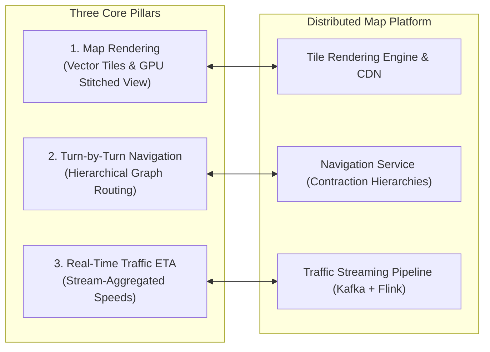
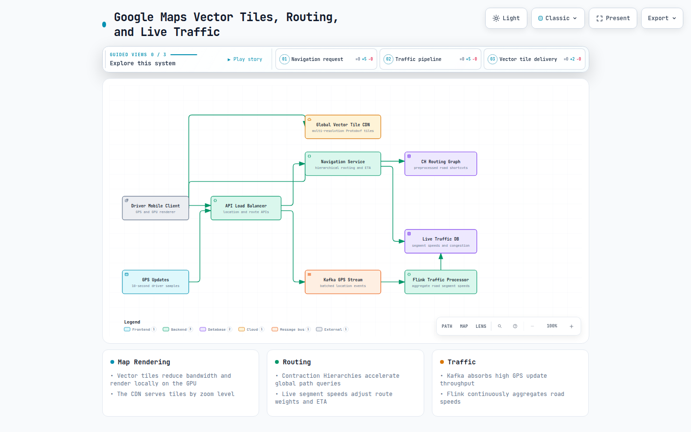
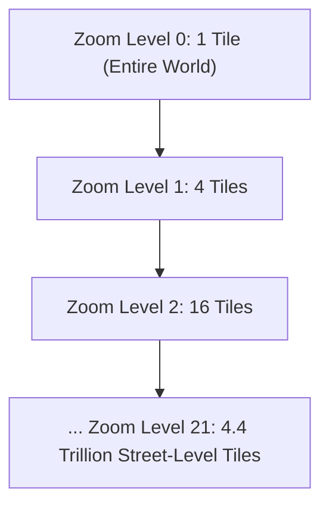
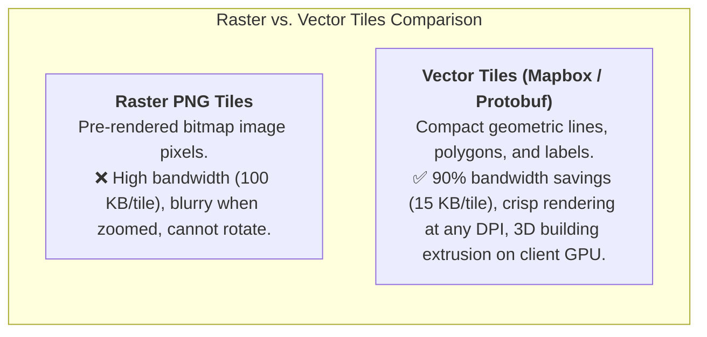
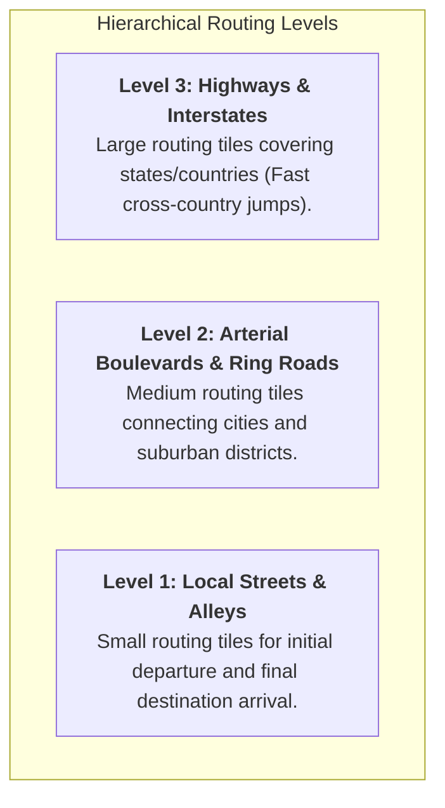
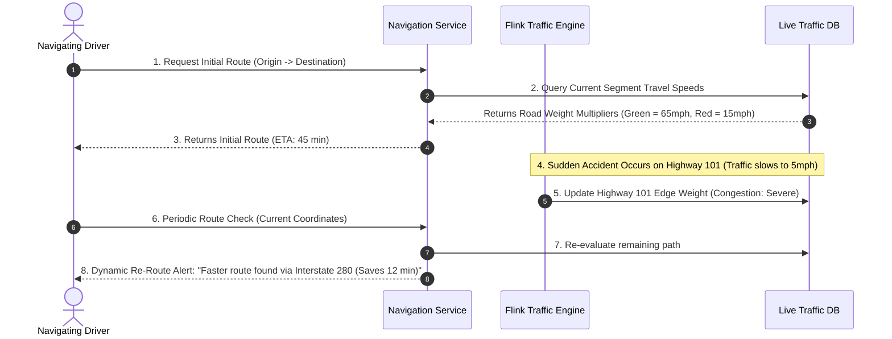
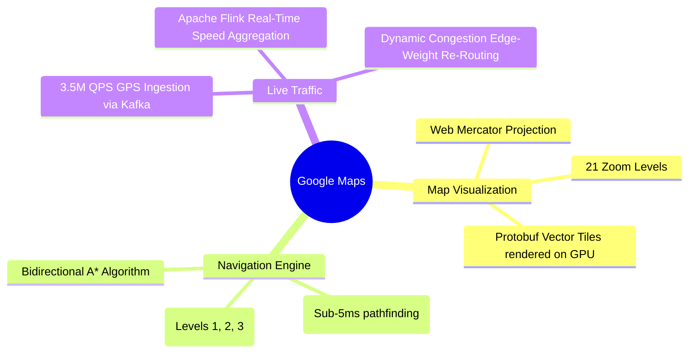

# Google Maps

> **Source**: *System Design Interview – An Insider's Guide: Volume 2* by Alex Xu & Sahn Lam  
> **ByteByteGo Chapter**: 19  
> **Topic**: Geospatial Navigation, Hierarchical Routing Tiles, Contraction Hierarchies, Vector Map Tiling, Real-Time Streaming Traffic ETA

---

## 1. Understand the Problem and Establish Design Scope

Google Maps provides worldwide map visualization, turn-by-turn navigation routing, and live traffic-aware Estimated Time of Arrival (ETA) for over 1 billion users.





[Open the interactive Archify diagram](resources/google-maps/google-maps-tiles-routing-traffic.html)

---

### Interview Clarification & Scope

> **Candidate:** What are the three core features to support?  
> **Interviewer:** **User location tracking**, **turn-by-turn navigation with ETA**, and **map rendering**.
>
> **Candidate:** What is the daily scale?  
> **Interviewer:** **1 Billion Daily Active Users (DAU)**, with **35 Million concurrent active turn-by-turn navigators**.
>
> **Candidate:** How should traffic affect routing?  
> **Interviewer:** Routing must dynamically incorporate live road traffic conditions and calculate accurate ETAs.
>
> **Candidate:** How is the map rendered?  
> **Interviewer:** Use **Vector Map Tiles** (Protobufs) rendered locally on client mobile GPUs to save cellular bandwidth.

---

### Back-of-the-Envelope Estimation

| Metric / Dimension | Calculation | Estimated Value |
|:---|:---|:---|
| **Daily Active Users (DAU)** | Given | $1{,}000{,}000{,}000\text{ DAU}$ |
| **Concurrent Navigation Sessions** | $35{,}000{,}000\text{ active drivers}$ | $35{,}000{,}000\text{ sessions}$ |
| **Location Update Frequency** | Every $10\text{ seconds}$ per driver | $\frac{35{,}000{,}000}{10\text{ sec}} \approx \mathbf{3{,}500{,}000\text{ GPS QPS}}$ |
| **Global Road Graph Data** | Billions of intersections & road segments | $\approx \mathbf{100\text{ TB Hierarchical Graph}}$ |
| **Tile CDN Storage** | 21 Zoom Levels (Vector Tiles) | $\approx \mathbf{50\text{ TB in Edge CDN}}$ |

---

## 2. Map Rendering: Multi-Resolution Vector Tiles

Rather than streaming huge monolithic images, the globe is projected via **Web Mercator** and subdivided into hierarchical $256 \times 256$ grid tiles across **21 Zoom Levels**:





---

## 3. Navigation & Routing Algorithms in Depth

A naive Dijkstra or $A^*$ search on a single global graph of 1 billion road segments takes seconds and requires hundreds of gigabytes of RAM. Google Maps utilizes **Hierarchical Routing Tiles** and **Contraction Hierarchies (CH)**:




---

### Contraction Hierarchies (CH) Algorithm
- **Pre-processing**: Iteratively "contracts" (removes) unimportant local intersection nodes by adding precomputed shortcut edges between high-degree highway vertices.
- **Query Phase**: Performs a bidirectional Dijkstra search only exploring "upward" edges in the contraction hierarchy, computing the shortest path across thousands of miles in **$< 5\text{ milliseconds}$**.

---

## 4. End-to-End System Architecture

```mermaid
flowchart TD
    subgraph MobileClient["Mobile Device (Driver)"]
        GPS["GPS Chipset (10s Update)"]
        RENDER["Vector Map Render Engine (GPU)"]
    end

    subgraph EdgeCDN["Edge & Gateway Tier"]
        CDN["Global Tile CDN (Vector Tiles)"]
        LB["API Load Balancer"]
    end

    subgraph ServiceFleet["Microservices Fleet"]
        NAV_SVC["Navigation & Route Planner"]
        LOC_SVC["Location Tracking Service"]
    end

    subgraph StreamingPipeline["Live Traffic Processing Engine"]
        KAFKA["Kafka Ingestion Stream (3.5M GPS QPS)"]
        FLINK["Apache Flink Stream Processor<br/>(Computes Segment Speeds)"]
        TRAFFIC_DB[("Live Traffic DB<br/>(Edge Speeds & Congestion)")]
    end

    subgraph StorageTier["Graph & Metadata Storage"]
        ROUTING_TILES[("Hierarchical Routing Graph (CH)")]
    end

    GPS -->|1. POST /v1/locations (Batch GPS)| LB --> LOC_SVC --> KAFKA
    KAFKA --> FLINK --> TRAFFIC_DB
    
    MobileClient -->|2. GET /v1/routes (Start -> End)| LB --> NAV_SVC
    NAV_SVC <--> ROUTING_TILES & TRAFFIC_DB
    
    RENDER <-->|3. Fetch Vector Tiles| CDN
```

---

## 5. Dynamic Traffic Re-Routing Flow



---

## 6. Architectural Summary



| Component | Technical Choice | Core System Benefit |
|:---|:---|:---|
| **Map Rendering** | Vector Tiles (Protobuf) | Reduces network payload by $90\%$ and allows smooth client-side zooming/tilting. |
| **Pathfinding Engine** | Contraction Hierarchies (CH) | Accelerates continental shortest-path queries from seconds to under $5\text{ ms}$. |
| **Routing Graph** | Geohash Hierarchical Routing Tiles | Partitions planetary road data so only local, relevant graph tiles are loaded into RAM. |
| **Traffic Engine** | Apache Flink Stream Processing | Continuously aggregates millions of GPS pings to maintain real-time road edge speeds. |

---

## References

1. Geohashing and Web Mercator Map Tiling: https://en.wikipedia.org/wiki/Web_Mercator_projection
2. Contraction Hierarchies: Faster and Simpler Hierarchical Routing (Geisberger et al.): https://algo2.iti.kit.edu/documents/route_planning/geisberger_dipl.pdf
3. Mapbox Vector Tile Specification: https://github.com/mapbox/vector-tile-spec
