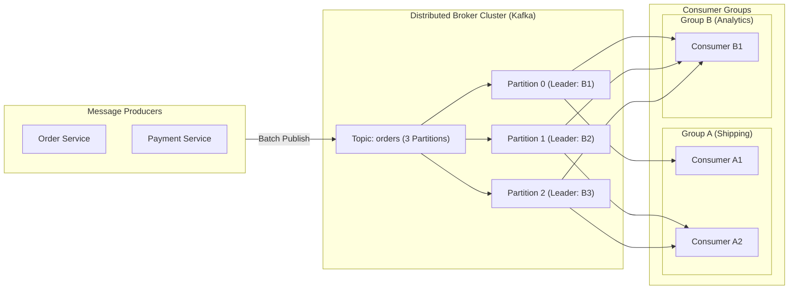
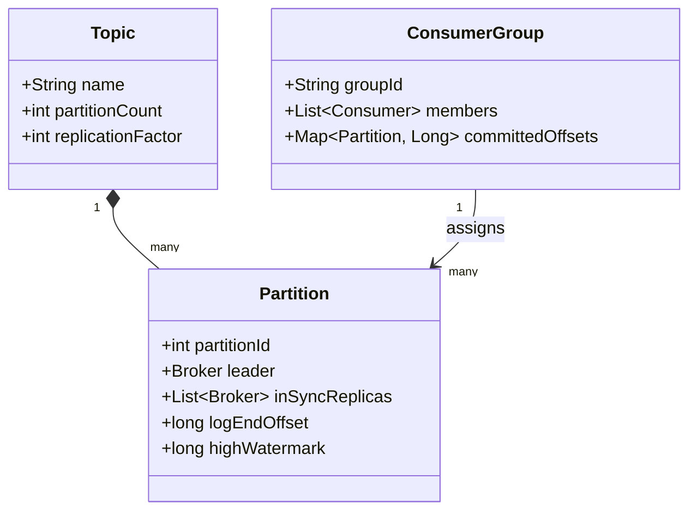
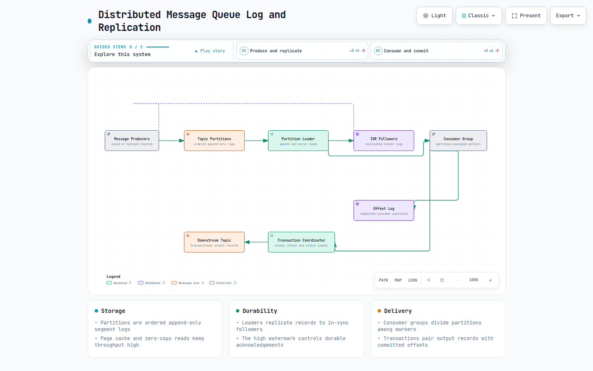
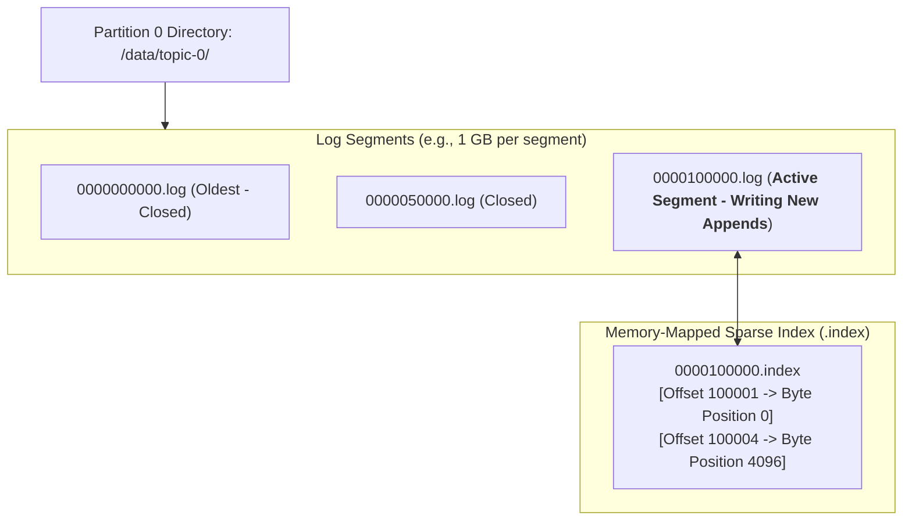
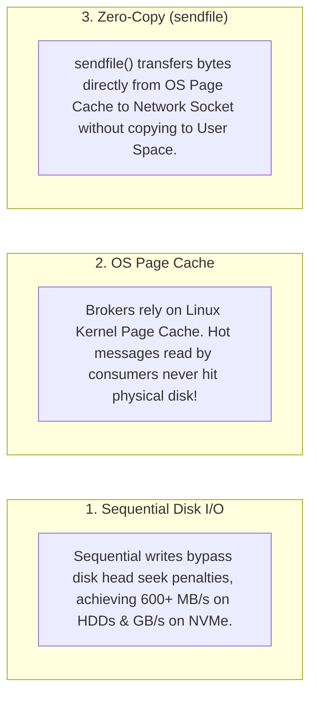
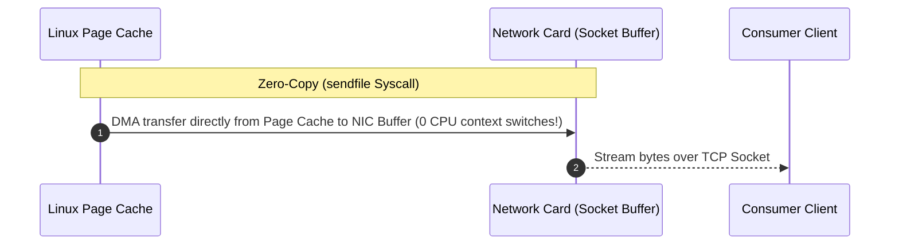
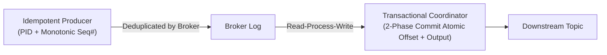
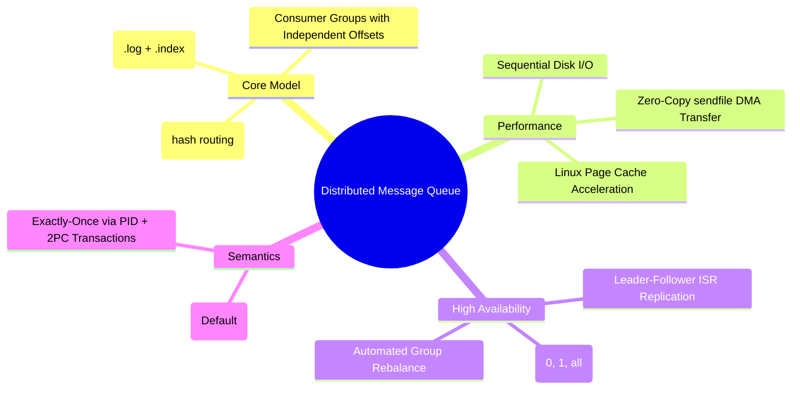

# Distributed Message Queue

> **Source**: *System Design Interview – An Insider's Guide: Volume 2* by Alex Xu & Sahn Lam  
> **ByteByteGo Chapter**: 20  
> **Topic**: Append-Only Commit Logs, Zero-Copy I/O, Partitioning & ISR Replication, Consumer Group Rebalancing, Exactly-Once Semantics

---

## 1. Understand the Problem and Establish Design Scope

A distributed message queue provides high-throughput, low-latency, and durable publish-subscribe messaging between decoupled distributed microservices.



---

### Interview Clarification & Scope

> **Candidate:** What delivery models should be supported?  
> **Interviewer:** Both **point-to-point** (competing workers within a consumer group) and **publish-subscribe** (independent consumer groups).
>
> **Candidate:** What are the message retention and ordering requirements?  
> **Interviewer:** Configurable retention (e.g., $14\text{ days}$). Messages must be strictly ordered **within each partition**.
>
> **Candidate:** What delivery semantics are required?  
> **Interviewer:** Support configurable semantics: **At-most-once**, **At-least-once**, and **Exactly-once**.
>
> **Candidate:** What are the performance and scale targets?  
> **Interviewer:** High throughput (millions of messages per second), sub-10ms delivery latency, and petabyte-scale durable log storage.

---

## 2. Core Architecture: Topics, Partitions, and Consumer Groups





[Open the interactive Archify diagram](resources/distributed-message-queue/distributed-message-queue-log-replication.html)

### Partitioning Rules
- **Keyed Messages**: $\text{Partition} = \text{hash}(\text{message\_key}) \pmod{\text{partition\_count}}$ (Guarantees strict per-entity ordering).
- **Keyless Messages**: Round-robin / sticky batching across partitions for uniform load distribution.

---

## 3. High-Throughput Storage Engine: Append-Only Segment Logs

General-purpose SQL/NoSQL databases degrade under heavy random write loads. A distributed queue structures each partition as an **append-only sequence of immutable disk segment files**:



---

### Three Pillars of Maximum I/O Performance





---

## 4. Replication, High Availability & Quorum (ISR)

Each partition maintains a configured number of replicas ($N=3$) distributed across independent broker nodes:

```mermaid
flowchart TD
    PRODUCER["Producer (acks=all)"] --> LEADER["Broker 1 (Partition Leader)"]
    
    subgraph ISRCluster["In-Sync Replicas (ISR)"]
        LEADER
        F1["Broker 2 (Follower 1)"]
        F2["Broker 3 (Follower 2)"]
    end

    LEADER -->|Replicate Log Append| F1 & F2
    F1 & F2 -->>|ACK Replicated| LEADER
    LEADER -->>|High Watermark Advanced -> Commit ACK| PRODUCER
```

### Producer Acknowledgment Levels (`acks`)

| `acks` Level | Description | Durability | Latency |
|:---|:---|:---|:---|
| **`acks = 0`** | Producer sends and does not wait for broker response (Fire & Forget). | Lowest (Data loss on crash) | **Fastest ($< 1\text{ ms}$)** |
| **`acks = 1`** | Producer waits until **Partition Leader** commits to local log. | Medium (Loss if leader dies before replication) | Fast ($2\text{–}5\text{ ms}$) |
| **`acks = all` (`-1`)**| Producer waits until **all In-Sync Replicas (ISR)** commit to log. | **Maximum (Zero data loss)** | Medium ($5\text{–}15\text{ ms}$) |

---

## 5. Consumer Offset Tracking & Rebalancing

```mermaid
flowchart TD
    CONSUMER["Consumer A1 in Group 'shipping'"] -->|1. Poll Messages| BROKER["Broker Partition Leader"]
    BROKER -->>|2. Batch of Messages| CONSUMER
    CONSUMER ->|3. Process Batch & Commit Offset 4500| OFFSETS_TOPIC[("__consumer_offsets Topic<br/>(Compacted Log)")]
```

### Consumer Group Rebalance Protocol
When a consumer joins, crashes, or partitions change:
1. **Group Coordinator** (designated broker) detects missing heartbeats ($> 10\text{s}$).
2. Triggers **Rebalance**: Revokes existing partition assignments.
3. Elects **Group Leader Consumer** to compute a new balanced partition assignment matrix (Range / Round-Robin / Sticky).
4. Synchronizes new partition claims across remaining consumers.

---

## 6. Delivery Semantics: Exactly-Once Processing (EOS)



1. **Idempotent Producer**: Prevents network retry duplicates by tagging each batch with a unique Producer ID (`PID`) and monotonically increasing Sequence Number (`Seq#`).
2. **Transactional Coordinator**: Uses a Two-Phase Commit protocol to atomically commit consumer offsets and produced messages together.

---

## 7. Architectural Summary



| Subsystem | Architectural Decision | Core Rationale |
|:---|:---|:---|
| **Storage Engine** | Append-Only Disk Segments | Exploits sequential I/O to achieve hardware-limit throughput on low-cost disks. |
| **Data Transfer** | Linux OS `sendfile` Zero-Copy | Eliminates CPU memory copy overhead between kernel page cache and network buffers. |
| **Replication** | In-Sync Replicas (ISR) Quorum | Prevents data loss during leader broker failures while maintaining bounded replication latency. |
| **Scalability** | Horizontal Topic Partitioning | Allows linearly scaling write throughput and consumer parallelism across broker clusters. |

---

## References

1. Kafka: A Distributed Messaging System for Log Processing (Kreps et al. LinkedIn): https://www.microsoft.com/en-us/research/wp-content/uploads/2017/09/Kafka.pdf
2. Apache Kafka Documentation & Architecture: https://kafka.apache.org/documentation/
3. It's Okay to Store Data on Disk (Sequential I/O Benchmarks): https://queue.acm.org/detail.cfm?id=1563874
