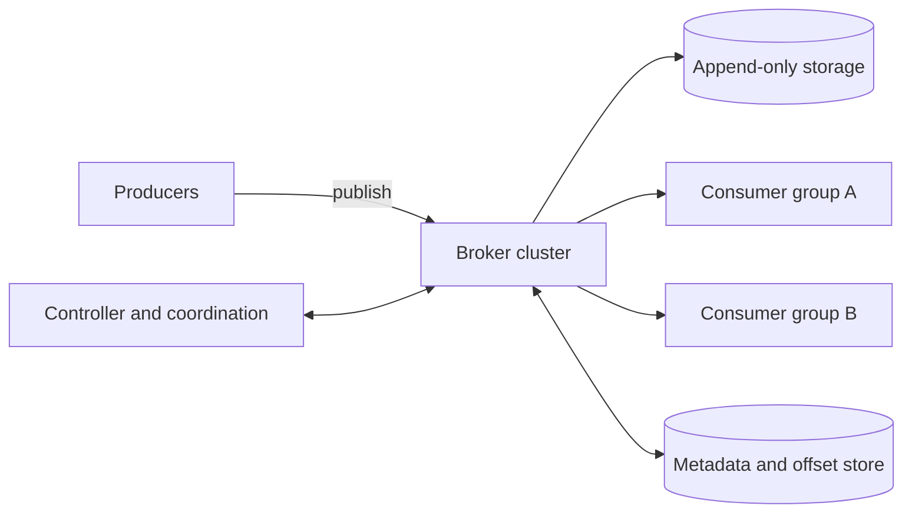

# Distributed Message Queue

> **Source**: System Design Interview – An Insider's Guide: Volume 2 by Alex Xu & Sahn Lam
> **ByteByteGo Chapter**: 20

## 1. Problem statement

Design a distributed message queue that lets producers publish messages and consumers process them reliably at scale.

The system should support both:

- **Point-to-point delivery**: one consumer in a group processes each message.
- **Publish-subscribe delivery**: multiple consumer groups process the same message independently.

The design also needs configurable retention, ordering, throughput, latency, and delivery guarantees.

## 2. Clarify the requirements

| Question | Assumption |
| --- | --- |
| Message format and size | Text or small binary payloads, usually a few KB. |
| Retention | Messages are retained for two weeks. |
| Replay | Consumers can replay retained messages. |
| Ordering | Messages are ordered within a partition. Global ordering is not required. |
| Scale | Support many producers and consumers, with high throughput. |
| Delivery semantics | At-most-once, at-least-once, and exactly-once are configurable. |
| Workload | Support both high-throughput streams and low-latency queues. |

### Functional requirements

- Producers publish messages to topics.
- Consumers read messages from topics.
- Consumer groups maintain independent positions and can replay messages.
- Historical messages expire according to a retention policy.
- A message key can keep related messages in the same partition.
- Ordering is guaranteed within each partition.
- Producers can choose a delivery acknowledgment level.

### Non-functional requirements

- Horizontally scalable and distributed.
- Durable: messages are written to disk and replicated.
- Fault tolerant: broker failures should not lose committed messages.
- Tunable for either throughput or latency.
- Able to absorb traffic spikes.

### Traditional queue versus retained log

Traditional queues such as RabbitMQ usually remove a message after successful delivery. This design behaves more like a durable event log: messages remain available during the retention period, so several consumer groups can read them independently.

## 3. Core model

### Topics, partitions, and brokers

- A **topic** groups related messages.
- A topic is split into **partitions** for scale.
- Each partition is an append-only FIFO log.
- A message's position in a partition is its **offset**.
- A **broker** stores partitions and serves reads and writes.
- Replicas of a partition are placed on different brokers.

Messages with the same key are routed to the same partition, commonly with:

```text
partition = hash(messageKey) % partitionCount
```

Messages without a key can be distributed across partitions. Ordering is therefore guaranteed only for messages that share a partition.

### Consumer groups

A consumer group is a set of consumers that share work:

- Each partition is assigned to at most one consumer in a group.
- Different groups keep separate offsets and can read the same messages.
- A single group can simulate point-to-point delivery.
- Adding consumers increases parallelism until there are more consumers than partitions.

## 4. High-level architecture



### Components

| Component | Responsibility |
| --- | --- |
| Producer client | Selects a partition, buffers messages, and sends batches. |
| Broker | Accepts writes, serves reads, and owns partition replicas. |
| Partition | Stores an ordered subset of a topic. |
| Consumer group coordinator | Tracks membership, heartbeats, partition assignments, and offsets. |
| Data storage | Persists message logs. |
| State storage | Persists consumer-group offsets and assignments. |
| Metadata storage | Stores topics, partitions, retention, and replica placement. |
| Coordination service | Detects brokers, elects a controller, and coordinates cluster metadata. |

The controller creates the replica distribution plan and assigns partition leaders. ZooKeeper or etcd are common coordination choices. Modern Kafka deployments can also store this metadata within the Kafka cluster itself.

## 5. Storage design

### Why not a database?

The workload is primarily append, sequential read, and retention-based deletion. A general-purpose database can store the data, but random-access indexes, update semantics, and coordination overhead make it a poor fit at high volume.

### Append-only log segments

Store each partition as a sequence of log segments:

1. Append new messages to the active segment.
2. When it reaches a size limit, close it and create a new active segment.
3. Read older segments sequentially.
4. Delete expired segments when the retention period or capacity limit is reached.

This layout provides efficient sequential disk access and works well with the operating system's page cache. It also avoids rewriting existing messages.

### Message format

| Field | Purpose |
| --- | --- |
| `key` | Optional business key used for partition routing. |
| `value` | Message payload. |
| `topic` | Owning topic. |
| `partition` | Partition identifier. |
| `offset` | Position within the partition. |
| `timestamp` | Storage time. |
| `size` | Payload size. |
| `crc` | Detects corrupted data. |

The same message representation should pass from producer to broker to consumer without unnecessary mutation or copying.

### Batching

Batch at every layer:

- Producers collect messages before sending.
- Brokers append batches to the log.
- Consumers fetch batches.

Larger batches improve network and disk throughput, but increase latency while the system waits to fill a batch. Use smaller batches for latency-sensitive queues and larger batches for log aggregation.

## 6. Producer flow

1. The producer fetches or caches topic metadata.
2. It chooses a partition using the message key or a custom partitioner.
3. The producer buffers messages and sends a batch directly to the partition leader.
4. Followers copy the batch from the leader.
5. The leader acknowledges the write according to the configured acknowledgment level.

Embedding routing and buffering in the producer client avoids a separate routing hop and makes batching easier.

## 7. Consumer flow

Consumers normally use a pull model:

1. A consumer joins a group and sends heartbeats to its coordinator.
2. The coordinator assigns partitions to group members.
3. The consumer fetches a batch starting at its committed offset.
4. It processes the batch.
5. It commits the offset according to the chosen delivery semantic.

Pulling lets consumers control their own rate. Long polling prevents consumers from repeatedly sending empty requests when no messages are available.

### Rebalancing

The coordinator reassigns partitions when a consumer joins, leaves, crashes, or when the topic changes.

Typical sequence:

1. The coordinator detects a membership change through a join or missed heartbeat.
2. Existing consumers rejoin the group.
3. A group leader creates a new partition assignment.
4. The coordinator distributes the assignment.
5. Consumers resume from their committed offsets.

Rebalancing improves fault tolerance, but it temporarily pauses consumption. Assignment strategies include round-robin and range-based assignment.

## 8. Replication and durability

Each partition has one leader and one or more followers:

- Producers write to the leader.
- Followers copy data from the leader.
- Consumers normally read from the leader.
- The controller can promote a follower if the leader fails.

Replicas should be placed on different broker nodes, and preferably across availability zones when the durability requirement justifies the added cost and latency.

### In-sync replicas

An **in-sync replica (ISR)** is a replica that is sufficiently caught up with the leader. The exact lag threshold is configurable.

ISR membership balances durability and availability:

- Waiting for every replica gives stronger durability but lets a slow replica delay writes.
- Accepting fewer replicas improves latency but increases the risk of data loss during failures.

### Acknowledgment levels

| Setting | Producer receives an acknowledgment when | Trade-off |
| --- | --- | --- |
| `ack=0` | The request is sent; no response is required. | Lowest latency, highest loss risk. |
| `ack=1` | The leader persists the message. | Good latency, but a leader failure before replication can lose data. |
| `ack=all` | The required ISR set persists the message. | Strongest durability, highest latency. |

`ack=all` should be combined with a minimum ISR setting. Otherwise, a partition with too few healthy replicas could still accept writes with weaker durability than intended.

## 9. Delivery semantics

The processing order and offset-commit order determine what happens when a consumer fails.

| Semantic | Producer behavior | Consumer behavior | Result |
| --- | --- | --- | --- |
| At-most-once | Do not retry after a failed send. | Commit the offset before processing. | No duplicates, but messages can be lost. |
| At-least-once | Retry until the broker confirms the write. | Commit after successful processing. | No intentional loss, but duplicates are possible. |
| Exactly-once | Requires coordinated writes and retries. | Processing and offset update must be atomic or idempotent. | Avoids duplicates, but adds complexity and reduces performance. |

At-least-once is the usual default. Consumers should be idempotent or deduplicate with a unique message ID. Exactly-once is most valuable when duplicates are unacceptable, such as some payment or accounting workflows.

## 10. Scaling and failure recovery

### Producers and consumers

- Add producer instances to increase publishing capacity.
- Add consumer groups without affecting other groups.
- Add consumers within a group up to the number of partitions.
- Pre-create enough partitions because increasing partitions can change key-to-partition mapping and requires rebalancing.

### Broker failure

When a broker fails:

1. The controller detects the failure.
2. A healthy ISR is promoted to leader.
3. Partition assignments are updated.
4. New replicas are created on healthy brokers.
5. The new replicas catch up before being considered fully healthy.

Replica placement, minimum ISR, and cross-zone replication determine how much failure the system can tolerate.

### Adding a broker

To avoid data loss, add a new replica first, let it catch up, and remove the old replica afterward. This temporarily creates extra replicas but allows a graceful migration.

### Changing partition count

- **Increase**: new messages can use the new partitions; old messages remain where they were.
- **Decrease**: stop writing to the removed partition, but keep it readable until its retained data expires. Decreasing partitions is not an immediate storage cleanup operation.

## 11. Optional features

### Message filtering

Put filterable metadata, such as tags or event type, alongside the message. Brokers can filter using metadata without decrypting or deserializing the payload. Complex script-based filtering is more flexible but adds broker cost and security risk.

### Delayed and scheduled messages

Store delayed messages temporarily and publish them to the target topic when their delivery time arrives. Common timing approaches are:

- Predefined delay queues.
- A hierarchical time wheel for many scheduled delivery times.

### Retry topics and archival

- Send failed messages to a retry topic so they do not block new traffic.
- Archive expired messages to object storage or another large-capacity store when consumers need long-term replay.

## 12. Key trade-offs

| Decision | Favors | Costs |
| --- | --- | --- |
| More partitions | Throughput and consumer parallelism | More metadata and coordination. |
| Larger batches | Throughput and disk efficiency | Higher latency. |
| Pull consumers | Back-pressure and flexible processing rates | Empty polls without long polling. |
| More replicas | Durability and availability | Storage, network, and replication cost. |
| Stronger acknowledgments | Lower data-loss risk | Higher write latency. |
| Longer retention | Replay and recovery | More storage cost. |

## 13. Interview wrap-up

The core design is an append-only, partitioned log replicated across brokers:

1. Producers route keyed messages to partitions and send batches.
2. Brokers append messages to durable log segments.
3. Followers replicate partition data.
4. Consumer groups pull batches and track independent offsets.
5. A controller handles leader election, partition placement, and recovery.
6. Acknowledgment and offset-commit policies provide configurable delivery semantics.

The most important limitation to state explicitly is ordering: the system guarantees order within a partition, not across all partitions.

## References

1. [RabbitMQ queue length limits](https://www.rabbitmq.com/maxlength.html)
2. [Apache ZooKeeper](https://zookeeper.apache.org/)
3. [etcd](https://etcd.io/)
4. [Push versus pull in Kafka](https://kafka.apache.org/documentation/#design_pull)
5. [Kafka consumer configuration](https://kafka.apache.org/20/documentation.html#consumerconfigs)
6. Martin Kleppmann, [Designing Data-Intensive Applications](https://dataintensive.net/), chapter 5.
7. [Kafka ISR explanation](https://www.cloudkarafka.com/blog/what-does-in-sync-in-apache-kafka-really-mean.html)
8. [Kafka fetch from the closest replica](https://cwiki.apache.org/confluence/display/KAFKA/KIP-392%3A+Allow+consumers+to+fetch+from+closest+replica)
9. [Kafka replication](https://www.confluent.io/blog/hands-free-kafka-replication-a-lesson-in-operational-simplicity/)
10. [Kafka mirroring](https://cwiki.apache.org/confluence/pages/viewpage.action?pageId=27846330)
