# Metrics Monitoring and Alerting System

> **Source**: *System Design Interview – An Insider's Guide: Volume 2* by Alex Xu & Sahn Lam  
> **ByteByteGo Chapter**: 21  
> **Topic**: Large-Scale Observability, Time-Series Databases (TSDB), Push vs. Pull, Stream Processing, and Alert Pipeline

---

## 1. Understand the Problem and Establish Design Scope

A metrics monitoring and alerting system provides visibility into infrastructure health, tracks application performance, detects anomalies, and notifies on-call engineers of operational issues.

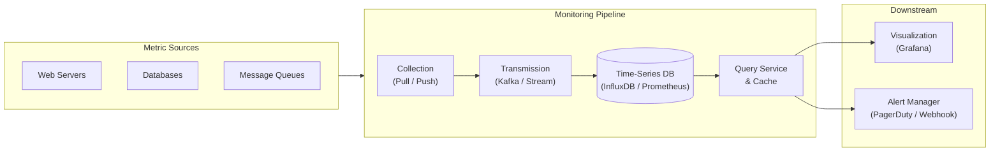

---

### Interview Clarification & Scope

> **Candidate:** Who are we building the system for? An in-house system for a large enterprise (e.g., Google, Meta) or a multi-tenant SaaS service like Datadog or Splunk?  
> **Interviewer:** We are building it for internal infrastructure use only.
>
> **Candidate:** Which metrics do we want to collect?  
> **Interviewer:** Operational system metrics (OS-level: CPU load, memory usage, disk consumption) and high-level service metrics (requests per second, server count, message queue depth). Business metrics are out of scope.
>
> **Candidate:** What is the scale of the monitored infrastructure?  
> **Interviewer:** 100 million daily active users (DAU), 1,000 server pools, and 100 machines per pool (~100,000 servers total).
>
> **Candidate:** What is the data retention policy?  
> **Interviewer:** 1-year total data retention.
>
> **Candidate:** Can we reduce data resolution over time (downsampling)?  
> **Interviewer:** Yes:
> - **Raw resolution**: Keep for 7 days.
> - **1-minute resolution**: Keep for 30 days.
> - **1-hour resolution**: Keep for 1 year (cold storage / archive).
>
> **Candidate:** What alert notification channels should be supported?  
> **Interviewer:** Email, SMS/phone, PagerDuty, and custom HTTP webhooks.
>
> **Candidate:** Do we need to collect logs (e.g., access logs, error logs) or support distributed tracing?  
> **Interviewer:** No, log collection (ELK stack) and distributed tracing (Zipkin, Jaeger, Dapper) are out of scope.

---

### Requirements Summary

#### Functional Requirements
1. **Data Collection**: Ingest operational system and application metrics from heterogeneous sources (web servers, databases, queues).
2. **Time-Series Storage**: Store high-frequency metric data points with labels/tags.
3. **Data Aggregation & Downsampling**: Support rollup strategies over retention boundaries (raw $\rightarrow$ 1-min $\rightarrow$ 1-hour).
4. **Alerting Pipeline**: Evaluate rule-based thresholds, deduplicate alerts, track alert lifecycle states, and dispatch notifications.
5. **Visualization**: Provide low-latency querying and dashboard rendering (e.g., Grafana integration).

#### Non-Functional Requirements
- **Scalability**: Handle heavy, continuous write loads (tens of millions of metric series updated every few seconds).
- **Low Query Latency**: Dashboards and alert evaluation rules must execute quickly with minimal latency.
- **Reliability & Durability**: The system must not lose metric data during downstream outages, and critical alerts must never be dropped.
- **Flexibility**: Extensible pipeline to ingest new metric formats and integrate modern collectors.

#### Out of Scope
- **Log Monitoring**: Unstructured/structured log indexing (handled via Elasticsearch / OpenSearch / Loki).
- **Distributed Tracing**: Request span tracking through distributed microservices (handled via OpenTelemetry / Jaeger).

---

### Back-of-the-Envelope Estimation

| Metric / Dimension | Calculation & Value |
|:---|:---|
| **Monitored Servers** | $1{,}000\text{ server pools} \times 100\text{ machines/pool} = 100{,}000\text{ servers}$ |
| **Metric Series per Server** | $\approx 100\text{ metrics/server}$ |
| **Total Concurrent Time-Series** | $100{,}000\text{ servers} \times 100\text{ metrics} = 10{,}000{,}000\text{ (10 Million metrics)}$ |
| **Collection Interval** | $10\text{ seconds (default)}$ |
| **Write Throughput (QPS)** | $\frac{10{,}000{,}000\text{ metrics}}{10\text{ seconds}} = 1{,}000{,}000\text{ writes/sec (1M QPS)}$ |
| **Peak Write Throughput** | $2\times\text{ average} \approx 2{,}000{,}000\text{ writes/sec (2M QPS)}$ |
| **Raw Metric Point Size** | $\approx 16\text{ bytes (Timestamp: 8B, Metric Value: 8B) + metadata}$ |
| **Daily Raw Storage (Uncompressed)** | $10\text{M} \times 6\text{ points/min} \times 1{,}440\text{ min/day} \times 16\text{ bytes} \approx 1.38\text{ TB/day}$ |
| **Daily Raw Storage (Compressed)** | With delta-of-delta compression ($\approx 4\times$ reduction) $\approx 350\text{ GB/day}$ |
| **7-Day Raw Data Storage** | $350\text{ GB/day} \times 7\text{ days} \approx 2.45\text{ TB}$ |
| **30-Day Rollup (1-min)** | $\frac{1}{6}\text{ volume of raw} \times 30\text{ days} \approx 1.75\text{ TB}$ |
| **1-Year Rollup (1-hour)** | $\frac{1}{360}\text{ volume of raw} \times 365\text{ days} \approx 350\text{ GB}$ |
| **Total Storage Footprint** | $\approx 4.55\text{ TB (after compression and retention policies)}$ |

---

## 2. High-Level Architecture

### Core Building Blocks

A complete metrics monitoring and alerting architecture consists of five core stages:

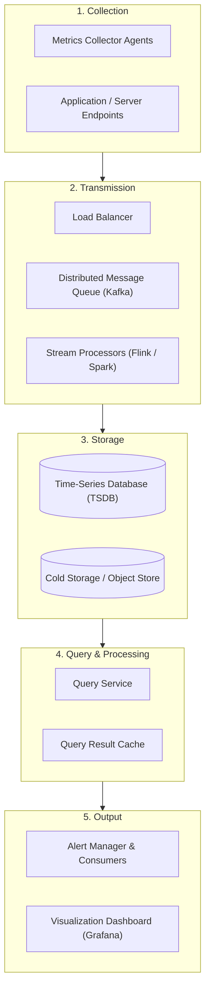

```
+------------------+      +-------------------+      +--------------------+
| Data Collection  | ---> | Data Transmission | ---> |    Data Storage    |
| (Push / Pull)    |      | (Kafka / Flink)   |      | (InfluxDB / TSDB)  |
+------------------+      +-------------------+      +--------------------+
                                                               |
                                                               v
+------------------+                                 +--------------------+
|  Visualization   | <------------------------------ |   Query Service    |
|  (Grafana)       |                                 |   & Alert Engine   |
+------------------+                                 +--------------------+
```

1. **Data Collection**: Extracts raw metric data from target services (OS stats, counters, timers).
2. **Data Transmission**: Transfers high-velocity metric payloads reliably via load balancers, message queues, and streaming pipelines.
3. **Data Storage**: Persists time-series records optimized for high write throughput and windowed range queries.
4. **Alerting System**: Evaluates rules against live time-series data, merges events, and dispatches to notification channels.
5. **Visualization**: Presents interactive graphs, gauges, and dashboards to operators.

---

### Data Model

Metrics data is inherently structured as **time series**: ordered sequences of values recorded at successive timestamps.

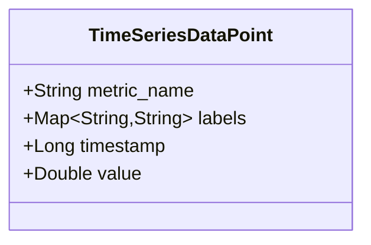

#### Time-Series Structure
| Element | Type | Description | Example |
|:---|:---|:---|:---|
| **Metric Name** | `String` | Identifier of the measured property | `cpu.load`, `http.requests.count` |
| **Labels / Tags** | `Map<String, String>` | Key-value dimensions identifying the source context | `host: i631`, `env: prod`, `region: us-west` |
| **Timestamp** | `Int64` | Unix epoch time in seconds or milliseconds | `1613707265` |
| **Value** | `Float64` | Measured value (gauge, counter, histogram bucket) | `0.29`, `420` |

#### Line Protocol Example
Many industrial TSDBs (e.g., InfluxDB, Prometheus, OpenTSDB) ingest data using text line protocols:

```text
// Format: <metric_name>,<tag_key>=<tag_value> <field_key>=<field_value> <timestamp>
cpu.load,host=webserver01,region=us-west,env=prod value=50 1613707265000000000
cpu.load,host=webserver01,region=us-west,env=prod value=62 1613707275000000000
cpu.load,host=webserver02,region=us-west,env=prod value=43 1613707265000000000
```

---

### Storage Engine Selection

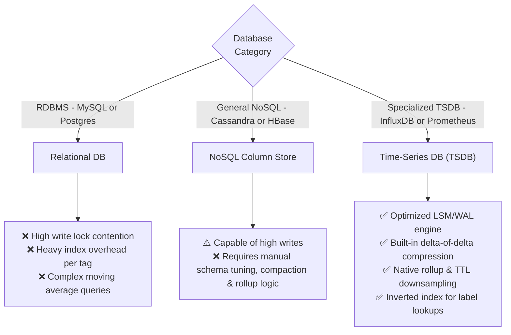

| Criteria | Relational (MySQL / PostgreSQL) | General NoSQL (Cassandra / Bigtable) | Specialized TSDB (InfluxDB / Prometheus) |
|:---|:---|:---|:---|
| **Write Pattern** | B-tree index updates degrade under 1M+ writes/sec | High write throughput via LSM-tree/commit logs | **Optimized append-only write paths (250K+ writes/sec per node)** |
| **Time-Window Queries** | Complex SQL window functions, high disk I/O | Fast primary key lookups; range queries require custom schema | **Native time-slice querying, rollup, and exponential moving averages** |
| **Multi-dimensional Tags** | Requires separate join tables or expensive composite B-trees | Partition key design is rigid; adding tags requires re-partitioning | **Built-in inverted index on label dimensions** |
| **Data Lifecycle (TTL / Rollup)** | Requires heavy background `DELETE` jobs causing table fragmentation | TTL supported, but downsampling requires custom jobs | **Built-in retention policies and automatic downsampling rollups** |
| **Recommendation** | ❌ Not recommended | ⚠️ Acceptable with high engineering overhead | **✅ Recommended choice** |

---

## 3. Deep Dive Design

### Topic 1: Metrics Collection — Pull vs. Push Model

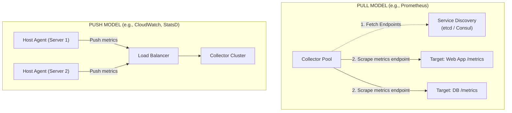

#### Pull Model Details
- **Mechanism**: The metric collector queries pre-defined HTTP endpoints (e.g., `/metrics`) periodically.
- **Service Discovery**: Uses `etcd`, `ZooKeeper`, or Kubernetes DNS so collectors dynamically receive updated IP lists when pods scale up/down.
- **Collector Coordination via Consistent Hashing**: Multiple collector nodes share monitored endpoints across a consistent hash ring (`hash(server_ip) % ring_space`), preventing duplicate scrapes and ensuring even load distribution.

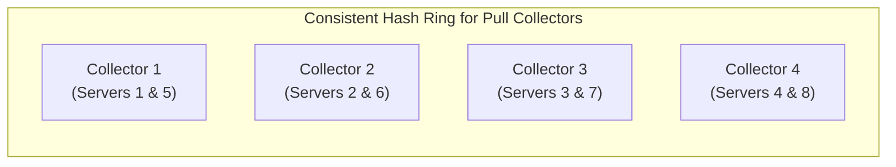

#### Push Model Details
- **Mechanism**: An agent running on each host continuously buffers, optionally aggregates, and pushes metrics to the collector cluster behind a load balancer.
- **Buffer & Backpressure**: Agents maintain a bounded local disk/memory buffer. If collectors return HTTP 503 or experience backpressure, the agent retries without crashing the host application.

#### Comprehensive Comparison

| Feature / Scenario | Pull Model (Prometheus-style) | Push Model (CloudWatch / StatsD-style) |
|:---|:---|:---|
| **Easy Debugging** | **Winner**: Point browser or `curl` to `http://server:9090/metrics` directly from a laptop. | Harder: Must inspect local agent logs or wait for collector reception. |
| **Host Health Check** | **Winner**: An unreachable scrape endpoint immediately signals host or network failure. | Ambiguous: Missing pushed metrics could mean the host is down or network dropped. |
| **Short-Lived / Batch Jobs** | Challenging: Ephemeral jobs may terminate before scrape (requires a *Pushgateway* intermediate). | **Winner**: Jobs push their metrics before exiting. |
| **Firewall & Multi-Cloud** | Complex: Scraper must reach inside private subnets and traverse firewalls. | **Winner**: Nodes only need outbound HTTPS access to the collector load balancer. |
| **Network Transport** | Typically uses reliable **TCP (HTTP/HTTPS)**. | Often uses lightweight **UDP** or batched HTTPS. |
| **Data Authenticity** | **Winner**: Collector fetches strictly from endpoints defined in trusted service discovery. | Requires client authentication tokens or IP whitelisting to reject rogue metrics. |

> [!TIP]
> **Hybrid Approach**: In production, enterprises commonly use **Pull** for persistent services/clusters (Kubernetes pods, VMs) and **Push via Pushgateway** for ephemeral batch jobs and serverless functions (AWS Lambda).

---

### Topic 2: Scaling the Transmission Pipeline

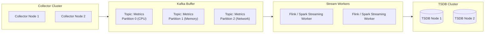

#### Why Introduce Kafka Between Collectors and TSDB?
1. **Decoupling**: Isolates the data collection ingestion tier from database indexing and write performance.
2. **Buffer Spikes & Outage Resilience**: If the TSDB is undergoing maintenance, compaction, or experiencing write slowdowns, Kafka buffers metric streams for days without data loss.
3. **Partitioning Strategy**:
   - **Partition by Metric Name**: e.g., `hash(metric_name) % num_partitions` ensures all `cpu.load` events land on the same consumer worker for efficient stream aggregation.
   - **Partition by Metric Name + Tag Set**: Prevents hotspots when a single metric (e.g., `http.requests`) dominates traffic.
   - **Priority Topics**: Separate critical infrastructure metrics from low-priority debug telemetry into distinct Kafka topics.

#### Alternative: In-Memory TSDB Architecture (Gorilla Approach)
If managing a massive Kafka cluster is deemed too operationally heavy, systems like Facebook Gorilla use high-availability in-memory TSDB nodes with write-ahead logs (WAL) and cross-datacenter replication to absorb write bursts without an explicit intermediate message queue.

---

### Topic 3: Multi-Tier Aggregation Strategy

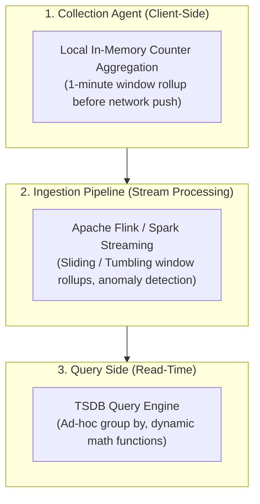

| Aggregation Tier | Where it Happens | Pros | Cons |
|:---|:---|:---|:---|
| **Client-Side Agent** | On monitored hosts | Drastically reduces network traffic sent to collectors | Limited to simple counters; host memory constraint |
| **Ingestion Pipeline** | Stream processors (Flink) | High-throughput batch writes to TSDB; reduces DB load | Precision loss for raw data; complex late-arriving event handling |
| **Query-Time Engine** | Inside TSDB upon read query | Zero data precision loss; flexible ad-hoc slicing | High compute overhead on large time ranges |

---

### Topic 4: Query Service & Query Language Comparison

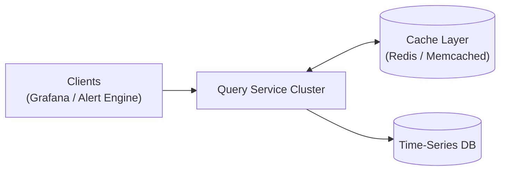

#### Why SQL is Inefficient for Time-Series Queries
Calculating a rolling exponential moving average over 15-minute intervals requires verbose, expensive relational SQL:

```sql
-- Relational SQL: 15-minute moving average (Complex & Slow)
SELECT id, temp,
       AVG(temp) OVER (
           PARTITION BY group_nr 
           ORDER BY time_read
       ) AS rolling_avg
FROM (
    SELECT id, time_read, temp,
           id - ROW_NUMBER() OVER (
               PARTITION BY interval_group 
               ORDER BY time_read
           ) AS group_nr
    FROM (
        SELECT id, time_read, temp,
               'epoch'::timestamp + '900 seconds'::interval * (
                   EXTRACT(epoch FROM time_read)::int4 / 900
               ) AS interval_group
        FROM readings
    ) t1
) t2
ORDER BY time_read;
```

#### Dedicated TSDB Query (Flux / PromQL)
Specialized TSDB languages express complex time-window operations natively in a clean, declarative pipeline:

```javascript
// InfluxDB Flux: Clean, expressive pipeline
from(db: "telegraf")
  |> range(start: -1h)
  |> filter(fn: (r) => r._measurement == "cpu" and r._field == "usage_system")
  |> exponentialMovingAverage(size: 10s)
```

```promql
// Prometheus PromQL: Rate calculation over 5-minute rolling window
rate(http_requests_total{status="500"}[5m]) / rate(http_requests_total[5m]) * 100
```

---

### Topic 5: Storage Layer Optimizations

#### 1. Temporal Locality (The 85/26 Rule)
Facebook's Gorilla research demonstrated that **over 85% of all operational queries access data from the past 26 hours**. Therefore:
- Keep the last 24–48 hours of time-series data completely in **in-memory cache** or fast NVMe SSD storage.
- Flush older data partitions to disk in immutable compressed columnar segments.

#### 2. Delta-of-Delta Timestamp Encoding
Absolute timestamps require 64 bits (or 32 bits). Since metrics are collected at regular fixed intervals (e.g., every 10 seconds), the **second delta** between consecutive timestamps is frequently 0:

$$\Delta_1 = t_1 - t_0 = 10\text{s}$$
$$\Delta_2 = t_2 - t_1 = 10\text{s}$$
$$D = \Delta_2 - \Delta_1 = 0$$

```
Absolute Timestamps:  1610087371, 1610087381, 1610087391, 1610087401 (32-bit each = 128 bits)
First Deltas:         10, 10, 10, 10
Delta-of-Delta:       0,  0,  0        (Stored in 1 bit each!)
```

#### 3. Gorilla XOR Floating-Point Value Compression
Metric values (e.g., CPU percentage `0.291`) are stored as IEEE 754 floating-point numbers. Successive measurements often have identical sign, exponent, and leading mantissa bits. XORing the current value with the previous value ($V_{\text{current}} \oplus V_{\text{prev}}$) results in many trailing and leading zeros, which are packed using variable-length bit encoding.

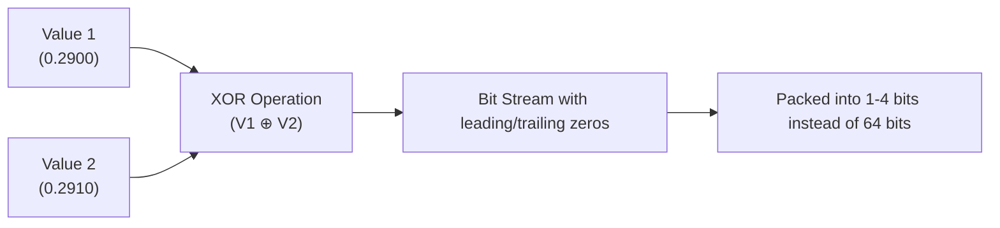

#### 4. Downsampling & Rollup Lifecycle

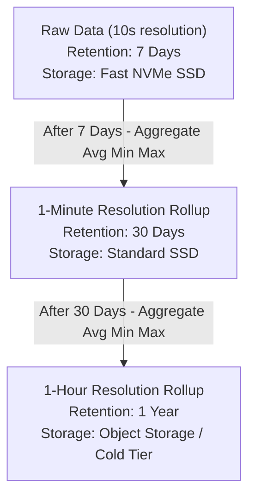

**10-Second Raw Data:**
| Metric | Timestamp | Host | Value |
|:---|:---|:---|:---|
| `cpu.load` | `2026-08-22T19:00:00Z` | `host-a` | `10` |
| `cpu.load` | `2026-08-22T19:00:10Z` | `host-a` | `16` |
| `cpu.load` | `2026-08-22T19:00:20Z` | `host-a` | `20` |

**30-Second Aggregated Rollup:**
| Metric | Timestamp | Host | Avg Value | Min Value | Max Value |
|:---|:---|:---|:---|:---|:---|
| `cpu.load` | `2026-08-22T19:00:00Z` | `host-a` | `15.3` | `10` | `20` |

---

### Topic 6: Alerting System

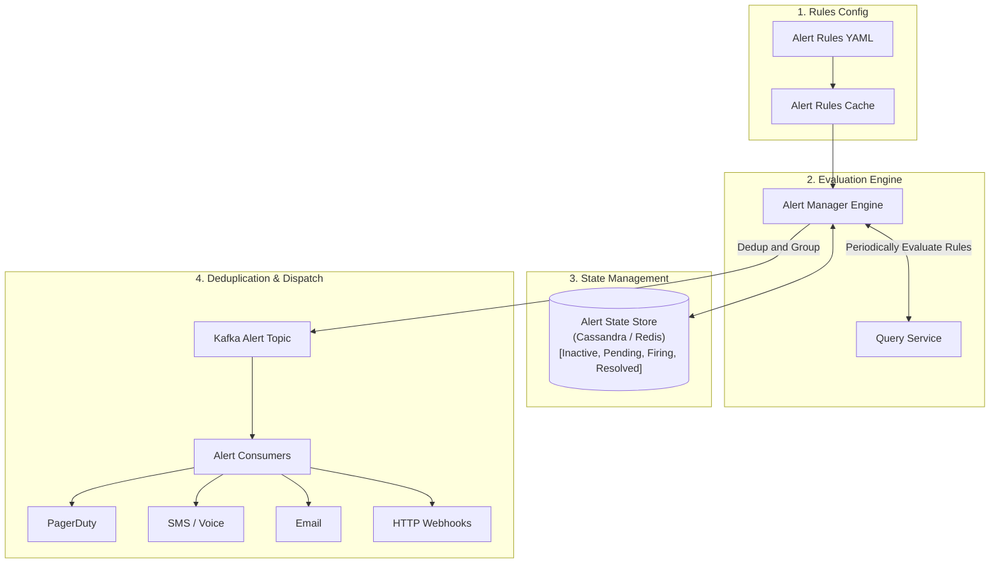

#### Alert Lifecycle States
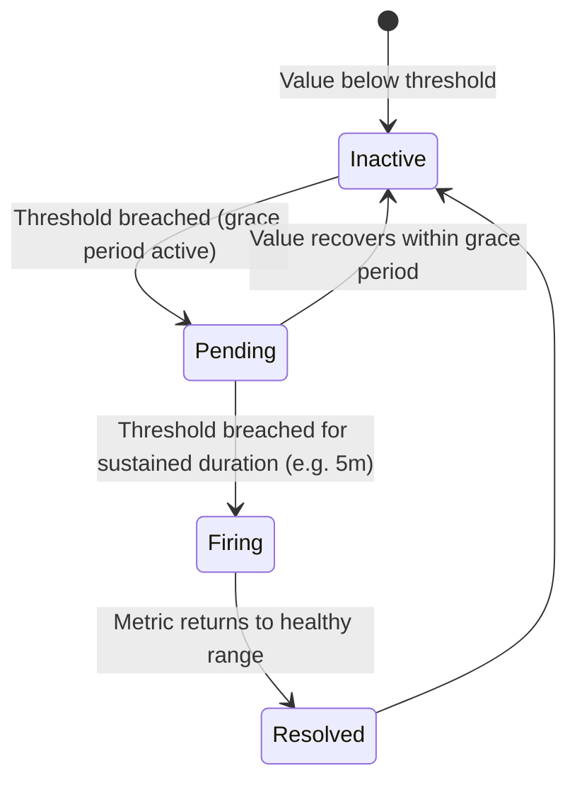

#### Sample YAML Alert Rule
```yaml
- name: high_cpu_and_instance_down_alerts
  rules:
    - alert: InstanceDown
      expr: up == 0
      for: 5m
      labels:
        severity: page
        team: sre-core
      annotations:
        summary: "Instance {{ $labels.instance }} is down"
        description: "Instance has been unreachable for more than 5 minutes."

    - alert: HighCPUUsage
      expr: 100 - (avg by (instance) (rate(node_cpu_seconds_total{mode="idle"}[5m])) * 100) > 90
      for: 10m
      labels:
        severity: warning
        team: backend-infra
```

#### Alert Manager Responsibilities
1. **Deduplication & Merging**: If an entire data center switch fails, hundreds of servers will trigger `InstanceDown` alerts simultaneously. The Alert Manager groups these into a single incident: *"Data Center US-West-1: 150 instances unreachable"*.
2. **Rate Limiting & Silencing**: Prevents alert storms by throttling repeat pages to on-call engineers.
3. **State Tracking**: Uses a distributed key-value store to maintain active incident IDs and guarantee **at-least-once** notification delivery.

---

### Topic 7: Visualization System

Visualization sits on top of the storage and query layer:
- **Dashboards**: Multi-panel visualization covering system metrics (CPU, memory, disk I/O), network metrics (QPS, packet drop), and business KPIs.
- **Build vs. Buy**: In real-world enterprise architectures, building a custom visualization tool is almost never justified. Standardizing on **Grafana** provides native TSDB plugins, mature RBAC, dashboard templating, and active open-source extensions.

---

## 4. Final End-to-End Architecture

The consolidated end-to-end architecture diagram illustrates the complete data flow from metric emission to dashboarding and alerting:

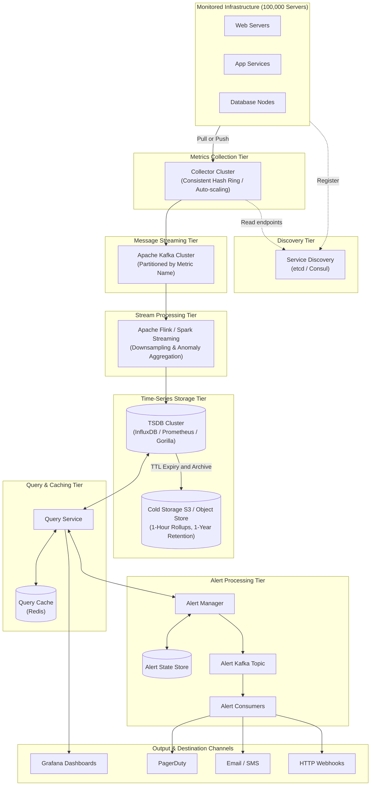

---

## 5. Summary & Key Takeaways

| Architectural Challenge | Recommended Solution | Tradeoff / Rationale |
|:---|:---|:---|
| **High Write Volume (1M+ QPS)** | Specialized TSDB (LSM tree + WAL) + Kafka buffer | RDBMS locks up under write storms; TSDB handles sequential appends smoothly. |
| **Collector Overload / Duplication** | Consistent hashing ring on collector nodes + Service Discovery | Prevents multiple collectors scraping the same server while dynamically tracking new instances. |
| **Pull vs. Push** | Hybrid: Pull for persistent services; Push for batch/ephemeral jobs | Pull enables easy debugging and instant host health detection; push accommodates short-lived tasks. |
| **Long-Term Storage Cost** | 3-tier downsampling (Raw 7d $\rightarrow$ 1m 30d $\rightarrow$ 1h 1y) | Preserves granular fidelity for live triage while reducing 1-year storage footprint by $>95\%$. |
| **Alert Storm Prevention** | Alert Manager grouping, merging, and deduplication rules | Eliminates noise by condensing hundreds of cascading server alerts into a single root-cause notification. |
| **Build vs. Buy** | Buy/adopt Grafana & PagerDuty; build custom ingestion pipeline | UI and alerting routing are undifferentiated heavy lifting; custom effort should focus on scalable ingestion. |

---

## 6. References & Further Reading

1. **Datadog**: [https://www.datadoghq.com/](https://www.datadoghq.com/)
2. **Splunk**: [https://www.splunk.com/](https://www.splunk.com/)
3. **PagerDuty**: [https://www.pagerduty.com/](https://www.pagerduty.com/)
4. **Elasticsearch & OpenSearch**: [https://www.elastic.co/elastic-stack](https://www.elastic.co/elastic-stack)
5. **Dapper, a Large-Scale Distributed Systems Tracing Infrastructure**: [Google Research Pub 36356](https://research.google/pubs/pub36356/)
6. **Distributed Systems Tracing with Zipkin**: [Twitter Engineering](https://blog.twitter.com/engineering/en_us/a/2012/distributed-systems-tracing-with-zipkin.html)
7. **Prometheus Architecture & Data Model**: [Prometheus Documentation](https://prometheus.io/docs/concepts/data_model/)
8. **OpenTSDB Distributed Time-Series Database**: [http://opentsdb.net/](http://opentsdb.net/)
9. **Facebook Gorilla: A Fast, Scalable, In-Memory Time Series Database**: [VLDB 2015 Paper](http://www.vldb.org/pvldb/vol8/p1816-teller.pdf)
10. **InfluxDB Storage Engine & Inverted Index Design**: [InfluxData Documentation](https://docs.influxdata.com/influxdb/)
11. **Schema Design for Time-Series Data in Cloud Bigtable**: [Google Cloud Documentation](https://cloud.google.com/bigtable/docs/schema-design-time-series)
12. **MetricsDB: Twitter’s Time-Series Database**: [Twitter Engineering Blog](https://blog.twitter.com/engineering/en_us/topics/infrastructure/2019/metricsdb.html)
13. **Amazon Timestream Architecture**: [AWS Documentation](https://aws.amazon.com/timestream/)
14. **Push vs. Pull in Monitoring Systems**: [Prometheus Blog](https://prometheus.io/blog/2016/07/23/pull-does-not-scale-or-does-it/)
15. **Grafana Interactive Observability Platform**: [https://grafana.com/](https://grafana.com/)
