# Ad Click Event Aggregation

> **Source**: *System Design Interview – An Insider's Guide: Volume 2* by Alex Xu & Sahn Lam  
> **ByteByteGo Chapter**: 22  
> **Topic**: Real-Time Stream Processing, Distributed Event Aggregation, Exactly-Once Semantics, Star Schema, Hotspot Mitigation

---

## 1. Understand the Problem and Establish Design Scope

Ad click event aggregation is a foundational subsystem of digital advertising platforms (such as Google Ads, Meta Ads, and Amazon Advertising). It aggregates raw ad click streams into actionable real-time metrics used for **advertiser billing**, **budget pacing**, **real-time bidding (RTB) feedback**, and **analytics dashboards**.

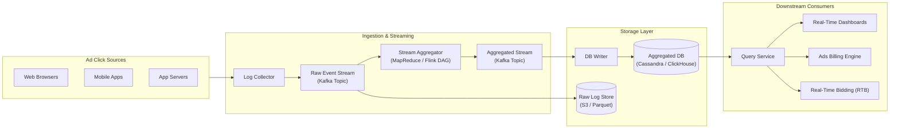

---

### Interview Clarification & Scope

> **Candidate:** What is the format of the input data?  
> **Interviewer:** Input data consists of log files appended across multiple application servers. Each event contains: `ad_id`, `click_timestamp`, `user_id`, `ip`, and `country`.
>
> **Candidate:** What is the expected data volume?  
> **Interviewer:** 1 billion ad clicks per day across 2 million unique active ads. The event volume grows roughly 30% year-over-year.
>
> **Candidate:** What are the most important queries the system must support?  
> **Interviewer:** Three primary queries:
> 1. **Ad Click Count**: Return the aggregated click count for a specific `ad_id` over the last $M$ minutes.
> 2. **Top $N$ Popular Ads**: Return the top 100 most-clicked ads in the past 1 minute (both $N$ and time window configurable).
> 3. **Attribute Filtering**: Support dynamic filtering by `ip`, `user_id`, or `country` for the above queries.
>
> **Candidate:** What edge cases should we prepare for?  
> **Interviewer:** 
> - Events arriving late (out-of-order data).
> - Duplicate event deliveries (from client retries or network drops).
> - System component outages and state recovery.
>
> **Candidate:** What are the latency requirements?  
> **Interviewer:** End-to-end latency of a few minutes is acceptable for reporting and billing. (Note: RTB auctions require sub-second latency, but downstream billing and aggregation tolerate 1–3 minutes).

---

### Requirements Summary

#### Functional Requirements
1. **Per-Ad Click Aggregation**: Aggregate click counts for any `ad_id` across sliding/tumbling windows of $M$ minutes.
2. **Top $N$ Query**: Return the top $N$ most-clicked ads over the past $M$ minutes updated every minute.
3. **Multi-Dimensional Filtering**: Support filtering queries by dimensions such as `country`, `ip`, and `user_id`.
4. **Data Recalculation**: Support historical data replay and backfilling if a bug or corruption occurs.

#### Non-Functional Requirements
- **High Correctness & Accuracy**: Financial impact is significant; data directly affects billing and advertiser trust. Requires **exactly-once** processing semantics.
- **Low Latency**: End-to-end processing latency must stay under a few minutes.
- **Robust Fault Tolerance**: Node failures must not cause data loss, double-counting, or silent drops.
- **Scalability**: Must scale gracefully to peak loads ($50{,}000\text{ QPS}$) and 30% annual traffic growth.

---

### Back-of-the-Envelope Estimation

| Dimension / Metric | Calculation & Value |
|:---|:---|
| **Daily Active Users (DAU)** | $1\text{ Billion DAU}$ |
| **Daily Ad Clicks** | $1\text{ Billion clicks/day}$ (assuming 1 ad click per user per day on average) |
| **Average Write QPS** | $\frac{10^9\text{ clicks}}{86{,}400\text{ seconds}} \approx 10{,}000\text{ QPS}$ |
| **Peak Write QPS** | $5 \times \text{Average QPS} = 50{,}000\text{ QPS}$ |
| **Total Active Ads** | $2\text{ Million ads}$ |
| **Raw Event Size** | $\approx 100\text{ Bytes (0.1 KB)}$ per event |
| **Daily Raw Storage** | $10^9 \times 0.1\text{ KB} = 100\text{ GB/day}$ |
| **Monthly Raw Storage** | $100\text{ GB/day} \times 30\text{ days} = 3\text{ TB/month}$ |
| **Annual Raw Storage** | $3\text{ TB/month} \times 12\text{ months} = 36\text{ TB/year}$ |

---

## 2. High-Level Design & Core Data Models

### Query API Design

The API serves internal dashboards, advertiser portals, and billing systems.

#### 1. Aggregate Click Count for a Specific Ad
`GET /v1/ads/{ad_id}/aggregated_count`

##### Request Parameters
| Parameter | Type | Required | Description |
|:---|:---|:---|:---|
| `ad_id` | `String` (path) | Yes | Unique identifier of the target ad |
| `from` | `Int64` (epoch sec) | No | Start timestamp of range (defaults to 1 minute ago) |
| `to` | `Int64` (epoch sec) | No | End timestamp of range (defaults to current time) |
| `filter_id` | `String` (query) | No | Pre-computed filter dimension identifier (e.g., US-only) |

##### Response Payload
```json
{
  "ad_id": "ad001",
  "count": 1420,
  "from": 1609459200,
  "to": 1609459260,
  "filter_id": "0012"
}
```

---

#### 2. Get Top $N$ Most-Clicked Ads
`GET /v1/ads/popular_ads`

##### Request Parameters
| Parameter | Type | Required | Description |
|:---|:---|:---|:---|
| `count` | `Integer` | No | Number of top ads to return ($N$, default: 100) |
| `window` | `Integer` | No | Aggregation window size ($M$) in minutes (default: 1) |
| `filter_id` | `String` | No | Dimension filter strategy identifier |

##### Response Payload
```json
{
  "window_size_min": 1,
  "update_time": 1609459260,
  "ads": [
    { "ad_id": "ad099", "clicks": 28450 },
    { "ad_id": "ad001", "clicks": 19320 },
    { "ad_id": "ad312", "clicks": 14200 }
  ]
}
```

---

### Data Models & Schema Design

The system maintains two distinct categories of data: **Raw Event Data** and **Aggregated Data**.

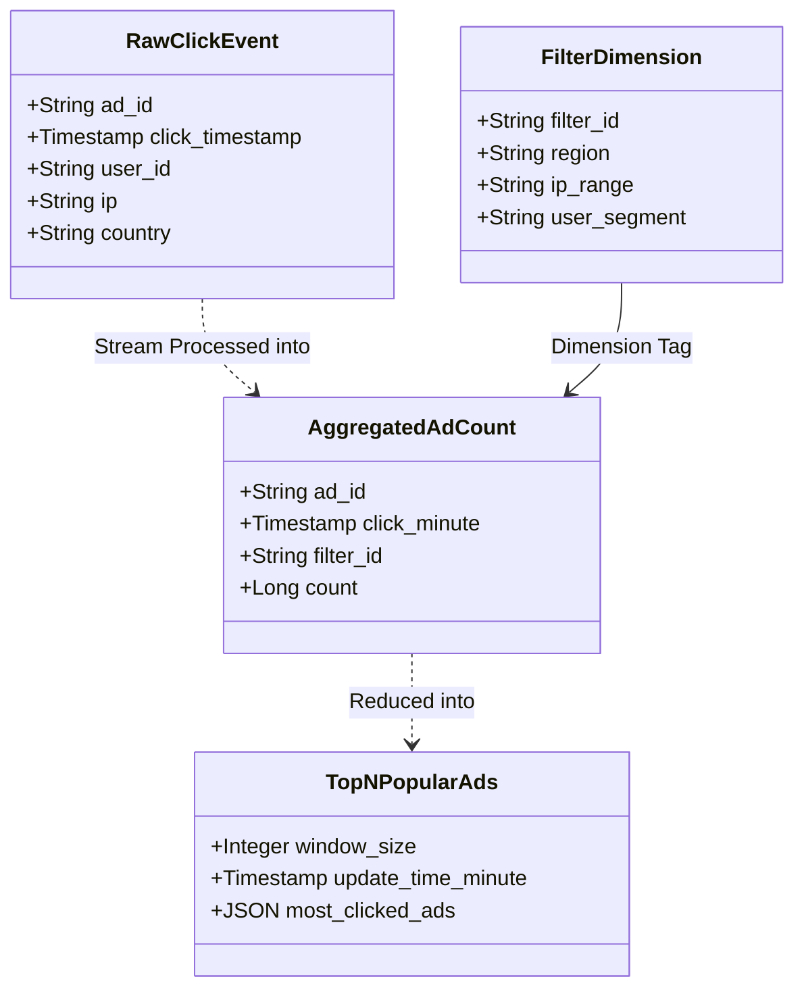

#### Raw vs. Aggregated Data Trade-Off

| Storage Strategy | Pros | Cons | Recommendation |
|:---|:---|:---|:---|
| **Raw Data Only** | • Complete fidelity<br>• Full debugging & audit trail<br>• Supports ad-hoc ML model training | • Massive storage growth<br>• Range queries and analytical rollups are unacceptably slow | Use as immutable backup and source for replay |
| **Aggregated Data Only** | • Ultra-fast query response<br>• Compact storage footprint<br>• Optimized for dashboard refresh | • Irreversible loss of raw details<br>• Impossible to backfill new metrics or fix bugs | Use for active queries and dashboards |
| **Hybrid (Store Both)** | • Best of both worlds: fast active queries + full recovery capability | • Additional storage & dual pipeline maintenance overhead | **✅ Recommended Choice** |

---

### Database Selection

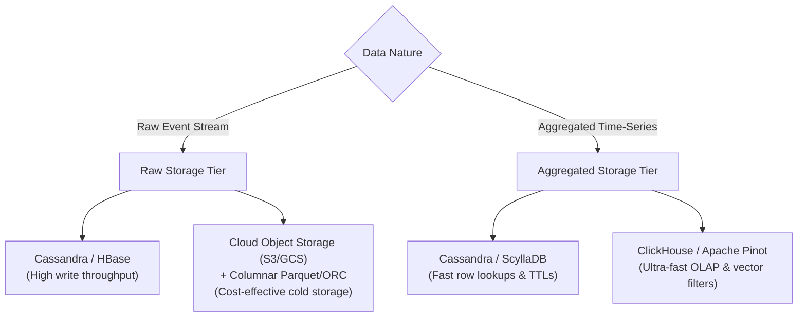

1. **Raw Data Storage**:
   - **Characteristics**: Extremely write-heavy ($10\text{K} - 50\text{K}\text{ QPS}$), append-only, low read frequency (only triggered for batch retraining or disaster recalculations).
   - **Engine Options**: 
     - **NoSQL Key-Value / Wide-Column** (Apache Cassandra / HBase) partitioned by `(date, ad_id)`.
     - **Cloud Object Storage + Parquet** (Amazon S3 / GCS): Stream processors flush batch Parquet files rotated every $10\text{ GB}$ or 15 minutes. Very cost-effective.
2. **Aggregated Data Storage**:
   - **Characteristics**: Both read-heavy (dashboards auto-refreshing for 2M ads) and write-heavy (bulk window updates every minute).
   - **Engine Options**:
     - **Apache Cassandra**: Efficient for time-series range queries with compound primary keys `((ad_id, filter_id), click_minute)`.
     - **ClickHouse / Apache Pinot**: Purpose-built column stores with native streaming ingestion from Kafka and sub-second OLAP rollups.

---

### End-to-End System Architecture

To handle unpredictable traffic spikes without overwhelming downstream consumers, we decouple producers, processors, and storage engines using distributed message queues (**Apache Kafka**).

```
+----------------------------------------------------------------------------------------------------+
|                                    END-TO-END DATA PIPELINE                                        |
+----------------------------------------------------------------------------------------------------+

 [ App Server 1 ] \
 [ App Server 2 ] ---> [ Log Collector ] ---> [ Kafka Topic 1: Raw Events ]
 [ App Server 3 ] /                                    |
                                                       v
                                            [ Stream Aggregator (Flink) ]
                                            +---------------------------+
                                            | • Map / Cleanse           |
                                            | • Tumbling Windows (1 min)|
                                            | • Sliding Windows (M min) |
                                            | • Local Min-Heap (Top N)  |
                                            +---------------------------+
                                                       |
                                                       v
                                            [ Kafka Topic 2: Aggregated ]
                                                       |
                                                       v
                                            [ Database Sink Consumer ]
                                                       |
                                                       v
                                          [ Aggregated DB (Cassandra) ]
                                                       |
                                                       v
                                         [ Query Service & Dashboards ]
```

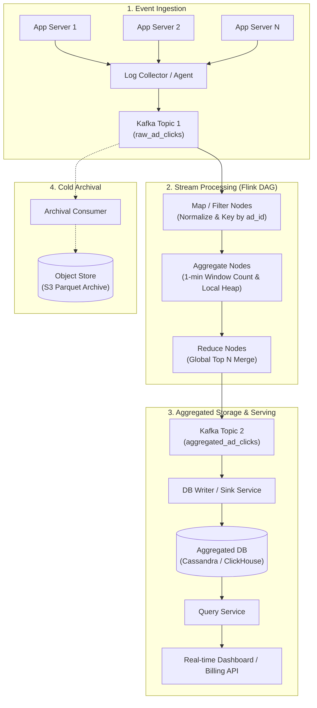

---

### Stream Processing: The MapReduce DAG Model

The aggregation engine decomposes stream computation into a Directed Acyclic Graph (DAG) of specialized computing nodes:

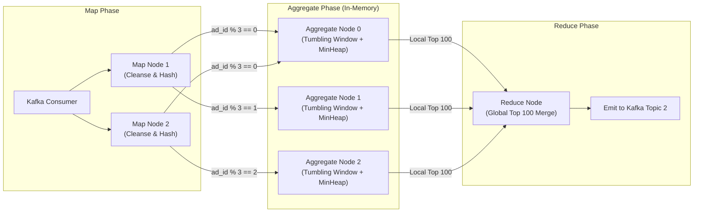

#### Core Roles in the DAG
1. **Map Node**:
   - Reads raw events from Kafka partitions.
   - Cleanses, filters, and normalizes unstructured fields.
   - Shards and routes records downstream based on `hash(ad_id) % num_aggregate_nodes`.
2. **Aggregate Node**:
   - Maintains in-memory count state for each `ad_id` during the current active time window.
   - Computes local Top $N$ rankings using a local **bounded min-heap** ($O(K \log N)$ space/time).
3. **Reduce Node**:
   - Gathers local Top $N$ candidates from all upstream aggregate nodes.
   - Merges the streams into a definitive **global Top $N$ list** for the time window and emits the result.

---

### Multi-Dimensional Data Filtering (Star Schema)

To support queries like *"Number of clicks for `ad001` in the US on mobile"*, we use a **Star Schema** dimensional modeling approach pre-aggregated directly in the stream:

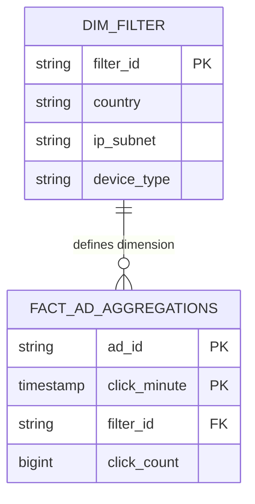

#### Aggregated Data with Star Schema Dimension
| `ad_id` | `click_minute` | `filter_id` | `count` | Description |
|:---|:---|:---|:---|:---|
| `ad001` | `2021-01-01 00:00:00` | `0012` | 240 | US Traffic Only |
| `ad001` | `2021-01-01 00:00:00` | `0013` | 510 | EU Traffic Only |
| `ad001` | `2021-01-01 00:00:00` | `0000` | 1200 | Global / All Dimensions (`*`) |
| `ad002` | `2021-01-01 00:00:00` | `0012` | 45 | US Traffic Only |

> [!TIP]
> **Star Schema Trade-Off**: Pre-computing dimension combinations guarantees $O(1)$ query lookup speed at runtime. However, having too many dimensions causes combinatorial explosion (*curse of dimensionality*). For dynamic ad-hoc slicing across dozens of dimensions, modern OLAP engines (ClickHouse / Pinot) are preferred over static pre-materialization.

---

## 3. Design Deep Dive

---

### 1. Streaming vs. Batch Processing & Kappa Architecture

| Dimension | Online Services | Batch Systems (Offline) | Streaming Systems (Near Real-Time) |
|:---|:---|:---|:---|
| **Responsiveness** | Milliseconds ($< 100\text{ ms}$) | Hours / Days | Sub-second to minutes |
| **Input Data** | Discrete user requests | Bounded historical datasets | **Unbounded continuous streams** |
| **Output** | Response to end user | Materialized tables, reports | **Continuous metric streams, live views** |
| **Tooling** | Web servers, microservices | MapReduce, Spark, Hive | **Apache Flink, Spark Streaming, Kafka Streams** |

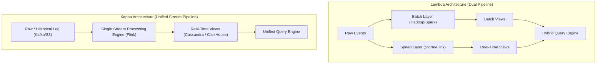

#### Why Kappa Architecture is Selected
- **Lambda Architecture** forces the maintenance of **two separate codebases** (e.g., Spark SQL for batch and Flink for streaming) to compute identical business logic, inevitably leading to code drift and reconciliation discrepancies.
- **Kappa Architecture** uses **one unified stream processing engine** for both live incoming events and historical reprocessing.

---

### 2. Historical Data Recalculation (Replay Flow)

When an aggregation bug is patched or an advertiser requests a historical audit, the system replays historical raw logs without interrupting real-time live ingestion:

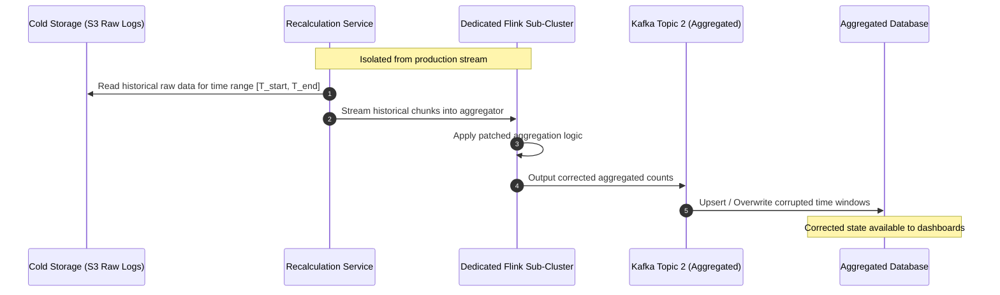

---

### 3. Time Semantics & Watermarking for Late Events

#### Event Time vs. Processing Time

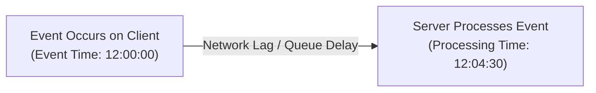

| Criteria | Event Time | Processing Time |
|:---|:---|:---|
| **Definition** | Timestamp when the ad click occurred on the client device | System clock timestamp of the stream processing node |
| **Accuracy** | **High**; reflects actual user behavior | **Low**; distorted by network jitter and queue backpressure |
| **Handling Late Data** | Requires watermarking and window buffering | Trivial; no late events by definition |
| **Reliability Risk** | Client clocks may drift or be spoofed | Server NTP clocks are trusted |
| **Decision** | **✅ Recommended for ad billing** | ❌ Not acceptable for billing |

---

#### Handling Late Data with Watermarks

A **Watermark** is a progress metric in event-time processing that informs the system: *"We assume no more events with timestamp $\le t$ will arrive."*

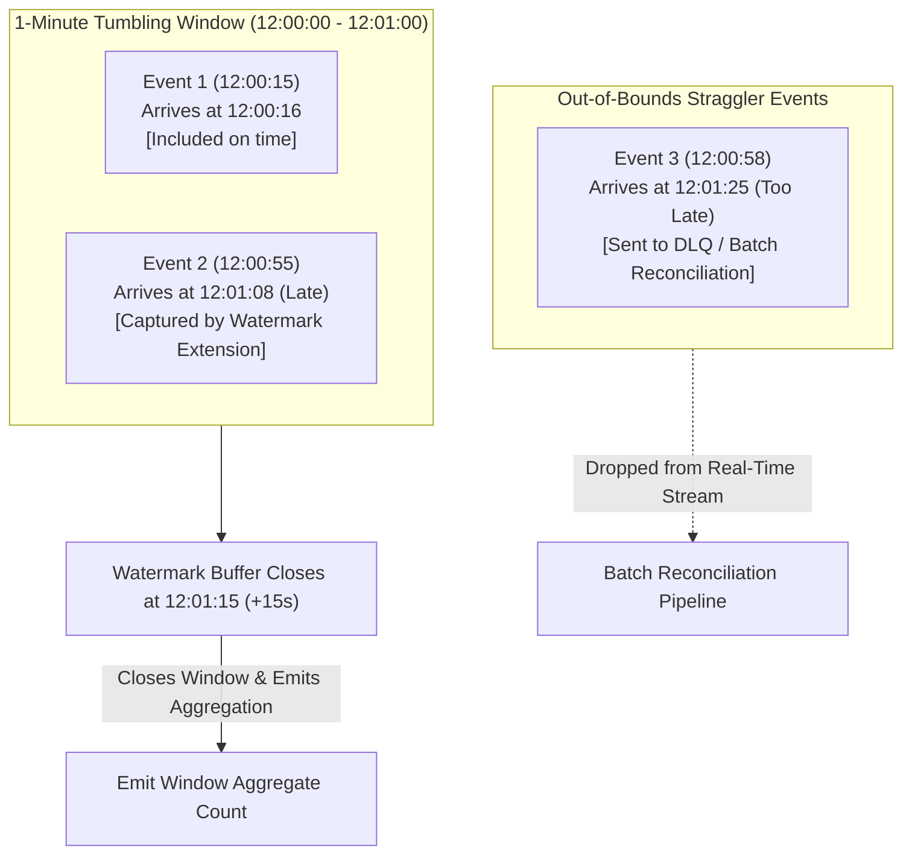

```
Window [12:00 - 12:01] 
|-----------------------|===============> Watermark closes at 12:01:15
   Click at 12:00:50           ^
   Arrives at 12:01:05 --------+ (Accepted & Included in 12:00 window)

   Click at 12:00:55
   Arrives at 12:01:25 --------> (Rejected: Beyond Watermark -> Sent to Dead Letter Queue / Reconciliation)
```

> [!NOTE]
> **Watermark Trade-Off**: 
> - **Longer watermark buffer** (e.g., 60 seconds): Captures more straggler events $\rightarrow$ higher data accuracy, but increases end-to-end dashboard latency.
> - **Shorter watermark buffer** (e.g., 10 seconds): Lower latency, but misses late events. Missed events are caught by **daily batch reconciliation**.

---

### 4. Windowing Strategies

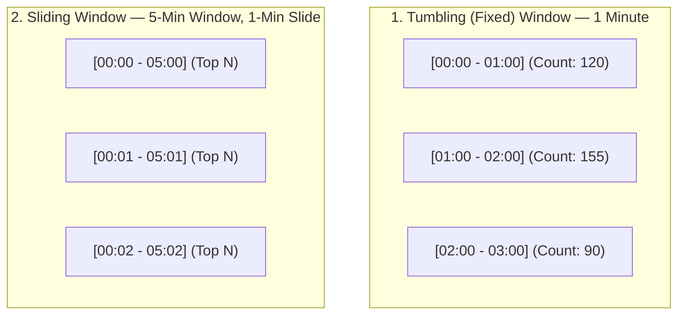

1. **Tumbling (Fixed) Window**:
   - Non-overlapping, fixed-length intervals.
   - **Use Case**: Aggregating per-minute ad click counts.
2. **Sliding Window**:
   - Overlapping intervals that advance by a configurable slide step.
   - **Use Case**: Tracking *"Top 100 ads in the last 5 minutes, updated every 1 minute"*.

---

### 5. Delivery Guarantees & Exactly-Once Semantics

In advertising systems, duplicate processing directly causes **over-billing**, while dropped events cause **under-billing**. Exactly-once processing is mandatory.

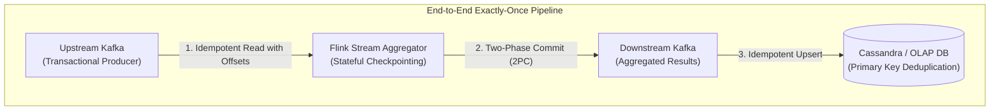

#### Why Standard Offset Commits Cause Duplicates or Data Loss

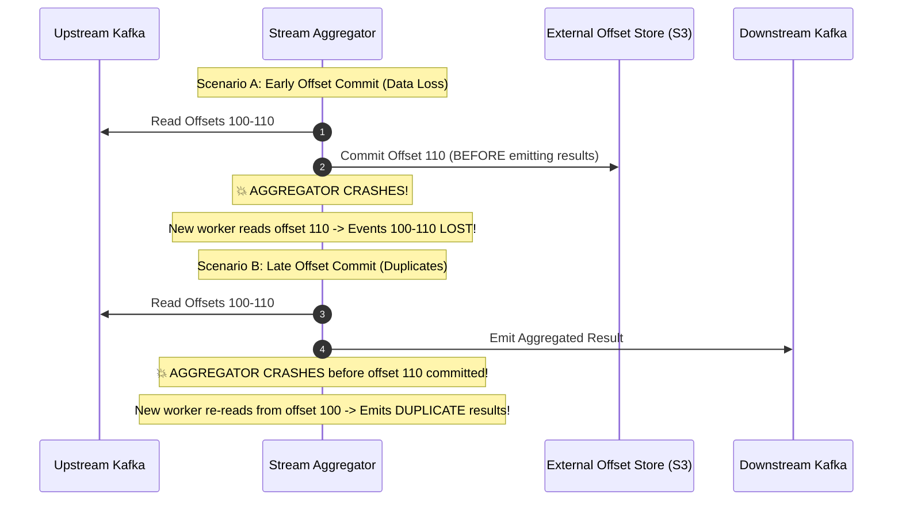

#### The Solution: Two-Phase Commit (2PC) & Idempotency
To achieve true end-to-end exactly-once:
1. **Source to Processing Engine**: Distributed snapshots using the **Chandy-Lamport algorithm** (Flink Checkpoints).
2. **Processing Engine to Downstream Queue**: Flink uses Kafka's **Transactional Producer API** with Two-Phase Commit (`2PC`):
   - *Pre-commit*: Write aggregated data into Kafka transaction during snapshot.
   - *Commit*: Mark Kafka transaction as committed only after checkpoint succeeds.
3. **Downstream Queue to DB Sink**: Idempotent upsert operations in the storage engine using deterministic natural primary keys (`ad_id + click_minute + filter_id`).

---

### 6. Scalability & Hotspot Mitigation

#### Scaling the Message Queue (Kafka)
- **Partition Key**: Partition by `hash(ad_id)`. All events for a specific ad land in the same partition, enabling clean in-memory accumulation.
- **Physical Topic Sharding**: Split large traffic streams across regional topics (e.g., `ad_clicks_us`, `ad_clicks_eu`) to limit the impact of partition rebalances.

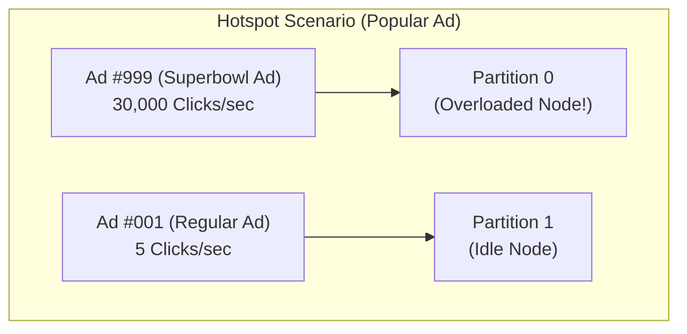

#### Mitigating Hotspots: Two-Stage (Global-Local) Aggregation

When a viral ad generates thousands of clicks per second, a single partition node will bottleneck. We solve this using **Two-Stage Aggregation**:

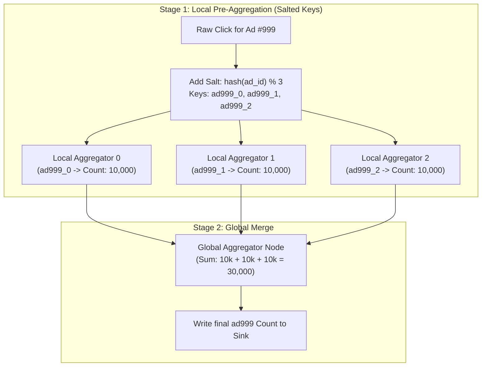

---

### 7. Fault Tolerance & State Recovery

Stream aggregators maintain stateful windows in memory. If a worker node crashes:

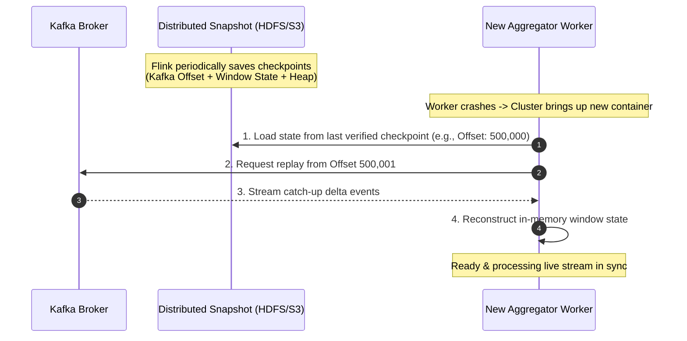

---

### 8. System Monitoring & Daily Batch Reconciliation

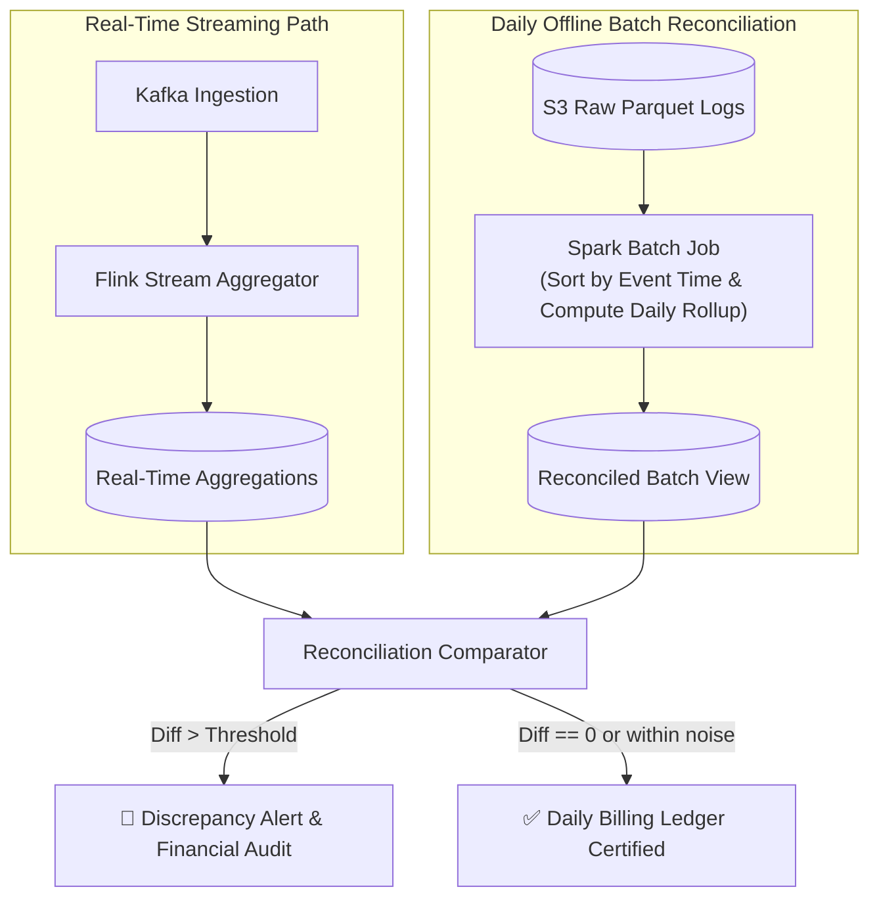

#### Critical Operational Metrics
1. **Event Latency Lag**: Difference between `processing_time` and `event_time`. Spikes indicate upstream network lag or queue build-up.
2. **Kafka Consumer Lag (`records-lag-max`)**: Measures backlog growth. Triggers auto-scaling of Flink task slots.
3. **JVM Memory & Garbage Collection**: High memory pressure inside stream operators indicates excessive window sizes or watermark delays.

---

### 9. Alternative Architecture: Real-Time OLAP Engine

An alternative industry-standard pattern avoids custom aggregation code by streaming raw events directly into a distributed real-time OLAP database:

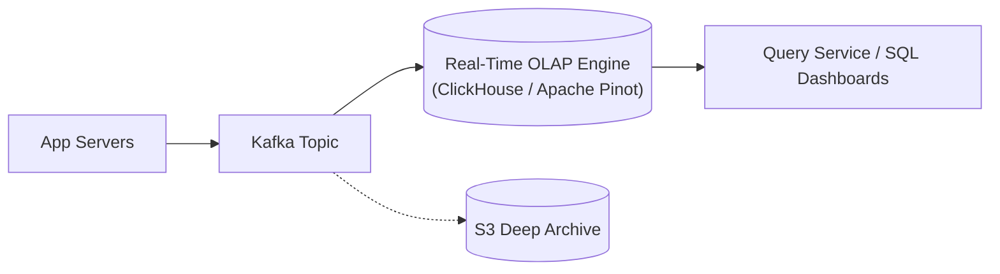

#### Trade-Off Comparison
| Feature | Custom Stream DAG (Flink + Cassandra) | Real-Time OLAP (Kafka + ClickHouse / Pinot) |
|:---|:---|:---|
| **Architecture Complexity** | Higher (requires custom DAG operators and 2PC sinks) | **Lower** (Kafka connects directly to ClickHouse tables) |
| **Ad-Hoc Query Flexibility** | Low (only pre-defined dimensions in Star Schema) | **Extremely High** (full SQL slicing across any dimension) |
| **Write Throughput** | Highest (pre-aggregated before DB write) | Very high (vectorized column inserts) |
| **Resource Cost** | Low storage footprint | Higher memory and CPU for indexing |

---

## 4. Summary & Architecture Wrap-Up

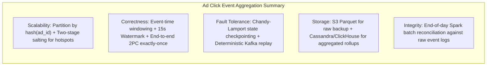

### Architectural Decisions Matrix

| Challenge | Chosen Solution | Rationale & Trade-Off |
|:---|:---|:---|
| **High Write Scale ($50\text{K}\text{ QPS}$)** | Asynchronous Kafka decoupling + Flink stream aggregation | Prevents backpressure crashes and scales consumers independently |
| **Data Correctness for Billing** | Event-time processing with watermark extensions | Mitigates client clock skew and out-of-order deliveries |
| **Duplicate Prevention** | Two-Phase Commit (2PC) + Idempotent DB upserts | Ensures exact financial figures without double charging |
| **Celebrity Ad Hotspots** | Two-stage (Global-Local) salted pre-aggregation | Distributes write spikes across multiple workers |
| **Data Recalculation** | Kappa Architecture with dedicated historical replay worker | Enables instant bug fixes and auditing using the same codebase |
| **Data Audit & Integrity** | End-of-day offline Spark batch reconciliation | Reconciles edge-case late events and verifies ledger accuracy |

---

## Reference Materials

1. **Clickthrough Rate (CTR)**: [Google Ads Help](https://support.google.com/google-ads/answer/2615875?hl=en)
2. **Display Advertising with RTB and Behavioral Targeting**: [ArXiv Research](https://arxiv.org/pdf/1610.03013.pdf)
3. **Apache Flink End-to-End Exactly-Once Processing**: [Apache Flink Documentation](https://flink.apache.org/features/2018/03/01/end-to-end-exactly-once-apache-flink.html)
4. **Star Schema in Dimensional Modeling**: [Microsoft Architecture Guide](https://docs.microsoft.com/en-us/power-bi/guidance/star-schema)
5. **Martin Kleppmann**: *Designing Data-Intensive Applications*. O'Reilly Media, 2017.
6. **Yelp Ad Stream Aggregation Architecture**: [Yelp Engineering](https://www.youtube.com/watch?v=hzxytnPcAUM)
7. **Uber Real-Time Exactly-Once Ad Processing with Flink & Pinot**: [Uber Engineering](https://eng.uber.com/real-time-exactly-once-ad-event-processing/)
8. **ClickHouse Architecture Overview**: [ClickHouse Docs](https://clickhouse.com/docs)
