# Hotel Reservation System

> **Source**: *System Design Interview – An Insider's Guide: Volume 2* by Alex Xu & Sahn Lam  
> **ByteByteGo Chapter**: 23  
> **Topic**: Booking Platforms, Inventory Management, Concurrency Control, Microservices Data Consistency, Overbooking

---

## 1. Understand the Problem and Establish Design Scope

A hotel reservation system manages hotel room inventories, rates, guest bookings, and payments across multiple hotel properties. Similar architectural patterns apply to Airbnb, flight booking engines, and ticket reservation platforms.

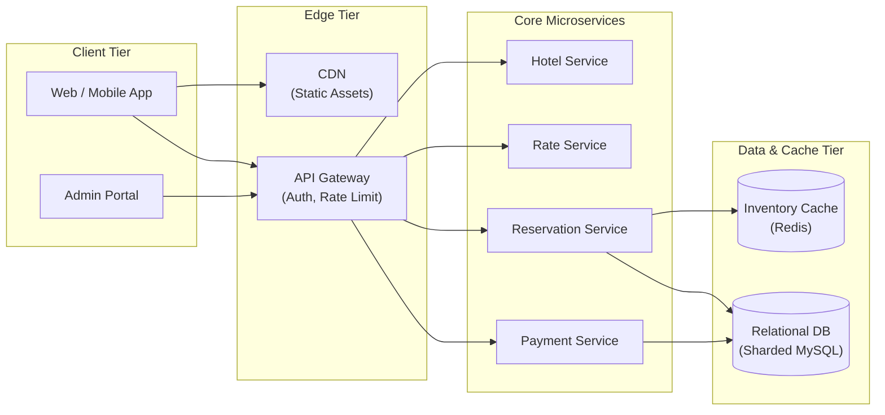

---

### Interview Clarification & Scope

> **Candidate:** What is the scale of the system?  
> **Interviewer:** We are designing for a hotel chain with **5,000 hotels** and **1 million total rooms**.
>
> **Candidate:** When do customers pay for their reservations?  
> **Interviewer:** For simplicity, guests pay in full at the time of making the reservation.
>
> **Candidate:** What booking channels need to be supported?  
> **Interviewer:** Bookings originate from the hotel website and mobile apps. Phone bookings or third-party aggregators are out of scope.
>
> **Candidate:** Can customers cancel or modify their reservations?  
> **Interviewer:** Yes, cancellations and refunds must be supported.
>
> **Candidate:** Are there special business rules like overbooking or dynamic pricing?  
> **Interviewer:** 
> - Support **10% overbooking** (selling up to 110% of capacity to offset expected cancellations).
> - Support **dynamic pricing** (room rates change per day based on predicted occupancy).
>
> **Candidate:** Is room search within scope?  
> **Interviewer:** Hotel/room search with complex multi-criteria filters is out of scope. Focus on:
> 1. Viewing hotel and room detail pages.
> 2. Booking and reserving a room.
> 3. Admin management panel (add/edit hotel/room metadata).
> 4. Overbooking and concurrency protection.

---

### Requirements Summary

#### Functional Requirements
1. **Hotel & Room Details**: View hotel information and room type details.
2. **Room Reservation**: Reserve rooms for specified date ranges with payment processing.
3. **Admin Management**: Staff can add, update, and manage hotel metadata, room types, and room inventory.
4. **Overbooking**: Allow booking up to $110\%$ of actual room capacity per room type per day.
5. **Dynamic Pricing**: Support fluctuating daily room rates.

#### Non-Functional Requirements
- **High Concurrency & Consistency**: Prevent double-booking when multiple users attempt to book the last available room simultaneously.
- **Moderate Latency**: Sub-second detail page reads; a few seconds acceptable for final booking transaction completion.
- **High Availability & Fault Tolerance**: System must survive data center outages with zero lost booking data.

#### Out of Scope
- Global search engine and complex geo-filtering (covered in Proximity Service / Search Autocomplete).
- Loyalty point programs and third-party travel agent aggregations (Expedia / Booking.com channel managers).

---

### Back-of-the-Envelope Estimation

#### Capacity & Traffic Calculations
| Metric / Dimension | Calculation & Value |
|:---|:---|
| **Total Scale** | $5{,}000\text{ hotels}$, $1{,}000{,}000\text{ rooms}$ |
| **Occupancy & Stay Duration** | $70\%\text{ occupancy}$, $3\text{ days average stay}$ |
| **Daily Reservations** | $\frac{1{,}000{,}000 \times 0.70}{3} \approx 233{,}333 \approx 240{,}000\text{ bookings/day}$ |
| **Average Booking TPS** | $\frac{240{,}000}{86{,}400\text{ sec}} \approx 2.8 \approx 3\text{ TPS}$ |
| **Peak Booking TPS** | $5\times\text{ average} \approx 15\text{ TPS}$ |

#### Conversion Funnel & QPS Distribution
In booking platforms, user traffic follows a steep funnel from browsing to booking (~$10\%$ conversion at each stage):

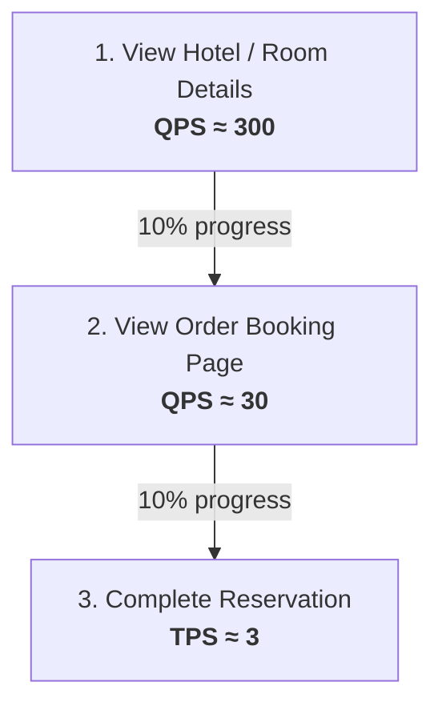

| Funnel Step | Description | Traffic Ratio | Estimated QPS |
|:---|:---|:---|:---|
| **1. Hotel / Room Detail** | Browsing hotel and room details (Read query) | $100\%$ | $\approx 300\text{ QPS}$ |
| **2. Booking Confirmation** | Reviewing dates, price breakdown, guest details | $10\%$ | $\approx 30\text{ QPS}$ |
| **3. Final Reservation** | Submitting booking and payment (Write transaction) | $1\%$ | $\approx 3\text{ TPS}$ |

---

## 2. High-Level Architecture

### Core APIs (RESTful)

#### 1. Hotel & Room Management APIs
| Method & Endpoint | Access | Description |
|:---|:---|:---|
| `GET /v1/hotels/{hotel_id}` | Public | Retrieve full hotel details, address, amenities |
| `POST /v1/hotels` | Admin | Create a new hotel property |
| `PUT /v1/hotels/{hotel_id}` | Admin | Update hotel property information |
| `GET /v1/hotels/{hotel_id}/rooms/{room_id}` | Public | Retrieve specific room details |
| `POST /v1/hotels/{hotel_id}/rooms` | Admin | Add a new room instance |

#### 2. Reservation APIs
| Method & Endpoint | Access | Description |
|:---|:---|:---|
| `GET /v1/reservations` | Authenticated | Fetch reservation history for current user |
| `GET /v1/reservations/{reservation_id}` | Authenticated | Retrieve booking status and receipt |
| `POST /v1/reservations` | Authenticated | Create a new reservation order |
| `DELETE /v1/reservations/{reservation_id}` | Authenticated | Cancel a reservation and initiate refund |

#### Reservation Request Payload
```json
{
  "startDate": "2026-09-01",
  "endDate": "2026-09-04",
  "hotelID": "245",
  "roomTypeID": "12354673389",
  "roomCount": 1,
  "reservationID": "res_98a76b5c4d"
}
```

> [!NOTE]
> `reservationID` is pre-generated on the booking confirmation screen and acts as the **idempotency key** to prevent double-booking from duplicate form submissions.

---

### High-Level Service Architecture

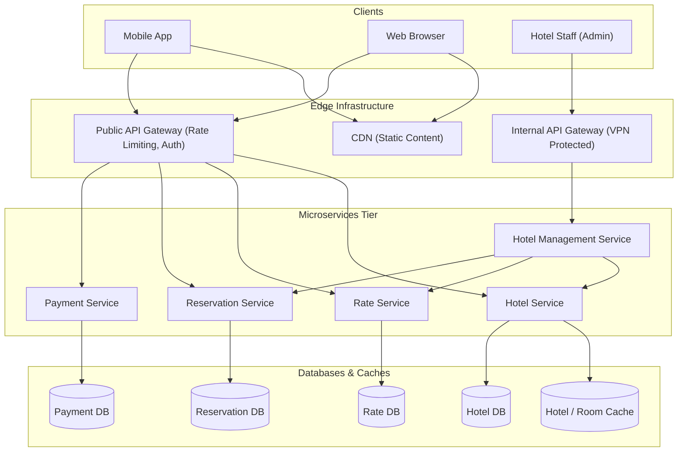

#### Component Responsibilities
- **Public API Gateway**: Handles SSL termination, OAuth2/JWT token validation, IP rate limiting, and request routing.
- **Hotel Service**: Provides static and semi-static hotel and room details (cached in memory / Redis).
- **Rate Service**: Computes and supplies daily room rates based on occupancy forecasts.
- **Reservation Service**: Manages room inventory availability, holds inventory, and records bookings.
- **Payment Service**: Integrates with payment gateways (Stripe/PayPal) and updates booking status to `PAID` or `REJECTED`.
- **Hotel Management Service**: Protected internal interface for hotel reception and operations staff.

---

## 3. Data Model & Schema Design

### Database Choice: Relational Database (RDBMS)

A relational database (e.g., PostgreSQL / MySQL) is the optimal choice for the reservation engine because:
1. **Read-Heavy, Moderate Write Workload**: Read QPS is $300\text{ QPS}$, write TPS is only $\approx 3\text{ TPS}$.
2. **ACID Transactional Guarantees**: Strict isolation is essential to prevent double-booking, over-allocation, and negative inventory.
3. **Structured Relational Schema**: Entity relationships between hotels, room types, daily inventory records, and guests are highly structured.

---

### Relational Schema (Room Type-Based Design)

> [!IMPORTANT]
> **Key Domain Insight**: In hotels, guests book a **room type** (e.g., King Suite, Standard Double), *not* a specific room number (e.g., Room 304). Specific physical rooms are assigned upon check-in.

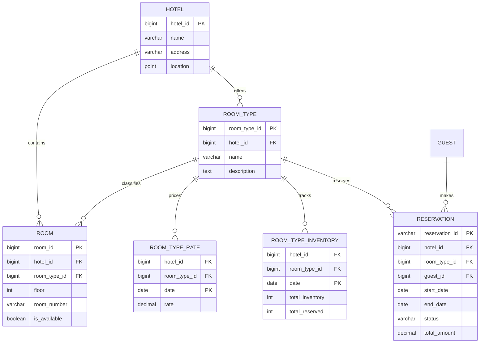

#### 1. `room_type_inventory` Table
This is the core inventory tracking table. Each row tracks the inventory state of a specific room type for a single calendar day:

| Column | Type | Description |
|:---|:---|:---|
| `hotel_id` | `BIGINT` | ID of the hotel property (Composite PK) |
| `room_type_id` | `BIGINT` | ID of the room type (Composite PK) |
| `date` | `DATE` | Calendar day (Composite PK) |
| `total_inventory` | `INT` | Total rooms minus out-of-order/maintenance rooms |
| `total_reserved` | `INT` | Total rooms currently reserved for this date |

#### Sample Inventory Data
| `hotel_id` | `room_type_id` | `date` | `total_inventory` | `total_reserved` | Available (10% Overbooking) |
|:---|:---|:---|:---|:---|:---|
| `211` | `1001` (King) | `2026-09-01` | 100 | 80 | $110 - 80 = 30$ |
| `211` | `1001` (King) | `2026-09-02` | 100 | 82 | $110 - 82 = 28$ |
| `211` | `1001` (King) | `2026-09-03` | 100 | 86 | $110 - 86 = 24$ |
| `211` | `1002` (Double) | `2026-09-01` | 200 | 190 | $220 - 190 = 30$ |

#### Storage Footprint Estimation
$$5{,}000\text{ hotels} \times 20\text{ room types} \times 2\text{ years} \times 365\text{ days} = 73{,}000{,}000\text{ rows (73M rows)}$$
$73\text{M rows}$ requires $\approx 5\text{–}10\text{ GB}$ of storage, easily fitting within a single MySQL instance.

---

### Reservation Lifecycle State Machine

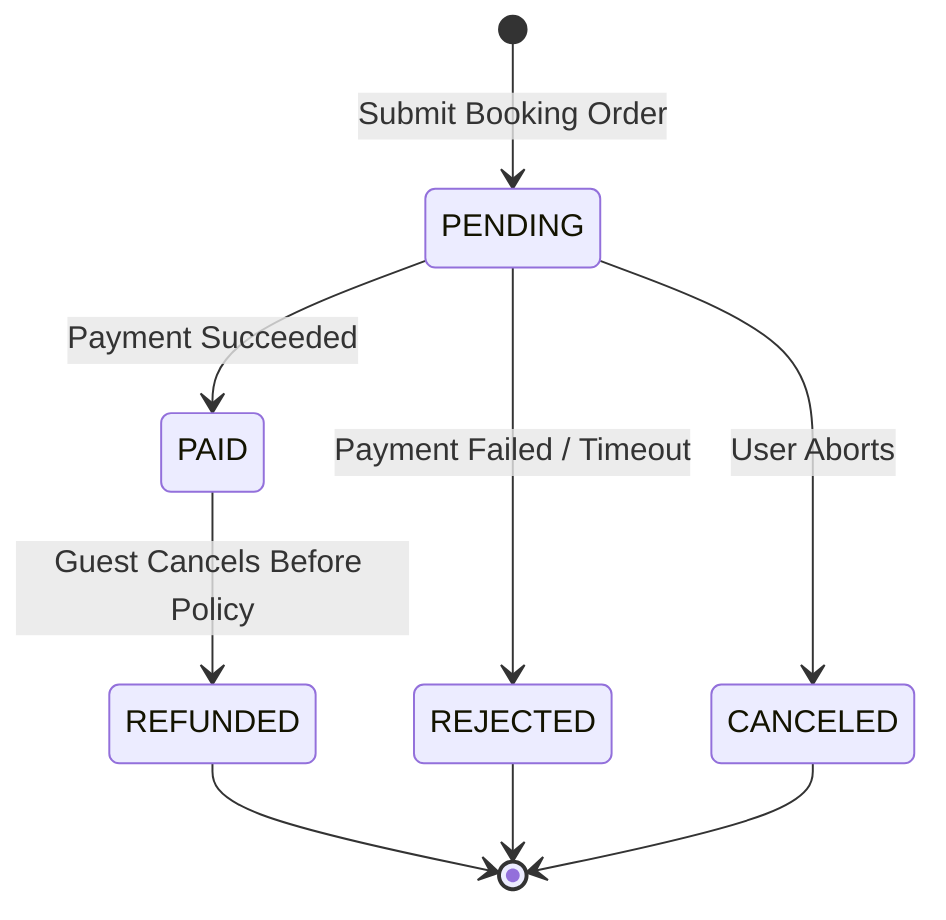

---

## 4. Design Deep Dive

### Concurrency Issue 1: Double-Click Prevention (Idempotency)

When a user clicks "Book Now" multiple times in quick succession or experiences network lag, duplicate booking requests reach the backend.

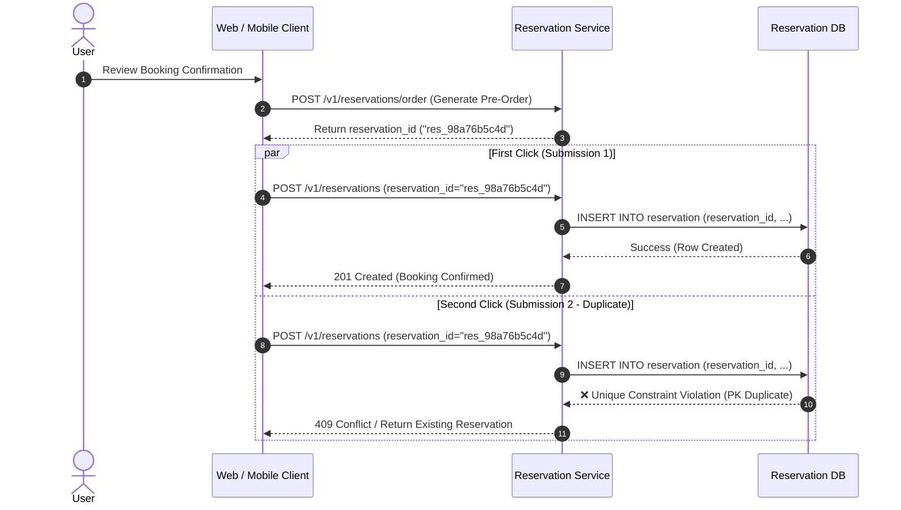

#### Implementation Strategies
1. **Client-Side Defense**: Disable/grey out the submit button immediately upon click.
2. **API Idempotency Key (Server-Side)**:
   - Client fetches a pre-generated `reservation_id` before the final confirmation step.
   - `reservation_id` is the primary key of the `reservation` table.
   - Any duplicate `INSERT` query fails immediately with a primary key constraint violation.

---

### Concurrency Issue 2: Simultaneous Booking Race Conditions

When multiple users attempt to book the last remaining room at the same time:

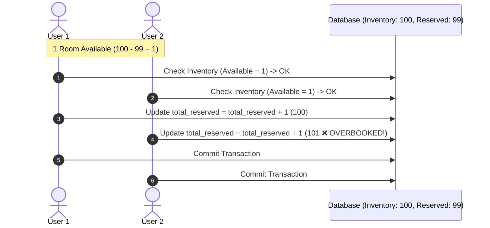

#### Comparison of Concurrency Control Mechanisms

| Mechanism | Description | Pros | Cons | Recommendation |
|:---|:---|:---|:---|:---|
| **Pessimistic Locking** | `SELECT ... FOR UPDATE` locks inventory rows for the entire transaction. | Serializes updates; zero conflicts. | High lock contention; danger of deadlocks; unscalable under traffic spikes. | Not recommended |
| **Optimistic Locking** | Checks a `version` column before updating (`WHERE version = @v`). | No DB locks held; fast for low contention. | Under high contention, massive retries degrade user experience. | Good for moderate load |
| **Database Constraints** | Relational `CHECK (total_reserved <= total_inventory)` constraint. | Atomic, handled directly by DB engine; clean code. | Migrations between DB engines can be tricky; retries still needed. | **Recommended** |
| **Distributed Lock** | Redis lock (Redlock) on `hotel_id:room_type_id:date`. | Offloads locking from DB; flexible TTL. | Operational complexity; split-brain risk on network partitions. | Optional for extreme scale |

#### Recommended Implementation: Database Constraint + Atomic Update

```sql
-- Step 1: Atomic conditional update with overbooking threshold (110%)
UPDATE room_type_inventory
SET total_reserved = total_reserved + :numRooms
WHERE hotel_id = :hotelId
  AND room_type_id = :roomTypeId
  AND date BETWEEN :startDate AND :endDate
  AND (total_reserved + :numRooms) <= (total_inventory * 1.10);

-- Step 2: Check rows affected
-- If affected_rows == number of nights in date range -> PROCEED TO INSERT RESERVATION
-- Else -> ROLLBACK & RETURN "NO_ROOMS_AVAILABLE"
```

---

### Scalability & Sharding Strategy

If the system expands from a single chain to a global travel aggregator (e.g., Booking.com scale with $30{,}000\text{ QPS}$):

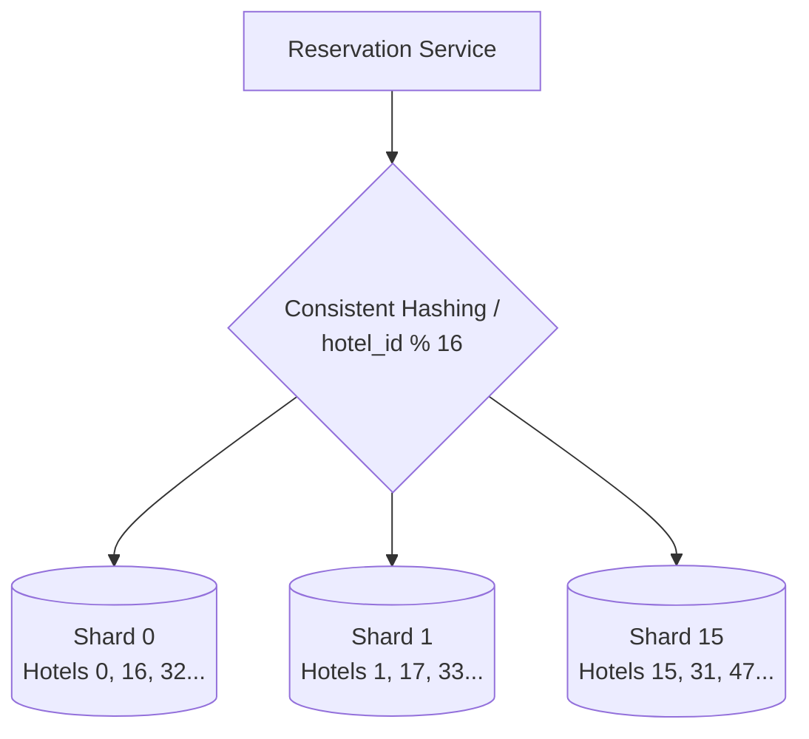

- **Sharding Key**: `hotel_id` is the natural sharding key because almost all reservation and inventory queries require `hotel_id`.
- **Shard Distribution**: Using `hash(hotel_id) % 16` distributes $30{,}000\text{ QPS}$ to $\approx 1{,}875\text{ QPS}$ per MySQL instance, well within single-node capacity.

---

### Inventory Caching & Asynchronous CDC Sync

To protect the database from read traffic surges during holiday campaigns, an in-memory Redis inventory cache is deployed.

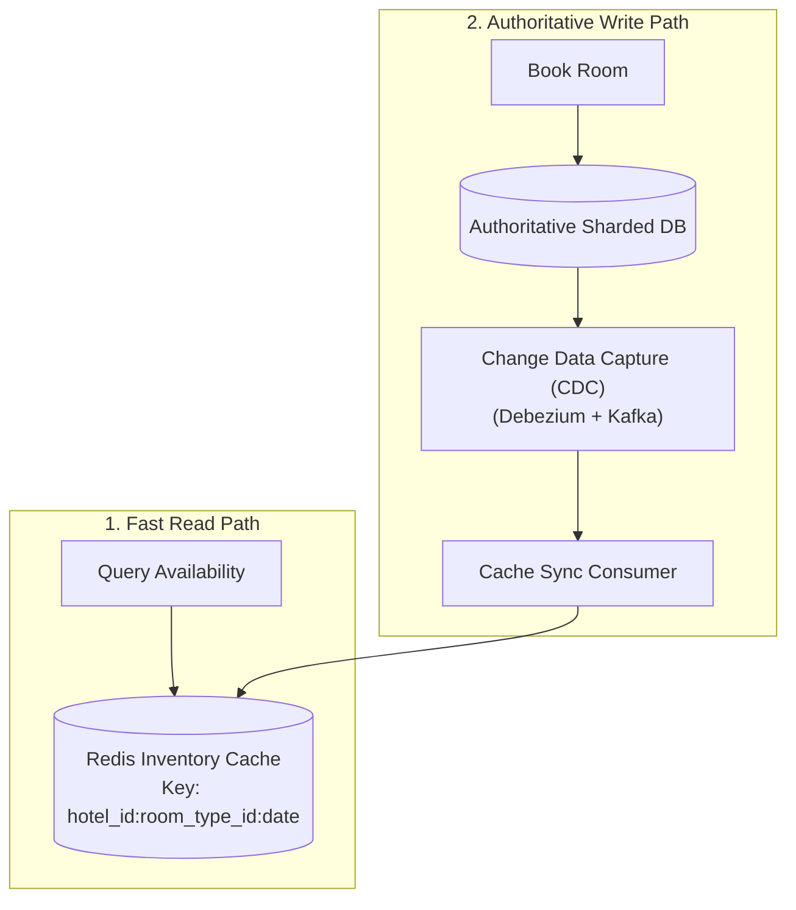

> [!TIP]
> **Cache Inconsistency Tolerance**:
> Even if Redis returns stale inventory data (showing an empty room when none is left), the authoritative database conditional update will reject the reservation at transaction time. The database remains the ultimate source of truth.

---

### Distributed Microservices Consistency

When microservices maintain isolated databases (Reservation DB vs. Inventory DB vs. Payment DB), distributed transactions are required.

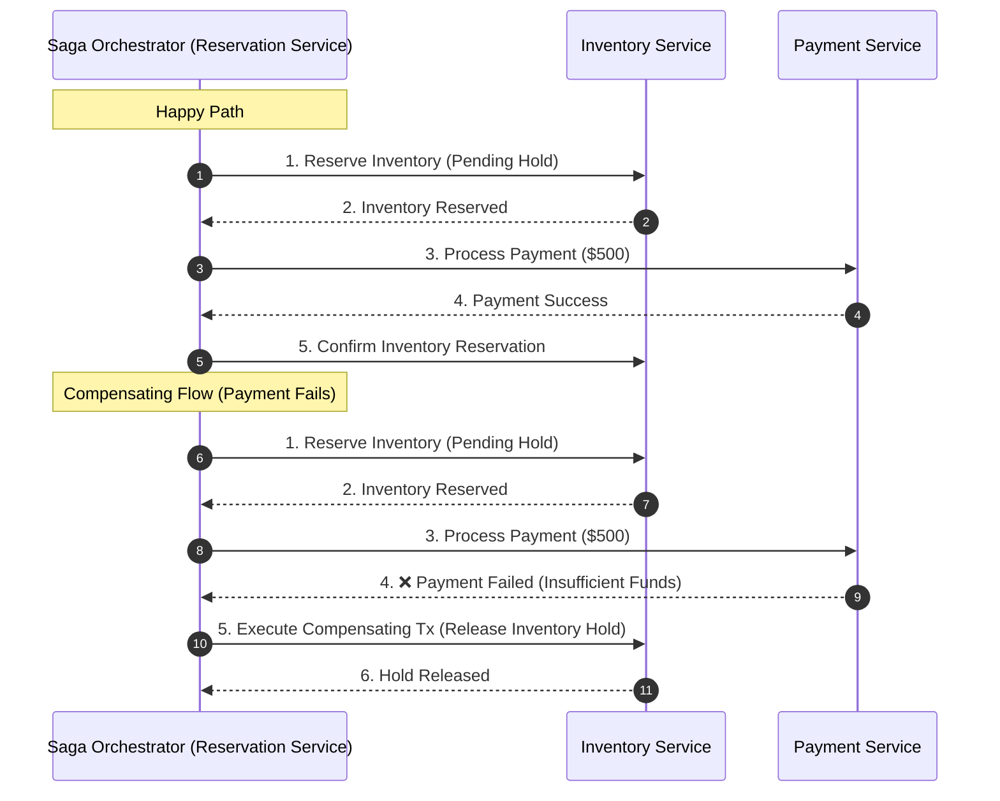

- **2-Phase Commit (2PC)**: Strong ACID consistency across databases, but heavy lock holding and blocking behavior make it unsuitable for high-throughput public systems.
- **Saga Pattern**: Sequence of local transactions coordinated via events/orchestration. If a step fails, **compensating transactions** are executed to undo earlier steps.
- **Pragmatic Architecture Recommendation**: Colocate `reservation` and `room_type_inventory` tables in the same relational database to leverage native local ACID transactions while using asynchronous events for external payment/notification integrations.

---

## 5. Wrap Up & Summary

### Architectural Summary Matrix

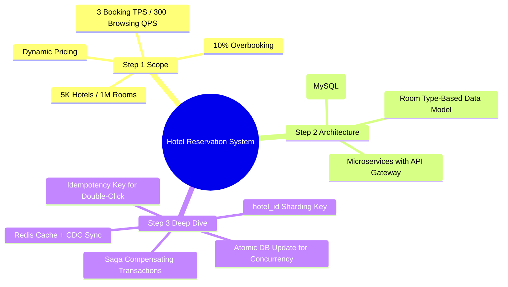

| Area | Primary Design Decision | Rationale |
|:---|:---|:---|
| **Data Model** | Room type-level inventory tracking (`room_type_inventory`) | Guests book room types; physical rooms assigned at check-in. |
| **Double-Click Defense** | `reservation_id` as primary key / idempotency token | Database unique constraint rejects identical duplicate submissions. |
| **Concurrency Control** | Conditional SQL `UPDATE` with `CHECK` constraint | Atomic execution in DB engine avoids pessimistic lock starvation. |
| **Overbooking** | `WHERE (total_reserved + N) <= total_inventory * 1.10` | Natively accommodates $10\%$ overbooking buffer. |
| **Database Scalability** | Sharding by `hash(hotel_id) % num_shards` | Perfectly isolates single-hotel traffic and spreads query load. |
| **Read Acceleration** | Redis inventory cache + Debezium CDC | Offloads $90\%+$ read queries with authoritative DB fallback. |

---

## References

1. Microservices Architecture: https://microservices.io
2. Debezium Change Data Capture: https://debezium.io
3. Distributed Sagas Pattern: https://microservices.io/patterns/data/saga.html
4. MySQL Optimistic & Pessimistic Locking: https://dev.mysql.com/doc/refman/8.0/en/innodb-locking-reads.html
