# Distributed Email Service

> **Source**: *System Design Interview – An Insider's Guide: Volume 2* by Alex Xu & Sahn Lam  
> **ByteByteGo Chapter**: 24  
> **Topic**: Distributed Storage, Inverted Index Search, Real-Time Push, Email Deliverability, Wide-Column Data Modeling

---

## 1. Understand the Problem and Establish Design Scope

Email is a foundational communication infrastructure operating at global scale. Modern email services handle hundreds of billions of messages daily, requiring massive distributed storage, low-latency search, robust anti-spam pipelines, and resilient multi-datacenter replication.

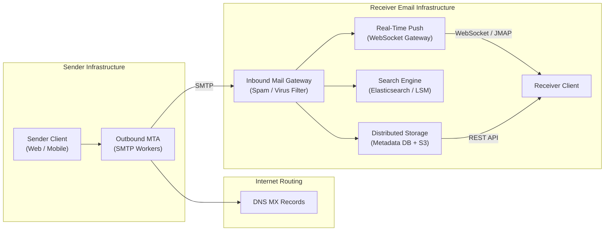

---

### Interview Clarification & Scope

> **Candidate:** How many users does the email system serve?  
> **Interviewer:** **1 billion users**.
>
> **Candidate:** Which core features should we prioritize?  
> **Interviewer:** 
> 1. Sending and receiving emails.
> 2. Fetching and viewing mailboxes and folders.
> 3. Filtering emails by read / unread status.
> 4. Full-text search by subject, sender, and body.
> 5. Spam and virus filtering.  
> *(Authentication and user profile management are out of scope).*
>
> **Candidate:** What client protocols should be supported?  
> **Interviewer:** Traditionally, clients use SMTP, POP3, and IMAP. For this interview, assume a modern webmail and mobile client using **HTTP / RESTful APIs and WebSockets**.
>
> **Candidate:** Can emails have attachments?  
> **Interviewer:** Yes, attachments up to $25\text{ MB}$ per email.

---

### Requirements Summary

#### Functional Requirements
1. **Send & Receive**: Asynchronously dispatch outbound emails via SMTP and ingest inbound emails.
2. **Mailbox Management**: Folder organization (Inbox, Sent, Drafts, Trash, Spam), read/unread status, and conversation threading.
3. **Attachments**: Support file uploads/downloads up to $25\text{ MB}$.
4. **Full-Text Search**: Low-latency keyword search over subjects, senders, and email bodies.
5. **Anti-Spam & Deliverability**: SPF/DKIM/DMARC authentication, IP reputation management, and bounce processing.

#### Non-Functional Requirements
- **High Reliability & Durability**: Zero email data loss; emails must persist across storage node failures.
- **High Availability**: $99.99\%$ uptime; automated cross-region replication.
- **Low Latency**: Real-time push for new emails ($< 1\text{ second}$), fast inbox retrieval ($< 100\text{ ms}$).
- **Scalability**: Handle $100{,}000\text{ QPS}$ outbound throughput and hundreds of petabytes of annual storage growth.

---

### Back-of-the-Envelope Estimation

| Metric / Dimension | Calculation | Estimated Value |
|:---|:---|:---|
| **Active Users** | Given | $1{,}000{,}000{,}000\text{ (1 Billion users)}$ |
| **Emails Sent per User / Day** | Assumption | $10\text{ emails/user/day}$ |
| **Outbound Email Throughput** | $\frac{10^9 \times 10}{86{,}400\text{ sec}} \approx \frac{10^{10}}{10^5}$ | $\approx 100{,}000\text{ QPS}$ |
| **Emails Received per User / Day** | Given | $40\text{ emails/user/day}$ |
| **Inbound Email Throughput** | $\frac{10^9 \times 40}{86{,}400\text{ sec}}$ | $\approx 400{,}000\text{ QPS}$ |
| **Average Email Metadata Size** | Headers, body, recipients | $50\text{ KB}$ |
| **Annual Metadata Storage** | $1\text{B users} \times 40\text{ mails/day} \times 365\text{ days} \times 50\text{ KB}$ | $\approx \mathbf{730\text{ PB/year}}$ |
| **Attachment Ratio & Size** | $20\%$ contain attachments, avg size $500\text{ KB}$ | $20\% \times 500\text{ KB} = 100\text{ KB/mail}$ |
| **Annual Attachment Storage** | $1\text{B users} \times 40\text{ mails/day} \times 365\text{ days} \times 100\text{ KB}$ | $\approx \mathbf{1{,}460\text{ PB/year}}$ |
| **Total Annual Storage Footprint** | $730\text{ PB} + 1{,}460\text{ PB}$ | $\approx \mathbf{2{,}190\text{ PB/year (2.19 Exabytes)}}$ |

> [!IMPORTANT]
> The massive volume ($>2\text{ Exabytes/year}$) makes storing raw emails in relational databases impossible. We must separate **metadata storage (distributed wide-column NoSQL)** from **attachment storage (distributed object storage)**.

---

## 2. High-Level Architecture

### Email Protocol Fundamentals

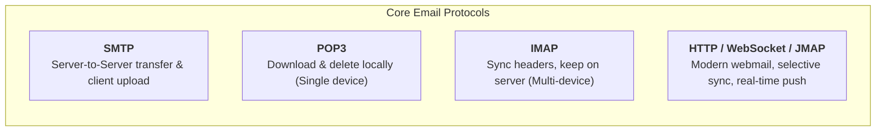

| Protocol | Role | Storage Model | Multi-Device Sync | Modern Applicability |
|:---|:---|:---|:---|:---|
| **SMTP** (RFC 5321) | Push emails between servers and clients | N/A (Transmission) | N/A | Universal standard for MTA-to-MTA |
| **POP3** (RFC 1939) | Download emails to local client | Deleted from server upon fetch | ❌ Poor | Legacy |
| **IMAP** (RFC 3501) | Read & sync mail on remote server | Persisted on server | ✅ Good | Standard for native desktop clients |
| **HTTP / JMAP** (RFC 8620) | RESTful API over HTTPS + WebSockets | Distributed Cloud Storage | ✅ Best | Ideal for webmail and modern mobile apps |

#### DNS MX (Mail Exchanger) Lookup
When sending to `bob@gmail.com`, the sender queries DNS for `gmail.com` MX records:
```text
gmail.com.    300   IN   MX   5    gmail-smtp-in.l.google.com.
gmail.com.    300   IN   MX   10   alt1.gmail-smtp-in.l.google.com.
```
Lower preference value ($5$) represents higher priority.

---

### Core Webmail APIs (RESTful)

| Endpoint | Method | Description |
|:---|:---|:---|
| `/v1/messages` | `POST` | Send a new message to recipients (`To`, `Cc`, `Bcc`) |
| `/v1/messages/{message_id}` | `GET` | Retrieve a specific email message details and payload |
| `/v1/folders` | `GET` | Fetch all user folders (`Inbox`, `Sent`, `Trash`, `Custom`) |
| `/v1/folders/{folder_id}/messages` | `GET` | Paginated retrieval of messages in a folder |
| `/v1/search` | `GET` | Search messages by query keywords, dates, and filters |

---

### Distributed Architecture Diagram

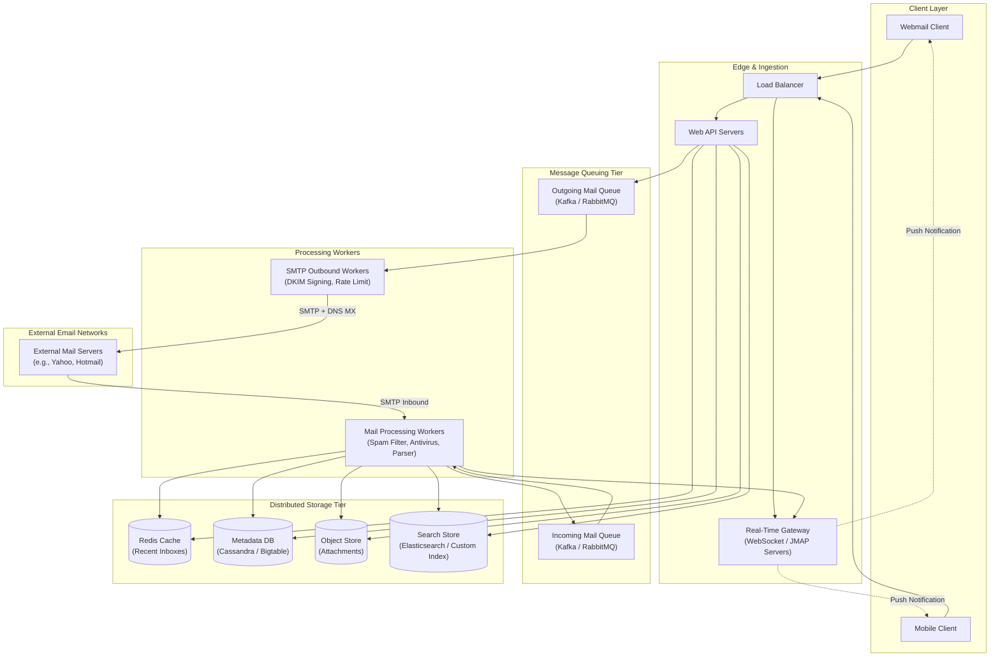

---

### Workflow 1: Email Sending Flow

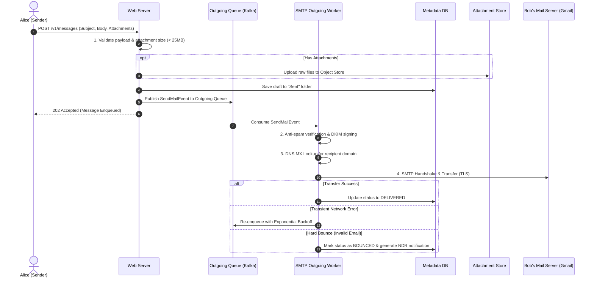

---

### Workflow 2: Email Receiving Flow

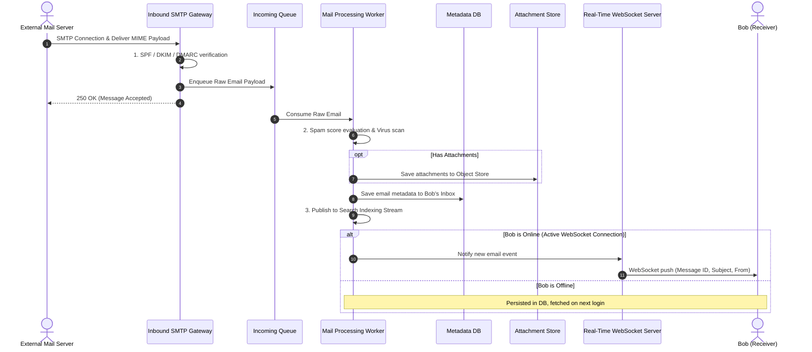

---

## 3. Data Model & Schema Design

### Metadata Characteristics
- **Headers**: Small ($\approx 1\text{–}2\text{ KB}$), highly structured, frequently read.
- **Body**: Variable size ($10\text{–}200\text{ KB}$), read once or twice per user.
- **Recency Access Pattern**: **$82\%$ of read queries access emails younger than 16 days**.
- **Data Isolation**: All operations belong strictly to a single `user_id`.

---

### Distributed Wide-Column Schema (Cassandra / Bigtable)

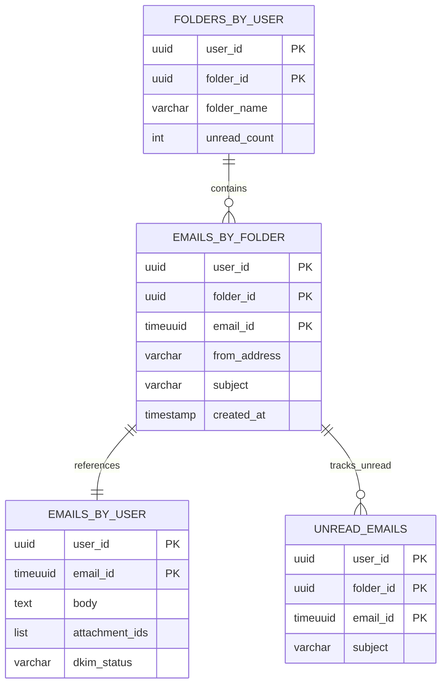

#### 1. `folders_by_user`
- **Partition Key**: `user_id`
- **Clustering Key**: `folder_id`
- **Purpose**: Rapidly lists all folders for an account in a single disk read.

#### 2. `emails_by_folder`
- **Partition Key**: `(user_id, folder_id)` (Composite)
- **Clustering Key**: `email_id TIMEUUID` (Descending)
- **Purpose**: Renders the inbox/folder list in reverse chronological order with fast pagination.

#### 3. `emails_by_user` (Detail Table)
- **Partition Key**: `user_id`
- **Clustering Key**: `email_id`
- **Purpose**: Fetches the full email body and attachment metadata when the user opens an email.

#### 4. `unread_emails` (Denormalized Index Table)
- **Partition Key**: `(user_id, folder_id)`
- **Clustering Key**: `email_id TIMEUUID`
- **Purpose**: Since NoSQL cannot efficiently filter by non-key columns (`WHERE is_read = false`), we maintain a dedicated denormalized unread table. When marked read, the row is deleted from `unread_emails`.

---

## 4. Design Deep Dive

### 1. Conversation Threading (JWZ Algorithm)

Modern email clients group messages into conversational threads.

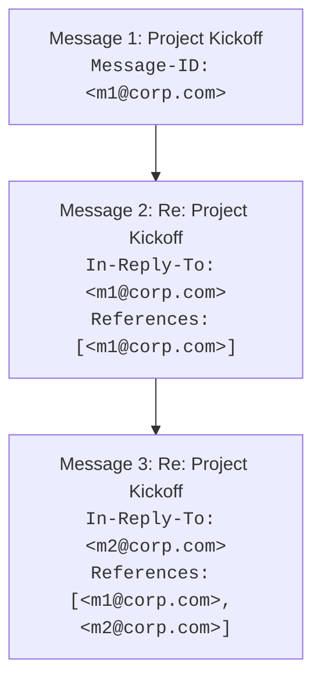

- **`Message-ID`**: Globally unique identifier generated by the sender client.
- **`In-Reply-To`**: `Message-ID` of the immediate parent message being replied to.
- **`References`**: Array of parent `Message-ID`s tracing the full lineage of the thread.

---

### 2. Email Deliverability & Anti-Spam Pipeline

More than **$50\%$ of all global email traffic is spam**. Establishing sender legitimacy is essential to prevent emails from landing in spam folders.

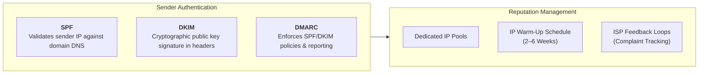

#### ISP Feedback & Bounce Handling

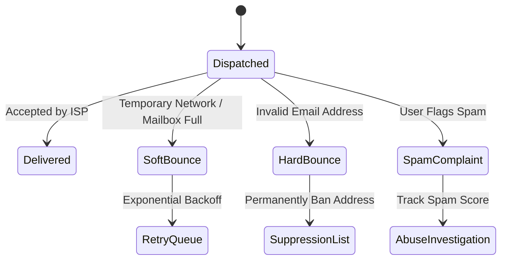

1. **Hard Bounce**: Permanent delivery failure (recipient address doesn't exist). Must be immediately added to a suppression list to protect domain reputation.
2. **Soft Bounce**: Temporary failure (mailbox full, ISP throttling). Retried with exponential backoff up to 72 hours.
3. **Complaint Rate**: Kept strictly below $0.1\%$ via automated spammer account suspension.

---

### 3. Distributed Email Search Architecture

Searching emails is fundamentally different from web search:
- **Write-to-Read Ratio**: Huge write volume (every incoming/outgoing email must be indexed); search queries occur only when a user explicitly searches.
- **Scope & Security**: Search scope is strictly limited to the user's own mailbox (`user_id`).

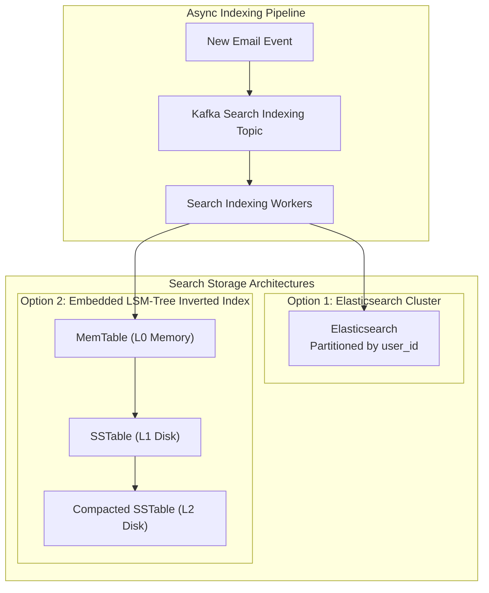

#### Trade-Off Matrix: Elasticsearch vs. Custom In-Database Search

| Dimension | Elasticsearch | Custom Embedded LSM-Tree Search |
|:---|:---|:---|
| **System Complexity** | High (Dual-system sync between DB and ES) | Low (Single integrated database storage) |
| **Data Consistency** | Eventual consistency via Kafka stream | Strong consistency within mailbox partition |
| **Write I/O Efficiency** | Medium (Higher memory/heap overhead) | High (Sequential writes via LSM-Tree compaction) |
| **Engineering Effort** | Low (Out-of-the-box cluster management) | High (Requires custom search engine team) |
| **Best Suited For** | Small-to-medium scale enterprise mail | Hyper-scale (Gmail, Outlook scale) |

---

## 5. Wrap Up & Summary

### Architectural Summary Mindmap

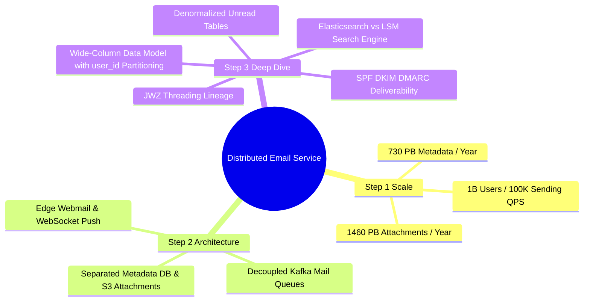

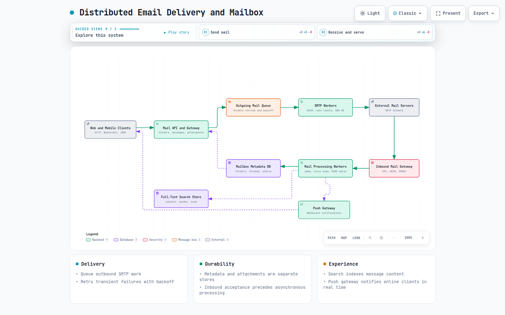

> **Interactive Archify diagram**: [Distributed email delivery and mailbox](resources/distributed-email-service/distributed-email-delivery.html)

| Area | Primary Architectural Decision | Key Benefit |
|:---|:---|:---|
| **Storage Separation** | Wide-column NoSQL for metadata + S3 for attachments | Prevents database bloat from large attachment files. |
| **Partitioning Key** | `user_id` as partition key | Guarantees all mailbox queries are isolated to a single shard. |
| **Real-Time Push** | WebSockets with JMAP subprotocol | Delivers immediate new message notifications without polling. |
| **Search Engine** | Asynchronous Kafka indexing to Elasticsearch / LSM | Prevents search index generation from blocking the email ingestion path. |
| **Deliverability** | SPF, DKIM, DMARC + ISP Feedback Loops | Protects IP reputation and ensures delivery to inboxes. |

---

## References

1. RFC 5321 - Simple Mail Transfer Protocol (SMTP): https://datatracker.ietf.org/doc/html/rfc5321
2. RFC 8620 - The JSON Meta Application Protocol (JMAP): https://datatracker.ietf.org/doc/html/rfc8620
3. Cassandra Wide-Column Data Modeling: https://cassandra.apache.org/doc/latest/
4. JWZ Message Threading Algorithm: https://www.jwz.org/doc/threading.html
5. Amazon SES Dedicated IP Warm-up Guide: https://docs.aws.amazon.com/ses/latest/dg/dedicated-ip-warming.html
