# S3-Like Object Storage

> **Source**: *System Design Interview – An Insider's Guide: Volume 2* by Alex Xu & Sahn Lam  
> **ByteByteGo Chapter**: 25  
> **Topic**: Distributed Storage Engines, Erasure Coding, Durability Modeling, Metadata Sharding, Append-Only Compaction

---

## 1. Understand the Problem and Establish Design Scope

Object storage is a cloud storage paradigm optimized for vast scale, high durability, and low cost. Unlike file systems (hierarchical directories) or block storage (raw disk blocks for databases/VMs), object storage treats data as immutable objects stored in flat namespaces accessed via RESTful HTTP APIs.

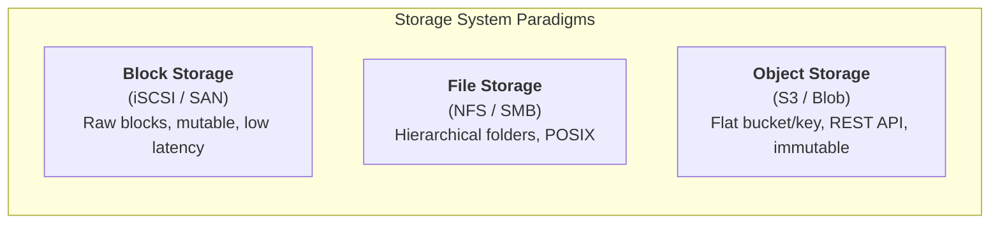

### Storage Paradigms Comparison

| Characteristic | Block Storage | File Storage | Object Storage (AWS S3) |
|:---|:---|:---|:---|
| **Data Mutability** | In-place read/write | In-place update / append | **Immutable** (replace/versioning only) |
| **Namespace Structure** | Flat sector addresses | Hierarchical directory tree | **Flat namespace** (Bucket + Key URI) |
| **Access Protocol** | Fibre Channel / iSCSI | NFS / SMB / CIFS | **RESTful HTTP (GET / PUT / DELETE)** |
| **Performance / Latency** | Ultra-high ($\mu\text{s}$ range) | High ($\text{ms}$ range) | Moderate ($\text{tens of ms}$) |
| **Cost & Scalability** | High cost, limited scale | Medium cost, moderate scale | **Lowest cost, petabyte-to-exabyte scale** |
| **Primary Use Cases** | Databases, VM system disks | Enterprise file sharing, NAS | **Backups, media assets, big data lakes** |

---

### Core Terminology

- **Bucket**: Globally unique logical container for objects.
- **Object**: An immutable binary payload (data bytes) paired with descriptive key-value **Metadata**.
- **URI**: Universal resource identifier uniquely addressing an object: `s3://<bucket-name>/<object-key>`.
- **Versioning**: Preserves historical variants of an object under the same key to protect against accidental overwrite or deletion.

---

### Interview Clarification & Scope

> **Candidate:** What core features should the object storage system provide?  
> **Interviewer:** 
> 1. Bucket creation and deletion.
> 2. Object upload, download, and deletion.
> 3. Object versioning.
> 4. Bucket listing (prefix filtering, similar to `aws s3 ls`).
>
> **Candidate:** What is the target data scale and object size distribution?  
> **Interviewer:** We need to store **100 Petabytes (PB)** annually, supporting both small files ($< 1\text{ MB}$) and large multi-gigabyte files.
>
> **Candidate:** What are the target durability and availability SLAs?  
> **Interviewer:** Target at least **$99.9999\%$ (6 nines)** data durability with replication, and design an erasure-coding option for **$99.999999999\%$ (11 nines)** durability. Service availability must be **$99.99\%$ (4 nines)**.

---

### Back-of-the-Envelope Estimation

#### Capacity & Object Count Estimation
Assume object size distribution:
- **Small objects ($< 1\text{ MB}$, median $0.5\text{ MB}$)**: $20\%$ of count
- **Medium objects ($1\text{ MB}$ to $64\text{ MB}$, median $32\text{ MB}$)**: $60\%$ of count
- **Large objects ($> 64\text{ MB}$, median $200\text{ MB}$)**: $20\%$ of count

$$\text{Average Object Size} = 0.20(0.5\text{ MB}) + 0.60(32\text{ MB}) + 0.20(200\text{ MB}) = 0.1 + 19.2 + 40 = 59.3\text{ MB} \approx 60\text{ MB}$$

| Metric / Dimension | Calculation | Estimated Value |
|:---|:---|:---|
| **Annual Payload Storage** | Given target capacity | $\mathbf{100\text{ PB}}$ ($10^{11}\text{ MB}$) |
| **Usable Storage Ratio** | Factoring parity / replication | $40\%\text{ of raw capacity}$ |
| **Total Objects Persisted** | $\frac{100\text{ PB} \times 0.40}{59.3\text{ MB}}$ | $\approx \mathbf{0.68\text{ Billion objects (680M)}}$ |
| **Metadata Record Size** | Object name, UUID, size, owner, ACL | $\approx 1\text{ KB/record}$ |
| **Total Metadata Database Size** | $680{,}000{,}000 \times 1\text{ KB}$ | $\approx \mathbf{680\text{ GB}}$ |
| **Drive IOPS Constraint** | 7200 RPM enterprise SATA drive | $100\text{–}150\text{ IOPS/drive}$ |

> [!NOTE]
> Since $680\text{ GB}$ of metadata easily fits in memory-cached indexes across a small cluster, the primary architectural bottleneck lies in **Disk IOPS and inode exhaustion** from managing hundreds of millions of small files.

---

## 2. High-Level Architecture

### Architectural Analogy: The Unix Inode Separation

Object storage separates mutable metadata from immutable raw data blocks, mirroring Unix file system architecture:

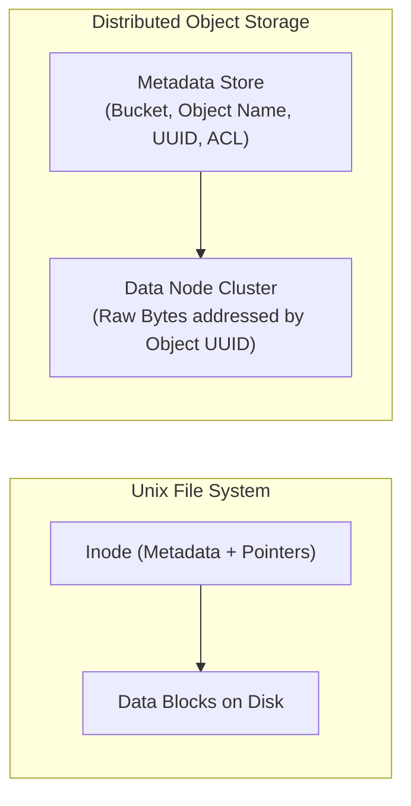

---

### High-Level System Components

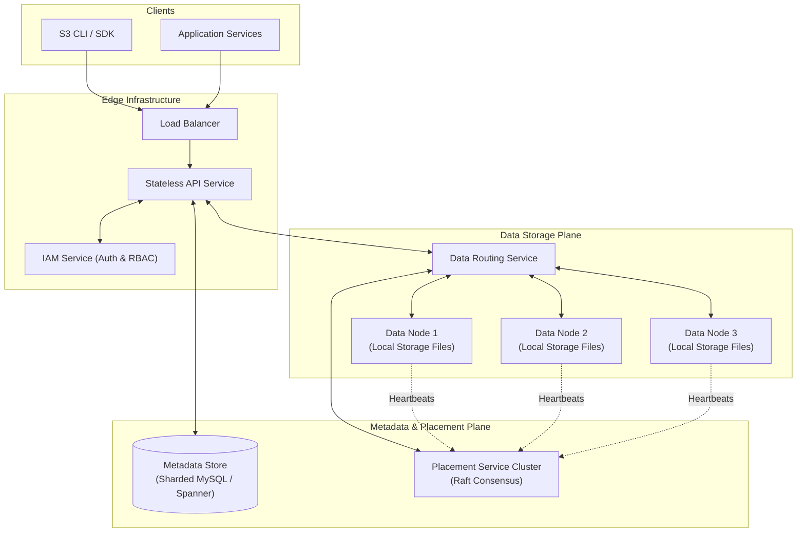

---

### Core Workflows

#### 1. Object Upload Workflow

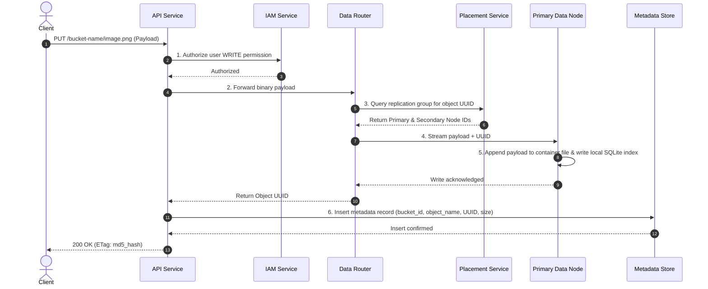

#### 2. Object Download Workflow

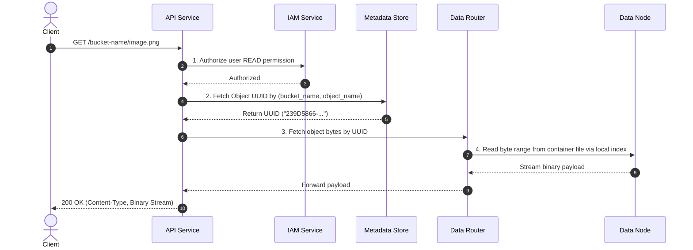

---

## 3. Data Model & Schema Design

### Metadata Store Schema

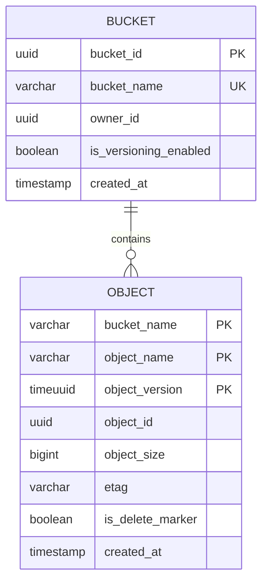

#### 1. `bucket` Table
Stores bucket-level configuration. Since users rarely create more than 100 buckets, the entire table is tiny ($\approx 10\text{ GB}$ for 1M users) and can be replicated across nodes.

#### 2. `object` Table (Metadata Records)
- **Primary Sharding Key**: `hash(bucket_name, object_name)`
- **Composite Key**: `(bucket_name, object_name, object_version)`

| Column | Type | Description |
|:---|:---|:---|
| `bucket_name` | `VARCHAR(64)` | Parent bucket identifier |
| `object_name` | `VARCHAR(1024)` | Logical URI key (e.g., `photos/2026/img.jpg`) |
| `object_version` | `TIMEUUID` | Version timestamp identifier (descending order) |
| `object_id` | `UUID` | Pointer to the binary payload in the Data Node cluster |
| `object_size` | `BIGINT` | Size in bytes |
| `etag` | `VARCHAR(32)` | MD5 hash of object payload |
| `is_delete_marker` | `BOOLEAN` | True if this version represents an object deletion |

---

## 4. Design Deep Dive

### 1. Data Node Organization: Append-Only Container Files

Storing millions of small files directly as individual files on a standard Linux file system (ext4/XFS) fails due to:
1. **Block Waste**: A $500\text{ byte}$ file consumes an entire $4\text{ KB}$ block.
2. **Inode Exhaustion**: File systems have fixed maximum inode allocations, leading to "disk full" errors even with ample free disk space.

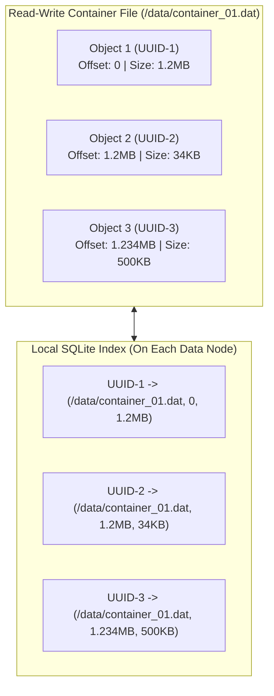

- **Container Files**: Objects are sequentially appended to a read-write container file until it reaches $\approx 2\text{–}4\text{ GB}$.
- **Immutable Rotation**: Once full, the container file is marked **Read-Only**, and a new container is opened.
- **Local Index Engine**: Each Data Node runs an embedded **SQLite** instance mapping `object_id (UUID) -> (file_name, start_offset, object_size)`.

#### Why Append-Only, Specifically

The write path only ever does one thing to a container file: open it, `seek` to end-of-file (or track the current write offset in memory), and `write()` the new payload. There is no in-place update, no random-offset write, and no read-modify-write cycle:

1. **Sequential I/O is the fastest I/O pattern** on both spinning disks (no seek time between writes) and SSDs (avoids write amplification from small random writes hitting the flash translation layer).
2. **No locking contention on existing bytes** — because prior offsets are never touched again, a writer never has to coordinate with a reader over the same byte range. A reader at offset `0–1.2MB` and a writer appending at offset `50GB` never conflict.
3. **Crash-safety is simpler**: if the process dies mid-append, the container file is truncated back to the last known-good offset (tracked in the index) on restart. Nothing "in the middle" of the file is ever left half-updated, because nothing in the middle is ever touched again.
4. **Corruption blast radius is limited to the tail**: a crash can only corrupt the last (incomplete) write, never an older object earlier in the file.

#### Per-Object Write Path (Step by Step)

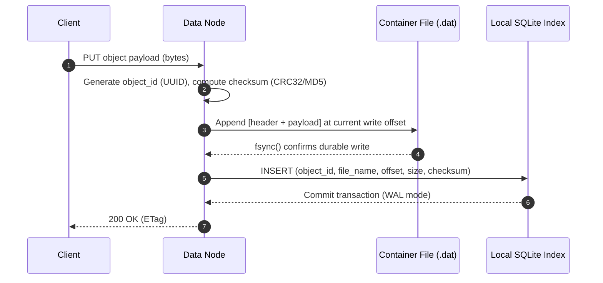

- The write offset is only advanced, and the index row is only committed, **after** the `fsync()` on the container file returns — this ordering guarantees the index never points at bytes that were not durably persisted.
- SQLite is run in **WAL (Write-Ahead Log) mode** so that concurrent readers (serving `GET` requests) are never blocked by an in-flight index write, and the index itself recovers cleanly after a crash using its own WAL replay.

#### Per-Object Read Path (Step by Step)

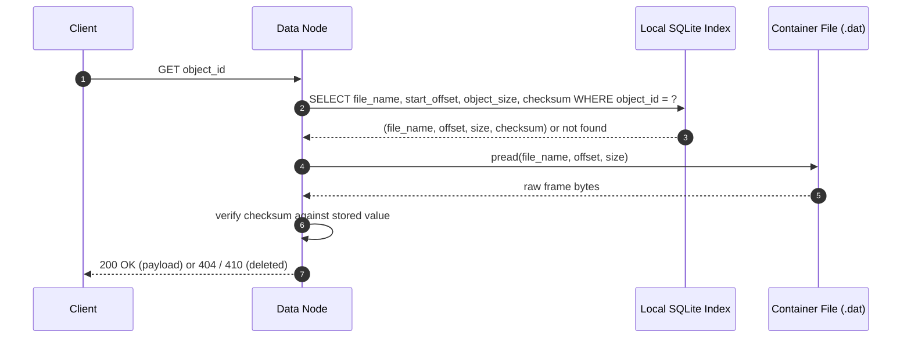

- The index lookup is a single indexed point-read on `object_id` (primary key), so it resolves in O(1) regardless of how many objects or container files the node holds.
- Because the read uses `pread()` at a known `(offset, size)`, it is a **single seek + single read** — no scanning, no directory traversal, and no dependency on the OS's per-file metadata (which doesn't exist here, since many objects share one container file).
- The checksum stored in the index (or recomputed from the frame header) is verified **before** returning bytes to the client, catching silent disk corruption (bit-rot) that a plain filesystem read would not detect.
- If `deleted = true` in the index (soft-delete, pending physical compaction — see section 5), the node returns immediately without touching the container file at all, even though the bytes may still physically be on disk.
- Reads never contend with the append-only writer: the writer only ever appends past the current end-of-file, so a concurrent read at any earlier offset always sees stable, already-`fsync()`'d bytes.

#### Container File Layout (On-Disk Framing)

Each appended object is not just raw bytes — it is wrapped in a small **frame header** so the container file is self-describing and can be independently scanned/repaired without the index (e.g., during index rebuild after corruption):

| Field | Size | Purpose |
|:---|:---|:---|
| `magic_number` | 4 bytes | Sanity check marker to detect corrupted/misaligned reads |
| `object_id` (UUID) | 16 bytes | Ties the frame back to a logical object, redundant with the index |
| `payload_length` | 8 bytes | Size of the object body that follows |
| `checksum` (CRC32/MD5) | 4–16 bytes | Detects silent bit-rot / partial writes independent of the index |
| `payload` | variable | The actual object bytes |

This framing is what makes the design **self-healing**: if the SQLite index file is ever lost or corrupted, a background job can sequentially scan every container file frame-by-frame (reading `magic_number` → `object_id` → `payload_length` → skip → repeat) and fully rebuild the `object_id -> (file, offset, size)` mapping from scratch.

#### Local Metadata Index Schema

The per-node SQLite database is purely a **local, node-scoped lookup cache** — it is not the system of record (that role belongs to the Cassandra-backed metadata service described in section 3 of this doc). Its schema is intentionally minimal for fast point lookups:

| Column | Type | Description |
|:---|:---|:---|
| `object_id` | `TEXT` (UUID, primary key) | Matches the `object_id` written in the Cassandra metadata row |
| `file_name` | `TEXT` | Which container file on this node's local disk holds the bytes |
| `start_offset` | `INTEGER` | Byte offset within `file_name` where the frame begins |
| `object_size` | `INTEGER` | Payload length, used to bound the read |
| `checksum` | `TEXT` | Copy of the frame checksum, for fast integrity verification without touching disk |
| `deleted` | `BOOLEAN` | Soft-delete marker set during garbage collection (see section 5), before physical compaction removes the bytes |

Because this index is a rebuildable cache (not the durability guarantee), it does not need cross-node replication — durability comes from the erasure-coded/replicated copies of the container files themselves across Data Nodes (see section 2).

#### Why a Local Index Instead of Extending the Central Metadata DB

There are two separate metadata layers in this design, each answering a different question:

| Layer | Question it answers | Storage |
|:---|:---|:---|
| **Central metadata (Cassandra, section 3)** | "Does this object exist, and which Data Nodes hold it?" — maps `(bucket_name, object_name, version) -> object_id` | Cluster-wide system of record |
| **Local index (SQLite, this section)** | "Given this `object_id`, exactly where on *my* disk is it?" — maps `object_id -> (file_name, offset, size)` | Node-local, rebuildable cache |

These cannot be merged into one central store without hurting the system:

- **Offset data is node-private and meaningless elsewhere**: `/data/container_01.dat` on Data Node A and the file of the same name on Data Node B are unrelated files with unrelated offsets. Centralizing this would blow up the central DB with per-replica, per-node rows that only matter to one machine.
- **Compaction would flood the central DB with updates**: every time a background compaction worker rewrites objects into a new container file (section 5), the offset changes. If offsets lived centrally, every compaction cycle on every node would generate a wave of updates against the one shared system. Keeping offsets local means compaction is a purely local, uncoordinated operation.
- **Reads stay off the network for the expensive part**: the central DB is only consulted once per request, to resolve "which node(s) have this object." Once the request reaches the correct Data Node, translating `object_id` to a byte range is a local, in-process SQLite lookup with no network round-trip — critical since this happens on every single `GET`.
- **Blast radius of index loss is contained**: because the local index is a derived cache (rebuildable by scanning container file frame headers, as described above), losing it is a local, recoverable event. Losing the central Cassandra metadata would be catastrophic, since it is the only record that objects exist at all — so it makes sense to keep the two failure domains separate.

The end-to-end read path reflects this two-hop design:

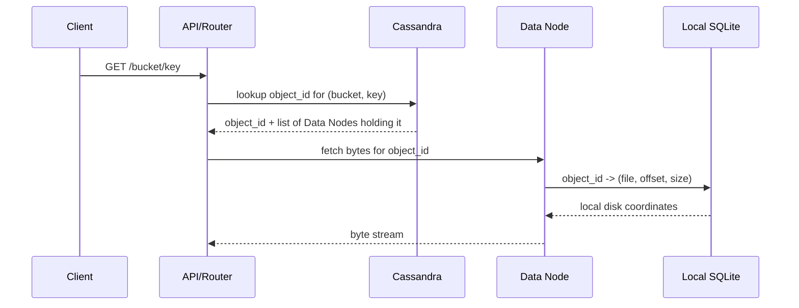

---

### 2. High Durability: Replication vs. Erasure Coding

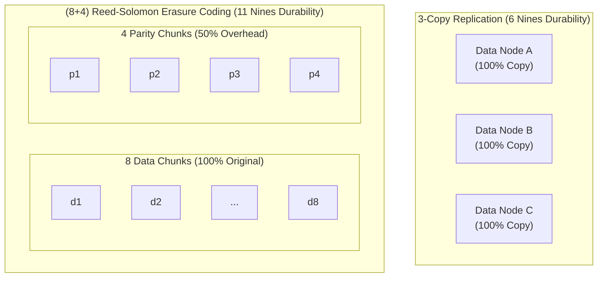

#### Durability and Storage Efficiency Comparison

| Dimension | 3-Copy Replication | $(8+4)$ Reed-Solomon Erasure Coding |
|:---|:---|:---|
| **Durability Level** | $\approx 99.9999\%$ (6 nines) | $\mathbf{\approx 99.999999999\%\text{ (11 nines)}}$ |
| **Storage Overhead** | $\mathbf{200\%}$ ($3\times$ raw data capacity) | $\mathbf{50\%}$ ($1.5\times$ raw data capacity) |
| **Compute Overhead** | None (direct bit copy) | High (Matrix Galois Field multiplication) |
| **Write Latency** | Low (direct disk stream) | Moderate (calculates parities before disk write) |
| **Read Latency** | Ultra-low (serves from single replica) | Normal: low; Degraded read: high (reconstruction) |
| **Best Application** | Hot, latency-sensitive objects | Cold storage, massive backups, cost-sensitive data |

#### What `Dx` and `Px` Actually Are

- **`d1`–`d8` (Data Chunks)**: the original object split into 8 equal-sized raw slices — no transformation, just the real bytes cut into 8 parts. That's why the diagram labels them "100% Original."
- **`p1`–`p4` (Parity Chunks)**: **not copies** of any data chunk. Each is computed by running all 8 data chunks through Reed–Solomon **Galois-field matrix multiplication**, producing 4 new chunks that are mathematical combinations of every data chunk (conceptually similar to RAID 6 parity, generalized to tolerate more simultaneous losses).

**Why 50% overhead**: you store $8 + 4 = 12$ chunks to represent $8$ chunks of original data:

$$\text{overhead} = \frac{\text{parity chunks}}{\text{data chunks}} = \frac{4}{8} = 50\%$$

That is $1.5\times$ the raw data size — versus $3\times$ (200%) for 3-copy replication.

**The reconstruction property**: any **8 of the 12** total chunks — data, parity, or a mix — are enough to reconstruct the complete original object. This means the system can lose **any 4 of the 12 chunks** and still fully recover the object by solving the linear system for the missing pieces. This is exactly why section 3 places all 4 parity chunks in a separate Availability Zone from the 8 data chunks: if that entire AZ is lost, exactly 4 chunks disappear — the maximum the scheme can absorb — and the remaining 8 chunks across the other two AZs are still sufficient to rebuild everything.

| | 3-Copy Replication | (8+4) Erasure Coding |
|:---|:---|:---|
| What's stored | 3 full identical copies | 8 data slices + 4 computed parity slices |
| Can tolerate losing | 2 of 3 copies | any 4 of 12 chunks |
| Storage cost | 3× | 1.5× |
| To read one byte when its chunk is missing | read from any surviving copy | reconstruct via matrix math from 8 surviving chunks (slower) |

---

### 3. Failure Domain Isolation & Consensus Placement

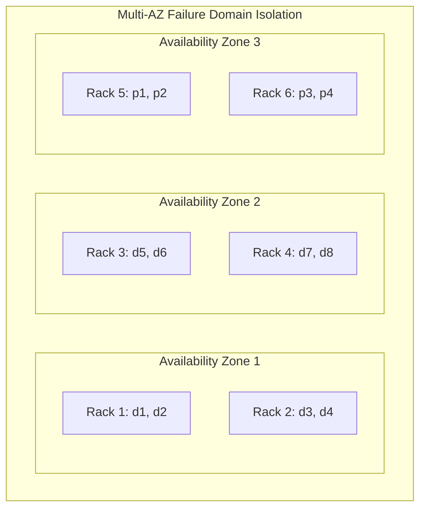

- **Placement Service**: 5-node cluster running **Raft consensus** maintaining a live **Virtual Cluster Map**.
- **Cross-AZ Spreading**: For $(8+4)$ erasure coding, all 12 chunks are distributed across distinct racks and Availability Zones. The system tolerates the total loss of an entire data center ($4\text{ chunks}$) without data loss.

#### Is Putting All Parity Chunks in One AZ Correct?

Yes — each AZ holds exactly 4 of the 12 total chunks, matching the $(8+4)$ scheme's tolerance for losing **any 4 of 12 chunks**. Losing any single whole AZ, including AZ3 (all parity), still leaves exactly 8 surviving chunks — precisely enough to reconstruct the object. Durability-wise, all three AZ-loss scenarios are equally safe.

However, this grouping is not read-cost-neutral, which is why placing parity together is a deliberate choice rather than an arbitrary one:

| If this AZ fails... | What remains | Read cost |
|:---|:---|:---|
| **AZ3 (all parity)** | All 8 original data chunks (`d1`–`d8`) intact | No reconstruction needed — reads are served directly from raw data |
| **AZ1 or AZ2 (data)** | 4 data chunks + all 4 parity chunks | Every affected read requires Reed-Solomon matrix reconstruction — meaningfully slower |

Grouping parity together makes the "cheapest" failure mode (losing the pure-parity AZ) also the one that keeps reads fast, at the cost of making a data-AZ failure the more expensive case.

**Limitation regardless of arrangement**: whichever AZ is lost, only 8 of 12 chunks remain — zero spare margin. The scheme tolerates exactly **one full AZ failure at a time**; a second simultaneous chunk loss anywhere else (e.g., a rack failure in a surviving AZ) while one AZ is already down would make the object unrecoverable. This "zero margin after one AZ loss" comes from the $(8+4)$ split matching 3 AZs into groups of 4, not from which AZ holds the parity.

---

### 4. Multipart Upload for Large Objects

For objects exceeding $100\text{ MB}$, uploading in a single HTTP connection is unreliable.

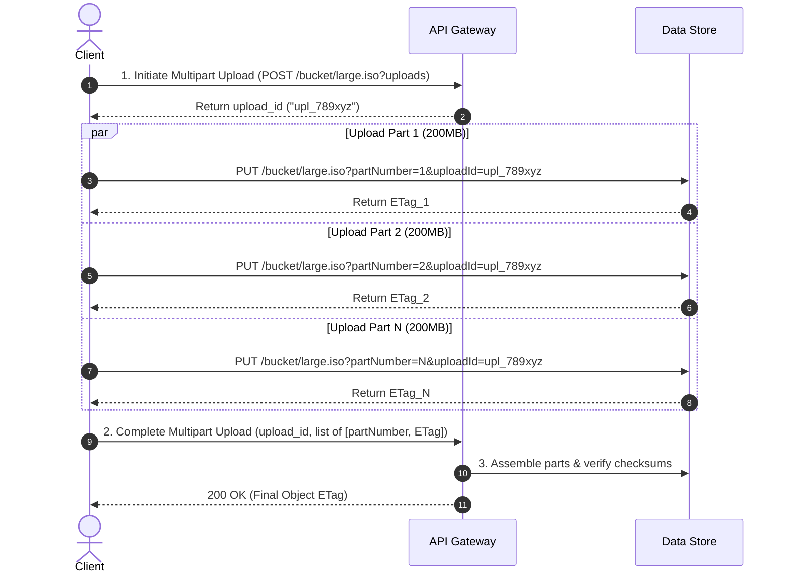

---

### 5. Garbage Collection & File Compaction

When objects are deleted or overwritten, they are not deleted from container files immediately (lazy deletion).

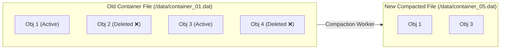

1. Background **Compaction Workers** scan read-only container files with high delete ratios.
2. Active objects are copied sequentially into a new container file.
3. The local SQLite index is updated atomically in a transaction (`UPDATE object_mapping SET file_name=..., start_offset=...`).
4. The old container file is unlinked and deleted from the operating system.

---

## 5. Wrap Up & Summary

### Architectural Summary Mindmap

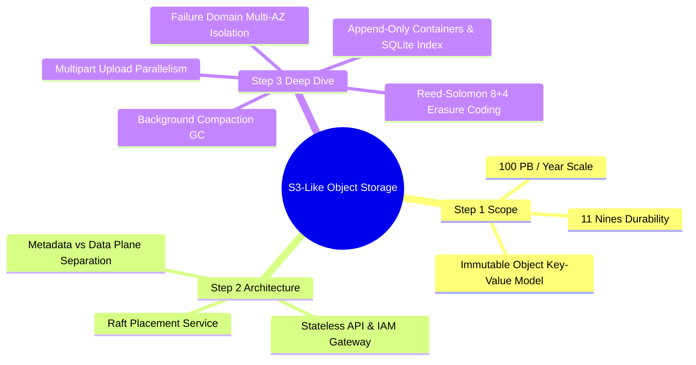

| Subsystem | Architectural Decision | Primary Benefit |
|:---|:---|:---|
| **Data Layout** | Append-only container files ($2\text{–}4\text{ GB}$) | Eliminates inode exhaustion and disk block waste. |
| **Local Indexing** | Node-local embedded SQLite B+Tree | Extremely fast byte-range reads without remote index lookups. |
| **Data Durability** | $(8+4)$ Erasure Coding across 3 AZs | Achieves 11 nines durability with only $50\%$ storage overhead. |
| **Placement State** | Raft consensus cluster with Virtual Cluster Map | Fault-tolerant metadata routing and automatic node health tracking. |
| **Large Files** | Multipart parallel chunk upload | Resilient against network drops; parallelizes network throughput. |
| **Storage Reclaim** | Offline container file compaction | Reclaims unreferenced object space without impacting live traffic. |

---

## References

1. LinkedIn Ambry: A Scalable Geo-Distributed Object Store: https://assured-cloud-computing.illinois.edu/files/2014/03/Ambry-LinkedIns-Scalable-GeoDistributed-Object-Store.pdf
2. Ceph RADOS Gateway Architecture: https://docs.ceph.com/en/latest/radosgw/
3. Backblaze Cloud Storage Durability Calculations: https://www.backblaze.com/blog/cloud-storage-durability/
4. Reed-Solomon Error Correction Demystified: https://en.wikipedia.org/wiki/Reed%E2%80%93Solomon_error_correction
5. AWS S3 Multipart Upload API Specification: https://docs.aws.amazon.com/AmazonS3/latest/userguide/mpuoverview.html
