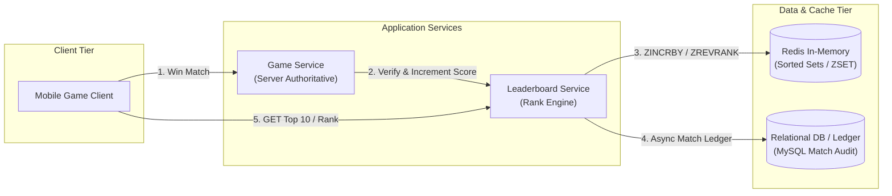
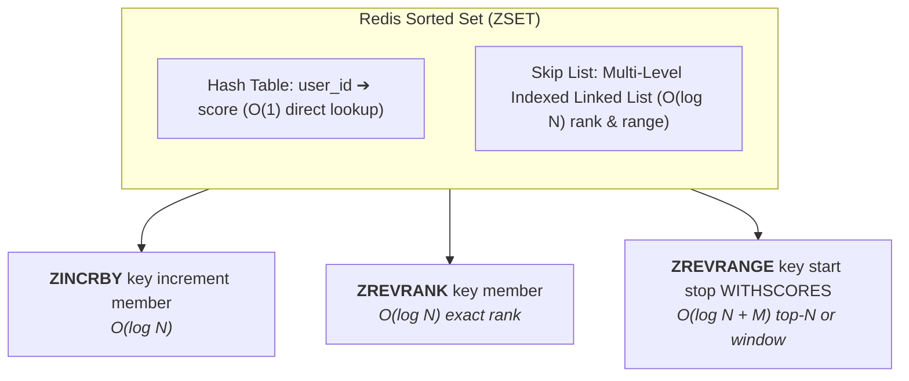
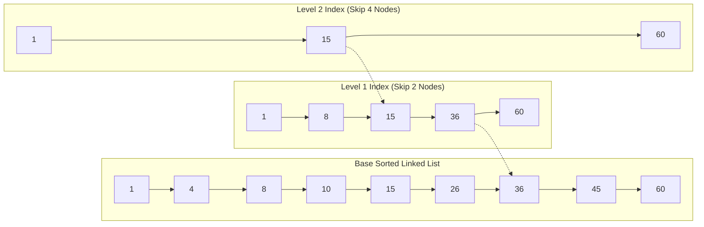
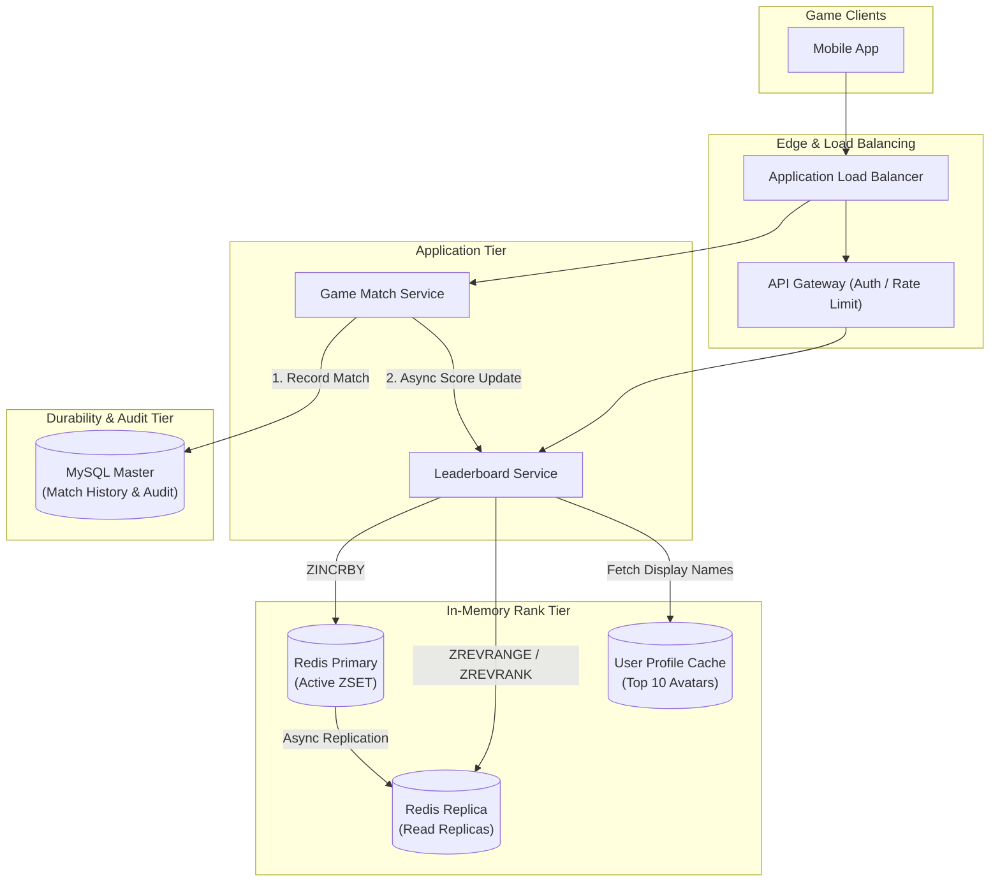
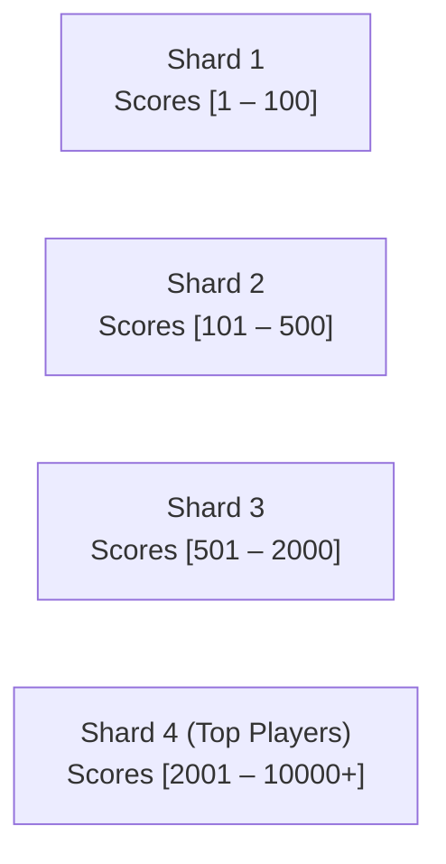
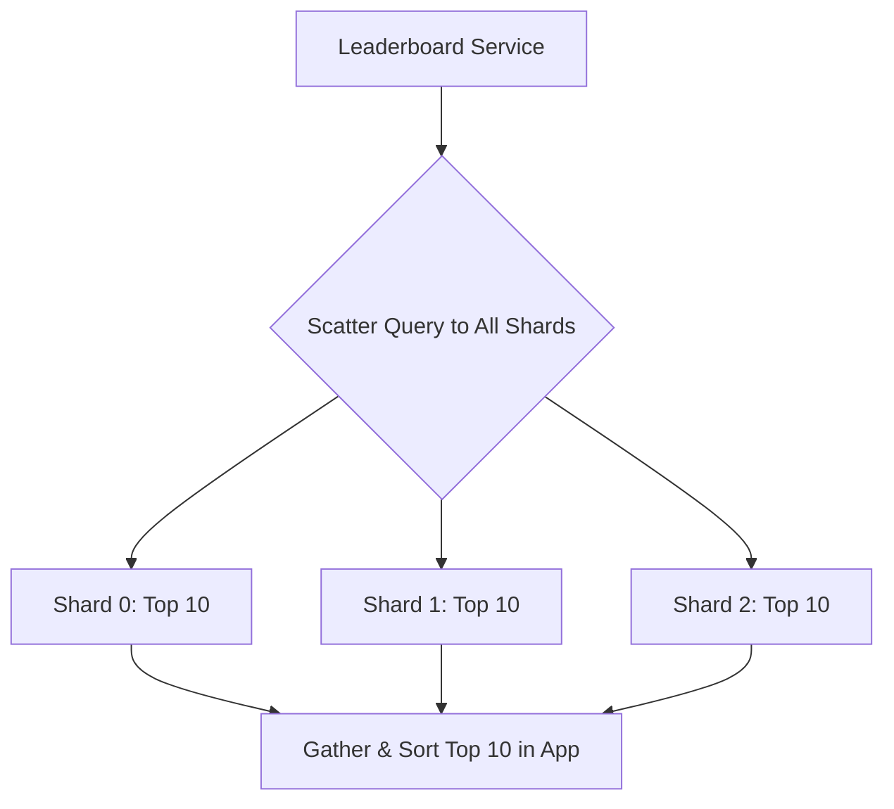
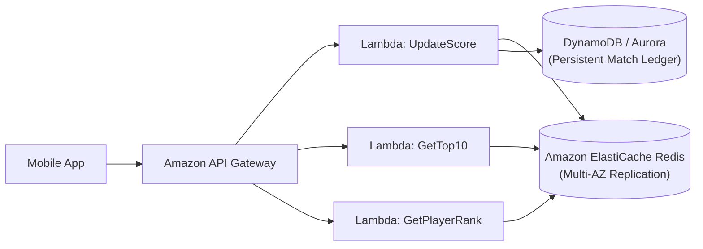
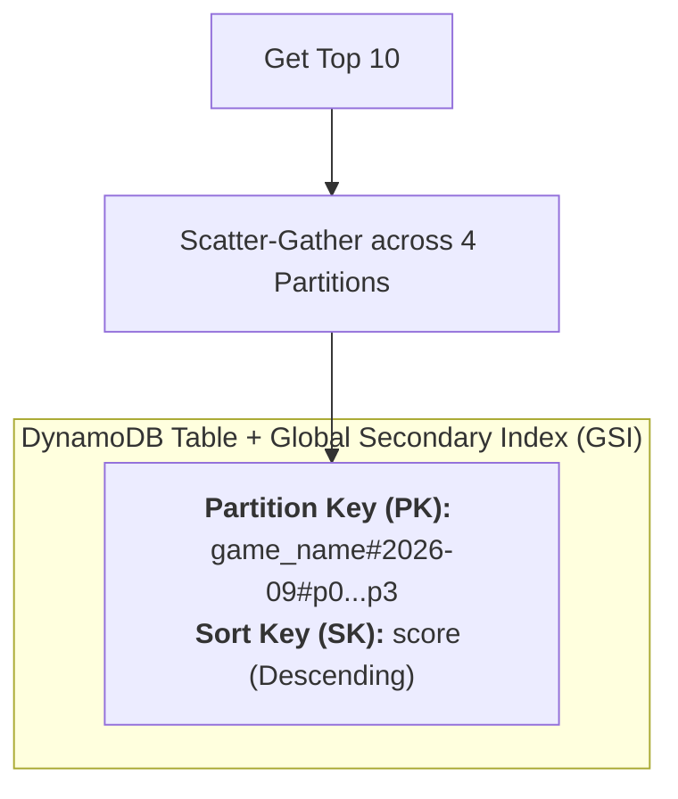
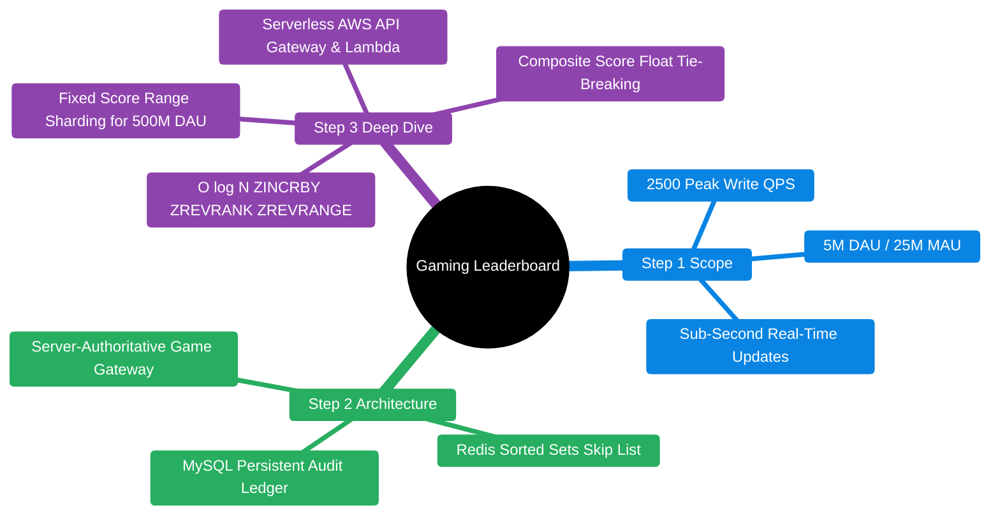
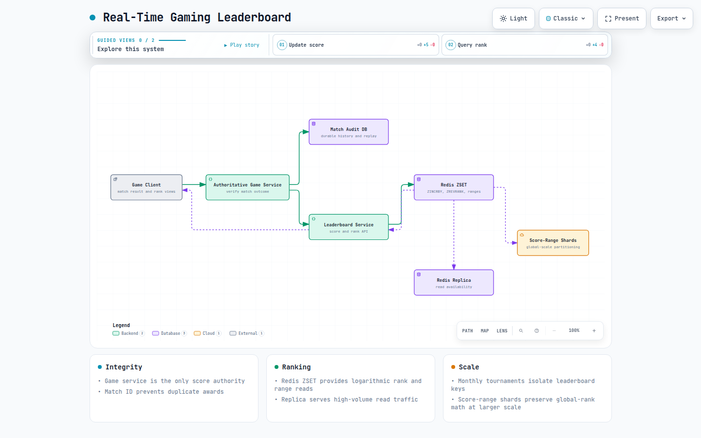

# Real-Time Gaming Leaderboard

> **Source**: *System Design Interview – An Insider's Guide: Volume 2* by Alex Xu & Sahn Lam  
> **ByteByteGo Chapter**: 26  
> **Topic**: In-Memory Data Structures, Skip Lists, Redis Sorted Sets, Range Sharding, Scatter-Gather Queries

---

## 1. Understand the Problem and Establish Design Scope

A gaming leaderboard tracks and displays player rankings in real-time based on competitive scores earned during matches or tournaments. Leaderboard systems are also used in fitness tracking apps, coding platforms, and sales gamification.



---

### Interview Clarification & Scope

> **Candidate:** How is the score calculated and awarded?  
> **Interviewer:** Players earn points by winning matches (1 point per win in our basic model).
>
> **Candidate:** What is the leaderboard lifespan?  
> **Interviewer:** Tournaments run monthly; each month a new leaderboard is instantiated.
>
> **Candidate:** What leaderboard queries must be supported?  
> **Interviewer:** 
> 1. Display the **Top 10 players**.
> 2. Show a specific player's **exact global rank**.
> 3. Display the **relative rank window** (e.g., 4 places above and 4 places below the player).
>
> **Candidate:** What is the scale of the game?  
> **Interviewer:** **5 million Daily Active Users (DAU)** and **25 million Monthly Active Users (MAU)**. Players play an average of 10 matches per day.
>
> **Candidate:** How should ties be handled?  
> **Interviewer:** Same score can share rank, or break ties by whichever player reached the score first (earlier timestamp).
>
> **Candidate:** Is real-time presentation required?  
> **Interviewer:** Yes, score updates and leaderboard position shifts must reflect near real-time ($< 500\text{ ms}$).

---

### Requirements Summary

#### Functional Requirements
1. **Submit Score**: Atomically increment a player's score upon winning a match.
2. **Top $N$ Leaderboard**: Fetch the top 10 global players with scores and profile info.
3. **Player Rank Lookup**: Return a player's exact rank and current score.
4. **Relative Position Window**: Return $K$ players immediately above and below a given player.

#### Non-Functional Requirements
- **Real-Time Responsiveness**: Score updates and rank queries must return in $< 50\text{ ms}$.
- **High Concurrency & Scalability**: Support $2{,}500\text{ write QPS}$ (up to $250{,}000\text{ QPS}$ under global scale).
- **High Availability & Durability**: Survives Redis cache crashes with zero loss of persistent match history.

---

### Back-of-the-Envelope Estimation

| Dimension / Metric | Calculation | Estimated Value |
|:---|:---|:---|
| **Daily Active Users (DAU)** | Given | $5{,}000{,}000\text{ (5M DAU)}$ |
| **Monthly Active Users (MAU)** | Given | $25{,}000{,}000\text{ (25M MAU)}$ |
| **Average Matches Played** | $10\text{ matches/user/day}$ | $50{,}000{,}000\text{ matches/day}$ |
| **Average Write QPS (Score Increment)** | $\frac{50{,}000{,}000}{86{,}400\text{ sec}} \approx \frac{5 \times 10^7}{10^5}$ | $\approx \mathbf{500\text{ QPS}}$ |
| **Peak Write QPS** | $5\times\text{ average}$ | $\approx \mathbf{2{,}500\text{ QPS}}$ |
| **Top 10 Fetch QPS (Reads)** | $5\text{M logins/day} \div 10^5\text{ sec}$ | $\approx \mathbf{50\text{ QPS}}$ |
| **Entry Storage Size** | `user_id` (24 bytes) + `score` (4 bytes) | $\approx 28\text{ bytes/entry}$ |
| **Redis Monthly Memory Footprint** | $25\text{M MAU} \times 28\text{ bytes} \times 2\text{ (Skip list overhead)}$ | $\approx \mathbf{650\text{ MB to } 1.4\text{ GB}}$ |

> [!NOTE]
> At $5\text{M DAU}$, the entire monthly leaderboard fits in **$< 1.5\text{ GB}$ of memory**, which easily runs on a single Redis instance with master-replica replication.

---

## 2. High-Level Architecture

### Core APIs (RESTful / Internal RPC)

#### 1. `POST /v1/scores` (Internal Server-to-Server Only)
Updates a player's score. Called strictly by Game Servers upon match completion to prevent client tampering.

```json
{
  "userId": "usr_99812",
  "points": 1,
  "gameId": "match_77341",
  "timestamp": 1774329600
}
```

#### 2. `GET /v1/scores` (Top 10 Global Leaderboard)
```json
{
  "data": [
    { "rank": 1, "userId": "usr_alpha", "score": 9840, "avatar": "https://cdn.game/1.png" },
    { "rank": 2, "userId": "usr_bravo", "score": 9510, "avatar": "https://cdn.game/2.png" }
  ],
  "total": 10
}
```

#### 3. `GET /v1/scores/{userId}` (Player Rank & Surrounding Window)
```json
{
  "userId": "usr_99812",
  "rank": 361,
  "score": 1420,
  "surrounding": [
    { "rank": 359, "userId": "usr_359", "score": 1425 },
    { "rank": 360, "userId": "usr_360", "score": 1422 },
    { "rank": 361, "userId": "usr_99812", "score": 1420 },
    { "rank": 362, "userId": "usr_362", "score": 1418 }
  ]
}
```

---

### Why Relational Databases Fail for Real-Time Ranking

In a relational database (e.g., MySQL), computing a player's rank requires a full table scan or index count over millions of changing rows:

```sql
-- Finding rank in MySQL requires scanning all higher scores:
SELECT COUNT(*) + 1 AS rank
FROM leaderboard
WHERE score > (SELECT score FROM leaderboard WHERE user_id = 'usr_99812');
```

- **Time Complexity**: $O(N)$ full table scan.
- **Lock Contention**: Continuous high-frequency write updates invalidate query result caches instantly.

---

### The Redis Sorted Set (ZSET) Solution

Redis **Sorted Sets (`ZSET`)** combine a **Hash Table** ($O(1)$ key lookup) with a **Skip List** ($O(\log N)$ rank lookups and range queries).



#### Skip List Search Mechanics ($O(\log N)$)



---

### Core Leaderboard Operations in Redis

```bash
# 1. Player wins a match: Increment score atomically
ZINCRBY leaderboard_2026_09 1 "usr_99812"

# 2. Fetch Top 10 Leaderboard (Descending order with scores)
ZREVRANGE leaderboard_2026_09 0 9 WITHSCORES

# 3. Fetch exact global rank of player
ZREVRANK leaderboard_2026_09 "usr_99812"

# 4. Fetch 4 players above and 4 players below rank 360 (0-indexed: 356 to 364)
ZREVRANGE leaderboard_2026_09 356 364 WITHSCORES
```

---

## 3. High-Level System Architecture



---

## 4. Design Deep Dive

### 1. Scaling to 500 Million DAU (250,000 QPS)

If the game expands to **$500\text{M DAU}$**, storage requirements grow to $65\text{ GB}$ and write throughput surges to $250{,}000\text{ QPS}$, exceeding single-node capacity.

#### Strategy A: Fixed Score Range Sharding (Recommended)

Divide players into discrete shards based on their total score ranges:



- **Top 10 Fetch**: Query strictly the highest shard (`Shard 4`) in $O(1)$ time.
- **Player Rank Lookup**:
  $$\text{Global Rank} = \text{Local Rank in Shard } k + \sum_{i > k} \text{Total Player Count in Shard } i$$
  Total player counts per shard are retrieved in $O(1)$ via Redis `INFO keyspace` or `ZCARD`.

#### Strategy B: Hash Partitioning (Redis Cluster Hash Slots)



| Partition Strategy | Pros | Cons | Recommendation |
|:---|:---|:---|:---|
| **Fixed Score Range** | Ultra-fast Top 10; simple global rank math. | Needs score mapping cache to know player's current shard. | **Recommended** |
| **Hash Partition (Scatter-Gather)** | Perfectly balanced writes across shards. | High read latency; complex $O(N)$ rank aggregation. | Better for general key-value |

---

### 2. Serverless Cloud Implementation (AWS)



- **Amazon API Gateway**: Routes incoming REST requests to stateless Lambda functions.
- **AWS Lambda**: Autoscales horizontally without managing server pools.
- **ElastiCache Redis**: Multi-AZ cluster with automatic failover and read replicas.

---

### 3. Alternative NoSQL Approach (DynamoDB Write Sharding)

For systems strictly standardizing on managed NoSQL without in-memory caches:



- **Write Sharding**: Append random partition suffix `game_name#2026-09#p{0..N}` to avoid hot partitions.
- **Percentile Estimation**: When absolute global rank over 500M users is unnecessary, DynamoDB partitions support fast percentile queries ($90\text{th percentile}$, $99\text{th percentile}$).

---

### 4. Advanced Operational Topics

1. **Tie-Breaking with Secondary Timestamps**:
   - If two players have the same score, rank the player who reached the score first higher.
   - Format score as a composite float: $\text{Score} + \left(1 - \frac{\text{Timestamp}}{10^{13}}\right)$.
2. **Disaster Recovery from Match Ledger**:
   - If the Redis cluster suffers total loss, a replay worker iterates through the persistent MySQL `point_ledger` table to execute `ZINCRBY` calls and rebuild the sorted set offline.

---

## 5. Wrap Up & Summary

### Architectural Summary Mindmap



    

    > **Interactive Archify diagram**: [Real-time gaming leaderboard ranking](resources/real-time-gaming-leaderboard/leaderboard-ranking.html)

| Area | Decision | Key Rationale |
|:---|:---|:---|
| **Core Storage** | Redis Sorted Set (`ZSET`) | $O(\log N)$ rank calculation and range queries via Skip List. |
| **Cheating Defense** | Server-authoritative game score dispatch | Client cannot manipulate scores or rank positions. |
| **Scalability (500M DAU)** | Fixed Score Range Partitioning | Isolates top-tier queries to highest shard without scatter-gather overhead. |
| **Durability** | Persistent MySQL match audit log | Enables deterministic offline replay in case of cache outage. |

---

## References

1. Redis Sorted Set Implementation (Skip Lists): https://redis.io/topics/data-types#sorted-sets
2. Amazon ElastiCache for Redis Leaderboards: https://aws.amazon.com/blogs/database/building-a-real-time-gaming-leaderboard-with-amazon-elasticache-for-redis/
3. DynamoDB Write Sharding Pattern: https://docs.aws.amazon.com/amazondynamodb/latest/developerguide/bp-partition-key-sharding.html
