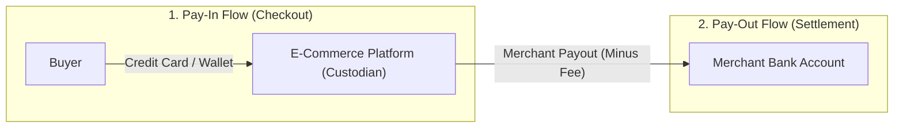
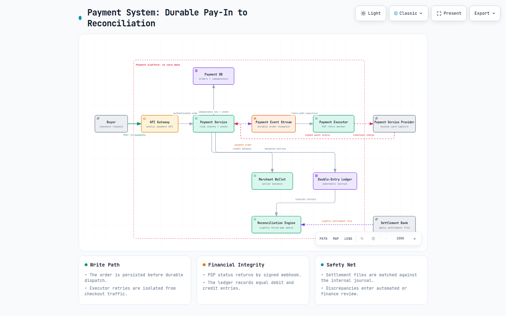
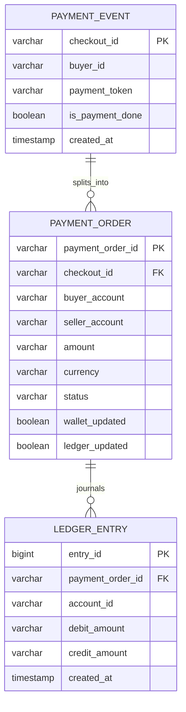
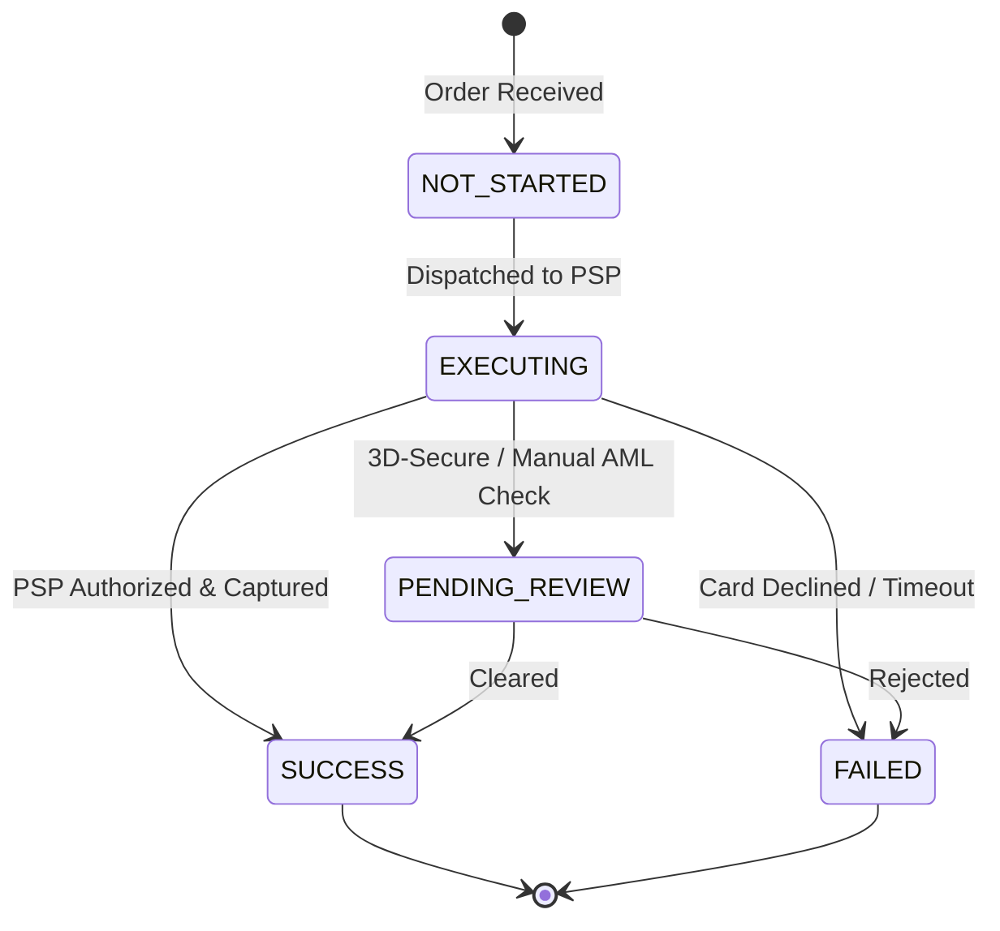
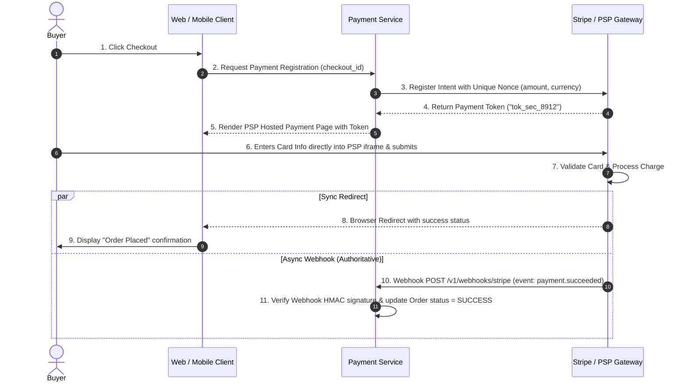
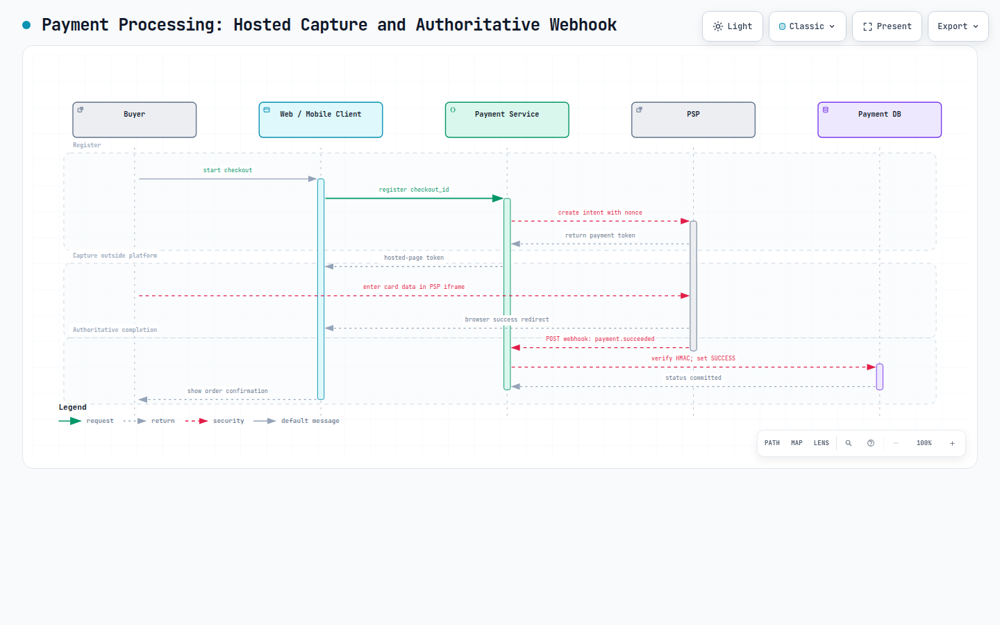
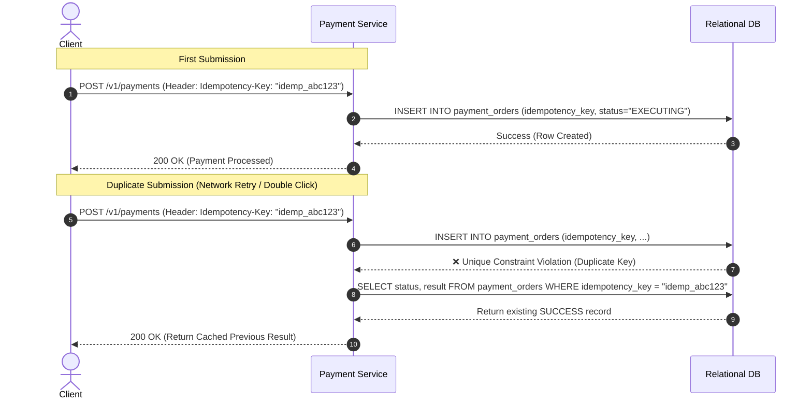
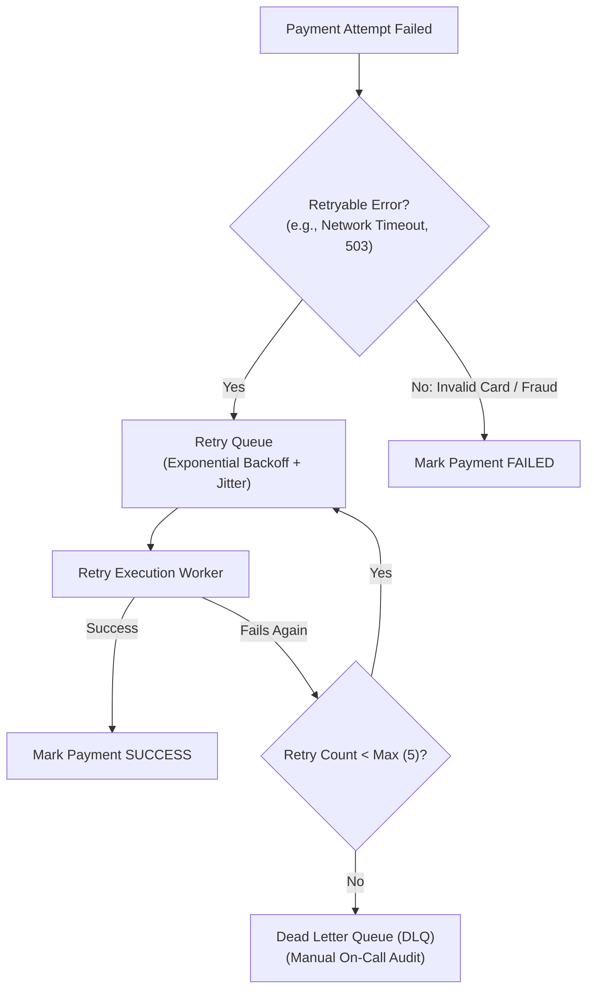
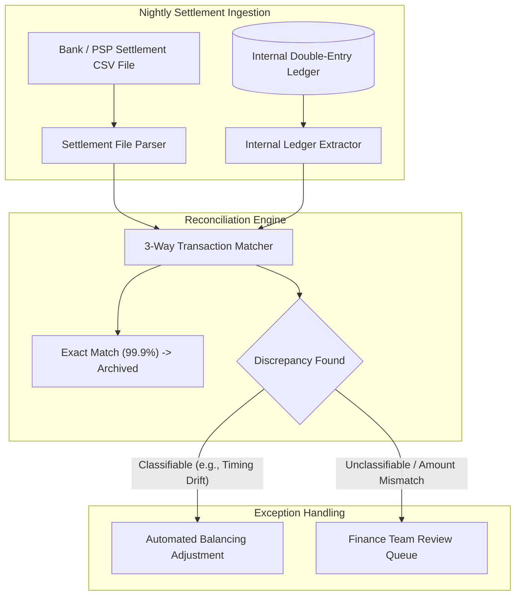
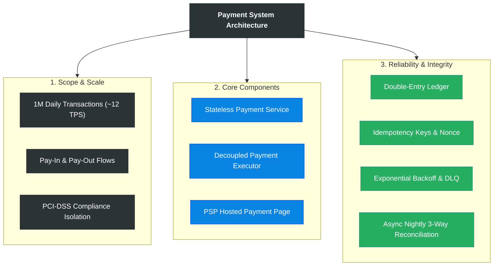

# Payment System

> **Source**: *System Design Interview – An Insider's Guide: Volume 2* by Alex Xu & Sahn Lam  
> **ByteByteGo Chapter**: 27  
> **Topic**: Financial Systems, Pay-In / Pay-Out Flows, Double-Entry Bookkeeping, Idempotency, Asynchronous Reconciliation

---

## 1. Understand the Problem and Establish Design Scope

A payment system orchestrates the movement of financial value between buyers, merchants, and third-party financial institutions. Unlike traditional web applications where throughput and eventual consistency dominate, payment systems prioritize **absolute correctness, traceability, zero double-charging, and strict regulatory compliance**.



---

### Interview Clarification & Scope

> **Candidate:** What type of payment system are we building?  
> **Interviewer:** A payment backend for an e-commerce platform (like Amazon). It handles customer pay-in at checkout and merchant pay-out settlement.
>
> **Candidate:** Which payment methods must be supported?  
> **Interviewer:** Credit cards processed via third-party Payment Service Providers (PSPs) like Stripe, Braintree, or Adyen.
>
> **Candidate:** Does our system directly store or process credit card numbers?  
> **Interviewer:** **No.** To avoid severe PCI-DSS compliance overhead, sensitive card data is captured entirely by the PSP's **hosted payment page/SDK**.
>
> **Candidate:** What is the daily transaction volume?  
> **Interviewer:** **1 million transactions per day**.
>
> **Candidate:** How should distributed system failures and inconsistencies be handled?  
> **Interviewer:** Implement **asynchronous reconciliation** between internal databases (orders, ledgers) and external PSP settlement reports.

---

### Requirements Summary

#### Functional Requirements
1. **Pay-In Flow**: Receive money from buyers on behalf of sellers upon order checkout.
2. **Pay-Out Flow**: Disburse funds to global seller bank accounts upon fulfillment.
3. **Double-Entry Ledger**: Maintain an immutable accounting record of all debits and credits.
4. **Reconciliation**: Asynchronously verify and reconcile internal ledgers against daily bank/PSP settlement files.

#### Non-Functional Requirements
- **Reliability & Exactly-Once Semantics**: Customers must never be double-charged; failed payments must recover deterministically.
- **Fault Tolerance & Async Queuing**: Seamlessly handle transient PSP downtimes via exponential backoff retries and Dead Letter Queues (DLQ).
- **Security & Compliance**: Full tokenization of sensitive credentials (PCI-DSS compliance).

---

### Back-of-the-Envelope Estimation

| Metric / Dimension | Calculation | Estimated Value |
|:---|:---|:---|
| **Daily Transactions** | Given | $1{,}000{,}000\text{ transactions/day}$ |
| **Average Transaction TPS** | $\frac{1{,}000{,}000}{86{,}400\text{ sec}} \approx \frac{10^6}{10^5}$ | $\approx \mathbf{10\text{–}12\text{ TPS}}$ |
| **Peak Transaction TPS** | $5\times\text{ average}$ | $\approx \mathbf{50\text{–}60\text{ TPS}}$ |

> [!IMPORTANT]
> At $\approx 50\text{ TPS}$, raw database write throughput is **not** the engineering challenge. The core challenge is **data consistency, transactional idempotency, retry safety, and auditability**.

---

## 2. High-Level Architecture

### Core Components of the Pay-In Flow



**Diagram:** The checkout request is persisted with its idempotency state before durable dispatch. The executor charges through the PSP, while its signed webhook authorizes wallet credit and balanced ledger entries; nightly bank files reconcile the immutable journal. [Interactive architecture](resources/payment-system/payment-system-architecture.html)

#### Component Roles
- **Payment Service**: Authenticates orders, enforces AML (Anti-Money Laundering) risk checks, orchestrates state transitions.
- **Payment Executor**: Executes individual payment orders with external PSPs using unique idempotency nonces.
- **Hosted Payment Page**: Secure iframe/widget provided by the PSP to capture card data without touching internal servers.
- **Wallet Service**: Maintains merchant balances.
- **Ledger Service**: Immutable double-entry bookkeeping journal.
- **Reconciliation Engine**: Compares nightly bank settlement records against internal ledger entries.

---

### Core Payment APIs (RESTful)

#### 1. `POST /v1/payments` (Execute Payment Event)
```json
{
  "buyerInfo": { "id": "usr_99182", "email": "alice@example.com" },
  "checkoutId": "chk_88231a4",
  "creditCardToken": "tok_visa_4242",
  "paymentOrders": [
    {
      "paymentOrderId": "ord_101",
      "sellerAccount": "seller_alpha",
      "amount": "120.50",
      "currency": "USD"
    },
    {
      "paymentOrderId": "ord_102",
      "sellerAccount": "seller_beta",
      "amount": "34.00",
      "currency": "USD"
    }
  ]
}
```

> [!NOTE]
> **Monetary Precision**: All monetary amounts are formatted as **Strings** (or integer cents) rather than `float`/`double` to eliminate binary floating-point serialization rounding errors.

---

## 3. Data Model & Double-Entry Bookkeeping

### Relational Storage Model



#### Order Execution State Transitions



---

### The Double-Entry Bookkeeping Principle

Double-entry accounting is the mathematical foundation of financial integrity: **every transaction must record equal and offsetting Debit and Credit entries across at least two accounts**.

$$\sum \text{Debits} - \sum \text{Credits} = 0$$

#### Example: Buyer Alice buys $\$100$ jacket from Merchant Bob ($\$100$ total)

| Entry ID | Account Name | Debit (Money Received / Asset) | Credit (Money Sent / Liability) | Description |
|:---|:---|:---|:---|:---|
| `1` | `Buyer_Cash_Receivable` | **$\$100.00$** | $\$0.00$ | Alice owes checkout amount |
| `2` | `Platform_Undeposited_Funds` | $\$0.00$ | **$\$100.00$** | Funds held in custodian account |
| `3` | `Platform_Undeposited_Funds` | **$\$97.00$** | $\$0.00$ | Release net payout to seller |
| `4` | `Seller_Bob_Wallet` | $\$0.00$ | **$\$97.00$** | Merchant wallet credited |
| `5` | `Platform_Fee_Revenue` | $\$0.00$ | **$\$3.00$** | $3\%$ platform processing fee |

---

## 4. Design Deep Dive

### 1. Hosted Payment Page & PSP Tokenization Flow



> [!TIP]
> Never rely exclusively on the client browser redirect for financial confirmation. Network disconnects or browser closures can drop redirects; **the server-to-server webhook is the authoritative source of truth**.



**Diagram:** Card data remains in the PSP-hosted page. The browser redirect improves checkout feedback, but only the signed PSP webhook is verified and committed as `SUCCESS`. [Interactive payment-processing sequence](resources/payment-system/payment-processing.html)

---

### 2. Idempotency & Exactly-Once Delivery

To prevent double-charging when clients retry due to network timeouts:

$$\text{Exactly-Once} = \text{At-Least-Once (Retries)} + \text{At-Most-Once (Idempotency)}$$



---

### 3. Fault-Tolerant Retry Queue & Dead Letter Queue (DLQ)



#### Exponential Backoff Formula
$$\text{Wait Time} = \min\left(\text{Max Delay}, \text{Base Delay} \times 2^{\text{retry count}}\right) \pm \text{Random Jitter}$$

---

### 4. Asynchronous Nightly Reconciliation Pipeline

Reconciliation is the ultimate safety net, detecting subtle discrepancies caused by race conditions, dropped messages, or clock skew.



---

### 5. Security & Fraud Mitigation Matrix

| Security Threat | Mitigation Technique |
|:---|:---|
| **Eavesdropping / Packet Sniffing** | TLS 1.3 encryption across all internal and public endpoints. |
| **Card Data Breach (PCI Scope)** | Hosted payment page iframe; credit card numbers never touch internal servers. |
| **Man-in-the-Middle (MITM)** | Certificate pinning on mobile client network layers. |
| **Webhook Spoofing** | HMAC-SHA256 signature verification on all incoming PSP webhook payloads. |
| **Replay Attacks** | Cryptographic nonces and timestamp expiration windows ($< 5\text{ minutes}$). |
| **Card Testing / Bot Attacks** | IP rate limiting, Cloudflare Turnstile / CAPTCHA, automated velocity rules. |

---

## 5. Wrap Up & Summary

### Architectural Summary



| Subsystem | Primary Design Decision | Core Rationale |
|:---|:---|:---|
| **Compliance** | PSP Hosted Payment Pages | Eliminates PCI-DSS compliance scope from application infrastructure. |
| **Data Integrity** | Double-Entry Accounting Journal | Mathematical balance check ($\sum\text{Debit} - \sum\text{Credit} = 0$) guarantees auditability. |
| **Double-Charge Defense** | Database Unique Constraint on Idempotency Key | Guarantees at-most-once payment execution across all network retries. |
| **Reliability** | Kafka Event Stream + DLQ | Isolates transient PSP outages and enables manual inspection of poisoned messages. |
| **Consistency** | Nightly 3-Way Reconciliation | Authoritative check against external bank settlement files. |

---

## References

1. Stripe Idempotent Requests Documentation: https://stripe.com/docs/api/idempotent_requests
2. Square Books: An Immutable Double-Entry Accounting Service: https://developer.squareup.com/blog/books-an-immutable-double-entry-accounting-database-service/
3. PCI Security Standards Council: https://www.pcisecuritystandards.org/
4. Uber Payments: Reliable Processing in a Streaming System: https://eng.uber.com/reliable-payments-stream-processing/
