# Digital Wallet

> **Source**: *System Design Interview – An Insider's Guide: Volume 2* by Alex Xu & Sahn Lam  
> **ByteByteGo Chapter**: 28  
> **Topic**: High-Throughput Ledger, Distributed Transactions (2PC vs. TC/C vs. Saga), Event Sourcing, CQRS, Raft Consensus

---

## 1. Understand the Problem and Establish Design Scope

A digital wallet manages electronic account balances, wallet-to-wallet transfers, and balance histories. In high-scale financial platforms (e.g., Alipay, WeChat Pay, PayPal), the wallet subsystem must process millions of transfer requests per second with **zero data loss, absolute transaction atomicity, and complete historical auditability**.

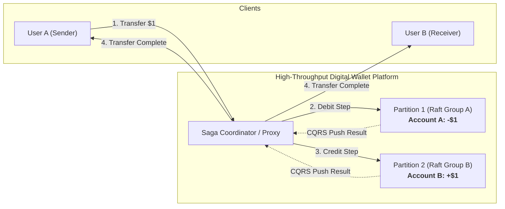

---

### Interview Clarification & Scope

> **Candidate:** What core operations should the digital wallet support?  
> **Interviewer:** Focus strictly on **balance transfer operations between two digital wallets**.
>
> **Candidate:** What is the throughput requirement?  
> **Interviewer:** Support **$1{,}000{,}000\text{ Transactions Per Second (1M TPS)}$**.
>
> **Candidate:** What correctness and verification guarantees are expected?  
> **Interviewer:** 
> - Strict ACID transactional correctness (zero lost funds, no negative balances).
> - **Reproducibility**: External auditors must be able to verify account integrity at any historical point in time by replaying deterministic events from the very beginning.
>
> **Candidate:** What is the availability SLA?  
> **Interviewer:** At least **$99.99\%$ (4 nines)** availability. Foreign exchange (FX) is out of scope.

---

### Requirements Summary

#### Functional Requirements
1. **Balance Transfer**: Atomically transfer an amount $X$ from Account A to Account B.
2. **Balance Query**: Return real-time account balances.
3. **Historical Reproducibility**: Reconstruct the exact account balance state at any timestamp $T$ by replaying immutable events.

#### Non-Functional Requirements
- **Ultra-High Throughput**: Handle $1{,}000{,}000\text{ transfers/sec}$ ($2{,}000{,}000\text{ atomic account balance operations/sec}$).
- **Strong Consistency & Atomicity**: No partial transfers; balance sum is strictly conserved.
- **Fault Tolerance**: Automated failover with zero data loss via distributed consensus.

---

### Back-of-the-Envelope Estimation

A single balance transfer command requires two underlying account operations:
1. Deduct $\$X$ from Account A (Debit).
2. Deposit $\$X$ to Account B (Credit).

$$\text{Operation Throughput} = 1{,}000{,}000\text{ transfers/sec} \times 2 = \mathbf{2{,}000{,}000\text{ TPS (2M TPS)}}$$

#### Node Capacity vs. Cluster Sizing
| Per-Node Transaction Capacity | Total Database Nodes Required for 2M TPS |
|:---|:---|
| **$100\text{ TPS}$** (Standard RDBMS disk commit) | $20{,}000\text{ nodes}$ (Prohibitively expensive) |
| **$1{,}000\text{ TPS}$** (Tuned RDBMS with connection pooling) | $2{,}000\text{ nodes}$ |
| **$10{,}000\text{ TPS}$** (In-Memory / Local LSM-Tree Engine) | $\mathbf{200\text{ nodes}}$ |

> [!NOTE]
> The primary design objective is to maximize single-node throughput using **in-memory caching, sequential append-only disk logging (`mmap`), and localized consensus** to minimize total cluster size.

---

## 2. High-Level Architecture Evolution

### Approach 1: In-Memory Sharded Cache (Redis + ZooKeeper)

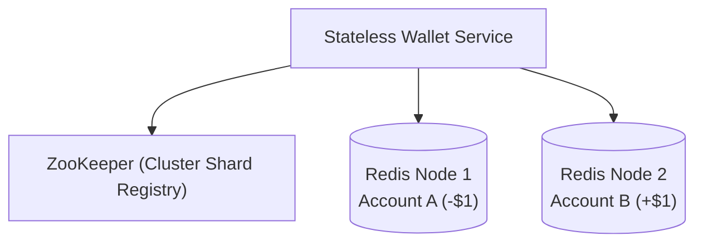

- **Limitation**: If the wallet service crashes after updating Node 1 but before updating Node 2, money is destroyed. **Distributed updates across separate Redis nodes lack atomic transactional guarantees**.

---

### Approach 2: Distributed Database Transactions

To make updates atomic across sharded databases, three distributed transaction protocols are considered:

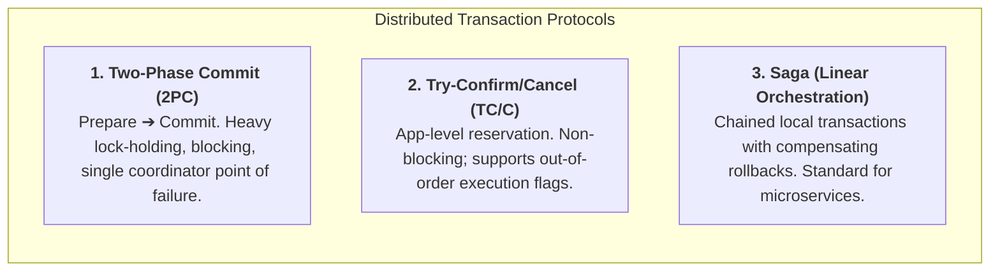

#### Comparison: 2PC vs. TC/C vs. Saga

| Dimension | 2-Phase Commit (2PC) | Try-Confirm / Cancel (TC/C) | Saga Pattern |
|:---|:---|:---|:---|
| **Transaction Level** | Database engine layer (XA) | Application business logic | Application business logic |
| **Lock Holding Time** | **Long** (locked until phase 2 ends) | **Short** (unlocked after each phase) | **Short** (unlocked after each step) |
| **Execution Order** | Simultaneous across nodes | Flexible / Parallel | **Strictly Linear Sequence** |
| **Rollback Mechanism** | Database abort | Compensating Cancel transaction | Compensating Rollback transaction |
| **Performance / Latency** | Low throughput, high latency | High throughput | High throughput |

#### Saga Linear Execution Flow ($A \rightarrow C$)

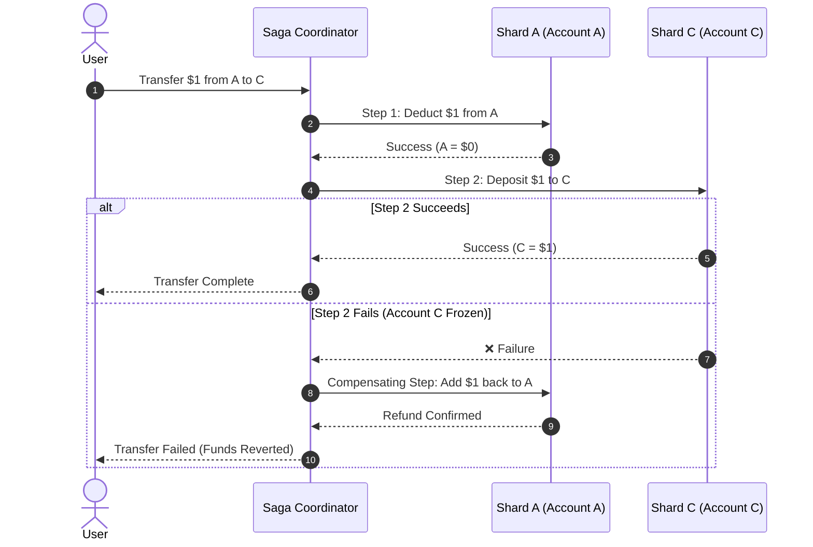

---

### Approach 3: Event Sourcing & CQRS

While distributed transactions handle atomicity, they do not provide auditability. **Event Sourcing** stores an immutable sequence of state-changing events as the single source of truth.

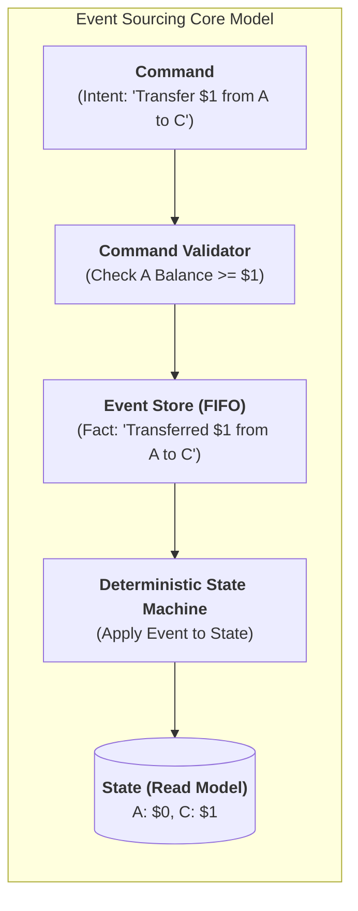

#### Core Concepts
1. **Command**: An external request/intent (can be rejected if invalid).
2. **Event**: An immutable historical fact (must be deterministic; always executed once validated).
3. **State**: The current balance projection derived by applying all historical events.
4. **Reproducibility**: State at timestamp $T$ is mathematically guaranteed by replaying events from $t_0$ to $T$.

---

## 3. Design Deep Dive: High-Performance Event Sourcing

### 1. File-Based Storage with `mmap` & RocksDB

Each Raft node stores its own local copy of the shard's data on local NVMe. The **committed append-only event log is the source of truth**. RocksDB or SQLite is a rebuildable local projection of that log, used to answer balance queries quickly; it is not a second source of truth. `mmap` is only an efficient way to access the local log file. It does not provide replication or consistency by itself.

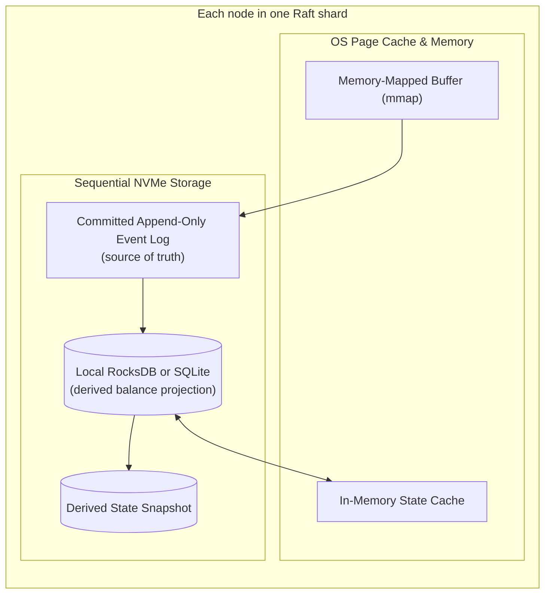

- **Write order**: The leader appends an event, replicates it through Raft, waits for a quorum, and then marks it committed. Nodes apply committed events to their local projection.
- **Recovery order**: If RocksDB/SQLite or the memory cache is lost, the node restores the latest snapshot and replays later committed events from the log. The log remains authoritative.
- **Snapshots**: Periodic checkpoints saved to HDFS/S3 speed recovery, but a snapshot is a derived checkpoint and can be regenerated from the event log.

---

### 2. High Reliability via Raft Consensus

To eliminate single points of failure, event sourcing nodes are grouped into **3- or 5-node Raft consensus clusters**.

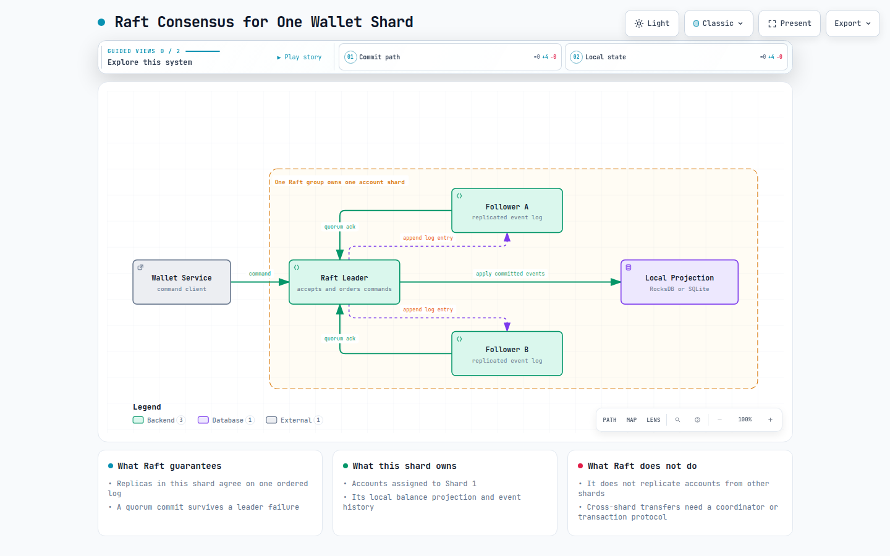

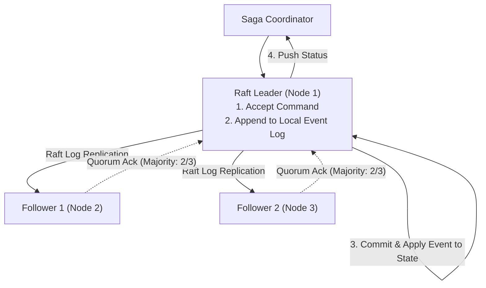

- **Leader**: Validates incoming commands, appends events to the local WAL, and replicates them to followers.
- **Followers**: Replicate event streams; update local read projections deterministically.
- **Failover**: If the leader crashes, followers elect a new leader in $< 500\text{ ms}$ with zero uncommitted data loss.

---

### 3. Distributed Raft Sharding & CQRS Push Architecture

To achieve $1{,}000{,}000\text{ TPS}$, accounts are partitioned across multiple independent Raft consensus groups. **Sharding chooses the owner partition; Raft replicates that partition.** Raft does not synchronize every account with every database.

For example, Account A may belong to Shard 1 and Account B may belong to Shard 2:

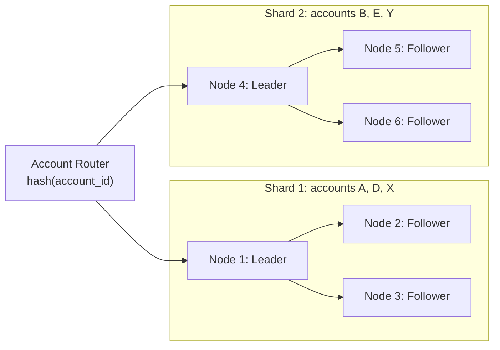

All replicas in Shard 1 contain the committed event history for Account A, while replicas in Shard 2 contain the history for Account B. The Saga coordinator is needed only when one transfer touches accounts in different shards.

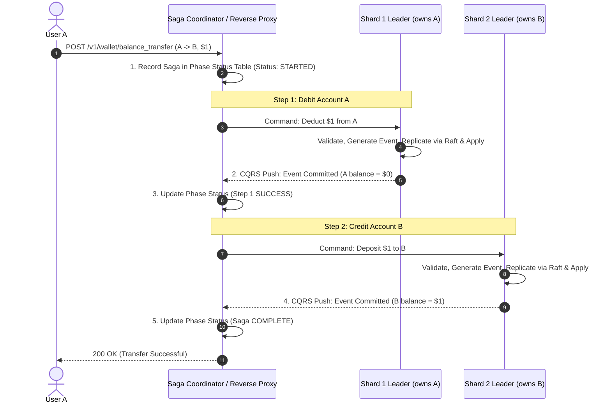

---

The two local Raft commits above are not one global Raft commit. Shard 1 guarantees that its replicas agree about the debit, and Shard 2 guarantees that its replicas agree about the credit. The Saga phase table tracks whether the overall transfer is `STARTED`, `DEBITED`, `COMPLETED`, or needs retry/compensation.

## 4. Balance Check Read Path

A balance query is routed to the shard that owns the requested account. For a financial decision, read from the current leader using a linearizable read (for example, a Raft `ReadIndex`) so the result reflects all committed events. A follower may be used for less-sensitive, eventually consistent views, but it can be stale.

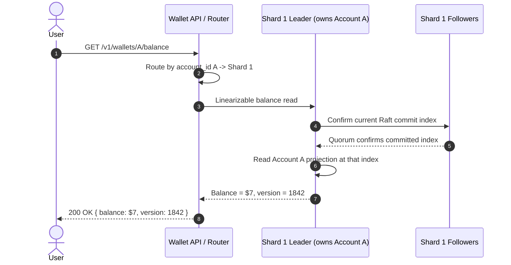

The balance projection is a local read model derived from the committed event log. It is not independently reconciled with every other shard: Account A is authoritative in Shard 1, and Account B is authoritative in Shard 2.

## 5. Architectural Summary

### Architectural Comparison Matrix

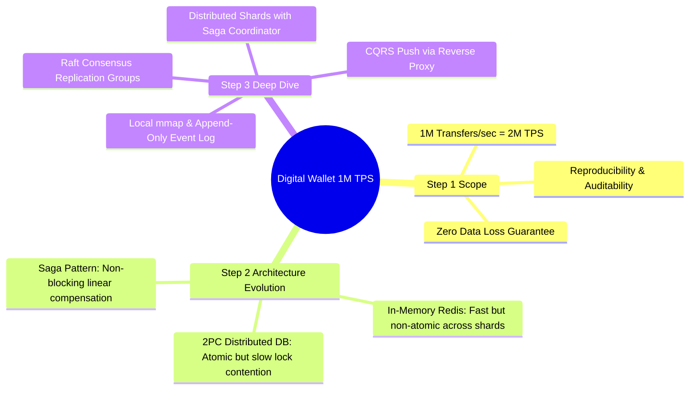

| Architecture Approach | Throughput Capability | Consistency & Auditability | Failure Recovery |
|:---|:---|:---|:---|
| **In-Memory Cache (Redis)** | High ($> 100\text{K TPS}$) | Poor (No cross-shard atomicity; no history) | High risk of data loss on crash |
| **Distributed 2PC Database** | Low ($< 1\text{K TPS}$) | Strong consistency; poor auditability | Heavy blocking on coordinator failure |
| **Saga on Traditional RDBMS** | Moderate ($10\text{K TPS}$) | High consistency; state overwrites erase history | Complex compensating rollbacks |
| **Distributed Event Sourcing (Raft + mmap)** | **Ultra-High ($> 1\text{M TPS}$)** | **Absolute mathematical reproducibility & audit trail** | **Instant Raft leader election with zero data loss** |

---

## References

1. Designing Data-Intensive Applications (Distributed Transactions & Consensus) by Martin Kleppmann
2. Event Sourcing & CQRS by Martin Fowler: https://martinfowler.com/bliki/CQRS.html
3. In-Search of an Understandable Consensus Algorithm (Raft): https://raft.github.io/raft.pdf
4. The Log: What every software engineer should know about real-time data's unifying abstraction by Jay Kreps: https://engineering.linkedin.com/distributed-systems/log-what-every-software-engineer-should-know-about-real-time-datas-unifying
