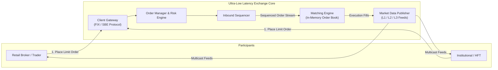
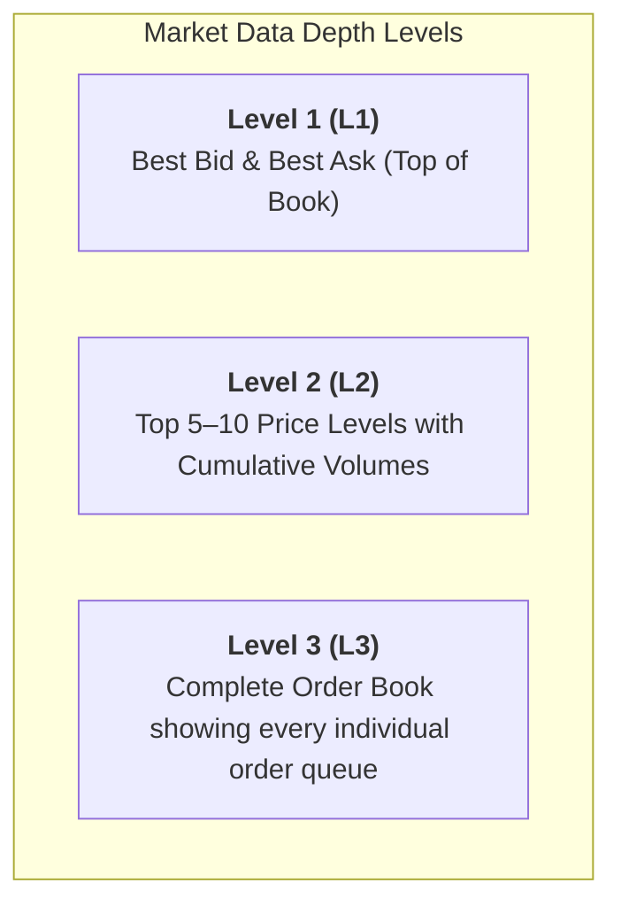
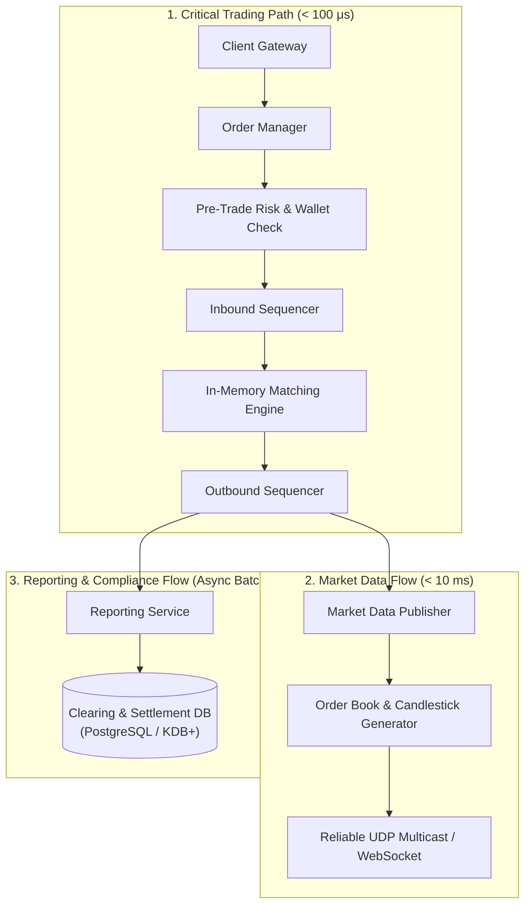
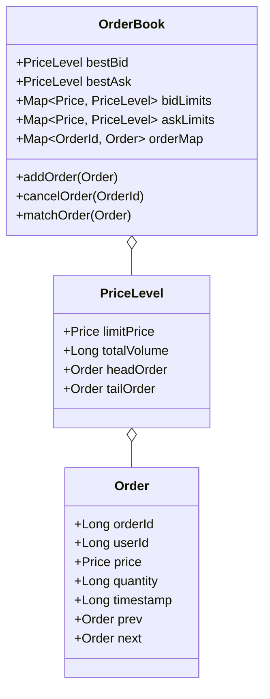
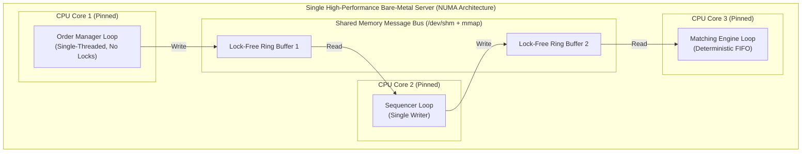
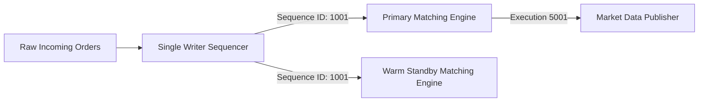
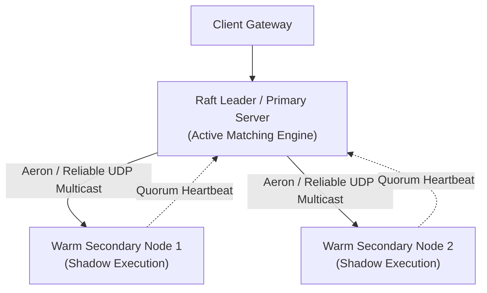
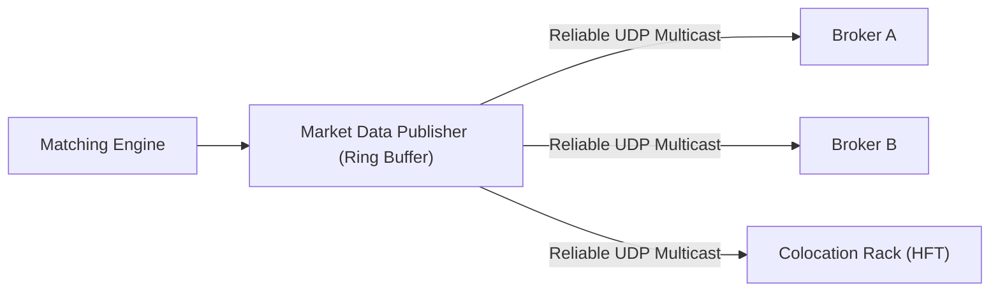

# Stock Exchange

> **Source**: *System Design Interview – An Insider's Guide: Volume 2* by Alex Xu & Sahn Lam  
> **ByteByteGo Chapter**: 29  
> **Topic**: Ultra-Low Latency Architecture, In-Memory Matching Engines, Lock-Free Ring Buffers, Price-Time Priority, L1/L2/L3 Market Data

---

## 1. Understand the Problem and Establish Design Scope

A modern stock exchange is a regulated financial venue designed to match buy and sell orders for securities with microsecond-level latency, absolute determinism, and high availability.



---

### Interview Clarification & Scope

> **Candidate:** Which securities and order types are supported?  
> **Interviewer:** Limit orders for **100 stock symbols**. Market orders and complex conditional orders are out of scope.
>
> **Candidate:** What is the scale and throughput requirement?  
> **Interviewer:** **1 billion orders per day** across tens of thousands of concurrent institutional and retail traders.
>
> **Candidate:** What are the trading hours and risk management requirements?  
> **Interviewer:** Standard NYSE trading hours ($6.5\text{ hours/day}$, 9:30 AM – 4:00 PM EST). Basic risk checks (e.g., maximum trade limits per account) and pre-trade wallet balance verification.
>
> **Candidate:** What are the latency and availability SLAs?  
> **Interviewer:** 
> - **End-to-end P99 latency**: Single-digit milliseconds or lower (sub-microsecond on the critical matching path).
> - **Availability**: At least **$99.99\%$ (4 nines)** with zero data loss ($RPO = 0$, $RTO < \text{seconds}$).

---

### Key Financial Domain Concepts



- **Limit Order**: An order to buy/sell at a specified price or better.
- **Bid vs. Ask**: *Bid* = buyer's maximum price; *Ask (Offer)* = seller's minimum price.
- **Spread**: The price difference between the lowest Ask and the highest Bid ($\text{Ask} - \text{Bid}$).
- **FIX Protocol**: Financial Information eXchange messaging standard, typically serialized via **Simple Binary Encoding (SBE)** for ultra-low latency.

---

### Back-of-the-Envelope Estimation

| Metric / Dimension | Calculation | Estimated Value |
|:---|:---|:---|
| **Trading Window** | $6.5\text{ hours/day} = 23{,}400\text{ seconds}$ | $23{,}400\text{ sec/day}$ |
| **Daily Orders** | Given | $1{,}000{,}000{,}000\text{ orders/day}$ |
| **Average Order QPS** | $\frac{1{,}000{,}000{,}000}{23{,}400\text{ sec}}$ | $\approx \mathbf{43{,}000\text{ QPS}}$ |
| **Peak Order QPS** | $5\times\text{ average (Market Open / Close Surge)}$ | $\approx \mathbf{215{,}000\text{ QPS}}$ |
| **Latency Budget** | Critical trading path | $\mathbf{< 1\text{ ms P99}}$ |

---

## 2. High-Level Architecture & Three Data Paths

The exchange architecture separates into three decoupled flows with distinct latency and consistency requirements:



### Component Breakdown
1. **Client Gateway**: Lightweight edge proxy for FIX/SBE protocol parsing, authentication, and IP rate limiting.
2. **Order Manager**: Manages order state machine and validates pre-trade account risk limits.
3. **Inbound Sequencer**: Stamps every incoming order with a strictly monotonically increasing sequence ID before execution.
4. **Matching Engine**: Core in-memory order book execution engine matching orders using **Price-Time Priority (FIFO)**.
5. **Market Data Publisher (MDP)**: Reconstructs L1/L2/L3 order books and candlestick bars ($1\text{m}, 5\text{m}, 1\text{h}$) for external subscribers.
6. **Reporting Engine**: Consolidates orders and fills asynchronously for regulatory audit, taxes, and end-of-day clearing.

---

## 3. Core Data Structures: The Limit Order Book (LOB)

To execute matching and cancellations in **$O(1)$ constant time**, the Order Book combines **Hash Maps** with a **Doubly-Linked List** for each price tier:



```
[Bids / Buy Side]                                              [Asks / Sell Side]
Price Level $100.00 ──> [Order 1: 100 shares] <-> [Order 2: 500 shares]
Price Level $99.95  ──> [Order 3: 200 shares]
                         ▲
                         │ (bestBid)
---------------------------------------------------------------------------------- SPREAD: $0.05
                         │ (bestAsk)
                         ▼
Price Level $100.05 ──> [Order 4: 50 shares] <-> [Order 5: 1000 shares]
Price Level $100.10 ──> [Order 6: 300 shares]
```

### Time Complexity of Order Book Operations

| Operation | Implementation Details | Time Complexity |
|:---|:---|:---|
| **Place Limit Order** | Append new order node to the tail of `PriceLevel` doubly-linked list | $\mathbf{O(1)}$ |
| **Match Order** | Pop filled order node from the head of `PriceLevel` doubly-linked list | $\mathbf{O(1)}$ |
| **Cancel Order** | Look up order via `orderMap` and unlink node from doubly-linked list | $\mathbf{O(1)}$ |
| **Query Best Bid / Ask** | Read `bestBid` / `bestAsk` direct pointers | $\mathbf{O(1)}$ |

---

## 4. Design Deep Dive: Sub-Microsecond Single-Server Architecture

### 1. Eliminating Network and Disk Hops

Traditional multi-tier architectures incur $\approx 500\ \mu\text{s}$ per network round-trip. At modern exchange scale, the entire critical matching path is colocated inside a **single high-spec server** communicating via shared memory.



#### Key Latency Optimization Techniques
1. **CPU Pinning & Thread Affinity**: Application loops are single-threaded and pinned to dedicated physical CPU cores (`pthread_setaffinity_np`), eliminating OS context switching overhead.
2. **Lock-Free Ring Buffers (LMAX Disruptor Pattern)**: Inter-process communication occurs via lock-free circular memory buffers with cache-line padding to eliminate CPU false sharing.
3. **Memory-Mapped IPC (`/dev/shm` + `mmap`)**: Messages pass through RAM-backed shared memory with **zero disk writes and zero network hops** on the critical path.

---

### 2. Deterministic Event Sourcing & Sequencer



- **Functional Determinism**: Given the exact same sequence of input orders, the matching engine is mathematically guaranteed to output the exact same sequence of fills.
- **Sequencer**: The single source of truth assigning strict sequential IDs ($1001, 1002, 1003...$) to ensure fairness and instant deterministic state recovery.

---

### 3. High Availability via Primary-Backup & Raft Consensus

To achieve 4 nines availability ($99.99\%$) without sacrificing microsecond latency:



- **Hot-Warm Standby**: The warm standby node receives identical sequenced event streams and maintains an identical in-memory order book. If the primary crashes, the warm standby promotes to primary in $< 1\text{ second}$.
- **Cross-Datacenter Replication**: Event streams are replicated across availability zones using **Reliable UDP Multicast (Aeron)**.

---

### 4. Market Data Distribution & Fairness



- **Fairness Guarantee**: The exchange broadcasts L2/L3 market updates via **Reliable UDP Multicast** so all connected brokers and market makers receive market ticks simultaneously.
- **Colocation (Co-Lo)**: Institutional trading servers are colocated within the exchange data center to minimize fiber-optic light transit latency.

---

## 5. Wrap Up & Summary

### Architectural Summary Mindmap

```mermaid
mindmap
  root((Stock Exchange System))
    Step 1 Scope
      1B Orders / Day (~215K Peak QPS)
      Sub-Millisecond P99 Latency
      Price-Time Priority Matching
    Step 2 Three Data Paths
      1. Critical Trading Path (Zero Disk/Network)
      2. Market Data Feed (L1/L2/L3 Multicast)
      3. Reporting & Settlement (Async Batch)
    Step 3 Deep Dive
      O(1) Limit Order Book (Doubly-Linked List + Hash)
      CPU Core Pinning & Lock-Free Ring Buffers
      /dev/shm mmap Shared Memory
      Deterministic Sequencer & Event Sourcing
      Primary-Backup Hot/Warm Failover
```

| Area | Core Architectural Decision | Benefit |
|:---|:---|:---|
| **Critical Path** | Single-server in-memory engine with CPU pinning | Sub-microsecond matching latency with zero OS context switches. |
| **Order Book** | Doubly-linked list + price map (`OrderBook`) | $O(1)$ order placement, cancellation, and execution. |
| **Inter-Process Comm** | Memory-mapped shared files (`mmap` on `/dev/shm`) | Lock-free, zero-network message bus. |
| **Determinism** | Single-writer Sequencer | Guarantees identical execution replay and fast state recovery. |
| **High Availability** | Primary-Secondary hot-warm with Raft consensus | Instant failover with zero loss of sequenced financial trades. |
| **Market Data** | UDP Multicast with lock-free ring buffers | Simultaneous, fair market data dissemination. |

---

## References

1. LMAX Disruptor Architecture: https://lmax-exchange.github.io/disruptor/
2. Aeron High-Performance Messaging: https://github.com/real-logic/aeron
3. How to Build a Fast Limit Order Book: https://mechanical-sympathy.blogspot.com/
4. Financial Information eXchange (FIX) Protocol: https://www.fixtrading.org/
5. Latency Numbers Every Programmer Should Know by Colin Scott: https://colin-scott.github.io/personal_website/research/interactive_latency.html
