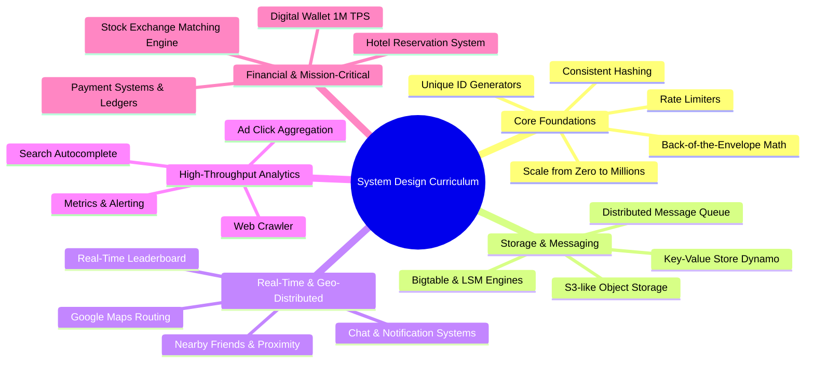
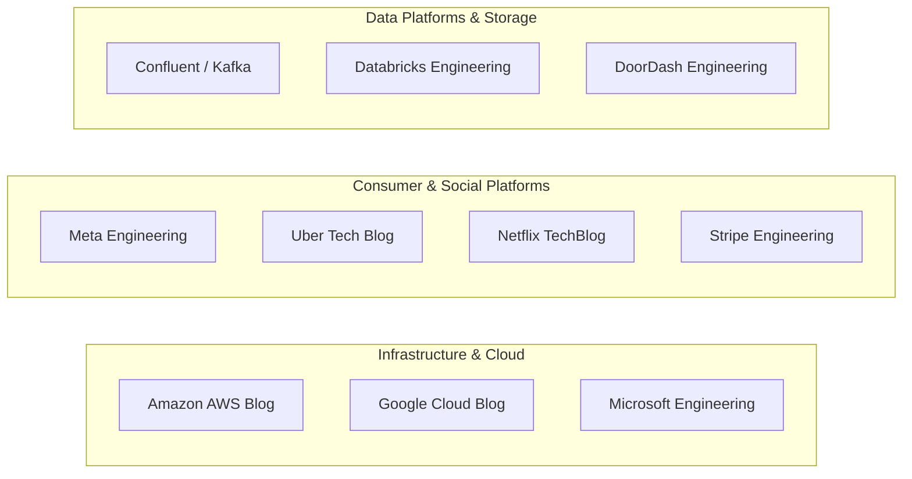
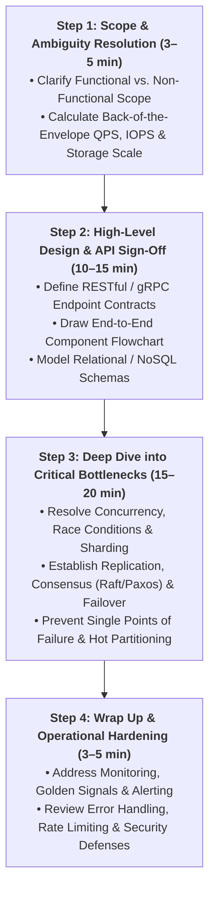

# The Learning Continues: Real-World Architectures & Resources

> **Source**: *System Design Interview – An Insider's Guide: Volume 1 & 2* by Alex Xu & Sahn Lam  
> **ByteByteGo Chapter**: 30  
> **Topic**: Distributed Systems Knowledge Catalog, Landmark Whitepapers, Engineering Blogs, Continuous Learning Roadmap

---

## 1. System Design Curriculum Map (Volumes 1 & 2)

---

## 2. Landmark Distributed Systems Whitepapers & Case Studies

Understanding how industry giants architected their proprietary systems is the fastest way to master trade-offs.

### Distributed Storage & File Systems
| System / Paper | Organization | Key Innovation & Takeaway | Reference |
|:---|:---|:---|:---|
| **The Google File System (GFS)** | Google | Master-chunkserver architecture, large chunk size ($64\text{ MB}$), append-heavy streaming workloads. | [GFS Paper](https://research.google/pubs/the-google-file-system/) |
| **Finding a Needle in Haystack** | Facebook | High-throughput photo storage eliminating disk metadata lookups via append-only aggregate volume files. | [Haystack Paper](https://www.usenix.org/legacy/event/osdi10/tech/full_papers/Beaver.pdf) |
| **Dynamo: Amazon's Key-Value Store** | Amazon | Consistent hashing with virtual nodes, vector clocks, sloppy quorums, and anti-entropy with Merkle trees. | [Dynamo Paper](https://www.allthingsdistributed.com/files/amazon-dynamo-sosp2007.pdf) |
| **Bigtable: Structured Storage** | Google | Wide-column NoSQL over GFS; MemTable + SSTable with Log-Structured Merge-Trees (LSM). | [Bigtable Paper](https://research.google/pubs/bigtable-a-distributed-storage-system-for-structured-data/) |
| **TAO: Facebook's Social Graph Store** | Facebook | Distributed read-through cache & graph database separating objects (nodes) and associations (edges). | [TAO Paper](https://www.usenix.org/system/files/conference/atc13/atc13-bronson.pdf) |

---

### In-Memory Caching & Performance
| System / Paper | Organization | Key Innovation & Takeaway | Reference |
|:---|:---|:---|:---|
| **Scaling Memcache at Facebook** | Facebook | Gutter pools, lease-based stale read prevention, and multi-region invalidation pipelines. | [Memcache Paper](https://www.usenix.org/system/files/conference/nsdi13/nsdi13-nishtala.pdf) |
| **LMAX Disruptor** | LMAX Exchange | Lock-free, mechanical sympathy ring buffer for ultra-low-latency inter-thread messaging. | [LMAX Disruptor](https://lmax-exchange.github.io/disruptor/) |
| **Aeron Messaging** | Real Logic | UDP unicast, multicast, and IPC messaging for high-throughput financial trading systems. | [Aeron GitHub](https://github.com/real-logic/aeron) |

---

### Social, Feed & Real-Time Engines
| System / Case Study | Organization | Key Innovation & Takeaway | Reference |
|:---|:---|:---|:---|
| **Timelines at Scale & Snowflake** | Twitter (X) | Fan-out on write vs. fan-out on read for celebrity users; $k$-ordered 64-bit unique ID generation. | [Twitter Snowflake](https://github.com/twitter-archive/snowflake) |
| **Facebook Multifeed & Timeline** | Facebook | Aggregated distributed graph querying with leaf index nodes and denormalized timeline caches. | [FB Timeline](https://engineering.fb.com/) |
| **WhatsApp Erlang Architecture** | WhatsApp | High-concurrency BEAM virtual machine scaling to millions of open TCP/WebSocket connections per server. | [WhatsApp Architecture](https://www.wired.com/2015/09/whatsapp-serves-900-million-users-50-engineers/) |
| **Uber Real-Time Marketplace** | Uber | Geospatial indexing (H3 hexagonal hierarchical spatial index) for real-time dispatch and surge pricing. | [Uber H3](https://www.uber.com/blog/h3/) |
| **Netflix Recommendation Engine** | Netflix | Multi-armed bandit testing, collaborative filtering, and real-time candidate ranking pipelines. | [Netflix TechBlog](https://netflixtechblog.com/) |

---

## 3. Premier Technology Company Engineering Blogs

Regularly tracking active engineering publications keeps your architectural intuition aligned with current best practices:

### Curated Directory of Engineering Blogs

| Organization | Specialization Focus | Link |
|:---|:---|:---|
| **Stripe** | Payment rails, idempotency, distributed financial ledgers, zero-downtime database migrations | [stripe.com/blog/engineering](https://stripe.com/blog/engineering) |
| **Netflix** | Chaos engineering, high-throughput microservices, global CDN routing, video encoding pipelines | [netflixtechblog.com](https://netflixtechblog.com/) |
| **Uber** | Geospatial dispatch, streaming data processing (Flink/Kafka), stateful microservice orchestration | [uber.com/blog/engineering](https://www.uber.com/blog/engineering/) |
| **Meta (Facebook)** | Social graph storage (TAO), compiler optimizations, distributed caching at scale | [engineering.fb.com](https://engineering.fb.com/) |
| **LinkedIn** | Apache Kafka origins, distributed data systems, graph indices (Espresso, Venice) | [engineering.linkedin.com](https://engineering.linkedin.com/blog) |
| **Dropbox** | High-scale metadata storage (Edgestore), multi-exabyte file storage systems | [dropbox.tech](https://dropbox.tech/) |
| **Airbnb** | Search ranking, distributed data pipelines, financial reconciliation architectures | [medium.com/airbnb-engineering](https://medium.com/airbnb-engineering) |
| **DoorDash** | Real-time logistics, search and recommendation engine, low-latency microservice topologies | [careers.doordash.com/blog](https://careers.doordash.com/blog) |
| **Slack** | Real-time messaging (Edge proxies), live collaborative workspace synchronization | [slack.engineering](https://slack.engineering/) |
| **Pinterest** | Visual graph discovery, large-scale Redis caching, high-throughput media ingestion | [medium.com/pinterest-engineering](https://medium.com/pinterest-engineering) |

---

## 4. The 4-Step Systematic Design Review Template

When preparing for or conducting any system design evaluation, consistently apply the standard 4-step framework:

> [!TIP]
> **Key Takeaway**: Great systems are not built on complex buzzwords, but on **principled trade-offs** between consistency, latency, operational simplicity, and infrastructure cost.