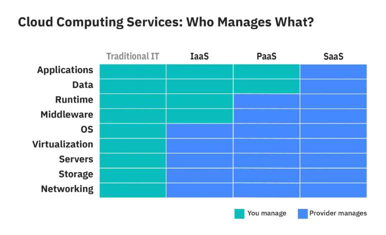

# What is IaaS/PaaS/SaaS?

> **Source**: ByteByteGo — System Design compilation PDF

The diagram below illustrates the differences between IaaS
(Infrastructure-as-a-Service), PaaS (Platform-as-a-Service), and SaaS
(Software-as-a-Service).
For a non-cloud application, we own and manage all the hardware and
software. We say the application is on-premises.
With cloud computing, cloud service vendors provide three kinds of
models for us to use: IaaS, PaaS, and SaaS.
𝐈𝐚𝐚𝐒 provides us access to cloud vendors' infrastructure, like servers,
storage, and networking. We pay for the infrastructure service and
install and manage supporting software on it for our application.
𝐏𝐚𝐚𝐒 goes further. It provides a platform with a variety of middleware,
frameworks, and tools to build our application. We only focus on
application development and data.
𝐒𝐚𝐚𝐒 enables the application to run in the cloud. We pay a monthly or
annual fee to use the SaaS product.
Over to you: which IaaS/PaaS/SaaS products have you used? How do
you decide which architecture to use?
Image Source: https://www.ibm.com/cloud/learn/iaas-paas-saas

