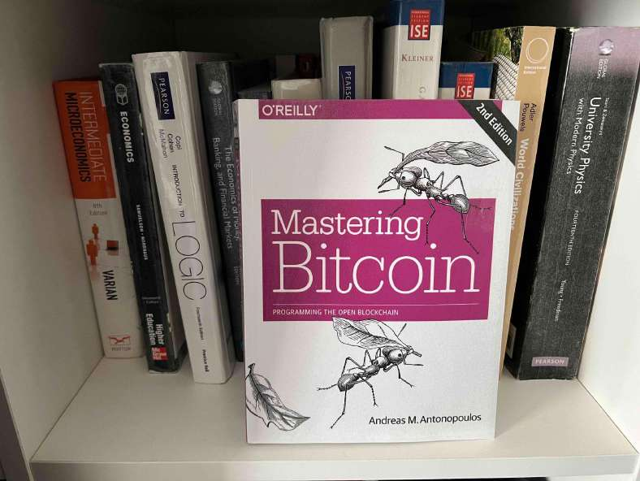

# What is the future of online payments?

> **Source**: ByteByteGo — System Design compilation PDF

I don’t know the answer, but I do know one of the candidates is the blockchain. As a fan of technology, I always seek new solutions to old challenges. A book that explains a lot about an emerging payment system is ‘Mastering Bitcoin’ by Andreas M. Antonopoulos. I want to share my discovery of this book with you because it explains very clearly bitcoin and its underlying blockchain. This book makes me rethink how to renovate payment systems. Here are the takeaways: 1. The bitcoin wallet balance is calculated on the fly, while the traditional wallet balance is stored in the database. You can check chapter 12 of System Design Interview Volume 2, on how to implement a traditional wallet (https://amzn.to/34G2vmC).

2. The golden source of truth for bitcoin is the blockchain, which is also the journal. It’s the same if we use Event Sourcing architecture to build a traditional wallet, although there are other options. 3. There is a small virtual machine for bitcoin - and also Ethereum. The virtual machine defines a set of bytecodes to do basic tasks such as validation. Over to you: if Elon Musk set up a base on planet Mars, what payment solution will you recommend?
