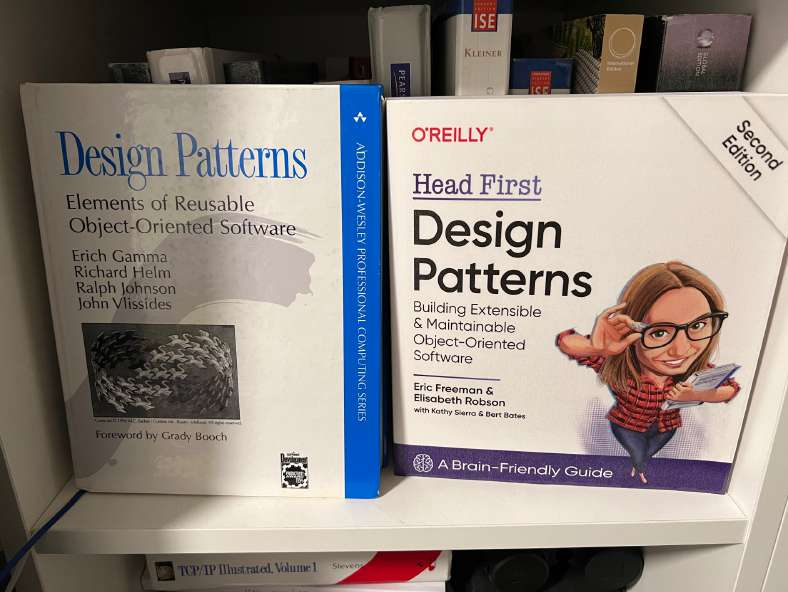

# How to learn design patterns?

> **Source**: ByteByteGo — System Design compilation PDF

Besides reading a lot of well-written code, a good book guides us like a
good teacher.
𝐇𝐞𝐚𝐝 𝐅𝐢𝐫𝐬𝐭 𝐃𝐞𝐬𝐢𝐠𝐧 𝐏𝐚𝐭𝐭𝐞𝐫𝐧𝐬, second edition, is the one I would
recommend.
When I began my journey in software engineering, I found it hard to
understand the classic textbook, 𝐃𝐞𝐬𝐢𝐠𝐧 𝐏𝐚𝐭𝐭𝐞𝐫𝐧𝐬, by the Gang of Four.
Luckily, I discovered Head First Design Patterns in the school library.
This book solved a lot of puzzles for me. When I went back to the
Design Patterns book, everything looked familiar and more
understandable.
Last year, I bought the second edition of Head First Design Patterns
and read through it. Here are a few things I like about the book:

🔹This book solves the challenge of software’s abstract, “invisible”
nature. Software is difficult to build because we cannot see its
architecture; its details are embedded in the code and binary files. It is
even harder to understand software design patterns because these are
higher-level abstractions of the software. The book fixes this by using
visualization. There are lots of diagrams, arrows, and comments on
almost every page. If I do not understand the text, it’s no problem. The
diagrams explain things very well.
🔹We all have questions we are afraid to ask when we first learn a
new skill. Maybe we think it’s an easy one. This book is good at
tackling design patterns from the student’s point of view. It guides us by
asking our questions and clearly answering them. There is a Guru in
the book and there’s also a Student.
Over to you: which book helped you understand a challenging topic?
Why do you like it?

