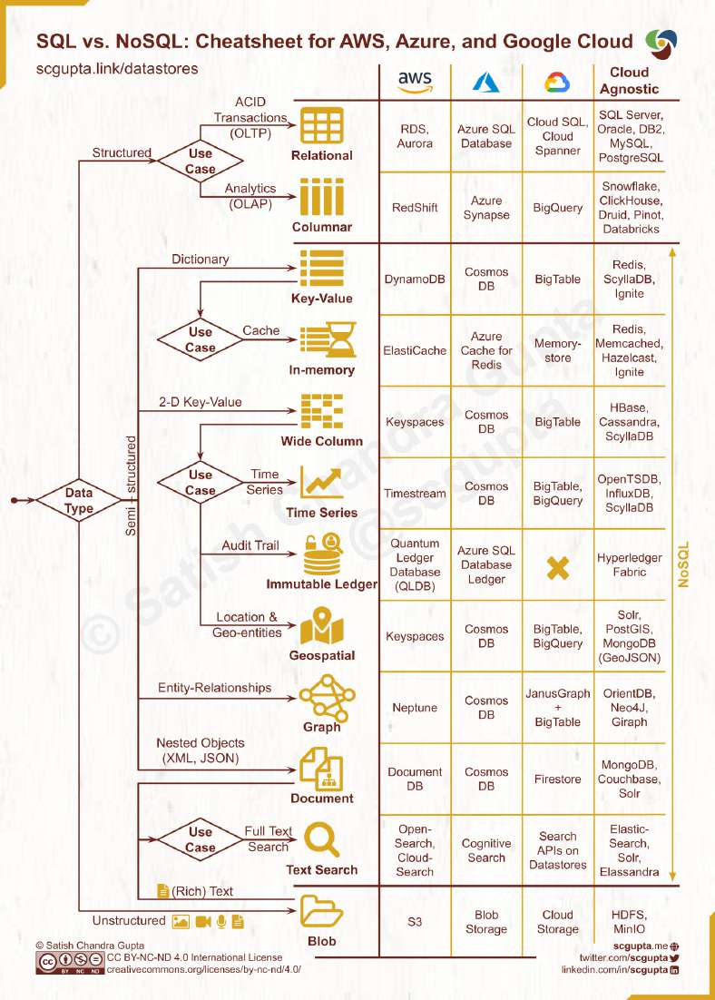

# A visual guide on how to choose the right Database

> **Source**: ByteByteGo — System Design compilation PDF

Picking a database is a long-term commitment so the decision shouldn’t be made lightly. The important thing to keep in mind is to choose the right database for the right job.

Data can be structured (SQL table schema), semi-structured (JSON, XML, etc.), and unstructured (Blob). Common database categories include: - Relational - Columnar - Key-value - In-memory - Wide column - Time Series - Immutable ledger - Geospatial - Graph - Document - Text search - Blob Thanks, Satish Chandra Gupta Over to you - Which database have you used for which workload?
