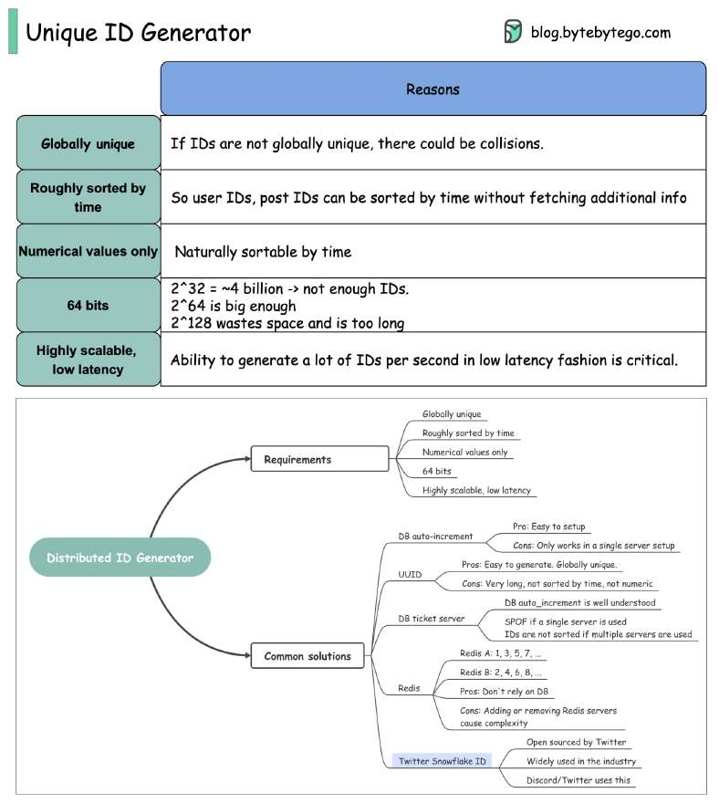

# Do you know how to generate globally unique IDs?

> **Source**: ByteByteGo — System Design compilation PDF

In this post, we will explore common requirements for IDs that are used in social media such as Facebook, Twitter, and LinkedIn. Requirements: - Globally unique - Roughly sorted by time - Numerical values only - 64 bits - Highly scalable, low latency

The implementation details of the algorithms can be found online so we will not go into detail here. Over to you: What kind of ID generators have you used?
—
Check out our bestselling system design books. Paperback: Amazon Digital: ByteByteGo.
