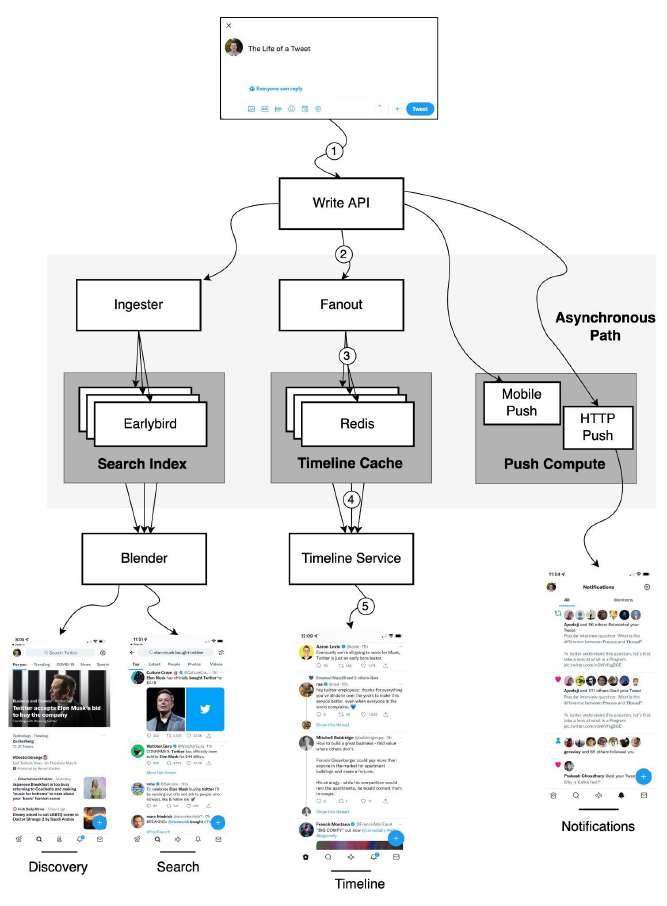

# How does Twitter work?

> **Source**: ByteByteGo — System Design compilation PDF

This post is a summary of a tech talk given by Twitter in 2013. Let’s take a look.

**The Life of a Tweet**

: 1️⃣ A tweet comes in through the Write API. 2️⃣ The Write API routes the request to the Fanout service. 3️⃣ The Fanout service does a lot of processing and stores them in the Redis cache.

4️⃣ The Timeline service is used to find the Redis server that has the home timeline on it. 5️⃣ A user pulls their home timeline through the Timeline service. **Search** & **Discovery** - Ingester: annotates and tokenizes Tweets so the data can be indexed. - Earlybird: stores search index. - Blender: creates the search and discovery timelines.

**Push Compute**

- HTTP push - Mobile push Disclaimer: This article is based on the tech talk given by Twitter in 2013 (https://bit.ly/3vNfjRp). Even though many years have passed, it’s still quite relevant. I redraw the diagram as the original diagram is difficult to read. Over to you: Do you use Twitter? What are some of the biggest differences between LinkedIn and Twitter that might shape their system architectures?
—
Check out our bestselling system design books. Paperback: Amazon Digital: ByteByteGo.
