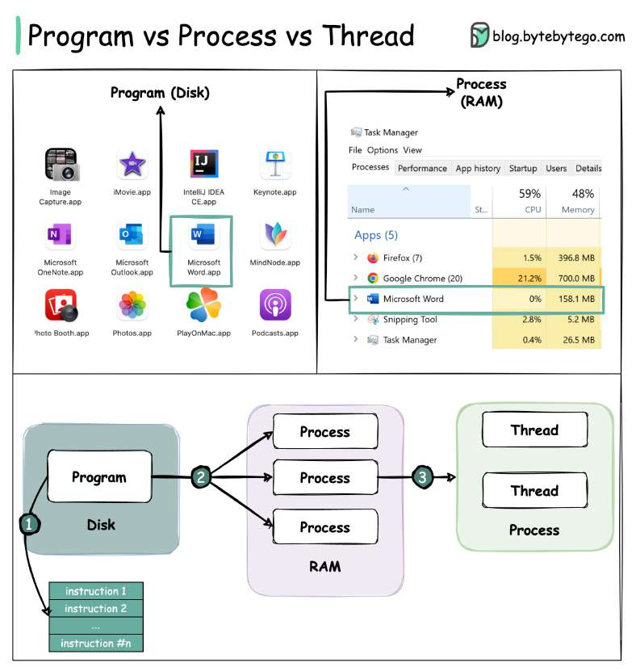

# What is the difference between Process and Thread?

> **Source**: ByteByteGo — System Design compilation PDF

To better understand this question, let’s first take a look at what is a Program. A **Program** is an executable file containing a set of instructions and passively stored on disk. One program can have multiple processes. For example, the Chrome browser creates a different process for every single tab. A **Process** means a program is in execution. When a program is loaded into the memory and becomes active, the program becomes a process. The process requires some essential resources such as registers, program counter, and stack.

A **Thread** is the smallest unit of execution within a process. The following process explains the relationship between program, process, and thread. 1. The program contains a set of instructions. 2. The program is loaded into memory. It becomes one or more running processes. 3. When a process starts, it is assigned memory and resources. A process can have one or more threads. For example, in the Microsoft Word app, a thread might be responsible for spelling checking and the other thread for inserting text into the doc. Main differences between process and thread: - Processes are usually independent, while threads exist as subsets of a process. - Each process has its own memory space. Threads that belong to the same process share the same memory. - A process is a heavyweight operation. It takes more time to create and terminate. - Context switching is more expensive between processes. - Inter-thread communication is faster for threads. Over to you: 1). Some programming languages support coroutine. What is the difference between coroutine and thread? 2). How to list running processes in Linux?
—
Check out our bestselling system design books. Paperback: Amazon Digital: ByteByteGo.
