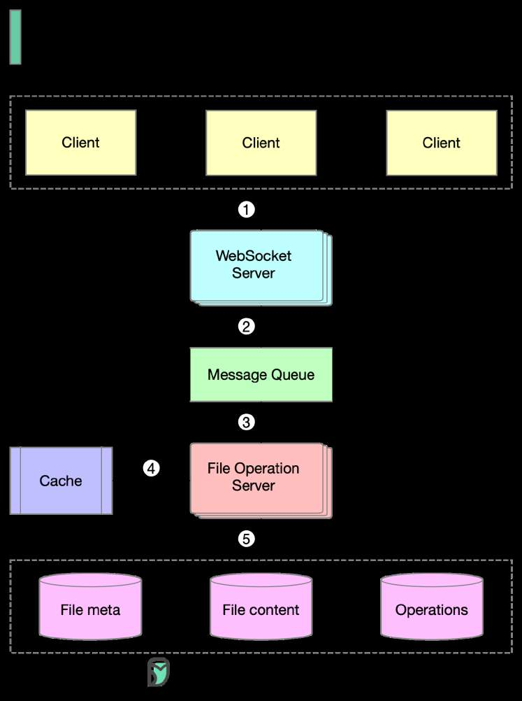

# Interview Question: design Google Docs

> **Source**: ByteByteGo — System Design compilation PDF

1️⃣ Clients send document editing operations to the WebSocket Server. 2️⃣ The real-time communication is handled by the WebSocket Server. 3️⃣ Documents operations are persisted in the Message Queue.

4️⃣ The File Operation Server consumes operations produced by clients and generates transformed operations using collaboration algorithms. 5️⃣ Three types of data are stored: file metadata, file content, and operations. One of the biggest challenges is real-time conflict resolution. Common algorithms include: - Operational transformation (OT) - Differential Synchronization (DS) - Conflict-free replicated data type (CRDT) Google Doc uses OT according to its Wikipedia page and CRDT is an active area of research for real-time concurrent editing. Over to you - Have you encountered any issues while using Google Docs? If so, what do you think might have caused the issue?
—
Check out our bestselling system design books. Paperback: Amazon Digital: ByteByteGo.
