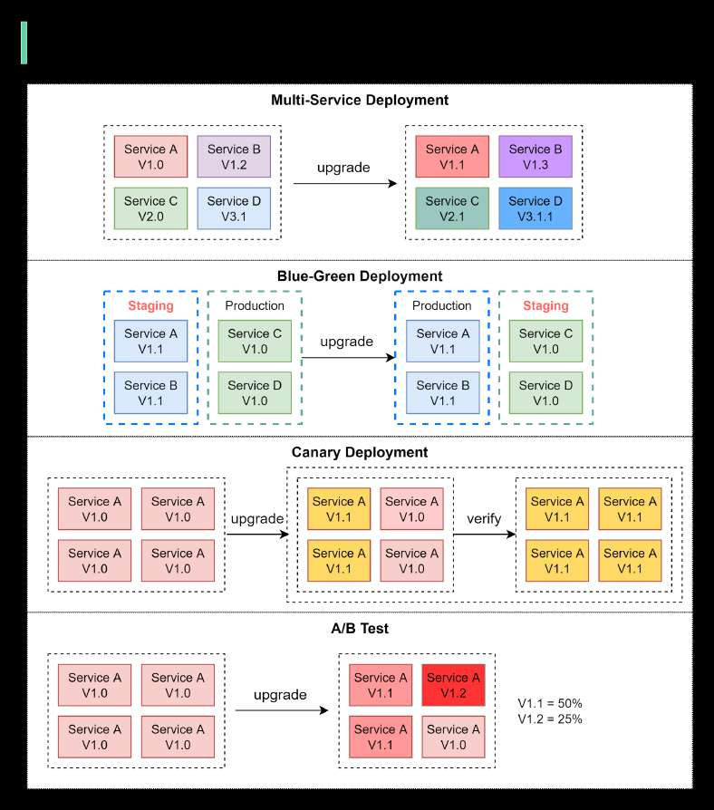

# Deployment strategies

> **Source**: ByteByteGo — System Design compilation PDF

Deploying or upgrading services is risky. In this post, we explore risk
mitigation strategies.
The diagram below illustrates the common ones.
𝐌𝐮𝐥𝐭𝐢-𝐒𝐞𝐫𝐯𝐢𝐜𝐞 𝐃𝐞𝐩𝐥𝐨𝐲𝐦𝐞𝐧𝐭
In this model, we deploy new changes to multiple services
simultaneously. This approach is easy to implement. But since all the
services are upgraded at the same time, it is hard to manage and test
dependencies. It’s also hard to rollback safely.

𝐁𝐥𝐮𝐞-𝐆𝐫𝐞𝐞𝐧 𝐃𝐞𝐩𝐥𝐨𝐲𝐦𝐞𝐧𝐭
With blue-green deployment, we have two identical environments: one
is staging (blue) and the other is production (green). The staging
environment is one version ahead of production. Once testing is done
in the staging environment, user traffic is switched to the staging
environment, and the staging becomes the production. This
deployment strategy is simple to perform rollback, but having two
identical production quality environments could be expensive.
𝐂𝐚𝐧𝐚𝐫𝐲 𝐃𝐞𝐩𝐥𝐨𝐲𝐦𝐞𝐧𝐭
A canary deployment upgrades services gradually, each time to a
subset of users. It is cheaper than blue-green deployment and easy to
perform rollback. However, since there is no staging environment, we
have to test on production. This process is more complicated because
we need to monitor the canary while gradually migrating more and
more users away from the old version.
𝐀/𝐁 𝐓𝐞𝐬𝐭
In the A/B test, different versions of services run in production
simultaneously. Each version runs an “experiment” for a subset of
users. A/B test is a cheap method to test new features in production.
We need to control the deployment process in case some features are
pushed to users by accident.
Over to you - Which deployment strategy have you used? Did you
witness any deployment-related outages in production and why did
they happen?

