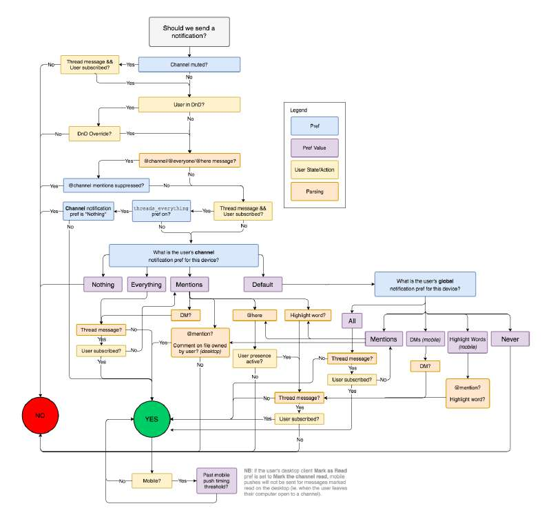

# Flowchart of how slack decides to send a notification

> **Source**: ByteByteGo — System Design compilation PDF

It is a great example of why a simple feature may take much longer to develop than many people think. When we have a great design, users may not notice the complexity because it feels like the feature is just working as intended. What’s your takeaway from this diagram? Image source: https://slack.engineering/reducing-slacks-memory-footprint/
