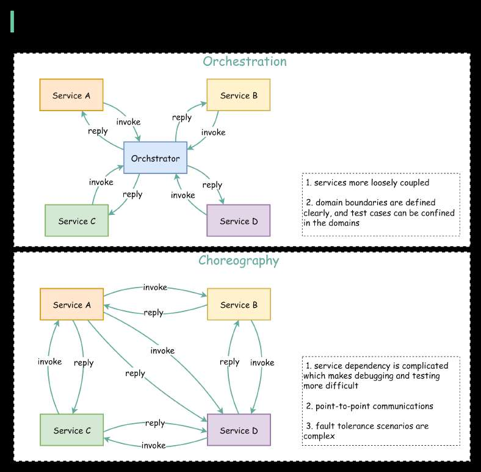

# How do microservices collaborate and interact with each other?

> **Source**: ByteByteGo — System Design compilation PDF

other? There are two ways: **orchestration** and **choreography**. The diagram below illustrates the collaboration of microservices. Choreography is like having a choreographer set all the rules. Then the dancers on stage (the microservices) interact according to them. Service choreography describes this exchange of messages and the rules by which the microservices interact. Orchestration is different. The orchestrator acts as a center of authority. It is responsible for invoking and combining the services. It describes the interactions between all the participating services. It is just like a conductor leading the musicians in a musical symphony. The orchestration pattern also includes the transaction management among different services. The benefits of orchestration: 1. Reliability - orchestration has built-in transaction management and error handling, while choreography is point-to-point communications and the fault tolerance scenarios are much more complicated. 2. Scalability - when adding a new service into orchestration, only the orchestrator needs to modify the interaction rules, while in choreography all the interacting services need to be modified. Some limitations of orchestration: 1. Performance - all the services talk via a centralized orchestrator, so latency is higher than it is with choreography. Also, the throughput is bound to the capacity of the orchestrator. 2. Single point of failure - if the orchestrator goes down, no services can talk to each other. To mitigate this, the orchestrator must be highly available. Real-world use case: Netflix Conductor is a microservice orchestrator and you can read more details on the orchestrator design. Question - Have you used orchestrator products in production? What are their pros & cons?

—
Check out our bestselling system design books. Paperback: Amazon Digital: ByteByteGo.
