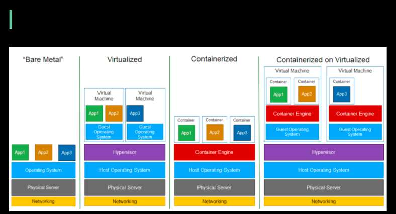

# What are the differences between Virtualization (VMware) and Containerization (Docker)?

> **Source**: ByteByteGo — System Design compilation PDF

What are the differences between Virtualization (VMware) and Containerization (Docker)? The diagram below illustrates the layered architecture of virtualization and containerization. “Virtualization is a technology that allows you to create multiple simulated environments or dedicated resources from a single, physical hardware system” [1]. “Containerization is the packaging together of software code with all its necessary components like libraries, frameworks, and other dependencies so that they are isolated in their own "container" [2]. The major differences are: - In virtualization, the hypervisor creates an abstraction layer over hardware, so that multiple operating systems can run alongside each other. This technique is considered to be the first generation of cloud computing. - Containerization is considered to be a lightweight version of virtualization, which virtualizes the operating system instead of hardware. Without the hypervisor, the containers enjoy faster resource provisioning. All the resources (including code, dependencies) that are needed to run the application or microservice are packaged together, so that the applications can run anywhere. Question: how much performance differences have you observed in production between virtualization, containerization, and bare-metal? Image Source: https://lnkd.in/gaPYcGTz Sources: [1] Understanding virtualization: https://lnkd.in/gtQY9gkx [2] What is containerization?: https://lnkd.in/gm4Qv_x2
